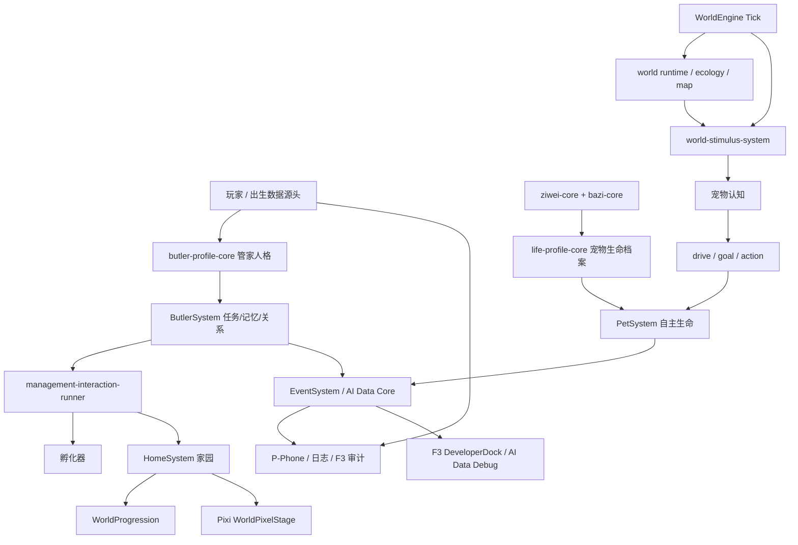

# AI-PET-WORLD 项目完整审核文档

生成时间：2026-05-08（Asia/Shanghai）

说明：本报告按要求排除了 node_modules、.next、dist、build、.git；源码统计基于生成报告前的仓库状态，不包含本报告自身和临时审计文件。已按仓库 AGENTS.md 要求先阅读本地 Next.js 16.2.4 文档中的 App Router 项目结构、Layouts/Pages、Server/Client Components。

## 1. 完整目录结构

```text
AI-PET-WORLD
├── .vscode
│   └── settings.json
├── src
│   ├── ai
│   │   ├── agent-core
│   │   │   ├── agent-gateway.ts
│   │   │   └── agent-schema.ts
│   │   ├── autonomy-core
│   │   │   ├── autonomy-gateway.ts
│   │   │   ├── autonomy-rules.ts
│   │   │   └── autonomy-types.ts
│   │   ├── bazi-core
│   │   │   ├── bazi-data
│   │   │   │   ├── bazi-element-dynamics.ts
│   │   │   │   ├── bazi-element-weights.ts
│   │   │   │   ├── bazi-ganzhi-data.ts
│   │   │   │   ├── bazi-hidden-stems-data.ts
│   │   │   │   └── bazi-solar-terms-data.ts
│   │   │   ├── bazi-runtime
│   │   │   │   ├── current-tendency
│   │   │   │   │   ├── bazi-current-tendency-composer.ts
│   │   │   │   │   ├── bazi-current-tendency-normalizer.ts
│   │   │   │   │   ├── bazi-current-tendency-schema.ts
│   │   │   │   │   └── bazi-current-tendency-summary.ts
│   │   │   │   ├── bazi-da-yun-engine.ts
│   │   │   │   ├── bazi-flow-engine.ts
│   │   │   │   ├── bazi-lunar-date-utils.ts
│   │   │   │   ├── bazi-runtime-gateway.ts
│   │   │   │   ├── bazi-runtime-mapper.ts
│   │   │   │   ├── bazi-runtime-schema.ts
│   │   │   │   ├── bazi-runtime-time-table.ts
│   │   │   │   └── bazi-runtime-utils.ts
│   │   │   ├── bazi-calculator.ts
│   │   │   ├── bazi-elements.ts
│   │   │   ├── bazi-gateway.ts
│   │   │   ├── bazi-interpreter.ts
│   │   │   ├── bazi-mapper.ts
│   │   │   ├── bazi-schema.ts
│   │   │   ├── bazi-summary.ts
│   │   │   ├── bazi-traits.ts
│   │   │   ├── bazi-types.ts
│   │   │   ├── bazi-utils.ts
│   │   │   ├── ganzhi.ts
│   │   │   └── wuxing.ts
│   │   ├── behavior-core
│   │   │   ├── behavior-engine.ts
│   │   │   ├── behavior-gateway.ts
│   │   │   └── behavior-types.ts
│   │   ├── butler-profile-core
│   │   │   ├── butler-profile-gateway.ts
│   │   │   ├── butler-profile-mapper.ts
│   │   │   └── butler-profile-schema.ts
│   │   ├── cognition-layer
│   │   │   ├── cognition-engine.ts
│   │   │   ├── cognition-gateway.ts
│   │   │   └── cognition-types.ts
│   │   ├── consciousness
│   │   │   ├── consciousness-builder.ts
│   │   │   ├── consciousness-gateway.ts
│   │   │   ├── consciousness-types.ts
│   │   │   └── ziwei-consciousness-builder.ts
│   │   ├── data-core
│   │   │   ├── ai-data-gateway.ts
│   │   │   ├── ai-data-store.ts
│   │   │   └── ai-data-types.ts
│   │   ├── event-style
│   │   │   ├── composer.ts
│   │   │   ├── event-gateway.ts
│   │   │   └── schema.ts
│   │   ├── life-profile-core
│   │   │   ├── life-profile-builder.ts
│   │   │   ├── life-profile-gateway.ts
│   │   │   └── life-profile-schema.ts
│   │   ├── life-tendency-core
│   │   │   ├── life-runtime-bundle-gateway.ts
│   │   │   ├── life-runtime-bundle-schema.ts
│   │   │   ├── life-runtime-time-adapter.ts
│   │   │   ├── life-runtime-world-gateway.ts
│   │   │   ├── life-tendency-composer.ts
│   │   │   ├── life-tendency-five-dimension.ts
│   │   │   ├── life-tendency-gateway.ts
│   │   │   ├── life-tendency-normalizer.ts
│   │   │   ├── life-tendency-runtime-gateway.ts
│   │   │   └── life-tendency-schema.ts
│   │   ├── memory-core
│   │   │   ├── memory-builder.ts
│   │   │   ├── memory-gateway.ts
│   │   │   ├── memory-types.ts
│   │   │   └── memory-updater.ts
│   │   ├── personality-interpretation-core
│   │   │   ├── bazi-dynamics-adapter.ts
│   │   │   ├── bazi-gender-mapper.ts
│   │   │   ├── bazi-gender-rules.ts
│   │   │   ├── five-dimension-mapper.ts
│   │   │   ├── five-dimension-rules.ts
│   │   │   ├── gender-comparison-mapper.ts
│   │   │   ├── gender-perspective-rules.ts
│   │   │   ├── interpretation-bias-mapper.ts
│   │   │   ├── interpretation-constants.ts
│   │   │   ├── interpretation-gateway.ts
│   │   │   ├── interpretation-schema.ts
│   │   │   ├── interpretation-utils.ts
│   │   │   ├── ziwei-life-function-mapper.ts
│   │   │   └── ziwei-structure-rules.ts
│   │   ├── timeline-system
│   │   │   ├── fortune
│   │   │   │   ├── fortune-engine.ts
│   │   │   │   ├── fortune-mapper.ts
│   │   │   │   └── fortune-types.ts
│   │   │   ├── state
│   │   │   │   ├── state-classifier.ts
│   │   │   │   ├── state-defaults.ts
│   │   │   │   ├── state-types.ts
│   │   │   │   └── state-updater.ts
│   │   │   ├── trajectory
│   │   │   │   ├── trajectory-branch-calculator.ts
│   │   │   │   ├── trajectory-recorder.ts
│   │   │   │   ├── trajectory-summary-builder.ts
│   │   │   │   └── trajectory-types.ts
│   │   │   ├── timeline-gateway.ts
│   │   │   └── timeline-types.ts
│   │   ├── world-stimulus-system
│   │   │   ├── entity-stimulus-builder.ts
│   │   │   ├── stimulus-builder.ts
│   │   │   ├── stimulus-engine.ts
│   │   │   ├── stimulus-gateway.ts
│   │   │   └── stimulus-types.ts
│   │   ├── ziwei-core
│   │   │   ├── dynamic
│   │   │   │   ├── current-profile
│   │   │   │   │   ├── current-dynamic-profile-composer.ts
│   │   │   │   │   ├── current-dynamic-profile-normalizer.ts
│   │   │   │   │   ├── current-dynamic-profile-schema.ts
│   │   │   │   │   └── current-dynamic-profile-summary.ts
│   │   │   │   ├── branch-utils.ts
│   │   │   │   ├── cycle-direction.ts
│   │   │   │   ├── dynamic-flow-engine.ts
│   │   │   │   ├── dynamic-gateway.ts
│   │   │   │   ├── dynamic-influence-composer.ts
│   │   │   │   └── dynamic-schema.ts
│   │   │   ├── knowledge
│   │   │   │   ├── pairProfiles
│   │   │   │   │   ├── jumenPairs.ts
│   │   │   │   │   ├── lianzhenPairs.ts
│   │   │   │   │   ├── pojunPairs.ts
│   │   │   │   │   ├── qishaPairs.ts
│   │   │   │   │   ├── registry.ts
│   │   │   │   │   ├── taiyangPairs.ts
│   │   │   │   │   ├── taiyinPairs.ts
│   │   │   │   │   ├── tanlangPairs.ts
│   │   │   │   │   ├── tianfuPairs.ts
│   │   │   │   │   ├── tianjiPairs.ts
│   │   │   │   │   ├── tianliangPairs.ts
│   │   │   │   │   ├── tiantongPairs.ts
│   │   │   │   │   ├── tianxiangPairs.ts
│   │   │   │   │   ├── types.ts
│   │   │   │   │   ├── wuquPairs.ts
│   │   │   │   │   └── ziweiPairs.ts
│   │   │   │   ├── branches.ts
│   │   │   │   ├── dynamicWeights.ts
│   │   │   │   ├── elementGates.ts
│   │   │   │   ├── emptyState.ts
│   │   │   │   ├── index.ts
│   │   │   │   ├── labels.ts
│   │   │   │   ├── pairProfiles.ts
│   │   │   │   ├── pairRelations.ts
│   │   │   │   ├── pairs.ts
│   │   │   │   ├── priorities.ts
│   │   │   │   ├── starProfiles.ts
│   │   │   │   ├── stars.ts
│   │   │   │   ├── stems.ts
│   │   │   │   ├── summaries.ts
│   │   │   │   └── units.ts
│   │   │   ├── calculator.ts
│   │   │   ├── constants.ts
│   │   │   ├── evolution.ts
│   │   │   ├── lunar.ts
│   │   │   ├── mapper.ts
│   │   │   ├── public-view.ts
│   │   │   ├── schema.ts
│   │   │   ├── ziwei-engine.ts
│   │   │   └── ziwei-gateway.ts
│   │   └── gateway.ts
│   ├── app
│   │   ├── personality-test
│   │   │   ├── components
│   │   │   │   ├── bazi-panel
│   │   │   │   │   ├── BaziBaseChartTable.tsx
│   │   │   │   │   ├── BaziBehaviorBiasLines.tsx
│   │   │   │   │   ├── BaziDebugLines.tsx
│   │   │   │   │   ├── BaziDebugTable.tsx
│   │   │   │   │   ├── BaziDynamicVectorLines.tsx
│   │   │   │   │   ├── BaziElementLine.tsx
│   │   │   │   │   ├── BaziElementScoreLines.tsx
│   │   │   │   │   ├── BaziEnergyTable.tsx
│   │   │   │   │   ├── BaziModeLine.tsx
│   │   │   │   │   ├── BaziPillarLines.tsx
│   │   │   │   │   ├── BaziProfilePanel.tsx
│   │   │   │   │   ├── BaziVectorTable.tsx
│   │   │   │   │   ├── BaziYinYangLines.tsx
│   │   │   │   │   ├── bazi-panel-labels.ts
│   │   │   │   │   └── bazi-panel-types.ts
│   │   │   │   ├── bazi-runtime-panel
│   │   │   │   │   ├── BaziCurrentTendencyPanel.tsx
│   │   │   │   │   ├── BaziRuntimePanel.tsx
│   │   │   │   │   ├── BaziRuntimeTimeCell.tsx
│   │   │   │   │   ├── BaziRuntimeTimeSelector.tsx
│   │   │   │   │   ├── bazi-runtime-panel-labels.ts
│   │   │   │   │   └── bazi-runtime-panel-types.ts
│   │   │   │   ├── birth-input
│   │   │   │   │   ├── BaziProfilePanel.tsx
│   │   │   │   │   ├── BirthDayInput.tsx
│   │   │   │   │   ├── BirthGenderInput.tsx
│   │   │   │   │   ├── BirthHourInput.tsx
│   │   │   │   │   ├── BirthInputBar.tsx
│   │   │   │   │   ├── BirthMonthInput.tsx
│   │   │   │   │   ├── BirthYearInput.tsx
│   │   │   │   │   └── birth-input-utils.ts
│   │   │   │   ├── chart
│   │   │   │   │   ├── ZiweiBorrowedStarList.tsx
│   │   │   │   │   ├── ZiweiFlowMarkerBadge.tsx
│   │   │   │   │   ├── ZiweiFlowMarkers.tsx
│   │   │   │   │   ├── ZiweiPalaceCell.tsx
│   │   │   │   │   ├── ZiweiPalaceHeader.tsx
│   │   │   │   │   ├── ZiweiStarList.tsx
│   │   │   │   │   ├── ziwei-chart-types.ts
│   │   │   │   │   ├── ziwei-chart-utils.ts
│   │   │   │   │   ├── ziwei-flow-marker-style.ts
│   │   │   │   │   └── ziwei-palace-style.ts
│   │   │   │   ├── common
│   │   │   │   │   ├── ComboInput.tsx
│   │   │   │   │   ├── InfoCard.tsx
│   │   │   │   │   ├── ScoreLine.tsx
│   │   │   │   │   └── ValueLine.tsx
│   │   │   │   ├── dashboard
│   │   │   │   │   ├── DynamicMappingExplainPanel.tsx
│   │   │   │   │   ├── TestDashboardGrid.tsx
│   │   │   │   │   ├── TestDashboardHero.tsx
│   │   │   │   │   ├── TestDashboardNotice.tsx
│   │   │   │   │   ├── TestDashboardPanel.tsx
│   │   │   │   │   └── TestDashboardSection.tsx
│   │   │   │   ├── debug
│   │   │   │   │   ├── JsonBlock.tsx
│   │   │   │   │   └── PublicViewPanel.tsx
│   │   │   │   ├── dynamic
│   │   │   │   │   ├── ZiweiBirthSummary.tsx
│   │   │   │   │   ├── ZiweiDynamicNotice.tsx
│   │   │   │   │   ├── ZiweiDynamicRuntimeLine.tsx
│   │   │   │   │   ├── ZiweiDynamicStatusBar.tsx
│   │   │   │   │   ├── ziwei-dynamic-flow-utils.ts
│   │   │   │   │   ├── ziwei-dynamic-helpers.ts
│   │   │   │   │   ├── ziwei-dynamic-marker-utils.ts
│   │   │   │   │   └── ziwei-dynamic-time-utils.ts
│   │   │   │   ├── dynamic-current-profile
│   │   │   │   │   └── ZiweiCurrentDynamicProfilePanel.tsx
│   │   │   │   ├── dynamic-detail
│   │   │   │   │   ├── DynamicBiasGrid.tsx
│   │   │   │   │   ├── DynamicDebugFlows.tsx
│   │   │   │   │   ├── DynamicFlowSummary.tsx
│   │   │   │   │   ├── DynamicPreferenceLines.tsx
│   │   │   │   │   ├── ZiweiDynamicDetail.tsx
│   │   │   │   │   └── dynamic-detail-labels.ts
│   │   │   │   ├── dynamic-tabs
│   │   │   │   │   ├── ZiweiDynamicTabButton.tsx
│   │   │   │   │   ├── ZiweiDynamicTabs.tsx
│   │   │   │   │   └── ziwei-dynamic-tabs-config.ts
│   │   │   │   ├── dynamic-time
│   │   │   │   │   ├── ZiweiTimeCell.tsx
│   │   │   │   │   ├── ZiweiTimeRow.tsx
│   │   │   │   │   ├── ziwei-time-labels.ts
│   │   │   │   │   ├── ziwei-time-summary.ts
│   │   │   │   │   ├── ziwei-time-types.ts
│   │   │   │   │   └── ziwei-time-utils.ts
│   │   │   │   ├── layout
│   │   │   │   │   ├── PersonalityTestMainGrid.tsx
│   │   │   │   │   ├── PersonalityTestPageShell.tsx
│   │   │   │   │   ├── PersonalityTestTitle.tsx
│   │   │   │   │   └── SectionSpacer.tsx
│   │   │   │   ├── personality-interpretation
│   │   │   │   │   └── PersonalityInterpretationPanel.tsx
│   │   │   │   ├── timeline-test
│   │   │   │   │   ├── TimelineActionButton.tsx
│   │   │   │   │   ├── TimelineActionGroup.tsx
│   │   │   │   │   ├── TimelineCurrentHeader.tsx
│   │   │   │   │   ├── TimelineLogList.tsx
│   │   │   │   │   ├── TimelineSnapshotView.tsx
│   │   │   │   │   ├── TimelineTestPanel.tsx
│   │   │   │   │   ├── timeline-labels.ts
│   │   │   │   │   ├── timeline-log-utils.ts
│   │   │   │   │   ├── timeline-types.ts
│   │   │   │   │   └── timeline-utils.ts
│   │   │   │   ├── ziwei-output
│   │   │   │   │   ├── NumericScoreList.tsx
│   │   │   │   │   ├── ZiweiDebugPairView.tsx
│   │   │   │   │   ├── ZiweiPersonalityOutputPanel.tsx
│   │   │   │   │   ├── ZiweiSummaryList.tsx
│   │   │   │   │   └── ziwei-output-types.ts
│   │   │   │   ├── ZiweiChartBoard.tsx
│   │   │   │   ├── ZiweiDynamicDetail.tsx
│   │   │   │   ├── ZiweiDynamicPanel.tsx
│   │   │   │   ├── ZiweiDynamicTabs.tsx
│   │   │   │   ├── ZiweiDynamicTimeTable.tsx
│   │   │   │   └── personality-test-components.ts
│   │   │   ├── hooks
│   │   │   │   ├── personality-test-state-types.ts
│   │   │   │   ├── useBaziRuntimeState.ts
│   │   │   │   ├── useBirthInputState.ts
│   │   │   │   ├── usePersonalityProfileData.ts
│   │   │   │   ├── usePersonalityTestState.ts
│   │   │   │   ├── useTimelineTestState.ts
│   │   │   │   ├── useZiweiDynamicInputState.ts
│   │   │   │   ├── useZiweiDynamicPanelState.ts
│   │   │   │   └── useZiweiDynamicResults.ts
│   │   │   ├── runtime-time
│   │   │   │   ├── PersonalityTestRuntimeTimePanel.tsx
│   │   │   │   ├── personality-test-runtime-time-types.ts
│   │   │   │   └── usePersonalityTestRuntimeTime.ts
│   │   │   ├── constants.ts
│   │   │   ├── devLabels.ts
│   │   │   ├── page.tsx
│   │   │   ├── types.ts
│   │   │   └── utils.ts
│   │   ├── world
│   │   │   ├── components
│   │   │   │   ├── butler-debug
│   │   │   │   │   ├── ButlerMemoryDebugPanel.tsx
│   │   │   │   │   ├── ButlerOpportunityFeedbackDebugPanel.tsx
│   │   │   │   │   ├── ButlerProfileDebugPanel.tsx
│   │   │   │   │   ├── ButlerProfileInputPanel.tsx
│   │   │   │   │   ├── ButlerRelationDebugPanel.tsx
│   │   │   │   │   ├── ButlerTaskDecisionTracePanel.tsx
│   │   │   │   │   └── butlerDebugFormatters.ts
│   │   │   │   ├── phone-mock
│   │   │   │   │   ├── PhoneHomeMockPanel.tsx
│   │   │   │   │   ├── PhoneMockTypes.ts
│   │   │   │   │   ├── PhoneModuleDetail.tsx
│   │   │   │   │   ├── PhoneModuleGrid.tsx
│   │   │   │   │   └── PhoneObservationList.tsx
│   │   │   │   ├── stage-renderers
│   │   │   │   │   ├── assets
│   │   │   │   │   │   ├── asset-actor-renderer.ts
│   │   │   │   │   │   ├── asset-effect-renderer.ts
│   │   │   │   │   │   ├── asset-entity-renderer.ts
│   │   │   │   │   │   └── asset-tile-renderer.ts
│   │   │   │   │   ├── config
│   │   │   │   │   │   ├── asset-manifest.ts
│   │   │   │   │   │   ├── sprite-theme.ts
│   │   │   │   │   │   ├── stage-size-config.ts
│   │   │   │   │   │   ├── stage-visual-config.ts
│   │   │   │   │   │   └── tile-theme.ts
│   │   │   │   │   ├── design
│   │   │   │   │   │   ├── atmosphere
│   │   │   │   │   │   │   ├── atmosphere-designs.ts
│   │   │   │   │   │   │   ├── breeze-designs.ts
│   │   │   │   │   │   │   ├── light-spot-designs.ts
│   │   │   │   │   │   │   └── scent-particle-designs.ts
│   │   │   │   │   │   ├── insects
│   │   │   │   │   │   │   ├── butterfly-designs.ts
│   │   │   │   │   │   │   ├── firefly-designs.ts
│   │   │   │   │   │   │   └── insect-designs.ts
│   │   │   │   │   │   ├── nature
│   │   │   │   │   │   │   ├── flower-designs.ts
│   │   │   │   │   │   │   ├── plant-designs.ts
│   │   │   │   │   │   │   ├── stone-designs.ts
│   │   │   │   │   │   │   └── tree-designs.ts
│   │   │   │   │   │   ├── structures
│   │   │   │   │   │   │   ├── board-designs.ts
│   │   │   │   │   │   │   ├── home-designs.ts
│   │   │   │   │   │   │   ├── life-capsule-designs.ts
│   │   │   │   │   │   │   └── path-structure-designs.ts
│   │   │   │   │   │   ├── terrain
│   │   │   │   │   │   │   ├── grass-designs.ts
│   │   │   │   │   │   │   ├── path-designs.ts
│   │   │   │   │   │   │   └── water-terrain-designs.ts
│   │   │   │   │   │   ├── water
│   │   │   │   │   │   │   ├── lake-designs.ts
│   │   │   │   │   │   │   ├── ripple-designs.ts
│   │   │   │   │   │   │   └── water-detail-designs.ts
│   │   │   │   │   │   ├── zones
│   │   │   │   │   │   │   ├── butler-response-scene-designs.ts
│   │   │   │   │   │   │   ├── butler-zone-designs.ts
│   │   │   │   │   │   │   ├── core-courtyard-designs.ts
│   │   │   │   │   │   │   ├── dual-agent-interaction-scene-designs.ts
│   │   │   │   │   │   │   ├── pet-expression-scene-designs.ts
│   │   │   │   │   │   │   └── pet-zone-designs.ts
│   │   │   │   │   │   ├── stage-design-catalog-gateway.ts
│   │   │   │   │   │   └── stage-design-types.ts
│   │   │   │   │   ├── gateway
│   │   │   │   │   │   ├── stage-asset-gateway.ts
│   │   │   │   │   │   ├── stage-config-gateway.ts
│   │   │   │   │   │   ├── stage-graphics-gateway.ts
│   │   │   │   │   │   ├── stage-renderer-gateway.ts
│   │   │   │   │   │   └── stage-shared-gateway.ts
│   │   │   │   │   ├── graphics
│   │   │   │   │   │   ├── actors
│   │   │   │   │   │   │   ├── actor-motion.ts
│   │   │   │   │   │   │   ├── actor-shape-utils.ts
│   │   │   │   │   │   │   ├── actor-target-resolver.ts
│   │   │   │   │   │   │   ├── actor-types.ts
│   │   │   │   │   │   │   ├── actor-visual-factory.ts
│   │   │   │   │   │   │   ├── butler-renderer.ts
│   │   │   │   │   │   │   ├── pet-renderer.ts
│   │   │   │   │   │   │   ├── stage-actor-renderer.ts
│   │   │   │   │   │   │   └── stage-pet-visibility.ts
│   │   │   │   │   │   ├── effects
│   │   │   │   │   │   │   └── stage-stimulus-renderer.ts
│   │   │   │   │   │   ├── entities
│   │   │   │   │   │   │   └── runtime-entity-renderer.ts
│   │   │   │   │   │   ├── environment
│   │   │   │   │   │   │   ├── stage-atmosphere-renderer.ts
│   │   │   │   │   │   │   └── stage-static-world-renderer.ts
│   │   │   │   │   │   ├── interior
│   │   │   │   │   │   │   ├── interior-background-renderer.ts
│   │   │   │   │   │   │   ├── interior-foreground-renderer.ts
│   │   │   │   │   │   │   ├── interior-furniture-renderer.ts
│   │   │   │   │   │   │   ├── interior-hit-areas.ts
│   │   │   │   │   │   │   ├── interior-incubator-renderer.ts
│   │   │   │   │   │   │   ├── interior-newborn-nest-renderer.ts
│   │   │   │   │   │   │   ├── interior-text-renderer.ts
│   │   │   │   │   │   │   └── stage-interior-renderer.ts
│   │   │   │   │   │   ├── structures
│   │   │   │   │   │   │   ├── garden-renderer.ts
│   │   │   │   │   │   │   ├── home-construction-renderer.ts
│   │   │   │   │   │   │   ├── stage-structure-hit-test.ts
│   │   │   │   │   │   │   ├── stage-structure-renderer.ts
│   │   │   │   │   │   │   ├── structure-layout-resolver.ts
│   │   │   │   │   │   │   ├── structure-shape-utils.ts
│   │   │   │   │   │   │   ├── structure-types.ts
│   │   │   │   │   │   │   └── temp-shelter-renderer.ts
│   │   │   │   │   │   ├── tiles
│   │   │   │   │   │   │   ├── stage-tile-renderer.ts
│   │   │   │   │   │   │   ├── tile-base-renderer.ts
│   │   │   │   │   │   │   ├── tile-detail-renderer.ts
│   │   │   │   │   │   │   ├── tile-edge-renderer.ts
│   │   │   │   │   │   │   ├── tile-types.ts
│   │   │   │   │   │   │   └── tile-utils.ts
│   │   │   │   │   │   ├── zones
│   │   │   │   │   │   │   └── stage-zone-renderer.ts
│   │   │   │   │   │   ├── stage-atmosphere-renderer.ts
│   │   │   │   │   │   ├── stage-static-world-renderer.ts
│   │   │   │   │   │   ├── stage-structure-renderer.ts
│   │   │   │   │   │   └── stage-tile-renderer.ts
│   │   │   │   │   ├── modes
│   │   │   │   │   │   └── render-mode.ts
│   │   │   │   │   ├── orchestrator
│   │   │   │   │   │   ├── graphics-stage-orchestrator.ts
│   │   │   │   │   │   ├── stage-camera-controller.ts
│   │   │   │   │   │   ├── stage-debug-logger.ts
│   │   │   │   │   │   ├── stage-dynamic-layer-cleaner.ts
│   │   │   │   │   │   ├── stage-dynamic-scene-sync.ts
│   │   │   │   │   │   ├── stage-layer-factory.ts
│   │   │   │   │   │   ├── stage-layer-types.ts
│   │   │   │   │   │   ├── stage-overlay-renderer.ts
│   │   │   │   │   │   ├── stage-pixi-app.ts
│   │   │   │   │   │   ├── stage-pointer-events.ts
│   │   │   │   │   │   ├── stage-runtime-state.ts
│   │   │   │   │   │   ├── stage-scene-mode.ts
│   │   │   │   │   │   └── stage-static-scene-sync.ts
│   │   │   │   │   ├── shared
│   │   │   │   │   │   ├── stage-renderer-types.ts
│   │   │   │   │   │   └── stage-renderer-utils.ts
│   │   │   │   │   └── validation
│   │   │   │   │       ├── stage-world-layout-validator.ts
│   │   │   │   │       ├── stage-world-validator-gateway.ts
│   │   │   │   │       └── stage-world-validator-types.ts
│   │   │   │   ├── BehaviorProcessPanel.tsx
│   │   │   │   ├── ButlerProfileSetupPanel.tsx
│   │   │   │   ├── CognitionPanel.tsx
│   │   │   │   ├── EventLogPanel.tsx
│   │   │   │   ├── PetStatusPanel.tsx
│   │   │   │   ├── RuntimeDebugPanel.tsx
│   │   │   │   ├── WorldEcologyPanel.tsx
│   │   │   │   ├── WorldHeader.tsx
│   │   │   │   ├── WorldPixelStage.tsx
│   │   │   │   ├── WorldRuntimePanel.tsx
│   │   │   │   └── WorldStimulusPanel.tsx
│   │   │   ├── hooks
│   │   │   │   └── useWorldEngineState.ts
│   │   │   ├── layouts
│   │   │   │   └── WorldObserveLayout.tsx
│   │   │   ├── ui
│   │   │   │   ├── common
│   │   │   │   │   └── WorldStatusPill.tsx
│   │   │   │   ├── minimap
│   │   │   │   │   ├── WorldMiniMap.tsx
│   │   │   │   │   ├── WorldMiniMapInfoRail.tsx
│   │   │   │   │   ├── WorldMiniMapMarkers.tsx
│   │   │   │   │   ├── WorldMiniMapTypes.ts
│   │   │   │   │   └── worldMiniMapMappers.ts
│   │   │   │   ├── panels
│   │   │   │   │   ├── AiDataDebugPanel.tsx
│   │   │   │   │   ├── DeveloperDock.tsx
│   │   │   │   │   ├── WorldBottomPanel.tsx
│   │   │   │   │   ├── WorldProgressionPanel.tsx
│   │   │   │   │   ├── WorldSidePanel.tsx
│   │   │   │   │   └── WorldStagePanel.tsx
│   │   │   │   ├── phone
│   │   │   │   │   ├── calendar
│   │   │   │   │   │   └── PPhoneCalendarApp.tsx
│   │   │   │   │   ├── call
│   │   │   │   │   │   └── PPhoneCallPlaceholder.tsx
│   │   │   │   │   ├── contacts
│   │   │   │   │   │   ├── PPhoneContactDetail.tsx
│   │   │   │   │   │   ├── PPhoneContactsApp.tsx
│   │   │   │   │   │   └── pPhoneContactMappers.ts
│   │   │   │   │   ├── home
│   │   │   │   │   │   └── PPhoneHomeScreen.tsx
│   │   │   │   │   ├── home-app
│   │   │   │   │   │   └── PPhoneHomeApp.tsx
│   │   │   │   │   ├── messages
│   │   │   │   │   │   ├── PPhoneMessageThread.tsx
│   │   │   │   │   │   ├── PPhoneMessagesApp.tsx
│   │   │   │   │   │   ├── pPhoneMessageMappers.ts
│   │   │   │   │   │   └── pPhoneMessagePolicy.ts
│   │   │   │   │   ├── pet
│   │   │   │   │   │   └── PPhonePetApp.tsx
│   │   │   │   │   ├── profile
│   │   │   │   │   │   └── PPhoneProfileApp.tsx
│   │   │   │   │   ├── settings
│   │   │   │   │   │   └── PPhoneSettingsApp.tsx
│   │   │   │   │   ├── weather
│   │   │   │   │   │   └── PPhoneWeatherApp.tsx
│   │   │   │   │   ├── PPhoneIcon.tsx
│   │   │   │   │   ├── PPhoneLauncher.tsx
│   │   │   │   │   ├── PPhoneRouter.tsx
│   │   │   │   │   ├── PPhoneShell.tsx
│   │   │   │   │   └── PPhoneTypes.ts
│   │   │   │   ├── ButlerInsightCard.tsx
│   │   │   │   ├── HomeInsightCard.tsx
│   │   │   │   ├── PetInsightCard.tsx
│   │   │   │   ├── WorldCompactHud.tsx
│   │   │   │   ├── WorldHUD.tsx
│   │   │   │   ├── WorldInfoBar.tsx
│   │   │   │   └── WorldObservationPanel.tsx
│   │   │   ├── utils
│   │   │   │   ├── butlerDisplayMappers.ts
│   │   │   │   ├── homeDisplayMappers.ts
│   │   │   │   ├── petDisplayMappers.ts
│   │   │   │   ├── phoneDetailMappers.ts
│   │   │   │   ├── phoneModuleMappers.ts
│   │   │   │   ├── phoneObservationMappers.ts
│   │   │   │   ├── worldHudMappers.ts
│   │   │   │   ├── worldInfoMappers.ts
│   │   │   │   └── worldObservationMappers.ts
│   │   │   └── page.tsx
│   │   ├── globals.css
│   │   ├── layout.tsx
│   │   └── page.tsx
│   ├── engine
│   │   ├── agent-runtime-audit
│   │   │   ├── agent-runtime-audit-gateway.ts
│   │   │   ├── agent-runtime-audit-types.ts
│   │   │   ├── butler-agent-runtime-audit.ts
│   │   │   └── pet-agent-runtime-audit.ts
│   │   ├── world-engine
│   │   │   ├── runners
│   │   │   │   ├── butler-opportunity-runner.ts
│   │   │   │   ├── home-construction-runner.ts
│   │   │   │   ├── life-runtime-log-runner.ts
│   │   │   │   ├── management-interaction-runner.ts
│   │   │   │   ├── pet-cognition-runner.ts
│   │   │   │   ├── pet-runtime-runner.ts
│   │   │   │   ├── world-event-update-runner.ts
│   │   │   │   ├── world-runtime-runner.ts
│   │   │   │   ├── world-runtime-step-runner.ts
│   │   │   │   ├── world-state-sync-runner.ts
│   │   │   │   ├── world-stimulus-runner.ts
│   │   │   │   ├── world-tick-phase-runner.ts
│   │   │   │   └── world-tick-runner.ts
│   │   │   ├── world-engine-gateway.ts
│   │   │   ├── world-engine-state.ts
│   │   │   ├── world-runtime-log-config.ts
│   │   │   └── world-runtime-logger.ts
│   │   ├── timeSystem.ts
│   │   └── worldEngine.ts
│   ├── shared
│   │   └── math
│   │       └── clamp.ts
│   ├── styles
│   │   └── world-styles
│   │       ├── cards
│   │       │   ├── butler-insight-card.module.css
│   │       │   ├── home-insight-card.module.css
│   │       │   └── pet-insight-card.module.css
│   │       ├── debug
│   │       │   ├── behavior-process-panel.module.css
│   │       │   ├── cognition-panel.module.css
│   │       │   ├── event-log-panel.module.css
│   │       │   ├── pet-status-panel.module.css
│   │       │   ├── runtime-debug-panel.module.css
│   │       │   ├── world-ecology-panel.module.css
│   │       │   ├── world-runtime-panel.module.css
│   │       │   └── world-stimulus-panel.module.css
│   │       ├── hud
│   │       │   ├── world-compact-hud.module.css
│   │       │   ├── world-hud.module.css
│   │       │   └── world-status-pill.module.css
│   │       ├── layout
│   │       │   ├── ai-data-debug-panel.module.css
│   │       │   ├── developer-dock.module.css
│   │       │   ├── world-bottom-panel.module.css
│   │       │   ├── world-header.module.css
│   │       │   ├── world-observe-layout.module.css
│   │       │   ├── world-pixel-stage.module.css
│   │       │   ├── world-progression-panel.module.css
│   │       │   ├── world-side-panel.module.css
│   │       │   └── world-stage-panel.module.css
│   │       ├── minimap
│   │       │   ├── world-mini-map-info-rail.module.css
│   │       │   ├── world-mini-map-markers.module.css
│   │       │   └── world-mini-map.module.css
│   │       ├── observation
│   │       │   └── world-observation-panel.module.css
│   │       ├── phone
│   │       │   ├── calendar
│   │       │   │   └── p-phone-calendar-app.module.css
│   │       │   ├── call
│   │       │   │   └── p-phone-call-placeholder.module.css
│   │       │   ├── contacts
│   │       │   │   ├── p-phone-contact-detail.module.css
│   │       │   │   └── p-phone-contacts-app.module.css
│   │       │   ├── home
│   │       │   │   └── p-phone-home-screen.module.css
│   │       │   ├── home-app
│   │       │   │   └── p-phone-home-app.module.css
│   │       │   ├── messages
│   │       │   │   ├── p-phone-message-thread.module.css
│   │       │   │   └── p-phone-messages-app.module.css
│   │       │   ├── pet
│   │       │   │   └── p-phone-pet-app.module.css
│   │       │   ├── profile
│   │       │   │   └── p-phone-profile-app.module.css
│   │       │   ├── settings
│   │       │   │   └── p-phone-settings-app.module.css
│   │       │   ├── weather
│   │       │   │   └── p-phone-weather-app.module.css
│   │       │   ├── p-phone-icon.module.css
│   │       │   ├── p-phone-launcher.module.css
│   │       │   ├── p-phone-router.module.css
│   │       │   └── p-phone-shell.module.css
│   │       ├── phone-mock
│   │       │   ├── phone-home-mock-panel.module.css
│   │       │   └── phone-observation-mock-panel.module.css
│   │       ├── theme
│   │       │   └── world-theme.module.css
│   │       ├── world-info-bar.module.css
│   │       └── world-page.module.css
│   ├── systems
│   │   ├── butler
│   │   │   ├── butler-experience-interpreter.ts
│   │   │   ├── butler-gateway.ts
│   │   │   ├── butler-memory.ts
│   │   │   ├── butler-mood-runner.ts
│   │   │   ├── butler-opportunity-runner.ts
│   │   │   ├── butler-profile-tuning.ts
│   │   │   ├── butler-relation-tuning.ts
│   │   │   ├── butler-relation.ts
│   │   │   ├── butler-schema.ts
│   │   │   ├── butler-task-decision-trace.ts
│   │   │   └── butler-task-runner.ts
│   │   ├── event
│   │   │   ├── event-action-end-message-runner.ts
│   │   │   ├── event-ai-recorder.ts
│   │   │   ├── event-continuity-runner.ts
│   │   │   ├── event-dedupe-runner.ts
│   │   │   ├── event-factory-runner.ts
│   │   │   ├── event-gateway.ts
│   │   │   ├── event-id-runner.ts
│   │   │   ├── event-incubator-runner.ts
│   │   │   ├── event-pet-context-runner.ts
│   │   │   ├── event-pet-update-runner.ts
│   │   │   ├── event-schema.ts
│   │   │   ├── event-style-input-runner.ts
│   │   │   └── event-time-runner.ts
│   │   ├── home
│   │   │   ├── home-build-runner.ts
│   │   │   ├── home-evolution-runner.ts
│   │   │   ├── home-gateway.ts
│   │   │   ├── home-stage-runner.ts
│   │   │   └── home-utils.ts
│   │   ├── incubator
│   │   │   ├── incubator-care-runner.ts
│   │   │   ├── incubator-gateway.ts
│   │   │   ├── incubator-hatch-runner.ts
│   │   │   ├── incubator-rules.ts
│   │   │   ├── incubator-runner.ts
│   │   │   ├── incubator-status-runner.ts
│   │   │   ├── incubator-update-runner.ts
│   │   │   ├── incubator-utils.ts
│   │   │   └── incubator-value-runner.ts
│   │   ├── pet
│   │   │   ├── pet-action
│   │   │   │   ├── pet-action-drive-layer.ts
│   │   │   │   ├── pet-action-gateway.ts
│   │   │   │   ├── pet-action-goal-layer.ts
│   │   │   │   ├── pet-action-life-phase-layer.ts
│   │   │   │   ├── pet-action-personality-layer.ts
│   │   │   │   ├── pet-action-random-layer.ts
│   │   │   │   ├── pet-action-selector.ts
│   │   │   │   ├── pet-action-stability.ts
│   │   │   │   ├── pet-action-state-layer.ts
│   │   │   │   ├── pet-action-timeline-layer.ts
│   │   │   │   ├── pet-action-tuning.ts
│   │   │   │   ├── pet-action-weight-types.ts
│   │   │   │   └── pet-action-weight-utils.ts
│   │   │   ├── pet-attention
│   │   │   │   ├── pet-attention-gateway.ts
│   │   │   │   └── pet-attention-runner.ts
│   │   │   ├── pet-birth
│   │   │   │   ├── pet-birth-gateway.ts
│   │   │   │   ├── pet-birth-types.ts
│   │   │   │   └── pet-gender-resolver.ts
│   │   │   ├── pet-cognition
│   │   │   │   ├── pet-cognition-gateway.ts
│   │   │   │   └── pet-cognition-runner.ts
│   │   │   ├── pet-drive
│   │   │   │   ├── pet-drive-base-layers.ts
│   │   │   │   ├── pet-drive-cognition-layer.ts
│   │   │   │   ├── pet-drive-context.ts
│   │   │   │   ├── pet-drive-finalize-runner.ts
│   │   │   │   ├── pet-drive-gateway.ts
│   │   │   │   ├── pet-drive-life-tendency-layer.ts
│   │   │   │   ├── pet-drive-memory-layer.ts
│   │   │   │   ├── pet-drive-runner.ts
│   │   │   │   ├── pet-drive-score-utils.ts
│   │   │   │   ├── pet-drive-state-layers.ts
│   │   │   │   ├── pet-drive-tuning.ts
│   │   │   │   └── pet-drive-types.ts
│   │   │   ├── pet-expression
│   │   │   │   ├── pet-expression-gateway.ts
│   │   │   │   ├── pet-expression-runner.ts
│   │   │   │   ├── pet-expression-tuning.ts
│   │   │   │   └── pet-expression-types.ts
│   │   │   ├── pet-feeding
│   │   │   │   ├── pet-feeding-gateway.ts
│   │   │   │   └── pet-feeding-runner.ts
│   │   │   ├── pet-goal
│   │   │   │   ├── pet-goal-choice-layer.ts
│   │   │   │   ├── pet-goal-context.ts
│   │   │   │   ├── pet-goal-drive-alignment-layer.ts
│   │   │   │   ├── pet-goal-duration-layer.ts
│   │   │   │   ├── pet-goal-gateway.ts
│   │   │   │   ├── pet-goal-life-tendency-layer.ts
│   │   │   │   ├── pet-goal-memory-layer.ts
│   │   │   │   ├── pet-goal-persistence-layer.ts
│   │   │   │   ├── pet-goal-runner.ts
│   │   │   │   ├── pet-goal-spatial-layer.ts
│   │   │   │   ├── pet-goal-tuning.ts
│   │   │   │   └── pet-goal-types.ts
│   │   │   ├── pet-life
│   │   │   │   ├── pet-life-gateway.ts
│   │   │   │   └── pet-life-runner.ts
│   │   │   ├── pet-mood
│   │   │   │   ├── pet-mood-gateway.ts
│   │   │   │   └── pet-mood-runner.ts
│   │   │   ├── pet-opportunity
│   │   │   │   ├── pet-opportunity-decision-runner.ts
│   │   │   │   ├── pet-opportunity-effect-runner.ts
│   │   │   │   └── pet-opportunity-gateway.ts
│   │   │   ├── pet-runtime
│   │   │   │   ├── pet-runtime-ai-recorder.ts
│   │   │   │   └── pet-runtime-runner.ts
│   │   │   ├── pet-state-events
│   │   │   │   ├── pet-state-events-gateway.ts
│   │   │   │   └── pet-state-events-runner.ts
│   │   │   ├── pet-zone
│   │   │   │   ├── pet-zone-gateway.ts
│   │   │   │   └── pet-zone-runner.ts
│   │   │   ├── pet-core-boundary.ts
│   │   │   └── pet-gateway.ts
│   │   ├── butlerSystem.ts
│   │   ├── eventSystem.ts
│   │   ├── homeSystem.ts
│   │   ├── incubatorSystem.ts
│   │   ├── petSystem.ts
│   │   └── systems-gateway.ts
│   ├── types
│   │   ├── butler.ts
│   │   ├── cognition.ts
│   │   ├── event.ts
│   │   ├── home.ts
│   │   ├── incubator.ts
│   │   └── pet.ts
│   └── world
│       ├── civilization
│       │   ├── commerce-system.ts
│       │   ├── npc-system.ts
│       │   ├── profession-system.ts
│       │   ├── social-system.ts
│       │   └── structure-growth.ts
│       ├── ecology
│       │   ├── ecology-engine.ts
│       │   ├── weather-system.ts
│       │   ├── world-environment.ts
│       │   ├── world-zone-types.ts
│       │   └── zone-system.ts
│       ├── entities
│       │   ├── actors
│       │   │   ├── butler-entity.ts
│       │   │   ├── npc-entity.ts
│       │   │   └── pet-entity.ts
│       │   ├── creatures
│       │   │   ├── birds
│       │   │   │   └── bird-types.ts
│       │   │   ├── insects
│       │   │   │   ├── butterfly-entity.ts
│       │   │   │   └── insect-types.ts
│       │   │   ├── small-animals
│       │   │   │   └── small-animal-types.ts
│       │   │   └── creature-types.ts
│       │   ├── resources
│       │   │   ├── food-resource.ts
│       │   │   ├── resource-types.ts
│       │   │   ├── water-resource.ts
│       │   │   └── wood-resource.ts
│       │   ├── structures
│       │   │   ├── home-entity.ts
│       │   │   ├── hospital-entity.ts
│       │   │   ├── incubator-entity.ts
│       │   │   ├── park-entity.ts
│       │   │   └── shop-entity.ts
│       │   ├── vegetation
│       │   │   ├── flower-entity.ts
│       │   │   ├── grass-entity.ts
│       │   │   ├── leaf-entity.ts
│       │   │   ├── plant-types.ts
│       │   │   └── tree-entity.ts
│       │   ├── entity-registry.ts
│       │   ├── entity-spawner.ts
│       │   └── entity-types.ts
│       ├── map
│       │   ├── biome-system.ts
│       │   ├── map-generator.ts
│       │   └── world-map.ts
│       ├── movement
│       │   ├── movement-engine.ts
│       │   ├── movement-types.ts
│       │   ├── pathfinding.ts
│       │   └── spatial-query.ts
│       ├── offline
│       │   ├── offline-catchup-gateway.ts
│       │   ├── offline-catchup-runner.ts
│       │   └── offline-catchup-types.ts
│       ├── persistence
│       │   ├── world-save-gateway.ts
│       │   ├── world-save-store.ts
│       │   └── world-save-types.ts
│       ├── progression
│       │   ├── world-facility-registry.ts
│       │   ├── world-progression-gateway.ts
│       │   ├── world-progression-runner.ts
│       │   ├── world-progression-system.ts
│       │   └── world-progression-types.ts
│       ├── renderer
│       │   ├── asset-loader.ts
│       │   ├── camera.ts
│       │   ├── pixi-app.ts
│       │   └── world-scene.ts
│       ├── runtime
│       │   ├── civilization-runtime.ts
│       │   ├── ecology-runtime.ts
│       │   ├── entity-runtime.ts
│       │   ├── movement-runtime.ts
│       │   ├── runtime-mapper.ts
│       │   ├── spatial-runtime.ts
│       │   ├── weather-runtime.ts
│       │   └── world-runtime.ts
│       ├── simulation
│       │   ├── tick-scheduler.ts
│       │   ├── world-balance.ts
│       │   └── world-simulation.ts
│       └── tiles
│           ├── tile-types.ts
│           └── tilemap.ts
├── AGENTS.md
├── CLAUDE.md
├── README.md
├── eslint.config.mjs
├── next-env.d.ts
├── next.config.ts
├── package-lock.json
├── package.json
├── postcss.config.mjs
└── tsconfig.json
```

## 2. 源码文件数量统计

目标扩展总数：718

| 扩展名 | 数量 |
|---|---:|
| .css | 49 |
| .json | 4 |
| .md | 3 |
| .mjs | 2 |
| .ts | 524 |
| .tsx | 136 |

## 3. 当前架构图



## 4. 产品核心落实审核

| 核心要求 | 当前落实情况 | 结论 |
|---|---|---|
| 玩家是世界源头，但不是直接控制者 | 玩家输入主要体现在管家 Profile 输入、P-Phone 读取反馈、本地观察；没有直接动作控制宠物/管家的主流程。 | 部分落实 |
| 玩家出生数据生成 AI 管家人格 | butler-profile-core 使用 birth + mappingMode 生成 care/build/boundary/opportunity bias。 | 已落实，但需升级语义 |
| 管家是玩家生命数据生成的自主意识管理者主角 | ButlerSystem 有任务判断、记忆、关系、审计 trace；但文案和部分职责仍把管家降格为机会提供者/维护者。 | 未完全落实 |
| 宠物是独立自主生命 | PetSystem 通过 drive、goal、action、memory、cognition 自主更新；机会需要 pet evaluate。 | 基本落实 |
| 家园由管家判断、世界阶段、宠物需求、事件积累推动 | tick 中由 chooseButlerTask -> management -> home construction 推进，并有 progression；但建设量读取宠物 lifeProfile bias 优先于管家 profile，事件积累对建造尚弱。 | 部分落实 |
| 玩家通过主世界、P-Phone、日志、管家解释、F3 审计理解世界 | /world 主界面、P-Phone、EventLog/AI Data/F3 DeveloperDock 已存在；管家解释仍偏 debug，不够产品化。 | 部分落实 |

## 5. 旧逻辑冲突定位

| 冲突类型 | 文件 | 说明 | 优先级 |
|---|---|---|---|
| 管家只能提供机会或维护环境 | src/ai/butler-profile-core/butler-profile-mapper.ts | internalNotes 明确写“只能提供机会或维护环境”，与“自主意识管理者主角”冲突。 | P0 |
| 家园建设由宠物人格主导 | src/engine/world-engine/runners/home-construction-runner.ts | getConstructionBias 优先使用 pet.lifeProfile.genderAwareBehaviorBias，再退回 butler.behaviorBias。 | P1 |
| 管家只是机会 NPC | src/systems/butler/butler-opportunity-runner.ts、src/systems/butlerSystem.ts | 机会系统设计合理，但文案和策略层需要明确这是“管理决策的一种输出”，不是管家的全部身份。 | P1 |
| 玩家理解世界入口偏开发态 | src/app/world/ui/panels/DeveloperDock.tsx、AiDataDebugPanel.tsx | F3 审计完整，但产品层“管家解释”不足，容易让理解依赖开发面板。 | P1 |
| 家园渲染链断裂 | src/app/world/components/WorldPixelStage.tsx、graphics-stage-orchestrator.ts | build 失败；home 未传入 SyncGraphicsStageInput，家园阶段可能无法正确渲染。 | P0 |

## 6. P0/P1/P2 问题清单

### P0

1. 生产构建失败：`SyncGraphicsStageInput` 缺少 `home`，但 `stage-static-scene-sync.ts` 使用 `input.home`。
2. 管家核心定义冲突：`butler-profile-mapper.ts` internalNotes 仍把管家限定为“只提供机会或维护环境”。

### P1

1. 家园推进权重来源错误：`home-construction-runner.ts` 优先读取宠物人格 bias，削弱“管家管理者主角”。
2. 管家出生数据入口仍在 Dev/Profile Debug 面板，缺少正式 Onboarding，玩家作为源头不够产品化。
3. 事件积累对家园建设影响不足，目前更多是 tick/task/progress 数值推进。
4. 管家解释面向 Debug trace，缺少 P-Phone 或主世界里的自然语言解释层。
5. 文本编码/显示存在局部 mojibake 风险，多个中文字符串在终端输出中显示异常，需确认文件编码和页面实际显示。

### P2

1. `phone-mock` 与正式 P-Phone 并存，需标记废弃或迁移。
2. `src/world/renderer` 与 `src/app/world/components/stage-renderers` 并存，需明确新旧边界。
3. 大量未被静态 import 的知识库/设计表/配置表是合理预留，但需建立 index/gateway 接入清单。
4. 生成型视觉/舞台设计目录很多，缺少统一资产 QA 或像素截图验证脚本。

## 7. 下一步修改顺序

1. 修复构建：给 `WorldPixelStage` Props 和 `SyncGraphicsStageInput` 补 `home`，从 `WorldObserveLayout` 传入 `world.home`。
2. 重写管家身份语义：替换“只能提供机会或维护环境”为“自主意识管理者，以解释、管理、建设、照护、机会协商等方式行动，但不直接控制宠物自由意志”。
3. 调整家园建设决策：建设节奏以 ButlerProfile/Relation/世界阶段/宠物需求/事件积累为主，宠物人格只作为需求约束，不作为主导建设人格。
4. 增加正式玩家出生数据入口：从 Dev 面板移到世界初始流程，并保存为世界源头档案。
5. 把管家解释产品化：在 P-Phone 增加“管家解释/世界审计摘要”，从 latestTaskDecisionTrace、AI Data、WorldProgression 生成可读说明。
6. 清理旧入口：标记 phone-mock、旧 renderer、未接入预留模块的状态。

## 8. 建议新增目录和文件

| 建议路径 | 目的 |
|---|---|
| src/player/player-source-profile.ts | 保存玩家出生数据、源头身份、映射模式，不暴露直接控制 API。 |
| src/player/player-source-gateway.ts | 玩家源头档案对 AI 管家/世界引擎的只读出口。 |
| src/systems/butler/butler-agency-policy.ts | 明确管家自主意识管理边界：可决策、可解释、可建设、不可直接控制宠物。 |
| src/systems/home/home-governance-runner.ts | 聚合管家判断、世界阶段、宠物需求、事件积累后生成家园推进计划。 |
| src/systems/home/home-event-accumulator.ts | 将事件积累转成建设倾向、设施需求和阶段门槛。 |
| src/app/world/ui/phone/butler-explain/PPhoneButlerExplainApp.tsx | P-Phone 中呈现管家解释和行动理由。 |
| src/engine/world-engine/runners/butler-explanation-runner.ts | 从 trace/event/progression 生成管家解释记录。 |
| src/engine/product-audit/product-core-contract.ts | 用代码常量/断言定义产品核心，防止旧逻辑回流。 |

## 9. 完整文件说明表

| 文件路径 | 当前文件负责什么 | 主要导出内容 | 被哪些模块调用或可能调用 | 空/占位/未接入 | 架构问题 |
|---|---|---|---|---|---|
| .vscode/settings.json | 项目配置或文档 | 无显式导出 | 未被静态 import；可能为路由、配置、静态资源或未接入 | 占位/极简/Mock 痕迹；未接入风险 | P2: 占位/极简文件，需确认是否保留。 |
| AGENTS.md | 项目配置或文档 | 无显式导出 | 未被静态 import；可能为路由、配置、静态资源或未接入 | 已接入或按约定入口 | 未发现明显架构问题。 |
| CLAUDE.md | 项目配置或文档 | 无显式导出 | 未被静态 import；可能为路由、配置、静态资源或未接入 | 占位/极简/Mock 痕迹 | P2: 占位/极简文件，需确认是否保留。 |
| eslint.config.mjs | 项目配置或文档 | default | 未被静态 import；可能为路由、配置、静态资源或未接入 | 已接入或按约定入口 | 未发现明显架构问题。 |
| next-env.d.ts | 项目配置或文档 | 无显式导出 | 未被静态 import；可能为路由、配置、静态资源或未接入 | 未接入风险 | 未发现明显架构问题。 |
| next.config.ts | 项目配置或文档 | default | 未被静态 import；可能为路由、配置、静态资源或未接入 | 已接入或按约定入口 | 未发现明显架构问题。 |
| package-lock.json | 项目配置或文档 | 无显式导出 | 未被静态 import；可能为路由、配置、静态资源或未接入 | 未接入风险 | 未发现明显架构问题。 |
| package.json | 项目配置或文档 | 无显式导出 | 未被静态 import；可能为路由、配置、静态资源或未接入 | 已接入或按约定入口 | 未发现明显架构问题。 |
| postcss.config.mjs | 项目配置或文档 | default | 未被静态 import；可能为路由、配置、静态资源或未接入 | 已接入或按约定入口 | 未发现明显架构问题。 |
| README.md | 项目配置或文档 | 无显式导出 | 未被静态 import；可能为路由、配置、静态资源或未接入 | 已接入或按约定入口 | 未发现明显架构问题。 |
| src/ai/agent-core/agent-gateway.ts | 项目配置或文档 | buildAgentSignal, buildAgentPerception, buildAgentInterpretation, buildAgentIntention, buildAgentExpression, buildAgentMemoryImpact, buildAgentCycleTrace | 未被静态 import；可能为路由、配置、静态资源或未接入 | 未接入风险 | P2: 静态分析未发现调用方，可能是未接入、约定入口或未来预留。 |
| src/ai/agent-core/agent-schema.ts | 项目配置或文档 | AutonomousAgentKind, AutonomousAgentId, AgentSignalSource, AgentSignalCategory, AgentSignalPolarity, AgentSignal, AgentPerceptionFocus, AgentPerception... | src/ai/agent-core/agent-gateway.ts | 已接入或按约定入口 | 未发现明显架构问题。 |
| src/ai/autonomy-core/autonomy-gateway.ts | 实体自主权和机会接受规则 | getWorldAutonomyRuleset, getEntityAutonomyPolicy, getOpportunityRule, entityOwnsFinalDecision, opportunityRequiresSelfAcceptance, opportunityCanDirectlyResolveOutcome | src/ai/gateway.ts, src/systems/butlerSystem.ts | 已接入或按约定入口 | 未发现明显架构问题。 |
| src/ai/autonomy-core/autonomy-rules.ts | 实体自主权和机会接受规则 | WORLD_AUTONOMY_RULESET | src/ai/autonomy-core/autonomy-gateway.ts | 已接入或按约定入口 | 未发现明显架构问题。 |
| src/ai/autonomy-core/autonomy-types.ts | 实体自主权和机会接受规则 | AutonomousEntityType, AutonomyDecisionStage, BehaviorOpportunityType, AutonomyConstraintCode, AutonomyConstraint, EntityAutonomyPolicy, AutonomousBehaviorChainRule, OpportunityRule... | src/ai/autonomy-core/autonomy-gateway.ts, src/ai/autonomy-core/autonomy-rules.ts | 已接入或按约定入口 | 未发现明显架构问题。 |
| src/ai/bazi-core/bazi-calculator.ts | 八字生命数据计算、动态流年与解释底层 | calculateBaziChart | src/ai/bazi-core/bazi-gateway.ts, src/ai/bazi-core/bazi-runtime/bazi-flow-engine.ts, src/ai/bazi-core/bazi-runtime/bazi-runtime-time-table.ts | 已接入或按约定入口 | 未发现明显架构问题。 |
| src/ai/bazi-core/bazi-data/bazi-element-dynamics.ts | 八字生命数据计算、动态流年与解释底层 | BaziElementDynamicMeaning, BAZI_ELEMENT_DYNAMICS | 未被静态 import；可能为路由、配置、静态资源或未接入 | 未接入风险 | P2: 静态分析未发现调用方，可能是未接入、约定入口或未来预留。 |
| src/ai/bazi-core/bazi-data/bazi-element-weights.ts | 八字生命数据计算、动态流年与解释底层 | BAZI_ELEMENT_WEIGHTS | src/ai/bazi-core/bazi-elements.ts | 已接入或按约定入口 | 未发现明显架构问题。 |
| src/ai/bazi-core/bazi-data/bazi-ganzhi-data.ts | 八字生命数据计算、动态流年与解释底层 | BAZI_HEAVENLY_STEMS, BAZI_EARTHLY_BRANCHES, BAZI_SIXTY_JIAZI, BAZI_STEM_ELEMENT_MAP, BAZI_BRANCH_ELEMENT_MAP, BAZI_STEM_YIN_YANG_MAP, BAZI_BRANCH_YIN_YANG_MAP, buildBaziPillarByIndex... | src/ai/bazi-core/bazi-calculator.ts, src/ai/bazi-core/bazi-elements.ts, src/ai/bazi-core/bazi-runtime/bazi-runtime-utils.ts | 已接入或按约定入口 | 未发现明显架构问题。 |
| src/ai/bazi-core/bazi-data/bazi-hidden-stems-data.ts | 八字生命数据计算、动态流年与解释底层 | BAZI_HIDDEN_STEMS | src/ai/bazi-core/bazi-data/bazi-ganzhi-data.ts | 已接入或按约定入口 | 未发现明显架构问题。 |
| src/ai/bazi-core/bazi-data/bazi-solar-terms-data.ts | 八字生命数据计算、动态流年与解释底层 | BaziMonthBoundary, BAZI_MONTH_BOUNDARIES, isBeforeLiChun, getBaziMonthBoundary | src/ai/bazi-core/bazi-calculator.ts, src/ai/bazi-core/bazi-runtime/bazi-da-yun-engine.ts | 已接入或按约定入口 | 未发现明显架构问题。 |
| src/ai/bazi-core/bazi-elements.ts | 八字生命数据计算、动态流年与解释底层 | WUXING_ELEMENTS, createEmptyWuXingScore, collectUsedPillars, analyzeBaziElements, calculateWuXingScore, normalizeWuXingScore, getDominantElements | src/ai/bazi-core/bazi-gateway.ts | 已接入或按约定入口 | 未发现明显架构问题。 |
| src/ai/bazi-core/bazi-gateway.ts | 八字生命数据计算、动态流年与解释底层 | buildBaziProfile, buildBaziCurrentTendencyProfile, buildBaziRuntimeProfile | src/ai/life-profile-core/life-profile-builder.ts, src/ai/life-profile-core/life-profile-schema.ts, src/ai/life-tendency-core/life-runtime-bundle-gateway.ts, src/ai/life-tendency-core/life-runtime-bundle-schema.ts, src/ai/life-tendency-core/life-runtime-world-gateway.ts... | 已接入或按约定入口 | 未发现明显架构问题。 |
| src/ai/bazi-core/bazi-interpreter.ts | 八字生命数据计算、动态流年与解释底层 | interpretBaziDynamics | 未被静态 import；可能为路由、配置、静态资源或未接入 | 未接入风险 | P2: 静态分析未发现调用方，可能是未接入、约定入口或未来预留。 |
| src/ai/bazi-core/bazi-mapper.ts | 八字生命数据计算、动态流年与解释底层 | mapElementsToDynamicVector, mapElementsToBehaviorBias, mapElementsToLegacyDynamics, mapWuXingToDynamics, buildBaziDynamicsSummary | src/ai/bazi-core/bazi-gateway.ts | 已接入或按约定入口 | 未发现明显架构问题。 |
| src/ai/bazi-core/bazi-runtime/bazi-da-yun-engine.ts | 八字生命数据计算、动态流年与解释底层 | buildBaziDaYunResult | src/ai/bazi-core/bazi-runtime/bazi-runtime-gateway.ts | 已接入或按约定入口 | 未发现明显架构问题。 |
| src/ai/bazi-core/bazi-runtime/bazi-flow-engine.ts | 八字生命数据计算、动态流年与解释底层 | buildBaziFlowResult, getRuntimeFlowPillars | src/ai/bazi-core/bazi-runtime/bazi-runtime-gateway.ts | 已接入或按约定入口 | 未发现明显架构问题。 |
| src/ai/bazi-core/bazi-runtime/bazi-lunar-date-utils.ts | 八字生命数据计算、动态流年与解释底层 | BaziLunarDateInfo, BaziLunarSolarMapItem, getDaysInSolarMonth, clampSolarDay, getBaziLunarInfoBySolar, findSolarByBaziLunarDate, getBaziLunarMonthStart, getBaziLunarMonthDays | src/ai/bazi-core/bazi-runtime/bazi-runtime-time-table.ts, src/ai/life-tendency-core/life-runtime-time-adapter.ts, src/app/personality-test/runtime-time/usePersonalityTestRuntimeTime.ts | 已接入或按约定入口 | 未发现明显架构问题。 |
| src/ai/bazi-core/bazi-runtime/bazi-runtime-gateway.ts | 八字生命数据计算、动态流年与解释底层 | buildBaziRuntimeProfile, buildBaziCurrentTendencyProfile | 未被静态 import；可能为路由、配置、静态资源或未接入 | 未接入风险 | P2: 静态分析未发现调用方，可能是未接入、约定入口或未来预留。 |
| src/ai/bazi-core/bazi-runtime/bazi-runtime-mapper.ts | 八字生命数据计算、动态流年与解释底层 | buildRuntimeElementField, mapRuntimeElementsToModifiers | src/ai/bazi-core/bazi-runtime/bazi-runtime-gateway.ts | 已接入或按约定入口 | 未发现明显架构问题。 |
| src/ai/bazi-core/bazi-runtime/bazi-runtime-schema.ts | 八字生命数据计算、动态流年与解释底层 | BaziRuntimeGender, BaziDaYunDirection, BaziRuntimeFlowLevel, BaziRuntimeInput, BaziRuntimeTimeSelection, BaziDaYunItem, BaziDaYunResult, BaziFlowResult... | src/ai/bazi-core/bazi-runtime/bazi-da-yun-engine.ts, src/ai/bazi-core/bazi-runtime/bazi-flow-engine.ts, src/ai/bazi-core/bazi-runtime/bazi-runtime-gateway.ts, src/ai/bazi-core/bazi-runtime/bazi-runtime-mapper.ts, src/ai/bazi-core/bazi-runtime/bazi-runtime-time-table.ts... | 已接入或按约定入口 | 未发现明显架构问题。 |
| src/ai/bazi-core/bazi-runtime/bazi-runtime-time-table.ts | 八字生命数据计算、动态流年与解释底层 | buildBaziRuntimeTimeTable | src/ai/bazi-core/bazi-runtime/bazi-runtime-gateway.ts | 已接入或按约定入口 | 未发现明显架构问题。 |
| src/ai/bazi-core/bazi-runtime/bazi-runtime-utils.ts | 八字生命数据计算、动态流年与解释底层 | getCurrentAge, getPillarCycleIndex, movePillarByStep, createEmptyRuntimeScore, addRuntimeElementScore, addPillarToRuntimeScore | src/ai/bazi-core/bazi-runtime/bazi-da-yun-engine.ts, src/ai/bazi-core/bazi-runtime/bazi-runtime-mapper.ts | 已接入或按约定入口 | 未发现明显架构问题。 |
| src/ai/bazi-core/bazi-runtime/current-tendency/bazi-current-tendency-composer.ts | 八字生命数据计算、动态流年与解释底层 | BuildBaziCurrentTendencyProfileInput, buildBaziCurrentTendencyProfile | 未被静态 import；可能为路由、配置、静态资源或未接入 | 未接入风险 | P2: 静态分析未发现调用方，可能是未接入、约定入口或未来预留。 |
| src/ai/bazi-core/bazi-runtime/current-tendency/bazi-current-tendency-normalizer.ts | 八字生命数据计算、动态流年与解释底层 | clampScore, getScoreDelta, getDominantElements, getWeakElements | src/ai/bazi-core/bazi-runtime/current-tendency/bazi-current-tendency-composer.ts | 已接入或按约定入口 | 未发现明显架构问题。 |
| src/ai/bazi-core/bazi-runtime/current-tendency/bazi-current-tendency-schema.ts | 八字生命数据计算、动态流年与解释底层 | BaziCurrentEnergyTone, BaziCurrentTendencies, BaziCurrentDynamicTemperament, BaziCurrentTendencyProfile | src/ai/bazi-core/bazi-runtime/current-tendency/bazi-current-tendency-composer.ts, src/ai/bazi-core/bazi-runtime/current-tendency/bazi-current-tendency-summary.ts | 已接入或按约定入口 | 未发现明显架构问题。 |
| src/ai/bazi-core/bazi-runtime/current-tendency/bazi-current-tendency-summary.ts | 八字生命数据计算、动态流年与解释底层 | getBaziElementLabel, getBaziEnergyToneLabel, buildBaziCurrentTendencySummary | src/ai/bazi-core/bazi-runtime/current-tendency/bazi-current-tendency-composer.ts | 已接入或按约定入口 | 未发现明显架构问题。 |
| src/ai/bazi-core/bazi-schema.ts | 八字生命数据计算、动态流年与解释底层 | HeavenlyStem, EarthlyBranch, WuXingElement, YinYang, BaziMode, BaziPrecision, BaziInput, BaziPillar... | src/ai/bazi-core/bazi-calculator.ts, src/ai/bazi-core/bazi-data/bazi-element-dynamics.ts, src/ai/bazi-core/bazi-data/bazi-ganzhi-data.ts, src/ai/bazi-core/bazi-data/bazi-hidden-stems-data.ts, src/ai/bazi-core/bazi-data/bazi-solar-terms-data.ts... | 已接入或按约定入口 | 未发现明显架构问题。 |
| src/ai/bazi-core/bazi-summary.ts | 八字生命数据计算、动态流年与解释底层 | buildBaziBehaviorTags, interpretBaziDynamics, buildBaziProfileSummary | src/ai/bazi-core/bazi-gateway.ts, src/ai/bazi-core/bazi-interpreter.ts | 已接入或按约定入口 | 未发现明显架构问题。 |
| src/ai/bazi-core/bazi-traits.ts | 八字生命数据计算、动态流年与解释底层 | buildBaziBehaviorTags | 未被静态 import；可能为路由、配置、静态资源或未接入 | 未接入风险 | P2: 静态分析未发现调用方，可能是未接入、约定入口或未来预留。 |
| src/ai/bazi-core/bazi-types.ts | 八字生命数据计算、动态流年与解释底层 | 无显式导出 | src/ai/personality-interpretation-core/bazi-dynamics-adapter.ts, src/ai/personality-interpretation-core/interpretation-schema.ts | 已接入或按约定入口 | 未发现明显架构问题。 |
| src/ai/bazi-core/bazi-utils.ts | 八字生命数据计算、动态流年与解释底层 | safeModulo, clamp, round, normalizeRecordToPercent, getTopKeys, getBottomKeys | src/ai/bazi-core/bazi-calculator.ts, src/ai/bazi-core/bazi-data/bazi-ganzhi-data.ts, src/ai/bazi-core/bazi-elements.ts, src/ai/bazi-core/bazi-mapper.ts, src/ai/bazi-core/bazi-runtime/bazi-runtime-mapper.ts... | 已接入或按约定入口 | 未发现明显架构问题。 |
| src/ai/bazi-core/ganzhi.ts | 八字生命数据计算、动态流年与解释底层 | EARTHLY_BRANCHES, HEAVENLY_STEMS, SIXTY_JIAZI, BRANCH_ELEMENT_MAP, STEM_ELEMENT_MAP, buildPillarByIndex, buildPillarByStemBranch, normalizeCycleIndex | 未被静态 import；可能为路由、配置、静态资源或未接入 | 未接入风险 | P2: 静态分析未发现调用方，可能是未接入、约定入口或未来预留。 |
| src/ai/bazi-core/wuxing.ts | 八字生命数据计算、动态流年与解释底层 | WUXING_ELEMENTS, analyzeBaziElements, calculateWuXingScore, collectUsedPillars, createEmptyWuXingScore, getDominantElements, normalizeWuXingScore | 未被静态 import；可能为路由、配置、静态资源或未接入 | 未接入风险 | P2: 静态分析未发现调用方，可能是未接入、约定入口或未来预留。 |
| src/ai/behavior-core/behavior-engine.ts | 项目配置或文档 | buildBehaviorProcessFromCognition, stepBehaviorProcess | 未被静态 import；可能为路由、配置、静态资源或未接入 | 未接入风险 | P2: 静态分析未发现调用方，可能是未接入、约定入口或未来预留。 |
| src/ai/behavior-core/behavior-gateway.ts | 项目配置或文档 | buildBehaviorProcessFromCognition, stepBehaviorProcess | src/ai/gateway.ts, src/types/pet.ts | 已接入或按约定入口 | 未发现明显架构问题。 |
| src/ai/behavior-core/behavior-types.ts | 项目配置或文档 | BehaviorProcessType, BehaviorProcessStage, BehaviorDelta, ActiveBehaviorProcess, BuildBehaviorProcessInput, StepBehaviorProcessInput, StepBehaviorProcessResult | src/ai/behavior-core/behavior-engine.ts, src/app/world/components/stage-renderers/graphics/actors/actor-target-resolver.ts | 已接入或按约定入口 | 未发现明显架构问题。 |
| src/ai/butler-profile-core/butler-profile-gateway.ts | 玩家出生数据到管家 Profile 的映射 | buildButlerProfile | 未被静态 import；可能为路由、配置、静态资源或未接入 | 未接入风险 | P2: 静态分析未发现调用方，可能是未接入、约定入口或未来预留。 |
| src/ai/butler-profile-core/butler-profile-mapper.ts | 玩家出生数据到管家 Profile 的映射 | buildButlerProfile | 未被静态 import；可能为路由、配置、静态资源或未接入 | 未接入风险 | P0: internalNotes 仍把管家定义成“只能提供机会或维护环境”，与新核心的自主意识管理者主角冲突。 |
| src/ai/butler-profile-core/butler-profile-schema.ts | 玩家出生数据到管家 Profile 的映射 | ButlerMappingMode, ButlerBirthTimeMode, ButlerProfileBirthInput, ButlerProfileInput, ButlerProfileIdentity, ButlerCareStyle, ButlerBuildStyle, ButlerBoundaryStyle... | src/ai/butler-profile-core/butler-profile-mapper.ts | 已接入或按约定入口 | 未发现明显架构问题。 |
| src/ai/cognition-layer/cognition-engine.ts | 项目配置或文档 | buildStimulusCognition | 未被静态 import；可能为路由、配置、静态资源或未接入 | 未接入风险 | P2: 静态分析未发现调用方，可能是未接入、约定入口或未来预留。 |
| src/ai/cognition-layer/cognition-gateway.ts | 项目配置或文档 | buildStimulusCognition | src/ai/gateway.ts | 已接入或按约定入口 | 未发现明显架构问题。 |
| src/ai/cognition-layer/cognition-types.ts | 项目配置或文档 | StimulusInterpretation, StimulusReactionTendency, CognitionResult, BuildCognitionInput | src/ai/cognition-layer/cognition-engine.ts | 占位/极简/Mock 痕迹 | P2: 占位/极简文件，需确认是否保留。 |
| src/ai/consciousness/consciousness-builder.ts | 意识与自主偏置构建 | buildZiweiConsciousnessKernel | 未被静态 import；可能为路由、配置、静态资源或未接入 | 未接入风险 | P2: 静态分析未发现调用方，可能是未接入、约定入口或未来预留。 |
| src/ai/consciousness/consciousness-gateway.ts | 意识与自主偏置构建 | buildConsciousnessFromPersonality | src/ai/life-profile-core/life-profile-builder.ts, src/ai/life-profile-core/life-profile-schema.ts, src/systems/pet/pet-drive/pet-drive-context.ts, src/systems/pet/pet-goal/pet-goal-context.ts, src/systems/pet/pet-goal/pet-goal-duration-layer.ts... | 已接入或按约定入口 | 未发现明显架构问题。 |
| src/ai/consciousness/consciousness-types.ts | 意识与自主偏置构建 | ConsciousnessArchetype, ConsciousnessCoreDrive, ThreatInterpretationStyle, AttachmentApproachStyle, RecoveryResistanceStyle, NoveltyResponseStyle, OrderResponseStyle, ConsciousnessBias... | src/ai/consciousness/consciousness-builder.ts, src/ai/consciousness/consciousness-gateway.ts, src/ai/consciousness/ziwei-consciousness-builder.ts | 已接入或按约定入口 | 未发现明显架构问题。 |
| src/ai/consciousness/ziwei-consciousness-builder.ts | 意识与自主偏置构建 | buildZiweiConsciousnessKernel | src/ai/consciousness/consciousness-gateway.ts | 已接入或按约定入口 | 未发现明显架构问题。 |
| src/ai/data-core/ai-data-gateway.ts | AI 决策、事件、反馈数据记录 | CreateAiBaseRecordInput, CreateAiDecisionRecordInput, CreateAiWorldEventRecordInput, CreateAiMessageRecordInput, CreateAiStateSnapshotRecordInput, CreateAiUserFeedbackRecordInput, hasAiDataRecord, recordAiDecision... | src/app/world/layouts/WorldObserveLayout.tsx, src/app/world/ui/panels/AiDataDebugPanel.tsx, src/app/world/ui/phone/messages/pPhoneMessageMappers.ts, src/app/world/ui/phone/messages/pPhoneMessagePolicy.ts, src/engine/worldEngine.ts... | 已接入或按约定入口 | 未发现明显架构问题。 |
| src/ai/data-core/ai-data-store.ts | AI 决策、事件、反馈数据记录 | AiDataRecordFilter, configureAiDataStore, appendAiDataRecord, appendAiDataRecords, readAiDataRecords, exportAiDataRecords, restoreAiDataRecords, readLatestAiDataRecord... | src/ai/data-core/ai-data-gateway.ts | 已接入或按约定入口 | 未发现明显架构问题。 |
| src/ai/data-core/ai-data-types.ts | AI 决策、事件、反馈数据记录 | AiDataRecordKind, AiDataSource, AiEntityType, AiImportance, AiUserVisibleChannel, AiScalarValue, AiStateValues, AiStateSnapshot... | src/ai/data-core/ai-data-gateway.ts, src/ai/data-core/ai-data-store.ts, src/app/world/ui/panels/AiDataDebugPanel.tsx, src/app/world/ui/phone/messages/pPhoneMessageMappers.ts, src/systems/event/event-ai-recorder.ts... | 已接入或按约定入口 | 未发现明显架构问题。 |
| src/ai/event-style/composer.ts | 项目配置或文档 | composeStyledPetEventMessage | src/ai/event-style/event-gateway.ts | 已接入或按约定入口 | 未发现明显架构问题。 |
| src/ai/event-style/event-gateway.ts | 项目配置或文档 | buildPetEventMessage | src/ai/gateway.ts | 已接入或按约定入口 | 未发现明显架构问题。 |
| src/ai/event-style/schema.ts | 项目配置或文档 | PetEventScene, PetEventAction, PetEventMood, PetHomeContext, PetEventStyleInput | src/ai/event-style/composer.ts, src/ai/event-style/event-gateway.ts, src/ai/gateway.ts, src/systems/event/event-pet-context-runner.ts, src/systems/event/event-style-input-runner.ts | 已接入或按约定入口 | 未发现明显架构问题。 |
| src/ai/gateway.ts | 项目配置或文档 | buildAiCurrentLifeRuntimeBundle, buildAiLifeRuntimeTimeFromWorld, buildAiCurrentLifeRuntimeBundleFromWorld, UpdatePetAiStateInput, updatePetAiState, buildPublicPersonality, buildPetEvent, buildAiPersonalityInterpretation... | src/app/personality-test/components/dashboard/DynamicMappingExplainPanel.tsx, src/app/personality-test/components/personality-interpretation/PersonalityInterpretationPanel.tsx, src/app/personality-test/components/timeline-test/timeline-log-utils.ts, src/app/personality-test/components/timeline-test/timeline-utils.ts, src/app/personality-test/components/timeline-test/TimelineActionGroup.tsx... | 已接入或按约定入口 | 未发现明显架构问题。 |
| src/ai/life-profile-core/life-profile-builder.ts | 通用生命人格档案组装 | buildLifePersonalityProfile | 未被静态 import；可能为路由、配置、静态资源或未接入 | 未接入风险 | P2: 静态分析未发现调用方，可能是未接入、约定入口或未来预留。 |
| src/ai/life-profile-core/life-profile-gateway.ts | 通用生命人格档案组装 | buildLifePersonalityProfile | 未被静态 import；可能为路由、配置、静态资源或未接入 | 未接入风险 | P2: 静态分析未发现调用方，可能是未接入、约定入口或未来预留。 |
| src/ai/life-profile-core/life-profile-schema.ts | 通用生命人格档案组装 | LifeProfileSubjectType, LifeProfileBirthInput, BuildLifePersonalityProfileInput, LifePersonalityProfileBundle | src/ai/life-profile-core/life-profile-builder.ts | 已接入或按约定入口 | 未发现明显架构问题。 |
| src/ai/life-tendency-core/life-runtime-bundle-gateway.ts | 项目配置或文档 | buildCurrentLifeRuntimeBundle | src/ai/life-tendency-core/life-runtime-world-gateway.ts, src/ai/life-tendency-core/life-tendency-runtime-gateway.ts | 已接入或按约定入口 | 未发现明显架构问题。 |
| src/ai/life-tendency-core/life-runtime-bundle-schema.ts | 项目配置或文档 | CurrentLifeRuntimeBundle | src/ai/life-tendency-core/life-runtime-bundle-gateway.ts, src/ai/life-tendency-core/life-runtime-world-gateway.ts | 已接入或按约定入口 | 未发现明显架构问题。 |
| src/ai/life-tendency-core/life-runtime-time-adapter.ts | 项目配置或文档 | LifeRuntimeWorldTimeInput, LifeRuntimeWorldStartDate, BuildLifeRuntimeTimeFromWorldInput, buildLifeRuntimeTimeFromWorld | src/ai/life-tendency-core/life-runtime-world-gateway.ts | 已接入或按约定入口 | 未发现明显架构问题。 |
| src/ai/life-tendency-core/life-runtime-world-gateway.ts | 项目配置或文档 | BuildCurrentLifeRuntimeBundleFromWorldInput, buildCurrentLifeRuntimeBundleFromWorld | 未被静态 import；可能为路由、配置、静态资源或未接入 | 未接入风险 | P2: 静态分析未发现调用方，可能是未接入、约定入口或未来预留。 |
| src/ai/life-tendency-core/life-tendency-composer.ts | 项目配置或文档 | buildCurrentLifeTendencyProfile | src/ai/life-tendency-core/life-runtime-bundle-gateway.ts | 已接入或按约定入口 | 未发现明显架构问题。 |
| src/ai/life-tendency-core/life-tendency-five-dimension.ts | 项目配置或文档 | buildLifeTendencyFiveDimensionScores | src/ai/life-tendency-core/life-tendency-composer.ts | 已接入或按约定入口 | 未发现明显架构问题。 |
| src/ai/life-tendency-core/life-tendency-gateway.ts | 项目配置或文档 | buildCurrentLifeTendencyProfile, buildCurrentLifeRuntimeBundle, buildCurrentLifeRuntimeBundleFromWorld, buildLifeRuntimeTimeFromWorld, buildCurrentLifeTendencyFromRuntime, buildLifeTendencyFiveDimensionScores, clampLifeTendencyScore, getLifeTendencyLevel... | src/ai/gateway.ts | 已接入或按约定入口 | 未发现明显架构问题。 |
| src/ai/life-tendency-core/life-tendency-normalizer.ts | 项目配置或文档 | clampLifeTendencyScore, mixLifeTendencyScore, getLifeTendencyLevel, getTopLifeTendencies | src/ai/life-tendency-core/life-tendency-composer.ts, src/ai/life-tendency-core/life-tendency-five-dimension.ts | 已接入或按约定入口 | 未发现明显架构问题。 |
| src/ai/life-tendency-core/life-tendency-runtime-gateway.ts | 项目配置或文档 | LifeTendencyRuntimeGender, LifeTendencyRuntimeTime, BuildCurrentLifeTendencyFromRuntimeInput, buildCurrentLifeTendencyFromRuntime | src/ai/life-tendency-core/life-runtime-bundle-gateway.ts, src/ai/life-tendency-core/life-runtime-time-adapter.ts, src/ai/life-tendency-core/life-runtime-world-gateway.ts | 已接入或按约定入口 | 未发现明显架构问题。 |
| src/ai/life-tendency-core/life-tendency-schema.ts | 项目配置或文档 | LifeTendencyKey, LifeTendencyLevel, LifeTendencyScoreInputs, LifeTendencyScoreItem, LifeTendencyScores, LifeTendencyFiveDimensionScores, LifeTendencySourceProfile, LifeTendencyLabels... | src/ai/life-tendency-core/life-runtime-bundle-schema.ts, src/ai/life-tendency-core/life-tendency-composer.ts, src/ai/life-tendency-core/life-tendency-five-dimension.ts, src/ai/life-tendency-core/life-tendency-normalizer.ts, src/ai/life-tendency-core/life-tendency-runtime-gateway.ts | 已接入或按约定入口 | 未发现明显架构问题。 |
| src/ai/memory-core/memory-builder.ts | 项目配置或文档 | buildInitialPetMemoryState | src/ai/memory-core/memory-gateway.ts | 已接入或按约定入口 | 未发现明显架构问题。 |
| src/ai/memory-core/memory-gateway.ts | 项目配置或文档 | buildInitialPetMemoryState, updatePetMemoryState | src/systems/pet/pet-drive/pet-drive-types.ts, src/systems/pet/pet-goal/pet-goal-context.ts, src/systems/pet/pet-goal/pet-goal-duration-layer.ts, src/systems/pet/pet-runtime/pet-runtime-runner.ts, src/systems/petSystem.ts... | 已接入或按约定入口 | 未发现明显架构问题。 |
| src/ai/memory-core/memory-types.ts | 项目配置或文档 | MemoryEventKind, MemoryActionRecord, MemoryEventRecord, MemoryWorldImpression, MemoryRelationImpression, MemorySelfImpression, MemoryPreferenceBias, PetMemoryState... | src/ai/memory-core/memory-builder.ts, src/ai/memory-core/memory-updater.ts | 已接入或按约定入口 | 未发现明显架构问题。 |
| src/ai/memory-core/memory-updater.ts | 项目配置或文档 | updatePetMemoryState | src/ai/memory-core/memory-gateway.ts | 已接入或按约定入口 | 未发现明显架构问题。 |
| src/ai/personality-interpretation-core/bazi-dynamics-adapter.ts | 人格解释与行为偏置映射 | adaptBaziDynamicsSupport | src/ai/personality-interpretation-core/gender-comparison-mapper.ts | 已接入或按约定入口 | 未发现明显架构问题。 |
| src/ai/personality-interpretation-core/bazi-gender-mapper.ts | 人格解释与行为偏置映射 | mapBaziGenderFunctionProfile, mapBaziPrimaryFiveDimensionProfile, buildBaziPrimaryInterpretationParts | src/ai/personality-interpretation-core/gender-comparison-mapper.ts | 已接入或按约定入口 | 未发现明显架构问题。 |
| src/ai/personality-interpretation-core/bazi-gender-rules.ts | 人格解释与行为偏置映射 | BaziSupportWeights, GenderAwareBaziFunctionRule, GenderAwareBaziDimensionRule, BAZI_GENDER_FUNCTION_ORDER, BAZI_GENDER_FUNCTION_RULES, BAZI_PRIMARY_FIVE_DIMENSION_RULES | src/ai/personality-interpretation-core/bazi-gender-mapper.ts | 已接入或按约定入口 | 未发现明显架构问题。 |
| src/ai/personality-interpretation-core/five-dimension-mapper.ts | 人格解释与行为偏置映射 | mapFiveDimensionProfile | src/ai/personality-interpretation-core/gender-comparison-mapper.ts | 已接入或按约定入口 | 未发现明显架构问题。 |
| src/ai/personality-interpretation-core/five-dimension-rules.ts | 人格解释与行为偏置映射 | FIVE_DIMENSION_ORDER, FIVE_DIMENSION_RULES | src/ai/personality-interpretation-core/bazi-gender-mapper.ts, src/ai/personality-interpretation-core/five-dimension-mapper.ts | 已接入或按约定入口 | 未发现明显架构问题。 |
| src/ai/personality-interpretation-core/gender-comparison-mapper.ts | 人格解释与行为偏置映射 | buildPersonalityInterpretationProfileInternal, buildGenderPerspectiveComparison | src/ai/personality-interpretation-core/interpretation-gateway.ts | 已接入或按约定入口 | 未发现明显架构问题。 |
| src/ai/personality-interpretation-core/gender-perspective-rules.ts | 人格解释与行为偏置映射 | GenderTraitWeights, GenderAwareZiweiMappingRule, GENDER_PERSPECTIVE_RULES, GENDER_LIFE_FUNCTION_FOCUS_RULES, GENDER_AWARE_ZIWEI_MAPPING_RULES, getGenderLifeFunctionFocus, getGenderAwareZiweiTraitWeights | src/ai/personality-interpretation-core/ziwei-life-function-mapper.ts | 已接入或按约定入口 | 未发现明显架构问题。 |
| src/ai/personality-interpretation-core/interpretation-bias-mapper.ts | 人格解释与行为偏置映射 | buildGenderAwareBehaviorBias | src/ai/personality-interpretation-core/interpretation-gateway.ts | 已接入或按约定入口 | 未发现明显架构问题。 |
| src/ai/personality-interpretation-core/interpretation-constants.ts | 人格解释与行为偏置映射 | INTERPRETATION_MIN_SCORE, INTERPRETATION_MAX_SCORE, INTERPRETATION_DEFAULT_SCORE, INTERPRETATION_HIGH_SCORE, INTERPRETATION_MEDIUM_HIGH_SCORE, INTERPRETATION_MEDIUM_SCORE, INTERPRETATION_MEDIUM_LOW_SCORE, ZIWEI_STRUCTURE_WEIGHT... | src/ai/personality-interpretation-core/gender-comparison-mapper.ts, src/ai/personality-interpretation-core/interpretation-utils.ts | 已接入或按约定入口 | 未发现明显架构问题。 |
| src/ai/personality-interpretation-core/interpretation-gateway.ts | 人格解释与行为偏置映射 | buildPersonalityInterpretationProfile, buildPersonalityGenderComparison, buildPersonalityInterpretationBehaviorBias | src/ai/gateway.ts, src/ai/life-profile-core/life-profile-builder.ts, src/ai/life-profile-core/life-profile-schema.ts | 已接入或按约定入口 | 未发现明显架构问题。 |
| src/ai/personality-interpretation-core/interpretation-schema.ts | 人格解释与行为偏置映射 | GenderPerspective, PersonalityInterpretationMode, ScoreLevel, ZiweiLifeFunctionKey, FiveDimensionKey, BaziDynamicsSupportKey, BaziGenderFunctionKey, ZiweiLifeFunctionRule... | src/ai/personality-interpretation-core/bazi-dynamics-adapter.ts, src/ai/personality-interpretation-core/bazi-gender-mapper.ts, src/ai/personality-interpretation-core/bazi-gender-rules.ts, src/ai/personality-interpretation-core/five-dimension-mapper.ts, src/ai/personality-interpretation-core/five-dimension-rules.ts... | 已接入或按约定入口 | 未发现明显架构问题。 |
| src/ai/personality-interpretation-core/interpretation-utils.ts | 人格解释与行为偏置映射 | clampInterpretationScore, averageInterpretationScores, weightedInterpretationScore, resolveInterpretationScoreLevel, getInterpretationScoreLevelLabel, dedupeInterpretationTexts, buildFinalVectorFingerprint | src/ai/personality-interpretation-core/bazi-dynamics-adapter.ts, src/ai/personality-interpretation-core/bazi-gender-mapper.ts, src/ai/personality-interpretation-core/five-dimension-mapper.ts, src/ai/personality-interpretation-core/ziwei-life-function-mapper.ts | 已接入或按约定入口 | 未发现明显架构问题。 |
| src/ai/personality-interpretation-core/ziwei-life-function-mapper.ts | 人格解释与行为偏置映射 | mapZiweiToLifeFunctionProfile | src/ai/personality-interpretation-core/gender-comparison-mapper.ts | 已接入或按约定入口 | 未发现明显架构问题。 |
| src/ai/personality-interpretation-core/ziwei-structure-rules.ts | 人格解释与行为偏置映射 | ZIWEI_LIFE_FUNCTION_ORDER, ZIWEI_SECTOR_TO_LIFE_FUNCTION, ZIWEI_LIFE_FUNCTION_RULES | src/ai/personality-interpretation-core/ziwei-life-function-mapper.ts | 已接入或按约定入口 | 未发现明显架构问题。 |
| src/ai/timeline-system/fortune/fortune-engine.ts | 时间线、状态、轨迹与运势 | BuildTemporalInfluenceInput, BuildFortuneProjectionInput, createFortuneBiasValue, createEmptyFortuneModifierSet, determineFortunePhaseTag, getBasePhaseStrength, pushBiasValue, buildPhaseModifiers... | src/ai/timeline-system/timeline-gateway.ts | 已接入或按约定入口 | 未发现明显架构问题。 |
| src/ai/timeline-system/fortune/fortune-mapper.ts | 时间线、状态、轨迹与运势 | FortuneFocusItem, FortuneDisplayResult, FortuneProjectionDisplayResult, mapFortunePhaseTagToName, mapFortunePhaseTagToShortSummary, sumBiasDelta, buildFortuneFocusLabel, extractFocusItemsFromCategory... | src/ai/timeline-system/timeline-gateway.ts | 已接入或按约定入口 | 未发现明显架构问题。 |
| src/ai/timeline-system/fortune/fortune-types.ts | 时间线、状态、轨迹与运势 | RatioValue, BiasDeltaValue, FortunePhaseTag, FortuneSourceLayer, FortuneBiasValue, EmotionalBiasMap, CognitiveBiasMap, DriveBiasMap... | src/ai/timeline-system/fortune/fortune-engine.ts, src/ai/timeline-system/fortune/fortune-mapper.ts, src/ai/timeline-system/state/state-updater.ts, src/ai/timeline-system/timeline-gateway.ts | 已接入或按约定入口 | 未发现明显架构问题。 |
| src/ai/timeline-system/state/state-classifier.ts | 时间线、状态、轨迹与运势 | classifyEmotionalLabel, classifyPhysicalLabel, classifyCognitiveLabel, classifyRelationalLabel, classifyPrimaryDrive, classifyEmotionalState, classifyPhysicalState, classifyCognitiveState... | 未被静态 import；可能为路由、配置、静态资源或未接入 | 未接入风险 | P2: 静态分析未发现调用方，可能是未接入、约定入口或未来预留。 |
| src/ai/timeline-system/state/state-defaults.ts | 时间线、状态、轨迹与运势 | DEFAULT_EMOTIONAL_STATE, DEFAULT_PHYSICAL_STATE, DEFAULT_COGNITIVE_STATE, DEFAULT_DRIVE_STATE, DEFAULT_RELATIONAL_STATE, buildDefaultPetState, buildDefaultEmotionalState, buildDefaultPhysicalState... | src/ai/timeline-system/timeline-gateway.ts | 已接入或按约定入口 | 未发现明显架构问题。 |
| src/ai/timeline-system/state/state-types.ts | 时间线、状态、轨迹与运势 | RatioValue, PercentValue, EmotionalLabel, EmotionalState, PhysicalLabel, PhysicalState, CognitiveLabel, CognitiveState... | src/ai/timeline-system/state/state-classifier.ts, src/ai/timeline-system/state/state-defaults.ts, src/ai/timeline-system/state/state-updater.ts, src/ai/timeline-system/timeline-gateway.ts | 已接入或按约定入口 | 未发现明显架构问题。 |
| src/ai/timeline-system/state/state-updater.ts | 时间线、状态、轨迹与运势 | PlayerRelationInput, TimelineStateEventType, StateUpdateEvent, UpdatePetStateInput, updatePetState | src/ai/gateway.ts, src/ai/timeline-system/timeline-gateway.ts | 已接入或按约定入口 | 未发现明显架构问题。 |
| src/ai/timeline-system/timeline-gateway.ts | 时间线、状态、轨迹与运势 | PetTimelineSnapshot, PetTimelineView, TimelineBehaviorShiftInput, UpdatePetTimelineSnapshotInput, buildDefaultTrajectoryTrend, buildDefaultTimelineHistory, buildDefaultBranchTag, buildBaseLifeTrajectory... | src/ai/gateway.ts, src/app/personality-test/hooks/usePersonalityProfileData.ts | 已接入或按约定入口 | 未发现明显架构问题。 |
| src/ai/timeline-system/timeline-types.ts | 时间线、状态、轨迹与运势 | RatioValue, PercentValue, TimelineTag, EmotionalLabel, EmotionalState, PhysicalLabel, PhysicalState, CognitiveLabel... | 未被静态 import；可能为路由、配置、静态资源或未接入 | 未接入风险 | P2: 静态分析未发现调用方，可能是未接入、约定入口或未来预留。 |
| src/ai/timeline-system/trajectory/trajectory-branch-calculator.ts | 时间线、状态、轨迹与运势 | BranchScoreMap, createDefaultBranchScoreMap, getTrendDirectionWeight, getTrendEffectValue, addBranchScore, applyTrustTrendToBranchScores, applyStressTrendToBranchScores, applyExplorationTrendToBranchScores... | src/ai/timeline-system/timeline-gateway.ts | 已接入或按约定入口 | 未发现明显架构问题。 |
| src/ai/timeline-system/trajectory/trajectory-recorder.ts | 时间线、状态、轨迹与运势 | DEFAULT_TIMELINE_HISTORY_LIMIT, CreateTimelineEventRecordInput, RecordBehaviorShiftInput, RecordStateShiftInput, RecordRelationalEventInput, buildTimelineEventRecordId, normalizeImpactValue, trimTimelineHistory... | src/ai/timeline-system/timeline-gateway.ts | 已接入或按约定入口 | 未发现明显架构问题。 |
| src/ai/timeline-system/trajectory/trajectory-summary-builder.ts | 时间线、状态、轨迹与运势 | DEFAULT_RECENT_HISTORY_WINDOW, DEFAULT_TREND_VISIBILITY_THRESHOLD, getBranchBaseSummary, isTrendVisible, buildSingleTrendSummary, buildTrendSummaryParts, getRecentTimelineHistory, countRecentEventTypes... | src/ai/timeline-system/timeline-gateway.ts | 已接入或按约定入口 | 未发现明显架构问题。 |
| src/ai/timeline-system/trajectory/trajectory-types.ts | 时间线、状态、轨迹与运势 | RatioValue, TimelineEventRecord, TrendDirection, TrajectoryTrend, BranchTag, LifeTrajectory | src/ai/timeline-system/timeline-gateway.ts, src/ai/timeline-system/trajectory/trajectory-branch-calculator.ts, src/ai/timeline-system/trajectory/trajectory-recorder.ts, src/ai/timeline-system/trajectory/trajectory-summary-builder.ts | 已接入或按约定入口 | 未发现明显架构问题。 |
| src/ai/world-stimulus-system/entity-stimulus-builder.ts | 世界刺激生成与感知输入 | EntityStimulusBuildInput, buildEntityDrivenStimuli | src/ai/world-stimulus-system/stimulus-engine.ts | 已接入或按约定入口 | 未发现明显架构问题。 |
| src/ai/world-stimulus-system/stimulus-builder.ts | 世界刺激生成与感知输入 | createWorldStimulus | src/ai/world-stimulus-system/entity-stimulus-builder.ts, src/ai/world-stimulus-system/stimulus-engine.ts | 已接入或按约定入口 | 未发现明显架构问题。 |
| src/ai/world-stimulus-system/stimulus-engine.ts | 世界刺激生成与感知输入 | buildNextWorldStimulusState | src/ai/world-stimulus-system/stimulus-gateway.ts | 已接入或按约定入口 | 未发现明显架构问题。 |
| src/ai/world-stimulus-system/stimulus-gateway.ts | 世界刺激生成与感知输入 | buildNextWorldStimulusState | src/ai/gateway.ts | 已接入或按约定入口 | 未发现明显架构问题。 |
| src/ai/world-stimulus-system/stimulus-types.ts | 世界刺激生成与感知输入 | WorldStimulusType, WorldStimulusCategory, WorldStimulusIntensity, StimulusMovementPattern, StimulusWorldPosition, WorldStimulusSource, WorldStimulus, BuildWorldStimuliInput... | src/ai/cognition-layer/cognition-types.ts, src/ai/world-stimulus-system/entity-stimulus-builder.ts, src/ai/world-stimulus-system/stimulus-builder.ts, src/ai/world-stimulus-system/stimulus-engine.ts | 已接入或按约定入口 | 未发现明显架构问题。 |
| src/ai/ziwei-core/calculator.ts | 紫微人格、星曜、动态画像底层 | calculateBirthPattern | src/ai/ziwei-core/ziwei-gateway.ts | 已接入或按约定入口 | 未发现明显架构问题。 |
| src/ai/ziwei-core/constants.ts | 紫微人格、星曜、动态画像底层 | SECTOR_ORDER, DEFAULT_TRAIT_VALUE, MIN_TRAIT_VALUE, MAX_TRAIT_VALUE, PRIMARY_STAR_WEIGHT, SUPPORT_STAR_WEIGHT, BORROWED_STAR_WEIGHT, EMPTY_PRIMARY_ATTENUATION | src/ai/ziwei-core/mapper.ts | 已接入或按约定入口 | 未发现明显架构问题。 |
| src/ai/ziwei-core/dynamic/branch-utils.ts | 紫微人格、星曜、动态画像底层 | safeModulo, getBranchIndex, getBranchByIndex, moveBranch, getForwardBranch, getBackwardBranch, getBranchDisplayName, getBranchShortName | src/ai/ziwei-core/dynamic/dynamic-flow-engine.ts | 已接入或按约定入口 | 未发现明显架构问题。 |
| src/ai/ziwei-core/dynamic/current-profile/current-dynamic-profile-composer.ts | 紫微人格、星曜、动态画像底层 | BuildCurrentDynamicProfileInput, buildCurrentDynamicProfile | src/ai/ziwei-core/dynamic/dynamic-gateway.ts | 已接入或按约定入口 | 未发现明显架构问题。 |
| src/ai/ziwei-core/dynamic/current-profile/current-dynamic-profile-normalizer.ts | 紫微人格、星曜、动态画像底层 | clampUnit, clampScore, getBiasDelta, normalizeCorePersonality, normalizeTraits | src/ai/ziwei-core/dynamic/current-profile/current-dynamic-profile-composer.ts | 已接入或按约定入口 | 未发现明显架构问题。 |
| src/ai/ziwei-core/dynamic/current-profile/current-dynamic-profile-schema.ts | 紫微人格、星曜、动态画像底层 | CurrentDynamicBiases, CurrentDynamicFlowSummary, CurrentDynamicPreference, CurrentDynamicTendencies, CurrentDynamicLabels, CurrentDynamicProfile | src/ai/ziwei-core/dynamic/current-profile/current-dynamic-profile-composer.ts, src/ai/ziwei-core/dynamic/current-profile/current-dynamic-profile-summary.ts, src/ai/ziwei-core/dynamic/dynamic-gateway.ts | 已接入或按约定入口 | 未发现明显架构问题。 |
| src/ai/ziwei-core/dynamic/current-profile/current-dynamic-profile-summary.ts | 紫微人格、星曜、动态画像底层 | getDynamicFlowLabel, buildCurrentDynamicProfileSummary | src/ai/ziwei-core/dynamic/current-profile/current-dynamic-profile-composer.ts | 已接入或按约定入口 | 未发现明显架构问题。 |
| src/ai/ziwei-core/dynamic/cycle-direction.ts | 紫微人格、星曜、动态画像底层 | ResolveZiweiCycleDirectionData, isValidZiweiGender, resolveZiweiCycleDirection | src/ai/ziwei-core/dynamic/dynamic-flow-engine.ts | 已接入或按约定入口 | 未发现明显架构问题。 |
| src/ai/ziwei-core/dynamic/dynamic-flow-engine.ts | 紫微人格、星曜、动态画像底层 | BuildZiweiDynamicChartInput, getYearBranch, getTimeBranchOffset, getDaYunPalace, getLiuNianPalace, getLiuYuePalace, getLiuRiPalace, getLiuShiPalace... | src/ai/ziwei-core/dynamic/dynamic-gateway.ts | 已接入或按约定入口 | 未发现明显架构问题。 |
| src/ai/ziwei-core/dynamic/dynamic-gateway.ts | 紫微人格、星曜、动态画像底层 | BuildZiweiDynamicInfluenceInput, BuildZiweiCurrentDynamicProfileInput, buildZiweiDynamicChartOnly, buildZiweiDynamicInfluence, buildZiweiCurrentDynamicProfile | 未被静态 import；可能为路由、配置、静态资源或未接入 | 未接入风险 | P2: 静态分析未发现调用方，可能是未接入、约定入口或未来预留。 |
| src/ai/ziwei-core/dynamic/dynamic-influence-composer.ts | 紫微人格、星曜、动态画像底层 | composeZiweiDynamicInfluence | src/ai/ziwei-core/dynamic/dynamic-gateway.ts | 已接入或按约定入口 | 未发现明显架构问题。 |
| src/ai/ziwei-core/dynamic/dynamic-schema.ts | 紫微人格、星曜、动态画像底层 | ZiweiGender, ZiweiCycleDirection, ZiweiFlowType, ZiweiDynamicInputErrorCode, ZiweiDynamicPositionBias, ZiweiObservationDistance, ZiweiToneBias, ZiweiFlowResult... | src/ai/ziwei-core/dynamic/current-profile/current-dynamic-profile-composer.ts, src/ai/ziwei-core/dynamic/current-profile/current-dynamic-profile-schema.ts, src/ai/ziwei-core/dynamic/current-profile/current-dynamic-profile-summary.ts, src/ai/ziwei-core/dynamic/cycle-direction.ts, src/ai/ziwei-core/dynamic/dynamic-flow-engine.ts... | 已接入或按约定入口 | 未发现明显架构问题。 |
| src/ai/ziwei-core/evolution.ts | 紫微人格、星曜、动态画像底层 | IncubationImprint, evolveProfile | 未被静态 import；可能为路由、配置、静态资源或未接入 | 未接入风险 | P2: 静态分析未发现调用方，可能是未接入、约定入口或未来预留。 |
| src/ai/ziwei-core/knowledge/branches.ts | 紫微人格、星曜、动态画像底层 | ZIWEI_BRANCH_ORDER, ZIWEI_BRANCH_LABELS, ZIWEI_BRANCH_FULL_LABELS, isZiweiBranchPalace, getBranchLabel, getBranchFullLabel | src/ai/ziwei-core/dynamic/branch-utils.ts | 已接入或按约定入口 | 未发现明显架构问题。 |
| src/ai/ziwei-core/knowledge/dynamicWeights.ts | 紫微人格、星曜、动态画像底层 | ZIWEI_DYNAMIC_FLOW_WEIGHTS, ZiweiDynamicFlowWeightKey, getZiweiDynamicFlowWeight | src/ai/ziwei-core/dynamic/dynamic-flow-engine.ts | 已接入或按约定入口 | 未发现明显架构问题。 |
| src/ai/ziwei-core/knowledge/elementGates.ts | 紫微人格、星曜、动态画像底层 | ELEMENT_GATE_START_AGE, ELEMENT_GATE_LABELS, getElementGateStartAge, getElementGateLabel | src/ai/ziwei-core/dynamic/dynamic-flow-engine.ts | 已接入或按约定入口 | 未发现明显架构问题。 |
| src/ai/ziwei-core/knowledge/emptyState.ts | 紫微人格、星曜、动态画像底层 | EmptyPrimaryStrategy, DEFAULT_EMPTY_PRIMARY_STRATEGY, EMPTY_PRIMARY_SUMMARY | 未被静态 import；可能为路由、配置、静态资源或未接入 | 未接入风险 | P2: 静态分析未发现调用方，可能是未接入、约定入口或未来预留。 |
| src/ai/ziwei-core/knowledge/index.ts | 紫微人格、星曜、动态画像底层 | stars, getStarById, getAllStars, starProfiles, getStarProfile, getAllStarProfiles, pairRelations, getPairRelation... | 未被静态 import；可能为路由、配置、静态资源或未接入 | 未接入风险 | P2: 静态分析未发现调用方，可能是未接入、约定入口或未来预留。 |
| src/ai/ziwei-core/knowledge/labels.ts | 紫微人格、星曜、动态画像底层 | StarGroupLabel, STAR_LABELS, GROUP_LABELS, getStarLabel, getGroupLabel, getPairLabelByStars | 未被静态 import；可能为路由、配置、静态资源或未接入 | 未接入风险 | P2: 静态分析未发现调用方，可能是未接入、约定入口或未来预留。 |
| src/ai/ziwei-core/knowledge/pairProfiles.ts | 紫微人格、星曜、动态画像底层 | PairProfile, PAIR_PROFILE_MAP, getPairProfile | 未被静态 import；可能为路由、配置、静态资源或未接入 | 未接入风险 | P2: 静态分析未发现调用方，可能是未接入、约定入口或未来预留。 |
| src/ai/ziwei-core/knowledge/pairProfiles/jumenPairs.ts | 紫微人格、星曜、动态画像底层 | jumenPairs | src/ai/ziwei-core/knowledge/pairProfiles/registry.ts | 已接入或按约定入口 | 未发现明显架构问题。 |
| src/ai/ziwei-core/knowledge/pairProfiles/lianzhenPairs.ts | 紫微人格、星曜、动态画像底层 | lianzhenPairs | src/ai/ziwei-core/knowledge/pairProfiles/registry.ts | 已接入或按约定入口 | 未发现明显架构问题。 |
| src/ai/ziwei-core/knowledge/pairProfiles/pojunPairs.ts | 紫微人格、星曜、动态画像底层 | pojunPairs | src/ai/ziwei-core/knowledge/pairProfiles/registry.ts | 已接入或按约定入口 | 未发现明显架构问题。 |
| src/ai/ziwei-core/knowledge/pairProfiles/qishaPairs.ts | 紫微人格、星曜、动态画像底层 | qishaPairs | src/ai/ziwei-core/knowledge/pairProfiles/registry.ts | 已接入或按约定入口 | 未发现明显架构问题。 |
| src/ai/ziwei-core/knowledge/pairProfiles/registry.ts | 紫微人格、星曜、动态画像底层 | allPairProfiles, getPairProfile, getAllPairProfiles | src/ai/ziwei-core/dynamic/dynamic-influence-composer.ts | 已接入或按约定入口 | 未发现明显架构问题。 |
| src/ai/ziwei-core/knowledge/pairProfiles/taiyangPairs.ts | 紫微人格、星曜、动态画像底层 | taiyangPairs | src/ai/ziwei-core/knowledge/pairProfiles/registry.ts | 已接入或按约定入口 | 未发现明显架构问题。 |
| src/ai/ziwei-core/knowledge/pairProfiles/taiyinPairs.ts | 紫微人格、星曜、动态画像底层 | taiyinPairs | src/ai/ziwei-core/knowledge/pairProfiles/registry.ts | 已接入或按约定入口 | 未发现明显架构问题。 |
| src/ai/ziwei-core/knowledge/pairProfiles/tanlangPairs.ts | 紫微人格、星曜、动态画像底层 | tanlangPairs | src/ai/ziwei-core/knowledge/pairProfiles/registry.ts | 已接入或按约定入口 | 未发现明显架构问题。 |
| src/ai/ziwei-core/knowledge/pairProfiles/tianfuPairs.ts | 紫微人格、星曜、动态画像底层 | tianfuPairs | src/ai/ziwei-core/knowledge/pairProfiles/registry.ts | 已接入或按约定入口 | 未发现明显架构问题。 |
| src/ai/ziwei-core/knowledge/pairProfiles/tianjiPairs.ts | 紫微人格、星曜、动态画像底层 | tianjiPairs | src/ai/ziwei-core/knowledge/pairProfiles/registry.ts | 已接入或按约定入口 | 未发现明显架构问题。 |
| src/ai/ziwei-core/knowledge/pairProfiles/tianliangPairs.ts | 紫微人格、星曜、动态画像底层 | tianliangPairs | src/ai/ziwei-core/knowledge/pairProfiles/registry.ts | 已接入或按约定入口 | 未发现明显架构问题。 |
| src/ai/ziwei-core/knowledge/pairProfiles/tiantongPairs.ts | 紫微人格、星曜、动态画像底层 | tiantongPairs | src/ai/ziwei-core/knowledge/pairProfiles/registry.ts | 已接入或按约定入口 | 未发现明显架构问题。 |
| src/ai/ziwei-core/knowledge/pairProfiles/tianxiangPairs.ts | 紫微人格、星曜、动态画像底层 | tianxiangPairs | src/ai/ziwei-core/knowledge/pairProfiles/registry.ts | 已接入或按约定入口 | 未发现明显架构问题。 |
| src/ai/ziwei-core/knowledge/pairProfiles/types.ts | 紫微人格、星曜、动态画像底层 | PairProfile | src/ai/ziwei-core/knowledge/pairProfiles/jumenPairs.ts, src/ai/ziwei-core/knowledge/pairProfiles/lianzhenPairs.ts, src/ai/ziwei-core/knowledge/pairProfiles/pojunPairs.ts, src/ai/ziwei-core/knowledge/pairProfiles/qishaPairs.ts, src/ai/ziwei-core/knowledge/pairProfiles/registry.ts... | 已接入或按约定入口 | 未发现明显架构问题。 |
| src/ai/ziwei-core/knowledge/pairProfiles/wuquPairs.ts | 紫微人格、星曜、动态画像底层 | wuquPairs | src/ai/ziwei-core/knowledge/pairProfiles/registry.ts | 已接入或按约定入口 | 未发现明显架构问题。 |
| src/ai/ziwei-core/knowledge/pairProfiles/ziweiPairs.ts | 紫微人格、星曜、动态画像底层 | ziweiPairs | src/ai/ziwei-core/knowledge/pairProfiles/registry.ts | 已接入或按约定入口 | 未发现明显架构问题。 |
| src/ai/ziwei-core/knowledge/pairRelations.ts | 紫微人格、星曜、动态画像底层 | PairRelation, pairRelations, getPairRelation, getAllPairRelations | src/ai/ziwei-core/dynamic/dynamic-flow-engine.ts | 已接入或按约定入口 | 未发现明显架构问题。 |
| src/ai/ziwei-core/knowledge/pairs.ts | 紫微人格、星曜、动态画像底层 | PairKnowledge, buildPairKey, PAIR_KNOWLEDGE_LIST, PAIR_KNOWLEDGE_MAP, getPairKnowledge | 未被静态 import；可能为路由、配置、静态资源或未接入 | 未接入风险 | P2: 静态分析未发现调用方，可能是未接入、约定入口或未来预留。 |
| src/ai/ziwei-core/knowledge/priorities.ts | 紫微人格、星曜、动态画像底层 | ENABLED_PAIR_IDS, isEnabledPair, getEnabledPairIds | 未被静态 import；可能为路由、配置、静态资源或未接入 | 未接入风险 | P2: 静态分析未发现调用方，可能是未接入、约定入口或未来预留。 |
| src/ai/ziwei-core/knowledge/starProfiles.ts | 紫微人格、星曜、动态画像底层 | StarCategory, StarProfile, starProfiles, getStarProfile, getAllStarProfiles | src/ai/ziwei-core/dynamic/dynamic-influence-composer.ts | 已接入或按约定入口 | 未发现明显架构问题。 |
| src/ai/ziwei-core/knowledge/stars.ts | 紫微人格、星曜、动态画像底层 | StarCategory, StarDefinition, stars, getStarById, getAllStars | 未被静态 import；可能为路由、配置、静态资源或未接入 | 未接入风险 | P2: 静态分析未发现调用方，可能是未接入、约定入口或未来预留。 |
| src/ai/ziwei-core/knowledge/stems.ts | 紫微人格、星曜、动态画像底层 | HeavenlyStemPolarity, YANG_HEAVENLY_STEMS, YIN_HEAVENLY_STEMS, HEAVENLY_STEM_LABELS, getHeavenlyStemPolarity, getHeavenlyStemLabel | src/ai/ziwei-core/dynamic/cycle-direction.ts | 已接入或按约定入口 | 未发现明显架构问题。 |
| src/ai/ziwei-core/knowledge/summaries.ts | 紫微人格、星曜、动态画像底层 | buildTraitSummaries, mergeUniqueSummaries | 未被静态 import；可能为路由、配置、静态资源或未接入 | 未接入风险 | P2: 静态分析未发现调用方，可能是未接入、约定入口或未来预留。 |
| src/ai/ziwei-core/knowledge/units.ts | 紫微人格、星曜、动态画像底层 | UnitGroupType, TraitWeights, UnitKnowledge, UNIT_KNOWLEDGE_MAP, getUnitKnowledge | src/ai/ziwei-core/knowledge/pairs.ts | 已接入或按约定入口 | 未发现明显架构问题。 |
| src/ai/ziwei-core/lunar.ts | 紫微人格、星曜、动态画像底层 | getTimeBranchFromHour, getTimeBranchIndex, getTimeBranchNumber, getFormulaTimeIndex, validateBirthInput, convertSolarToLunarInfo, calculatePrimarySectorIndex, getTimeBranchLabel... | src/ai/ziwei-core/calculator.ts | 已接入或按约定入口 | 未发现明显架构问题。 |
| src/ai/ziwei-core/mapper.ts | 紫微人格、星曜、动态画像底层 | mapBirthPatternToPersonalityProfile, buildProfileFromPattern, mapBirthPattern, PublicPersonalityView, getInnateTemperamentLabelFromProfile, buildPublicSummaries, buildPublicPersonalityView, default | src/ai/ziwei-core/ziwei-gateway.ts | 已接入或按约定入口 | 未发现明显架构问题。 |
| src/ai/ziwei-core/public-view.ts | 紫微人格、星曜、动态画像底层 | PublicPersonalityView, buildPublicPersonalityView | src/ai/gateway.ts, src/ai/life-profile-core/life-profile-builder.ts, src/ai/life-profile-core/life-profile-schema.ts | 已接入或按约定入口 | 未发现明显架构问题。 |
| src/ai/ziwei-core/schema.ts | 紫微人格、星曜、动态画像底层 | StarId, SectorName, BranchPalace, TimeBranch, HeavenlyStem, ElementGate, SectorStars, BranchPalaceStars... | src/ai/consciousness/consciousness-builder.ts, src/ai/consciousness/consciousness-gateway.ts, src/ai/consciousness/ziwei-consciousness-builder.ts, src/ai/event-style/schema.ts, src/ai/gateway.ts... | 已接入或按约定入口 | 未发现明显架构问题。 |
| src/ai/ziwei-core/ziwei-engine.ts | 紫微人格、星曜、动态画像底层 | getOppositePalace, calculateLifeAndBodyPalace, calculatePalaceSequence, buildPalaceStemMap, calculateElementGate, calculateZiweiIndex, calculateTianfuIndex, describePalace... | src/ai/ziwei-core/calculator.ts | 已接入或按约定入口 | 未发现明显架构问题。 |
| src/ai/ziwei-core/ziwei-gateway.ts | 紫微人格、星曜、动态画像底层 | buildBirthPattern, buildPersonalityFromPattern, buildPersonalityProfile, buildZiweiCurrentDynamicProfile, buildZiweiDynamicChartOnly, buildZiweiDynamicInfluence | src/ai/life-profile-core/life-profile-builder.ts, src/ai/life-tendency-core/life-runtime-bundle-gateway.ts, src/ai/life-tendency-core/life-runtime-bundle-schema.ts, src/ai/life-tendency-core/life-tendency-composer.ts, src/ai/life-tendency-core/life-tendency-schema.ts... | 已接入或按约定入口 | 未发现明显架构问题。 |
| src/app/globals.css | Next App Router 页面、布局、全局样式 | CSS class module / global styles | src/app/layout.tsx | 已接入或按约定入口 | 未发现明显架构问题。 |
| src/app/layout.tsx | Next App Router 页面、布局、全局样式 | metadata, RootLayout | 未被静态 import；可能为路由、配置、静态资源或未接入 | 已接入或按约定入口 | 未发现明显架构问题。 |
| src/app/page.tsx | Next App Router 页面、布局、全局样式 | HomePage | 未被静态 import；可能为路由、配置、静态资源或未接入 | 已接入或按约定入口 | 未发现明显架构问题。 |
| src/app/personality-test/components/bazi-panel/bazi-panel-labels.ts | 人格、命盘、时间线测试页面 | BAZI_ELEMENT_LABELS, BAZI_YIN_YANG_LABELS, BAZI_DYNAMIC_VECTOR_LABELS, BAZI_BEHAVIOR_BIAS_LABELS, getBaziElementLabel, getBaziYinYangLabel, formatBaziScore | src/app/personality-test/components/bazi-panel/BaziBaseChartTable.tsx, src/app/personality-test/components/bazi-panel/BaziBehaviorBiasLines.tsx, src/app/personality-test/components/bazi-panel/BaziDynamicVectorLines.tsx, src/app/personality-test/components/bazi-panel/BaziElementLine.tsx, src/app/personality-test/components/bazi-panel/BaziElementScoreLines.tsx... | 已接入或按约定入口 | 未发现明显架构问题。 |
| src/app/personality-test/components/bazi-panel/bazi-panel-types.ts | 人格、命盘、时间线测试页面 | BaziPillarView, BaziScoreMap, BaziProfileView | src/app/personality-test/components/bazi-panel/BaziBaseChartTable.tsx, src/app/personality-test/components/bazi-panel/BaziDebugTable.tsx, src/app/personality-test/components/bazi-panel/BaziEnergyTable.tsx, src/app/personality-test/components/bazi-panel/BaziPillarLines.tsx, src/app/personality-test/components/bazi-panel/BaziProfilePanel.tsx... | 已接入或按约定入口 | 未发现明显架构问题。 |
| src/app/personality-test/components/bazi-panel/BaziBaseChartTable.tsx | 人格、命盘、时间线测试页面 | BaziBaseChartTable | src/app/personality-test/components/bazi-panel/BaziProfilePanel.tsx | 已接入或按约定入口 | 未发现明显架构问题。 |
| src/app/personality-test/components/bazi-panel/BaziBehaviorBiasLines.tsx | 人格、命盘、时间线测试页面 | BaziBehaviorBiasLines | 未被静态 import；可能为路由、配置、静态资源或未接入 | 未接入风险 | P2: 静态分析未发现调用方，可能是未接入、约定入口或未来预留。 |
| src/app/personality-test/components/bazi-panel/BaziDebugLines.tsx | 人格、命盘、时间线测试页面 | BaziDebugLines | 未被静态 import；可能为路由、配置、静态资源或未接入 | 未接入风险 | P2: 静态分析未发现调用方，可能是未接入、约定入口或未来预留。 |
| src/app/personality-test/components/bazi-panel/BaziDebugTable.tsx | 人格、命盘、时间线测试页面 | BaziDebugTable | src/app/personality-test/components/bazi-panel/BaziProfilePanel.tsx | 已接入或按约定入口 | 未发现明显架构问题。 |
| src/app/personality-test/components/bazi-panel/BaziDynamicVectorLines.tsx | 人格、命盘、时间线测试页面 | BaziDynamicVectorLines | 未被静态 import；可能为路由、配置、静态资源或未接入 | 未接入风险 | P2: 静态分析未发现调用方，可能是未接入、约定入口或未来预留。 |
| src/app/personality-test/components/bazi-panel/BaziElementLine.tsx | 人格、命盘、时间线测试页面 | BaziElementLine | 未被静态 import；可能为路由、配置、静态资源或未接入 | 未接入风险 | P2: 静态分析未发现调用方，可能是未接入、约定入口或未来预留。 |
| src/app/personality-test/components/bazi-panel/BaziElementScoreLines.tsx | 人格、命盘、时间线测试页面 | BaziElementScoreLines | 未被静态 import；可能为路由、配置、静态资源或未接入 | 未接入风险 | P2: 静态分析未发现调用方，可能是未接入、约定入口或未来预留。 |
| src/app/personality-test/components/bazi-panel/BaziEnergyTable.tsx | 人格、命盘、时间线测试页面 | BaziEnergyTable | src/app/personality-test/components/bazi-panel/BaziProfilePanel.tsx | 已接入或按约定入口 | 未发现明显架构问题。 |
| src/app/personality-test/components/bazi-panel/BaziModeLine.tsx | 人格、命盘、时间线测试页面 | BaziModeLine | 未被静态 import；可能为路由、配置、静态资源或未接入 | 未接入风险 | P2: 静态分析未发现调用方，可能是未接入、约定入口或未来预留。 |
| src/app/personality-test/components/bazi-panel/BaziPillarLines.tsx | 人格、命盘、时间线测试页面 | BaziPillarLines | 未被静态 import；可能为路由、配置、静态资源或未接入 | 未接入风险 | P2: 静态分析未发现调用方，可能是未接入、约定入口或未来预留。 |
| src/app/personality-test/components/bazi-panel/BaziProfilePanel.tsx | 人格、命盘、时间线测试页面 | BaziProfilePanelMode, BaziProfilePanel | 未被静态 import；可能为路由、配置、静态资源或未接入 | 未接入风险 | P2: 静态分析未发现调用方，可能是未接入、约定入口或未来预留。 |
| src/app/personality-test/components/bazi-panel/BaziVectorTable.tsx | 人格、命盘、时间线测试页面 | BaziVectorTable | src/app/personality-test/components/bazi-panel/BaziProfilePanel.tsx | 已接入或按约定入口 | 未发现明显架构问题。 |
| src/app/personality-test/components/bazi-panel/BaziYinYangLines.tsx | 人格、命盘、时间线测试页面 | BaziYinYangLines | 未被静态 import；可能为路由、配置、静态资源或未接入 | 未接入风险 | P2: 静态分析未发现调用方，可能是未接入、约定入口或未来预留。 |
| src/app/personality-test/components/bazi-runtime-panel/bazi-runtime-panel-labels.ts | 人格、命盘、时间线测试页面 | BAZI_RUNTIME_ELEMENT_LABELS, BAZI_RUNTIME_MODIFIER_LABELS, BAZI_RUNTIME_LEVEL_ORDER, BAZI_RUNTIME_LEVEL_LABELS, isRuntimeLevelActive, getBaziRuntimeDirectionLabel, getBaziRuntimeGenderLabel, formatRuntimeScore | src/app/personality-test/components/bazi-runtime-panel/BaziCurrentTendencyPanel.tsx, src/app/personality-test/components/bazi-runtime-panel/BaziRuntimePanel.tsx, src/app/personality-test/components/bazi-runtime-panel/BaziRuntimeTimeSelector.tsx | 已接入或按约定入口 | 未发现明显架构问题。 |
| src/app/personality-test/components/bazi-runtime-panel/bazi-runtime-panel-types.ts | 人格、命盘、时间线测试页面 | BaziRuntimeProfileView, BaziRuntimeActiveLevel, BaziRuntimeTimeSelection | src/app/personality-test/components/bazi-runtime-panel/bazi-runtime-panel-labels.ts, src/app/personality-test/components/bazi-runtime-panel/BaziRuntimePanel.tsx, src/app/personality-test/components/bazi-runtime-panel/BaziRuntimeTimeSelector.tsx, src/app/personality-test/page.tsx, src/app/personality-test/runtime-time/usePersonalityTestRuntimeTime.ts | 已接入或按约定入口 | 未发现明显架构问题。 |
| src/app/personality-test/components/bazi-runtime-panel/BaziCurrentTendencyPanel.tsx | 人格、命盘、时间线测试页面 | BaziCurrentTendencyPanel | src/app/personality-test/components/bazi-runtime-panel/BaziRuntimePanel.tsx | 已接入或按约定入口 | 未发现明显架构问题。 |
| src/app/personality-test/components/bazi-runtime-panel/BaziRuntimePanel.tsx | 人格、命盘、时间线测试页面 | BaziRuntimePanelMode, BaziRuntimePanel | 未被静态 import；可能为路由、配置、静态资源或未接入 | 未接入风险 | P2: 静态分析未发现调用方，可能是未接入、约定入口或未来预留。 |
| src/app/personality-test/components/bazi-runtime-panel/BaziRuntimeTimeCell.tsx | 人格、命盘、时间线测试页面 | BaziRuntimeTimeCell, baziRuntimeRowStyle, baziRuntimeRowLabelStyle | src/app/personality-test/components/bazi-runtime-panel/BaziRuntimeTimeSelector.tsx | 已接入或按约定入口 | 未发现明显架构问题。 |
| src/app/personality-test/components/bazi-runtime-panel/BaziRuntimeTimeSelector.tsx | 人格、命盘、时间线测试页面 | BaziRuntimeTimeSelector | src/app/personality-test/components/bazi-runtime-panel/BaziRuntimePanel.tsx | 已接入或按约定入口 | 未发现明显架构问题。 |
| src/app/personality-test/components/birth-input/BaziProfilePanel.tsx | 人格、命盘、时间线测试页面 | BaziProfilePanel | 未被静态 import；可能为路由、配置、静态资源或未接入 | 未接入风险 | P2: 静态分析未发现调用方，可能是未接入、约定入口或未来预留。 |
| src/app/personality-test/components/birth-input/birth-input-utils.ts | 人格、命盘、时间线测试页面 | parseBirthHourInput, buildYearOptions, buildMonthOptions, buildDayOptions, buildHourOptions | src/app/personality-test/components/birth-input/BirthDayInput.tsx, src/app/personality-test/components/birth-input/BirthHourInput.tsx, src/app/personality-test/components/birth-input/BirthMonthInput.tsx, src/app/personality-test/components/birth-input/BirthYearInput.tsx, src/app/personality-test/hooks/useBirthInputState.ts | 已接入或按约定入口 | 未发现明显架构问题。 |
| src/app/personality-test/components/birth-input/BirthDayInput.tsx | 人格、命盘、时间线测试页面 | BirthDayInput | src/app/personality-test/components/birth-input/BirthInputBar.tsx | 已接入或按约定入口 | 未发现明显架构问题。 |
| src/app/personality-test/components/birth-input/BirthGenderInput.tsx | 人格、命盘、时间线测试页面 | BirthGenderInput | src/app/personality-test/components/birth-input/BirthInputBar.tsx | 已接入或按约定入口 | 未发现明显架构问题。 |
| src/app/personality-test/components/birth-input/BirthHourInput.tsx | 人格、命盘、时间线测试页面 | BirthHourInput | src/app/personality-test/components/birth-input/BirthInputBar.tsx | 占位/极简/Mock 痕迹 | P2: 占位/极简文件，需确认是否保留。 |
| src/app/personality-test/components/birth-input/BirthInputBar.tsx | 人格、命盘、时间线测试页面 | BirthInputBar | 未被静态 import；可能为路由、配置、静态资源或未接入 | 未接入风险 | P2: 静态分析未发现调用方，可能是未接入、约定入口或未来预留。 |
| src/app/personality-test/components/birth-input/BirthMonthInput.tsx | 人格、命盘、时间线测试页面 | BirthMonthInput | src/app/personality-test/components/birth-input/BirthInputBar.tsx | 已接入或按约定入口 | 未发现明显架构问题。 |
| src/app/personality-test/components/birth-input/BirthYearInput.tsx | 人格、命盘、时间线测试页面 | BirthYearInput | src/app/personality-test/components/birth-input/BirthInputBar.tsx | 已接入或按约定入口 | 未发现明显架构问题。 |
| src/app/personality-test/components/chart/ziwei-chart-types.ts | 人格、命盘、时间线测试页面 | ZiweiChartFlowMarkerKind, ZiweiChartFlowMarker, ZiweiChartSectorMap | src/app/personality-test/components/chart/ziwei-chart-utils.ts, src/app/personality-test/components/chart/ziwei-flow-marker-style.ts, src/app/personality-test/components/chart/ZiweiFlowMarkerBadge.tsx, src/app/personality-test/components/chart/ZiweiFlowMarkers.tsx, src/app/personality-test/components/chart/ZiweiPalaceCell.tsx... | 已接入或按约定入口 | 未发现明显架构问题。 |
| src/app/personality-test/components/chart/ziwei-chart-utils.ts | 人格、命盘、时间线测试页面 | getBorrowedStarsByBranch, getFlowMarkersByBranch | src/app/personality-test/components/ZiweiChartBoard.tsx | 已接入或按约定入口 | 未发现明显架构问题。 |
| src/app/personality-test/components/chart/ziwei-flow-marker-style.ts | 人格、命盘、时间线测试页面 | getZiweiFlowMarkerColor | src/app/personality-test/components/chart/ZiweiFlowMarkerBadge.tsx | 已接入或按约定入口 | 未发现明显架构问题。 |
| src/app/personality-test/components/chart/ziwei-palace-style.ts | 人格、命盘、时间线测试页面 | getZiweiPalaceCellStyle | src/app/personality-test/components/chart/ZiweiPalaceCell.tsx | 已接入或按约定入口 | 未发现明显架构问题。 |
| src/app/personality-test/components/chart/ZiweiBorrowedStarList.tsx | 人格、命盘、时间线测试页面 | ZiweiBorrowedStarList | 未被静态 import；可能为路由、配置、静态资源或未接入 | 未接入风险 | P2: 静态分析未发现调用方，可能是未接入、约定入口或未来预留。 |
| src/app/personality-test/components/chart/ZiweiFlowMarkerBadge.tsx | 人格、命盘、时间线测试页面 | ZiweiFlowMarkerBadge | src/app/personality-test/components/chart/ZiweiFlowMarkers.tsx | 已接入或按约定入口 | 未发现明显架构问题。 |
| src/app/personality-test/components/chart/ZiweiFlowMarkers.tsx | 人格、命盘、时间线测试页面 | ZiweiFlowMarkers | src/app/personality-test/components/chart/ZiweiPalaceCell.tsx | 已接入或按约定入口 | 未发现明显架构问题。 |
| src/app/personality-test/components/chart/ZiweiPalaceCell.tsx | 人格、命盘、时间线测试页面 | ZiweiPalaceCell | src/app/personality-test/components/ZiweiChartBoard.tsx | 已接入或按约定入口 | 未发现明显架构问题。 |
| src/app/personality-test/components/chart/ZiweiPalaceHeader.tsx | 人格、命盘、时间线测试页面 | ZiweiPalaceHeader | src/app/personality-test/components/chart/ZiweiPalaceCell.tsx | 已接入或按约定入口 | 未发现明显架构问题。 |
| src/app/personality-test/components/chart/ZiweiStarList.tsx | 人格、命盘、时间线测试页面 | ZiweiStarList | src/app/personality-test/components/chart/ZiweiPalaceCell.tsx | 已接入或按约定入口 | 未发现明显架构问题。 |
| src/app/personality-test/components/common/ComboInput.tsx | 人格、命盘、时间线测试页面 | ComboInput | src/app/personality-test/components/birth-input/BirthDayInput.tsx, src/app/personality-test/components/birth-input/BirthGenderInput.tsx, src/app/personality-test/components/birth-input/BirthHourInput.tsx, src/app/personality-test/components/birth-input/BirthMonthInput.tsx, src/app/personality-test/components/birth-input/BirthYearInput.tsx | 占位/极简/Mock 痕迹 | P2: 占位/极简文件，需确认是否保留。 |
| src/app/personality-test/components/common/InfoCard.tsx | 人格、命盘、时间线测试页面 | InfoCard | src/app/personality-test/components/bazi-panel/BaziProfilePanel.tsx, src/app/personality-test/components/bazi-runtime-panel/BaziRuntimePanel.tsx, src/app/personality-test/components/birth-input/BaziProfilePanel.tsx, src/app/personality-test/components/debug/PublicViewPanel.tsx, src/app/personality-test/components/personality-interpretation/PersonalityInterpretationPanel.tsx... | 已接入或按约定入口 | 未发现明显架构问题。 |
| src/app/personality-test/components/common/ScoreLine.tsx | 人格、命盘、时间线测试页面 | ScoreLine | src/app/personality-test/components/bazi-panel/BaziBehaviorBiasLines.tsx, src/app/personality-test/components/bazi-panel/BaziDynamicVectorLines.tsx, src/app/personality-test/components/bazi-panel/BaziElementScoreLines.tsx, src/app/personality-test/components/bazi-panel/BaziYinYangLines.tsx, src/app/personality-test/components/dynamic-detail/DynamicBiasGrid.tsx... | 已接入或按约定入口 | 未发现明显架构问题。 |
| src/app/personality-test/components/common/ValueLine.tsx | 人格、命盘、时间线测试页面 | ValueLine | src/app/personality-test/components/bazi-panel/BaziDebugLines.tsx, src/app/personality-test/components/bazi-panel/BaziElementLine.tsx, src/app/personality-test/components/bazi-panel/BaziModeLine.tsx, src/app/personality-test/components/bazi-panel/BaziPillarLines.tsx, src/app/personality-test/components/birth-input/BaziProfilePanel.tsx... | 已接入或按约定入口 | 未发现明显架构问题。 |
| src/app/personality-test/components/dashboard/DynamicMappingExplainPanel.tsx | 人格、命盘、时间线测试页面 | DynamicMappingExplainPanel | src/app/personality-test/page.tsx | 已接入或按约定入口 | 未发现明显架构问题。 |
| src/app/personality-test/components/dashboard/TestDashboardGrid.tsx | 人格、命盘、时间线测试页面 | TestDashboardGrid | src/app/personality-test/page.tsx | 已接入或按约定入口 | 未发现明显架构问题。 |
| src/app/personality-test/components/dashboard/TestDashboardHero.tsx | 人格、命盘、时间线测试页面 | TestDashboardHero | src/app/personality-test/page.tsx | 已接入或按约定入口 | 未发现明显架构问题。 |
| src/app/personality-test/components/dashboard/TestDashboardNotice.tsx | 人格、命盘、时间线测试页面 | TestDashboardNotice | src/app/personality-test/page.tsx | 已接入或按约定入口 | 未发现明显架构问题。 |
| src/app/personality-test/components/dashboard/TestDashboardPanel.tsx | 人格、命盘、时间线测试页面 | TestDashboardPanel | src/app/personality-test/page.tsx | 已接入或按约定入口 | 未发现明显架构问题。 |
| src/app/personality-test/components/dashboard/TestDashboardSection.tsx | 人格、命盘、时间线测试页面 | TestDashboardSection | src/app/personality-test/page.tsx | 已接入或按约定入口 | 未发现明显架构问题。 |
| src/app/personality-test/components/debug/JsonBlock.tsx | 人格、命盘、时间线测试页面 | JsonBlock | src/app/personality-test/components/debug/PublicViewPanel.tsx | 已接入或按约定入口 | 未发现明显架构问题。 |
| src/app/personality-test/components/debug/PublicViewPanel.tsx | 人格、命盘、时间线测试页面 | PublicViewPanel | 未被静态 import；可能为路由、配置、静态资源或未接入 | 未接入风险 | P2: 静态分析未发现调用方，可能是未接入、约定入口或未来预留。 |
| src/app/personality-test/components/dynamic-current-profile/ZiweiCurrentDynamicProfilePanel.tsx | 人格、命盘、时间线测试页面 | ZiweiCurrentDynamicProfilePanel | src/app/personality-test/components/ZiweiDynamicPanel.tsx | 已接入或按约定入口 | 未发现明显架构问题。 |
| src/app/personality-test/components/dynamic-detail/dynamic-detail-labels.ts | 人格、命盘、时间线测试页面 | DYNAMIC_BIAS_LABELS, POSITION_BIAS_LABELS, OBSERVATION_DISTANCE_LABELS, TONE_BIAS_LABELS | src/app/personality-test/components/dynamic-detail/DynamicBiasGrid.tsx, src/app/personality-test/components/dynamic-detail/DynamicPreferenceLines.tsx | 已接入或按约定入口 | 未发现明显架构问题。 |
| src/app/personality-test/components/dynamic-detail/DynamicBiasGrid.tsx | 人格、命盘、时间线测试页面 | DynamicBiasGrid | src/app/personality-test/components/dynamic-detail/ZiweiDynamicDetail.tsx | 已接入或按约定入口 | 未发现明显架构问题。 |
| src/app/personality-test/components/dynamic-detail/DynamicDebugFlows.tsx | 人格、命盘、时间线测试页面 | DynamicDebugFlows | src/app/personality-test/components/dynamic-detail/ZiweiDynamicDetail.tsx | 已接入或按约定入口 | 未发现明显架构问题。 |
| src/app/personality-test/components/dynamic-detail/DynamicFlowSummary.tsx | 人格、命盘、时间线测试页面 | DynamicFlowSummary | src/app/personality-test/components/dynamic-detail/ZiweiDynamicDetail.tsx | 已接入或按约定入口 | 未发现明显架构问题。 |
| src/app/personality-test/components/dynamic-detail/DynamicPreferenceLines.tsx | 人格、命盘、时间线测试页面 | DynamicPreferenceLines | src/app/personality-test/components/dynamic-detail/ZiweiDynamicDetail.tsx | 已接入或按约定入口 | 未发现明显架构问题。 |
| src/app/personality-test/components/dynamic-detail/ZiweiDynamicDetail.tsx | 人格、命盘、时间线测试页面 | ZiweiDynamicDetail | 未被静态 import；可能为路由、配置、静态资源或未接入 | 未接入风险 | P2: 静态分析未发现调用方，可能是未接入、约定入口或未来预留。 |
| src/app/personality-test/components/dynamic-tabs/ziwei-dynamic-tabs-config.ts | 人格、命盘、时间线测试页面 | ZiweiDynamicTabConfig, ZIWEI_DYNAMIC_TAB_CONFIGS | src/app/personality-test/components/dynamic-tabs/ZiweiDynamicTabs.tsx | 已接入或按约定入口 | 未发现明显架构问题。 |
| src/app/personality-test/components/dynamic-tabs/ZiweiDynamicTabButton.tsx | 人格、命盘、时间线测试页面 | ZiweiDynamicTabButton | src/app/personality-test/components/dynamic-tabs/ZiweiDynamicTabs.tsx | 已接入或按约定入口 | 未发现明显架构问题。 |
| src/app/personality-test/components/dynamic-tabs/ZiweiDynamicTabs.tsx | 人格、命盘、时间线测试页面 | ZiweiDynamicTabs | 未被静态 import；可能为路由、配置、静态资源或未接入 | 未接入风险 | P2: 静态分析未发现调用方，可能是未接入、约定入口或未来预留。 |
| src/app/personality-test/components/dynamic-time/ziwei-time-labels.ts | 人格、命盘、时间线测试页面 | TIME_BRANCH_ORDER, getMonthLabel, getDayLabel | src/app/personality-test/components/dynamic-time/ziwei-time-summary.ts, src/app/personality-test/components/ZiweiDynamicTimeTable.tsx | 已接入或按约定入口 | 未发现明显架构问题。 |
| src/app/personality-test/components/dynamic-time/ziwei-time-summary.ts | 人格、命盘、时间线测试页面 | buildDynamicTimeSummary | src/app/personality-test/components/ZiweiDynamicTimeTable.tsx | 已接入或按约定入口 | 未发现明显架构问题。 |
| src/app/personality-test/components/dynamic-time/ziwei-time-types.ts | 人格、命盘、时间线测试页面 | ZiweiDynamicTimeSelection | src/app/personality-test/components/dynamic-time/ziwei-time-summary.ts, src/app/personality-test/components/ZiweiDynamicTimeTable.tsx | 已接入或按约定入口 | 未发现明显架构问题。 |
| src/app/personality-test/components/dynamic-time/ziwei-time-utils.ts | 人格、命盘、时间线测试页面 | buildDaYunStartAges, getActiveDaYunStartAge, buildYearRange, isSelectedDaYunAge, isDynamicFlowVisible | src/app/personality-test/components/ZiweiDynamicTimeTable.tsx | 已接入或按约定入口 | 未发现明显架构问题。 |
| src/app/personality-test/components/dynamic-time/ZiweiTimeCell.tsx | 人格、命盘、时间线测试页面 | ZiweiTimeCell | src/app/personality-test/components/ZiweiDynamicTimeTable.tsx | 已接入或按约定入口 | 未发现明显架构问题。 |
| src/app/personality-test/components/dynamic-time/ZiweiTimeRow.tsx | 人格、命盘、时间线测试页面 | ZiweiTimeRow | src/app/personality-test/components/ZiweiDynamicTimeTable.tsx | 已接入或按约定入口 | 未发现明显架构问题。 |
| src/app/personality-test/components/dynamic/ziwei-dynamic-flow-utils.ts | 人格、命盘、时间线测试页面 | getActiveFlowResult | 未被静态 import；可能为路由、配置、静态资源或未接入 | 未接入风险 | P2: 静态分析未发现调用方，可能是未接入、约定入口或未来预留。 |
| src/app/personality-test/components/dynamic/ziwei-dynamic-helpers.ts | 人格、命盘、时间线测试页面 | getActiveFlowResult, buildZiweiFlowMarkers, buildInitialTimeSelection | src/app/personality-test/hooks/useZiweiDynamicInputState.ts, src/app/personality-test/hooks/useZiweiDynamicResults.ts | 已接入或按约定入口 | 未发现明显架构问题。 |
| src/app/personality-test/components/dynamic/ziwei-dynamic-marker-utils.ts | 人格、命盘、时间线测试页面 | buildZiweiFlowMarkers | 未被静态 import；可能为路由、配置、静态资源或未接入 | 未接入风险 | P2: 静态分析未发现调用方，可能是未接入、约定入口或未来预留。 |
| src/app/personality-test/components/dynamic/ziwei-dynamic-time-utils.ts | 人格、命盘、时间线测试页面 | buildInitialTimeSelection | 未被静态 import；可能为路由、配置、静态资源或未接入 | 未接入风险 | P2: 静态分析未发现调用方，可能是未接入、约定入口或未来预留。 |
| src/app/personality-test/components/dynamic/ZiweiBirthSummary.tsx | 人格、命盘、时间线测试页面 | ZiweiBirthSummary | src/app/personality-test/components/ZiweiDynamicPanel.tsx | 已接入或按约定入口 | 未发现明显架构问题。 |
| src/app/personality-test/components/dynamic/ZiweiDynamicNotice.tsx | 人格、命盘、时间线测试页面 | ZiweiDynamicErrorNotice, ZiweiDaYunInactiveNotice | src/app/personality-test/components/ZiweiDynamicPanel.tsx | 已接入或按约定入口 | 未发现明显架构问题。 |
| src/app/personality-test/components/dynamic/ZiweiDynamicRuntimeLine.tsx | 人格、命盘、时间线测试页面 | ZiweiDynamicRuntimeLine | src/app/personality-test/components/ZiweiDynamicPanel.tsx | 已接入或按约定入口 | 未发现明显架构问题。 |
| src/app/personality-test/components/dynamic/ZiweiDynamicStatusBar.tsx | 人格、命盘、时间线测试页面 | ZiweiDynamicStatusBar | src/app/personality-test/components/ZiweiDynamicPanel.tsx | 已接入或按约定入口 | 未发现明显架构问题。 |
| src/app/personality-test/components/layout/PersonalityTestMainGrid.tsx | 人格、命盘、时间线测试页面 | PersonalityTestMainGrid | 未被静态 import；可能为路由、配置、静态资源或未接入 | 未接入风险 | P2: 静态分析未发现调用方，可能是未接入、约定入口或未来预留。 |
| src/app/personality-test/components/layout/PersonalityTestPageShell.tsx | 人格、命盘、时间线测试页面 | PersonalityTestPageShell | 未被静态 import；可能为路由、配置、静态资源或未接入 | 未接入风险 | P2: 静态分析未发现调用方，可能是未接入、约定入口或未来预留。 |
| src/app/personality-test/components/layout/PersonalityTestTitle.tsx | 人格、命盘、时间线测试页面 | PersonalityTestTitle | 未被静态 import；可能为路由、配置、静态资源或未接入 | 未接入风险 | P2: 静态分析未发现调用方，可能是未接入、约定入口或未来预留。 |
| src/app/personality-test/components/layout/SectionSpacer.tsx | 人格、命盘、时间线测试页面 | SectionSpacer | 未被静态 import；可能为路由、配置、静态资源或未接入 | 未接入风险 | P2: 静态分析未发现调用方，可能是未接入、约定入口或未来预留。 |
| src/app/personality-test/components/personality-interpretation/PersonalityInterpretationPanel.tsx | 人格、命盘、时间线测试页面 | PersonalityInterpretationPanel | 未被静态 import；可能为路由、配置、静态资源或未接入 | 未接入风险 | P2: 静态分析未发现调用方，可能是未接入、约定入口或未来预留。 |
| src/app/personality-test/components/personality-test-components.ts | 人格、命盘、时间线测试页面 | BaziProfilePanel, BaziRuntimePanel, BirthInputBar, PublicViewPanel, PersonalityInterpretationPanel, PersonalityTestMainGrid, PersonalityTestPageShell, PersonalityTestTitle... | src/app/personality-test/page.tsx | 已接入或按约定入口 | 未发现明显架构问题。 |
| src/app/personality-test/components/timeline-test/timeline-labels.ts | 人格、命盘、时间线测试页面 | PHASE_LABELS, EMOTIONAL_LABELS, COGNITIVE_LABELS, RELATIONAL_LABELS, DRIVE_LABELS, BRANCH_LABEL_MAP | src/app/personality-test/components/timeline-test/TimelineSnapshotView.tsx | 已接入或按约定入口 | 未发现明显架构问题。 |
| src/app/personality-test/components/timeline-test/timeline-log-utils.ts | 人格、命盘、时间线测试页面 | buildTimelineLogEntry | src/app/personality-test/hooks/useTimelineTestState.ts | 已接入或按约定入口 | 未发现明显架构问题。 |
| src/app/personality-test/components/timeline-test/timeline-types.ts | 人格、命盘、时间线测试页面 | TimelineClock, DiffItem, TimelineLogEntry | src/app/personality-test/components/timeline-test/timeline-log-utils.ts, src/app/personality-test/components/timeline-test/timeline-utils.ts, src/app/personality-test/components/timeline-test/TimelineCurrentHeader.tsx, src/app/personality-test/components/timeline-test/TimelineLogList.tsx, src/app/personality-test/components/timeline-test/TimelineSnapshotView.tsx... | 已接入或按约定入口 | 未发现明显架构问题。 |
| src/app/personality-test/components/timeline-test/timeline-utils.ts | 人格、命盘、时间线测试页面 | clampHour, getPeriodFromHour, advanceClock, formatClock, buildTimelineDiffs | src/app/personality-test/components/timeline-test/TimelineCurrentHeader.tsx, src/app/personality-test/components/timeline-test/TimelineLogList.tsx, src/app/personality-test/hooks/useTimelineTestState.ts | 已接入或按约定入口 | 未发现明显架构问题。 |
| src/app/personality-test/components/timeline-test/TimelineActionButton.tsx | 人格、命盘、时间线测试页面 | TimelineActionButton | src/app/personality-test/components/timeline-test/TimelineActionGroup.tsx | 已接入或按约定入口 | 未发现明显架构问题。 |
| src/app/personality-test/components/timeline-test/TimelineActionGroup.tsx | 人格、命盘、时间线测试页面 | TimelineActionGroup | src/app/personality-test/components/timeline-test/TimelineTestPanel.tsx | 已接入或按约定入口 | 未发现明显架构问题。 |
| src/app/personality-test/components/timeline-test/TimelineCurrentHeader.tsx | 人格、命盘、时间线测试页面 | TimelineCurrentHeader | src/app/personality-test/components/timeline-test/TimelineTestPanel.tsx | 已接入或按约定入口 | 未发现明显架构问题。 |
| src/app/personality-test/components/timeline-test/TimelineLogList.tsx | 人格、命盘、时间线测试页面 | TimelineLogList | src/app/personality-test/components/timeline-test/TimelineTestPanel.tsx | 已接入或按约定入口 | 未发现明显架构问题。 |
| src/app/personality-test/components/timeline-test/TimelineSnapshotView.tsx | 人格、命盘、时间线测试页面 | TimelineSnapshotView | src/app/personality-test/components/timeline-test/TimelineTestPanel.tsx | 已接入或按约定入口 | 未发现明显架构问题。 |
| src/app/personality-test/components/timeline-test/TimelineTestPanel.tsx | 人格、命盘、时间线测试页面 | TimelineTestPanel | 未被静态 import；可能为路由、配置、静态资源或未接入 | 未接入风险 | P2: 静态分析未发现调用方，可能是未接入、约定入口或未来预留。 |
| src/app/personality-test/components/ziwei-output/NumericScoreList.tsx | 人格、命盘、时间线测试页面 | NumericScoreList | src/app/personality-test/components/bazi-runtime-panel/BaziCurrentTendencyPanel.tsx, src/app/personality-test/components/dynamic-current-profile/ZiweiCurrentDynamicProfilePanel.tsx, src/app/personality-test/components/ziwei-output/ZiweiPersonalityOutputPanel.tsx | 已接入或按约定入口 | 未发现明显架构问题。 |
| src/app/personality-test/components/ziwei-output/ziwei-output-types.ts | 人格、命盘、时间线测试页面 | NumericObjectView, PairDebugItemView, ZiweiDebugView | src/app/personality-test/components/ziwei-output/NumericScoreList.tsx, src/app/personality-test/components/ziwei-output/ZiweiDebugPairView.tsx, src/app/personality-test/components/ziwei-output/ZiweiPersonalityOutputPanel.tsx | 已接入或按约定入口 | 未发现明显架构问题。 |
| src/app/personality-test/components/ziwei-output/ZiweiDebugPairView.tsx | 人格、命盘、时间线测试页面 | ZiweiDebugPairView | src/app/personality-test/components/ziwei-output/ZiweiPersonalityOutputPanel.tsx | 已接入或按约定入口 | 未发现明显架构问题。 |
| src/app/personality-test/components/ziwei-output/ZiweiPersonalityOutputPanel.tsx | 人格、命盘、时间线测试页面 | ZiweiPersonalityOutputPanel | 未被静态 import；可能为路由、配置、静态资源或未接入 | 未接入风险 | P2: 静态分析未发现调用方，可能是未接入、约定入口或未来预留。 |
| src/app/personality-test/components/ziwei-output/ZiweiSummaryList.tsx | 人格、命盘、时间线测试页面 | ZiweiSummaryList | src/app/personality-test/components/ziwei-output/ZiweiPersonalityOutputPanel.tsx | 已接入或按约定入口 | 未发现明显架构问题。 |
| src/app/personality-test/components/ZiweiChartBoard.tsx | 人格、命盘、时间线测试页面 | ZiweiChartBoard | src/app/personality-test/components/ZiweiDynamicPanel.tsx | 已接入或按约定入口 | 未发现明显架构问题。 |
| src/app/personality-test/components/ZiweiDynamicDetail.tsx | 人格、命盘、时间线测试页面 | ZiweiDynamicDetail | src/app/personality-test/components/ZiweiDynamicPanel.tsx | 已接入或按约定入口 | 未发现明显架构问题。 |
| src/app/personality-test/components/ZiweiDynamicPanel.tsx | 人格、命盘、时间线测试页面 | ZiweiDynamicPanel | 未被静态 import；可能为路由、配置、静态资源或未接入 | 未接入风险 | P2: 静态分析未发现调用方，可能是未接入、约定入口或未来预留。 |
| src/app/personality-test/components/ZiweiDynamicTabs.tsx | 人格、命盘、时间线测试页面 | ZiweiDynamicTabs | src/app/personality-test/components/ZiweiDynamicPanel.tsx | 已接入或按约定入口 | 未发现明显架构问题。 |
| src/app/personality-test/components/ZiweiDynamicTimeTable.tsx | 人格、命盘、时间线测试页面 | ZiweiDynamicTimeTable | src/app/personality-test/components/dynamic/ziwei-dynamic-time-utils.ts, src/app/personality-test/components/dynamic/ZiweiDynamicStatusBar.tsx, src/app/personality-test/components/ZiweiDynamicPanel.tsx, src/app/personality-test/hooks/useZiweiDynamicInputState.ts, src/app/personality-test/hooks/useZiweiDynamicPanelState.ts... | 已接入或按约定入口 | 未发现明显架构问题。 |
| src/app/personality-test/constants.ts | 人格、命盘、时间线测试页面 | BRANCH_LABELS, BRANCH_FULL_LABELS, SECTOR_LABELS_FALLBACK, ZIWEI_LAYOUT, TIME_BRANCH_BY_HOUR, ELEMENT_GATE_LABELS, WUXING_LABELS, DYNAMIC_FLOW_LABELS... | src/app/personality-test/components/birth-input/BaziProfilePanel.tsx, src/app/personality-test/components/chart/ZiweiPalaceHeader.tsx, src/app/personality-test/components/dynamic-detail/DynamicDebugFlows.tsx, src/app/personality-test/components/dynamic-detail/DynamicFlowSummary.tsx, src/app/personality-test/components/dynamic-time/ziwei-time-summary.ts... | 已接入或按约定入口 | 未发现明显架构问题。 |
| src/app/personality-test/devLabels.ts | 人格、命盘、时间线测试页面 | SECTOR_LABELS, DEV_SECTOR_LABELS, STAR_LABELS, TRAIT_LABELS, DEV_TRAIT_LABELS, getSectorLabel, getStarLabel, getDevStarLabel... | src/app/personality-test/utils.ts | 已接入或按约定入口 | 未发现明显架构问题。 |
| src/app/personality-test/hooks/personality-test-state-types.ts | 人格、命盘、时间线测试页面 | BirthInputState | src/app/personality-test/hooks/usePersonalityProfileData.ts | 已接入或按约定入口 | 未发现明显架构问题。 |
| src/app/personality-test/hooks/useBaziRuntimeState.ts | 人格、命盘、时间线测试页面 | useBaziRuntimeState | 未被静态 import；可能为路由、配置、静态资源或未接入 | 未接入风险 | P2: 静态分析未发现调用方，可能是未接入、约定入口或未来预留。 |
| src/app/personality-test/hooks/useBirthInputState.ts | 人格、命盘、时间线测试页面 | useBirthInputState | src/app/personality-test/hooks/usePersonalityTestState.ts | 已接入或按约定入口 | 未发现明显架构问题。 |
| src/app/personality-test/hooks/usePersonalityProfileData.ts | 人格、命盘、时间线测试页面 | usePersonalityProfileData | src/app/personality-test/hooks/usePersonalityTestState.ts | 已接入或按约定入口 | 未发现明显架构问题。 |
| src/app/personality-test/hooks/usePersonalityTestState.ts | 人格、命盘、时间线测试页面 | usePersonalityTestState | src/app/personality-test/page.tsx | 已接入或按约定入口 | 未发现明显架构问题。 |
| src/app/personality-test/hooks/useTimelineTestState.ts | 人格、命盘、时间线测试页面 | INITIAL_TIMELINE_CLOCK, useTimelineTestState | src/app/personality-test/hooks/usePersonalityProfileData.ts, src/app/personality-test/hooks/usePersonalityTestState.ts | 已接入或按约定入口 | 未发现明显架构问题。 |
| src/app/personality-test/hooks/useZiweiDynamicInputState.ts | 人格、命盘、时间线测试页面 | useZiweiDynamicInputState | 未被静态 import；可能为路由、配置、静态资源或未接入 | 未接入风险 | P2: 静态分析未发现调用方，可能是未接入、约定入口或未来预留。 |
| src/app/personality-test/hooks/useZiweiDynamicPanelState.ts | 人格、命盘、时间线测试页面 | useZiweiDynamicPanelState | src/app/personality-test/components/ZiweiDynamicPanel.tsx | 已接入或按约定入口 | 未发现明显架构问题。 |
| src/app/personality-test/hooks/useZiweiDynamicResults.ts | 人格、命盘、时间线测试页面 | useZiweiDynamicResults | src/app/personality-test/hooks/useZiweiDynamicPanelState.ts | 已接入或按约定入口 | 未发现明显架构问题。 |
| src/app/personality-test/page.tsx | 人格、命盘、时间线测试页面 | PersonalityTestPage | 未被静态 import；可能为路由、配置、静态资源或未接入 | 已接入或按约定入口 | 未发现明显架构问题。 |
| src/app/personality-test/runtime-time/personality-test-runtime-time-types.ts | 人格、命盘、时间线测试页面 | PersonalityTestRuntimeTime | src/app/personality-test/components/bazi-runtime-panel/BaziRuntimePanel.tsx, src/app/personality-test/components/dashboard/DynamicMappingExplainPanel.tsx, src/app/personality-test/components/dashboard/TestDashboardHero.tsx, src/app/personality-test/components/ZiweiDynamicPanel.tsx, src/app/personality-test/hooks/useZiweiDynamicPanelState.ts... | 已接入或按约定入口 | 未发现明显架构问题。 |
| src/app/personality-test/runtime-time/PersonalityTestRuntimeTimePanel.tsx | 人格、命盘、时间线测试页面 | PersonalityTestRuntimeTimePanel | src/app/personality-test/page.tsx | 已接入或按约定入口 | 未发现明显架构问题。 |
| src/app/personality-test/runtime-time/usePersonalityTestRuntimeTime.ts | 人格、命盘、时间线测试页面 | usePersonalityTestRuntimeTime | src/app/personality-test/page.tsx | 已接入或按约定入口 | 未发现明显架构问题。 |
| src/app/personality-test/types.ts | 人格、命盘、时间线测试页面 | DynamicGenderInput, ActiveDynamicFlow | src/app/personality-test/components/bazi-runtime-panel/BaziRuntimePanel.tsx, src/app/personality-test/components/birth-input/BirthGenderInput.tsx, src/app/personality-test/components/birth-input/BirthInputBar.tsx, src/app/personality-test/components/dashboard/DynamicMappingExplainPanel.tsx, src/app/personality-test/components/dashboard/TestDashboardHero.tsx... | 已接入或按约定入口 | 未发现明显架构问题。 |
| src/app/personality-test/utils.ts | 人格、命盘、时间线测试页面 | getSectorLabel, getStarDisplay, clampHour, getTimeBranchFromHour, getBranchDisplay, resolveCurrentAge | src/app/personality-test/components/chart/ZiweiBorrowedStarList.tsx, src/app/personality-test/components/chart/ZiweiPalaceHeader.tsx, src/app/personality-test/components/chart/ZiweiStarList.tsx, src/app/personality-test/components/dynamic-detail/DynamicFlowSummary.tsx, src/app/personality-test/hooks/useZiweiDynamicInputState.ts | 已接入或按约定入口 | 未发现明显架构问题。 |
| src/app/world/components/BehaviorProcessPanel.tsx | /world 主世界 UI、面板、HUD、布局和 hooks | BehaviorProcessPanel | src/app/world/ui/panels/DeveloperDock.tsx | 已接入或按约定入口 | 未发现明显架构问题。 |
| src/app/world/components/butler-debug/butlerDebugFormatters.ts | /world 主世界 UI、面板、HUD、布局和 hooks | formatDebugValue, formatGatePassed | src/app/world/components/butler-debug/ButlerMemoryDebugPanel.tsx, src/app/world/components/butler-debug/ButlerOpportunityFeedbackDebugPanel.tsx, src/app/world/components/butler-debug/ButlerProfileDebugPanel.tsx, src/app/world/components/butler-debug/ButlerRelationDebugPanel.tsx, src/app/world/components/butler-debug/ButlerTaskDecisionTracePanel.tsx | 已接入或按约定入口 | 未发现明显架构问题。 |
| src/app/world/components/butler-debug/ButlerMemoryDebugPanel.tsx | /world 主世界 UI、面板、HUD、布局和 hooks | ButlerMemoryDebugPanel | src/app/world/components/ButlerProfileSetupPanel.tsx | 已接入或按约定入口 | 未发现明显架构问题。 |
| src/app/world/components/butler-debug/ButlerOpportunityFeedbackDebugPanel.tsx | /world 主世界 UI、面板、HUD、布局和 hooks | ButlerOpportunityFeedbackDebugPanel | src/app/world/components/ButlerProfileSetupPanel.tsx | 已接入或按约定入口 | 未发现明显架构问题。 |
| src/app/world/components/butler-debug/ButlerProfileDebugPanel.tsx | /world 主世界 UI、面板、HUD、布局和 hooks | ButlerProfileDebugPanel | src/app/world/components/ButlerProfileSetupPanel.tsx | 已接入或按约定入口 | 未发现明显架构问题。 |
| src/app/world/components/butler-debug/ButlerProfileInputPanel.tsx | /world 主世界 UI、面板、HUD、布局和 hooks | ButlerProfileInputPanel | src/app/world/components/ButlerProfileSetupPanel.tsx | 已接入或按约定入口 | 未发现明显架构问题。 |
| src/app/world/components/butler-debug/ButlerRelationDebugPanel.tsx | /world 主世界 UI、面板、HUD、布局和 hooks | ButlerRelationDebugPanel | src/app/world/components/ButlerProfileSetupPanel.tsx | 已接入或按约定入口 | 未发现明显架构问题。 |
| src/app/world/components/butler-debug/ButlerTaskDecisionTracePanel.tsx | /world 主世界 UI、面板、HUD、布局和 hooks | ButlerTaskDecisionTracePanel | src/app/world/components/ButlerProfileSetupPanel.tsx | 已接入或按约定入口 | 未发现明显架构问题。 |
| src/app/world/components/ButlerProfileSetupPanel.tsx | /world 主世界 UI、面板、HUD、布局和 hooks | ButlerProfileSetupPanel | src/app/world/ui/panels/DeveloperDock.tsx | 已接入或按约定入口 | 未发现明显架构问题。 |
| src/app/world/components/CognitionPanel.tsx | /world 主世界 UI、面板、HUD、布局和 hooks | CognitionPanel | src/app/world/ui/panels/DeveloperDock.tsx | 已接入或按约定入口 | 未发现明显架构问题。 |
| src/app/world/components/EventLogPanel.tsx | /world 主世界 UI、面板、HUD、布局和 hooks | EventLogPanel | 未被静态 import；可能为路由、配置、静态资源或未接入 | 未接入风险 | P2: 静态分析未发现调用方，可能是未接入、约定入口或未来预留。 |
| src/app/world/components/PetStatusPanel.tsx | /world 主世界 UI、面板、HUD、布局和 hooks | PetStatusPanel | src/app/world/ui/panels/DeveloperDock.tsx | 已接入或按约定入口 | 未发现明显架构问题。 |
| src/app/world/components/phone-mock/PhoneHomeMockPanel.tsx | /world 主世界 UI、面板、HUD、布局和 hooks | PhoneHomeMockPanel | 未被静态 import；可能为路由、配置、静态资源或未接入 | 占位/极简/Mock 痕迹；未接入风险 | P2: Mock 面板需确认是否仍用于产品入口，否则会干扰 P-Phone 正式路径判断。 |
| src/app/world/components/phone-mock/PhoneMockTypes.ts | /world 主世界 UI、面板、HUD、布局和 hooks | PhoneMockModuleId, getPhoneMockStatusLabel | src/app/world/components/phone-mock/PhoneHomeMockPanel.tsx, src/app/world/components/phone-mock/PhoneModuleGrid.tsx | 占位/极简/Mock 痕迹 | P2: Mock 面板需确认是否仍用于产品入口，否则会干扰 P-Phone 正式路径判断。 |
| src/app/world/components/phone-mock/PhoneModuleDetail.tsx | /world 主世界 UI、面板、HUD、布局和 hooks | PhoneModuleDetail | src/app/world/components/phone-mock/PhoneHomeMockPanel.tsx | 占位/极简/Mock 痕迹 | P2: Mock 面板需确认是否仍用于产品入口，否则会干扰 P-Phone 正式路径判断。 |
| src/app/world/components/phone-mock/PhoneModuleGrid.tsx | /world 主世界 UI、面板、HUD、布局和 hooks | PhoneModuleGrid | src/app/world/components/phone-mock/PhoneHomeMockPanel.tsx | 占位/极简/Mock 痕迹 | P2: Mock 面板需确认是否仍用于产品入口，否则会干扰 P-Phone 正式路径判断。 |
| src/app/world/components/phone-mock/PhoneObservationList.tsx | /world 主世界 UI、面板、HUD、布局和 hooks | PhoneObservationList | src/app/world/components/phone-mock/PhoneHomeMockPanel.tsx | 占位/极简/Mock 痕迹 | P2: Mock 面板需确认是否仍用于产品入口，否则会干扰 P-Phone 正式路径判断。 |
| src/app/world/components/RuntimeDebugPanel.tsx | /world 主世界 UI、面板、HUD、布局和 hooks | RuntimeDebugPanel | src/app/world/ui/panels/DeveloperDock.tsx | 已接入或按约定入口 | 未发现明显架构问题。 |
| src/app/world/components/stage-renderers/assets/asset-actor-renderer.ts | Pixi 世界舞台渲染器 | SyncAssetCoreActorsInput, syncAssetCoreActors | 未被静态 import；可能为路由、配置、静态资源或未接入 | 未接入风险 | P2: 静态分析未发现调用方，可能是未接入、约定入口或未来预留。 |
| src/app/world/components/stage-renderers/assets/asset-effect-renderer.ts | Pixi 世界舞台渲染器 | SyncAssetEffectsInput, syncAssetEffects | 未被静态 import；可能为路由、配置、静态资源或未接入 | 未接入风险 | P2: 静态分析未发现调用方，可能是未接入、约定入口或未来预留。 |
| src/app/world/components/stage-renderers/assets/asset-entity-renderer.ts | Pixi 世界舞台渲染器 | SyncAssetRuntimeEntitiesInput, syncAssetRuntimeEntities | 未被静态 import；可能为路由、配置、静态资源或未接入 | 未接入风险 | P2: 静态分析未发现调用方，可能是未接入、约定入口或未来预留。 |
| src/app/world/components/stage-renderers/assets/asset-tile-renderer.ts | Pixi 世界舞台渲染器 | DrawAssetWorldTilesInput, drawAssetWorldTiles | 未被静态 import；可能为路由、配置、静态资源或未接入 | 未接入风险 | P2: 静态分析未发现调用方，可能是未接入、约定入口或未来预留。 |
| src/app/world/components/stage-renderers/config/asset-manifest.ts | Pixi 世界舞台渲染器 | StageAssetCategory, StageAssetDefinition, StageTileAssetManifest, StageActorAssetManifest, StageObjectAssetManifest, StageEffectAssetManifest, StageAssetManifest, STAGE_ASSET_MANIFEST... | src/app/world/components/stage-renderers/config/sprite-theme.ts, src/app/world/components/stage-renderers/config/tile-theme.ts | 已接入或按约定入口 | 未发现明显架构问题。 |
| src/app/world/components/stage-renderers/config/sprite-theme.ts | Pixi 世界舞台渲染器 | StageSpriteKind, StageSpriteThemeDefinition, getStageSpriteTheme | 未被静态 import；可能为路由、配置、静态资源或未接入 | 未接入风险 | P2: 静态分析未发现调用方，可能是未接入、约定入口或未来预留。 |
| src/app/world/components/stage-renderers/config/stage-size-config.ts | Pixi 世界舞台渲染器 | WORLD_STAGE_SIZE, WorldStageSize | src/app/world/components/stage-renderers/orchestrator/stage-pixi-app.ts, src/app/world/components/stage-renderers/orchestrator/stage-pointer-events.ts, src/app/world/components/WorldPixelStage.tsx | 已接入或按约定入口 | 未发现明显架构问题。 |
| src/app/world/components/stage-renderers/config/stage-visual-config.ts | Pixi 世界舞台渲染器 | StageVisualTone, StageTileVisualConfig, StageActorVisualConfig, StageIncubatorVisualConfig, StageEffectVisualConfig, StageWorldVisualConfig, STAGE_VISUAL_CONFIG, getStageTileVisual | src/app/world/components/stage-renderers/config/sprite-theme.ts, src/app/world/components/stage-renderers/config/tile-theme.ts, src/app/world/components/stage-renderers/graphics/actors/actor-shape-utils.ts, src/app/world/components/stage-renderers/graphics/actors/butler-renderer.ts, src/app/world/components/stage-renderers/graphics/actors/pet-renderer.ts... | 已接入或按约定入口 | 未发现明显架构问题。 |
| src/app/world/components/stage-renderers/config/tile-theme.ts | Pixi 世界舞台渲染器 | StageTileThemeMode, StageTileThemeDefinition, getStageTileTheme | 未被静态 import；可能为路由、配置、静态资源或未接入 | 未接入风险 | P2: 静态分析未发现调用方，可能是未接入、约定入口或未来预留。 |
| src/app/world/components/stage-renderers/design/atmosphere/atmosphere-designs.ts | Pixi 世界舞台渲染器 | 无显式导出 | 未被静态 import；可能为路由、配置、静态资源或未接入 | 空文件；占位/极简/Mock 痕迹；未接入风险 | P2: 占位/极简文件，需确认是否保留。 |
| src/app/world/components/stage-renderers/design/atmosphere/breeze-designs.ts | Pixi 世界舞台渲染器 | 无显式导出 | 未被静态 import；可能为路由、配置、静态资源或未接入 | 空文件；占位/极简/Mock 痕迹；未接入风险 | P2: 占位/极简文件，需确认是否保留。 |
| src/app/world/components/stage-renderers/design/atmosphere/light-spot-designs.ts | Pixi 世界舞台渲染器 | 无显式导出 | 未被静态 import；可能为路由、配置、静态资源或未接入 | 空文件；占位/极简/Mock 痕迹；未接入风险 | P2: 占位/极简文件，需确认是否保留。 |
| src/app/world/components/stage-renderers/design/atmosphere/scent-particle-designs.ts | Pixi 世界舞台渲染器 | 无显式导出 | 未被静态 import；可能为路由、配置、静态资源或未接入 | 空文件；占位/极简/Mock 痕迹；未接入风险 | P2: 占位/极简文件，需确认是否保留。 |
| src/app/world/components/stage-renderers/design/insects/butterfly-designs.ts | Pixi 世界舞台渲染器 | BUTTERFLY_STAGE_DESIGN_ITEMS, BUTTERFLY_STAGE_DESIGN_GROUP | src/app/world/components/stage-renderers/design/insects/insect-designs.ts, src/app/world/components/stage-renderers/design/stage-design-catalog-gateway.ts | 已接入或按约定入口 | 未发现明显架构问题。 |
| src/app/world/components/stage-renderers/design/insects/firefly-designs.ts | Pixi 世界舞台渲染器 | FIREFLY_STAGE_DESIGN_ITEMS, FIREFLY_STAGE_DESIGN_GROUP | src/app/world/components/stage-renderers/design/insects/insect-designs.ts, src/app/world/components/stage-renderers/design/stage-design-catalog-gateway.ts | 已接入或按约定入口 | 未发现明显架构问题。 |
| src/app/world/components/stage-renderers/design/insects/insect-designs.ts | Pixi 世界舞台渲染器 | INSECT_STAGE_DESIGN_ITEMS, INSECT_STAGE_DESIGN_GROUPS, INSECT_STAGE_DESIGN_GROUP | 未被静态 import；可能为路由、配置、静态资源或未接入 | 未接入风险 | P2: 静态分析未发现调用方，可能是未接入、约定入口或未来预留。 |
| src/app/world/components/stage-renderers/design/nature/flower-designs.ts | Pixi 世界舞台渲染器 | FLOWER_STAGE_DESIGN_ITEMS, FLOWER_STAGE_DESIGN_GROUP | 未被静态 import；可能为路由、配置、静态资源或未接入 | 未接入风险 | P2: 静态分析未发现调用方，可能是未接入、约定入口或未来预留。 |
| src/app/world/components/stage-renderers/design/nature/plant-designs.ts | Pixi 世界舞台渲染器 | PLANT_STAGE_DESIGN_ITEMS, PLANT_STAGE_DESIGN_GROUP | 未被静态 import；可能为路由、配置、静态资源或未接入 | 未接入风险 | P2: 静态分析未发现调用方，可能是未接入、约定入口或未来预留。 |
| src/app/world/components/stage-renderers/design/nature/stone-designs.ts | Pixi 世界舞台渲染器 | STONE_STAGE_DESIGN_ITEMS, STONE_STAGE_DESIGN_GROUP | 未被静态 import；可能为路由、配置、静态资源或未接入 | 未接入风险 | P2: 静态分析未发现调用方，可能是未接入、约定入口或未来预留。 |
| src/app/world/components/stage-renderers/design/nature/tree-designs.ts | Pixi 世界舞台渲染器 | TREE_STAGE_DESIGN_ITEMS, TREE_STAGE_DESIGN_GROUP | 未被静态 import；可能为路由、配置、静态资源或未接入 | 未接入风险 | P2: 静态分析未发现调用方，可能是未接入、约定入口或未来预留。 |
| src/app/world/components/stage-renderers/design/stage-design-catalog-gateway.ts | Pixi 世界舞台渲染器 | STAGE_DESIGN_CATALOG_GROUPS, STAGE_DESIGN_CATALOG_ITEMS, getEnabledStageDesignCatalogItems, getStageDesignCatalogItemsByCategory, getStageDesignCatalogItemsByPriority, getStageDesignCatalogGroupById | 未被静态 import；可能为路由、配置、静态资源或未接入 | 未接入风险 | P2: 静态分析未发现调用方，可能是未接入、约定入口或未来预留。 |
| src/app/world/components/stage-renderers/design/stage-design-types.ts | Pixi 世界舞台渲染器 | StageDesignCategory, StageDesignPriority, StageDesignDensity, StageDesignPlacement, StageDesignInteractionRole, StageDesignTimeMode, StageDesignMvpStatus, StageDesignItem... | src/app/world/components/stage-renderers/design/insects/butterfly-designs.ts, src/app/world/components/stage-renderers/design/insects/firefly-designs.ts, src/app/world/components/stage-renderers/design/insects/insect-designs.ts, src/app/world/components/stage-renderers/design/nature/flower-designs.ts, src/app/world/components/stage-renderers/design/nature/plant-designs.ts... | 已接入或按约定入口 | 未发现明显架构问题。 |
| src/app/world/components/stage-renderers/design/structures/board-designs.ts | Pixi 世界舞台渲染器 | BOARD_STAGE_DESIGN_ITEMS, BOARD_STAGE_DESIGN_GROUP | src/app/world/components/stage-renderers/design/stage-design-catalog-gateway.ts | 已接入或按约定入口 | 未发现明显架构问题。 |
| src/app/world/components/stage-renderers/design/structures/home-designs.ts | Pixi 世界舞台渲染器 | HOME_STAGE_DESIGN_ITEMS, HOME_STAGE_DESIGN_GROUP | src/app/world/components/stage-renderers/design/stage-design-catalog-gateway.ts | 已接入或按约定入口 | 未发现明显架构问题。 |
| src/app/world/components/stage-renderers/design/structures/life-capsule-designs.ts | Pixi 世界舞台渲染器 | LIFE_CAPSULE_STAGE_DESIGN_ITEMS, LIFE_CAPSULE_STAGE_DESIGN_GROUP | src/app/world/components/stage-renderers/design/stage-design-catalog-gateway.ts | 已接入或按约定入口 | 未发现明显架构问题。 |
| src/app/world/components/stage-renderers/design/structures/path-structure-designs.ts | Pixi 世界舞台渲染器 | PATH_STRUCTURE_STAGE_DESIGN_ITEMS, PATH_STRUCTURE_STAGE_DESIGN_GROUP | src/app/world/components/stage-renderers/design/stage-design-catalog-gateway.ts | 已接入或按约定入口 | 未发现明显架构问题。 |
| src/app/world/components/stage-renderers/design/terrain/grass-designs.ts | Pixi 世界舞台渲染器 | GRASS_STAGE_DESIGN_ITEMS, GRASS_STAGE_DESIGN_GROUP | 未被静态 import；可能为路由、配置、静态资源或未接入 | 未接入风险 | P2: 静态分析未发现调用方，可能是未接入、约定入口或未来预留。 |
| src/app/world/components/stage-renderers/design/terrain/path-designs.ts | Pixi 世界舞台渲染器 | PATH_STAGE_DESIGN_ITEMS, PATH_STAGE_DESIGN_GROUP | 未被静态 import；可能为路由、配置、静态资源或未接入 | 未接入风险 | P2: 静态分析未发现调用方，可能是未接入、约定入口或未来预留。 |
| src/app/world/components/stage-renderers/design/terrain/water-terrain-designs.ts | Pixi 世界舞台渲染器 | WATER_TERRAIN_STAGE_DESIGN_ITEMS, WATER_TERRAIN_STAGE_DESIGN_GROUP | 未被静态 import；可能为路由、配置、静态资源或未接入 | 未接入风险 | P2: 静态分析未发现调用方，可能是未接入、约定入口或未来预留。 |
| src/app/world/components/stage-renderers/design/water/lake-designs.ts | Pixi 世界舞台渲染器 | LAKE_STAGE_DESIGN_ITEMS, LAKE_STAGE_DESIGN_GROUP | src/app/world/components/stage-renderers/design/stage-design-catalog-gateway.ts | 已接入或按约定入口 | 未发现明显架构问题。 |
| src/app/world/components/stage-renderers/design/water/ripple-designs.ts | Pixi 世界舞台渲染器 | RIPPLE_STAGE_DESIGN_ITEMS, RIPPLE_STAGE_DESIGN_GROUP | src/app/world/components/stage-renderers/design/stage-design-catalog-gateway.ts | 已接入或按约定入口 | 未发现明显架构问题。 |
| src/app/world/components/stage-renderers/design/water/water-detail-designs.ts | Pixi 世界舞台渲染器 | WATER_DETAIL_STAGE_DESIGN_ITEMS, WATER_DETAIL_STAGE_DESIGN_GROUP | src/app/world/components/stage-renderers/design/stage-design-catalog-gateway.ts | 已接入或按约定入口 | 未发现明显架构问题。 |
| src/app/world/components/stage-renderers/design/zones/butler-response-scene-designs.ts | Pixi 世界舞台渲染器 | BUTLER_RESPONSE_SCENE_STAGE_DESIGN_ITEMS, BUTLER_RESPONSE_SCENE_STAGE_DESIGN_GROUP | src/app/world/components/stage-renderers/design/stage-design-catalog-gateway.ts | 已接入或按约定入口 | 未发现明显架构问题。 |
| src/app/world/components/stage-renderers/design/zones/butler-zone-designs.ts | Pixi 世界舞台渲染器 | 无显式导出 | 未被静态 import；可能为路由、配置、静态资源或未接入 | 空文件；占位/极简/Mock 痕迹；未接入风险 | P2: 占位/极简文件，需确认是否保留。 |
| src/app/world/components/stage-renderers/design/zones/core-courtyard-designs.ts | Pixi 世界舞台渲染器 | CORE_COURTYARD_STAGE_DESIGN_ITEMS, CORE_COURTYARD_STAGE_DESIGN_GROUP | src/app/world/components/stage-renderers/design/stage-design-catalog-gateway.ts | 已接入或按约定入口 | 未发现明显架构问题。 |
| src/app/world/components/stage-renderers/design/zones/dual-agent-interaction-scene-designs.ts | Pixi 世界舞台渲染器 | DUAL_AGENT_INTERACTION_SCENE_STAGE_DESIGN_ITEMS, DUAL_AGENT_INTERACTION_SCENE_STAGE_DESIGN_GROUP | src/app/world/components/stage-renderers/design/stage-design-catalog-gateway.ts | 已接入或按约定入口 | 未发现明显架构问题。 |
| src/app/world/components/stage-renderers/design/zones/pet-expression-scene-designs.ts | Pixi 世界舞台渲染器 | PET_EXPRESSION_SCENE_STAGE_DESIGN_ITEMS, PET_EXPRESSION_SCENE_STAGE_DESIGN_GROUP | src/app/world/components/stage-renderers/design/stage-design-catalog-gateway.ts | 已接入或按约定入口 | 未发现明显架构问题。 |
| src/app/world/components/stage-renderers/design/zones/pet-zone-designs.ts | Pixi 世界舞台渲染器 | 无显式导出 | 未被静态 import；可能为路由、配置、静态资源或未接入 | 空文件；占位/极简/Mock 痕迹；未接入风险 | P2: 占位/极简文件，需确认是否保留。 |
| src/app/world/components/stage-renderers/gateway/stage-asset-gateway.ts | Pixi 世界舞台渲染器 | drawAssetWorldTiles, type DrawAssetWorldTilesInput, syncAssetCoreActors, type SyncAssetCoreActorsInput, syncAssetRuntimeEntities, type SyncAssetRuntimeEntitiesInput, syncAssetEffects, type SyncAssetEffectsInput | 未被静态 import；可能为路由、配置、静态资源或未接入 | 未接入风险 | P2: 静态分析未发现调用方，可能是未接入、约定入口或未来预留。 |
| src/app/world/components/stage-renderers/gateway/stage-config-gateway.ts | Pixi 世界舞台渲染器 | DEFAULT_STAGE_RENDER_MODE, isGraphicsRenderMode, isPixelAssetRenderMode, type StageRenderMode, STAGE_VISUAL_CONFIG, getStageTileVisual, type StageActorVisualConfig, type StageTileVisualConfig... | 未被静态 import；可能为路由、配置、静态资源或未接入 | 未接入风险 | P2: 静态分析未发现调用方，可能是未接入、约定入口或未来预留。 |
| src/app/world/components/stage-renderers/gateway/stage-graphics-gateway.ts | Pixi 世界舞台渲染器 | drawStaticWorld, getStaticWorldRenderKey, type DrawStaticWorldInput, type StaticWorldLayerRefs, clearCoreActorVisuals, createCoreActorVisualRegistry, createCoreActorVisuals, syncCoreActorVisuals... | 未被静态 import；可能为路由、配置、静态资源或未接入 | 未接入风险 | P2: 静态分析未发现调用方，可能是未接入、约定入口或未来预留。 |
| src/app/world/components/stage-renderers/gateway/stage-renderer-gateway.ts | Pixi 世界舞台渲染器 | 无显式导出 | src/app/world/components/stage-renderers/orchestrator/graphics-stage-orchestrator.ts, src/app/world/components/stage-renderers/orchestrator/stage-dynamic-scene-sync.ts, src/app/world/components/stage-renderers/orchestrator/stage-runtime-state.ts, src/app/world/components/stage-renderers/orchestrator/stage-static-scene-sync.ts | 已接入或按约定入口 | 未发现明显架构问题。 |
| src/app/world/components/stage-renderers/gateway/stage-shared-gateway.ts | Pixi 世界舞台渲染器 | type RuntimeVisualState, type StageAlphaFill, type StageColor, type StagePoint, type StageSize, type StageVisualRegistry, clampNumber, createMixedSeed... | 未被静态 import；可能为路由、配置、静态资源或未接入 | 未接入风险 | P2: 静态分析未发现调用方，可能是未接入、约定入口或未来预留。 |
| src/app/world/components/stage-renderers/graphics/actors/actor-motion.ts | Pixi 世界舞台渲染器 | moveToward | src/app/world/components/stage-renderers/graphics/actors/stage-actor-renderer.ts | 已接入或按约定入口 | 未发现明显架构问题。 |
| src/app/world/components/stage-renderers/graphics/actors/actor-shape-utils.ts | Pixi 世界舞台渲染器 | drawActorShadow | src/app/world/components/stage-renderers/graphics/actors/butler-renderer.ts, src/app/world/components/stage-renderers/graphics/actors/pet-renderer.ts | 已接入或按约定入口 | 未发现明显架构问题。 |
| src/app/world/components/stage-renderers/graphics/actors/actor-target-resolver.ts | Pixi 世界舞台渲染器 | getPetTargetPosition, getButlerTargetPosition, getPetBaseSpeed, getButlerBaseSpeed | src/app/world/components/stage-renderers/graphics/actors/stage-actor-renderer.ts | 已接入或按约定入口 | 未发现明显架构问题。 |
| src/app/world/components/stage-renderers/graphics/actors/actor-types.ts | Pixi 世界舞台渲染器 | ActorMotionState, ActorVisualState, CoreActorVisualRegistry, CreateCoreActorsInput, SyncCoreActorsInput | src/app/world/components/stage-renderers/graphics/actors/actor-motion.ts, src/app/world/components/stage-renderers/graphics/actors/actor-target-resolver.ts, src/app/world/components/stage-renderers/graphics/actors/actor-visual-factory.ts, src/app/world/components/stage-renderers/graphics/actors/stage-actor-renderer.ts | 已接入或按约定入口 | 未发现明显架构问题。 |
| src/app/world/components/stage-renderers/graphics/actors/actor-visual-factory.ts | Pixi 世界舞台渲染器 | createCoreActorVisuals | src/app/world/components/stage-renderers/graphics/actors/stage-actor-renderer.ts | 已接入或按约定入口 | 未发现明显架构问题。 |
| src/app/world/components/stage-renderers/graphics/actors/butler-renderer.ts | Pixi 世界舞台渲染器 | drawButlerGraphic | src/app/world/components/stage-renderers/graphics/actors/stage-actor-renderer.ts | 已接入或按约定入口 | 未发现明显架构问题。 |
| src/app/world/components/stage-renderers/graphics/actors/pet-renderer.ts | Pixi 世界舞台渲染器 | drawPetGraphic, getPetBob | src/app/world/components/stage-renderers/graphics/actors/stage-actor-renderer.ts | 已接入或按约定入口 | 未发现明显架构问题。 |
| src/app/world/components/stage-renderers/graphics/actors/stage-actor-renderer.ts | Pixi 世界舞台渲染器 | createCoreActorVisualRegistry, syncCoreActorVisuals, clearCoreActorVisuals, createCoreActorVisuals | 未被静态 import；可能为路由、配置、静态资源或未接入 | 未接入风险 | P2: 静态分析未发现调用方，可能是未接入、约定入口或未来预留。 |
| src/app/world/components/stage-renderers/graphics/actors/stage-pet-visibility.ts | Pixi 世界舞台渲染器 | ExternalPetVisibilityPhase, getExternalPetVisibilityPhase, shouldRenderExternalPet, shouldKeepPetNearShelter, shouldRenderInteriorNewbornNest | src/app/world/components/stage-renderers/graphics/actors/actor-target-resolver.ts, src/app/world/components/stage-renderers/graphics/actors/stage-actor-renderer.ts, src/app/world/components/stage-renderers/graphics/interior/interior-newborn-nest-renderer.ts | 已接入或按约定入口 | 未发现明显架构问题。 |
| src/app/world/components/stage-renderers/graphics/effects/stage-stimulus-renderer.ts | Pixi 世界舞台渲染器 | StimulusVisualState, StimulusVisualRegistry, SyncStimulusVisualsInput, createStimulusVisualRegistry, syncStimulusVisuals, animateStimulusVisuals, clearStimulusVisuals | 未被静态 import；可能为路由、配置、静态资源或未接入 | 未接入风险 | P2: 静态分析未发现调用方，可能是未接入、约定入口或未来预留。 |
| src/app/world/components/stage-renderers/graphics/entities/runtime-entity-renderer.ts | Pixi 世界舞台渲染器 | RuntimeEntityVisualState, RuntimeEntityVisualRegistry, SyncRuntimeEntitiesInput, createRuntimeEntityVisualRegistry, syncRuntimeEntityVisuals, clearRuntimeEntityVisuals | 未被静态 import；可能为路由、配置、静态资源或未接入 | 未接入风险 | P2: 静态分析未发现调用方，可能是未接入、约定入口或未来预留。 |
| src/app/world/components/stage-renderers/graphics/environment/stage-atmosphere-renderer.ts | Pixi 世界舞台渲染器 | drawStageBackground, drawAmbientNature, drawForegroundAtmosphere | src/app/world/components/stage-renderers/graphics/environment/stage-static-world-renderer.ts, src/app/world/components/stage-renderers/graphics/stage-atmosphere-renderer.ts | 已接入或按约定入口 | 未发现明显架构问题。 |
| src/app/world/components/stage-renderers/graphics/environment/stage-static-world-renderer.ts | Pixi 世界舞台渲染器 | StaticWorldLayerRefs, DrawStaticWorldInput, drawStaticWorld, getStaticWorldRenderKey | src/app/world/components/stage-renderers/graphics/stage-static-world-renderer.ts | 已接入或按约定入口 | 未发现明显架构问题。 |
| src/app/world/components/stage-renderers/graphics/interior/interior-background-renderer.ts | Pixi 世界舞台渲染器 | drawInteriorBackground, drawInteriorFloor | src/app/world/components/stage-renderers/graphics/interior/stage-interior-renderer.ts | 已接入或按约定入口 | 未发现明显架构问题。 |
| src/app/world/components/stage-renderers/graphics/interior/interior-foreground-renderer.ts | Pixi 世界舞台渲染器 | drawInteriorForeground | src/app/world/components/stage-renderers/graphics/interior/stage-interior-renderer.ts | 已接入或按约定入口 | 未发现明显架构问题。 |
| src/app/world/components/stage-renderers/graphics/interior/interior-furniture-renderer.ts | Pixi 世界舞台渲染器 | drawInteriorDoor, drawRestCorner, drawStorageShelf, drawBirthRecordDesk | src/app/world/components/stage-renderers/graphics/interior/stage-interior-renderer.ts | 已接入或按约定入口 | 未发现明显架构问题。 |
| src/app/world/components/stage-renderers/graphics/interior/interior-hit-areas.ts | Pixi 世界舞台渲染器 | StageHitRect, SHELTER_INTERIOR_DOOR_HIT_BOX, isPointInsideStageRect | src/app/world/components/stage-renderers/orchestrator/stage-pointer-events.ts | 已接入或按约定入口 | 未发现明显架构问题。 |
| src/app/world/components/stage-renderers/graphics/interior/interior-incubator-renderer.ts | Pixi 世界舞台渲染器 | drawIncubatorStation | src/app/world/components/stage-renderers/graphics/interior/stage-interior-renderer.ts | 已接入或按约定入口 | 未发现明显架构问题。 |
| src/app/world/components/stage-renderers/graphics/interior/interior-newborn-nest-renderer.ts | Pixi 世界舞台渲染器 | drawNewbornNest | src/app/world/components/stage-renderers/graphics/interior/stage-interior-renderer.ts | 已接入或按约定入口 | 未发现明显架构问题。 |
| src/app/world/components/stage-renderers/graphics/interior/interior-text-renderer.ts | Pixi 世界舞台渲染器 | drawInteriorText | src/app/world/components/stage-renderers/graphics/interior/stage-interior-renderer.ts | 已接入或按约定入口 | 未发现明显架构问题。 |
| src/app/world/components/stage-renderers/graphics/interior/stage-interior-renderer.ts | Pixi 世界舞台渲染器 | DrawShelterInteriorInput, drawShelterInterior, getShelterInteriorRenderKey | src/app/world/components/stage-renderers/orchestrator/stage-static-scene-sync.ts | 已接入或按约定入口 | 未发现明显架构问题。 |
| src/app/world/components/stage-renderers/graphics/stage-atmosphere-renderer.ts | Pixi 世界舞台渲染器 | drawAmbientNature, drawForegroundAtmosphere, drawStageBackground | 未被静态 import；可能为路由、配置、静态资源或未接入 | 未接入风险 | P2: 静态分析未发现调用方，可能是未接入、约定入口或未来预留。 |
| src/app/world/components/stage-renderers/graphics/stage-static-world-renderer.ts | Pixi 世界舞台渲染器 | drawStaticWorld, getStaticWorldRenderKey, type DrawStaticWorldInput, type StaticWorldLayerRefs | 未被静态 import；可能为路由、配置、静态资源或未接入 | 未接入风险 | P2: 静态分析未发现调用方，可能是未接入、约定入口或未来预留。 |
| src/app/world/components/stage-renderers/graphics/stage-structure-renderer.ts | Pixi 世界舞台渲染器 | GARDEN_STAGE_POSITION, HOME_CONSTRUCTION_STAGE_POSITION, INCUBATOR_STAGE_POSITION, TEMP_SHELTER_STAGE_POSITION, drawGarden, drawHomeConstruction, drawTempShelter, resolveStageStructureLayout... | 未被静态 import；可能为路由、配置、静态资源或未接入 | 未接入风险 | P2: 静态分析未发现调用方，可能是未接入、约定入口或未来预留。 |
| src/app/world/components/stage-renderers/graphics/stage-tile-renderer.ts | Pixi 世界舞台渲染器 | drawWorldTiles, getTileColor, type DrawWorldTilesInput, type TileContext | 未被静态 import；可能为路由、配置、静态资源或未接入 | 未接入风险 | P2: 静态分析未发现调用方，可能是未接入、约定入口或未来预留。 |
| src/app/world/components/stage-renderers/graphics/structures/garden-renderer.ts | Pixi 世界舞台渲染器 | drawGarden | 未被静态 import；可能为路由、配置、静态资源或未接入 | 未接入风险 | P2: 静态分析未发现调用方，可能是未接入、约定入口或未来预留。 |
| src/app/world/components/stage-renderers/graphics/structures/home-construction-renderer.ts | Pixi 世界舞台渲染器 | drawHomeConstruction | 未被静态 import；可能为路由、配置、静态资源或未接入 | 未接入风险 | P2: 静态分析未发现调用方，可能是未接入、约定入口或未来预留。 |
| src/app/world/components/stage-renderers/graphics/structures/stage-structure-hit-test.ts | Pixi 世界舞台渲染器 | StageHitTestPoint, isPointInsideShelterStructure | src/app/world/components/stage-renderers/orchestrator/stage-pointer-events.ts | 已接入或按约定入口 | 未发现明显架构问题。 |
| src/app/world/components/stage-renderers/graphics/structures/stage-structure-renderer.ts | Pixi 世界舞台渲染器 | GARDEN_STAGE_POSITION, HOME_CONSTRUCTION_STAGE_POSITION, INCUBATOR_STAGE_POSITION, TEMP_SHELTER_STAGE_POSITION, type StagePoint, type StageStructureLayout, resolveStageStructureLayout, drawTempShelter... | src/app/world/components/stage-renderers/graphics/environment/stage-static-world-renderer.ts | 已接入或按约定入口 | 未发现明显架构问题。 |
| src/app/world/components/stage-renderers/graphics/structures/structure-layout-resolver.ts | Pixi 世界舞台渲染器 | resolveStageStructureLayout | src/app/world/components/stage-renderers/graphics/structures/stage-structure-hit-test.ts | 已接入或按约定入口 | 未发现明显架构问题。 |
| src/app/world/components/stage-renderers/graphics/structures/structure-shape-utils.ts | Pixi 世界舞台渲染器 | drawPixelWallBlock, drawRoof, drawUnfinishedRoof, drawWoodStrips, drawDarkInterior, drawIncubatorWindow, drawCornerPosts, drawConstructionDoor... | src/app/world/components/stage-renderers/graphics/structures/garden-renderer.ts, src/app/world/components/stage-renderers/graphics/structures/home-construction-renderer.ts, src/app/world/components/stage-renderers/graphics/structures/temp-shelter-renderer.ts | 已接入或按约定入口 | 未发现明显架构问题。 |
| src/app/world/components/stage-renderers/graphics/structures/structure-types.ts | Pixi 世界舞台渲染器 | StagePoint, StageStructureLayout, TileBounds, TEMP_SHELTER_STAGE_POSITION, INCUBATOR_STAGE_POSITION, HOME_CONSTRUCTION_STAGE_POSITION, GARDEN_STAGE_POSITION, TEMP_SHELTER_WIDTH... | src/app/world/components/stage-renderers/graphics/structures/garden-renderer.ts, src/app/world/components/stage-renderers/graphics/structures/home-construction-renderer.ts, src/app/world/components/stage-renderers/graphics/structures/structure-layout-resolver.ts, src/app/world/components/stage-renderers/graphics/structures/temp-shelter-renderer.ts | 已接入或按约定入口 | 未发现明显架构问题。 |
| src/app/world/components/stage-renderers/graphics/structures/temp-shelter-renderer.ts | Pixi 世界舞台渲染器 | drawTempShelter | 未被静态 import；可能为路由、配置、静态资源或未接入 | 未接入风险 | P2: 静态分析未发现调用方，可能是未接入、约定入口或未来预留。 |
| src/app/world/components/stage-renderers/graphics/tiles/stage-tile-renderer.ts | Pixi 世界舞台渲染器 | drawWorldTiles, getTileColor | src/app/world/components/stage-renderers/graphics/environment/stage-static-world-renderer.ts, src/app/world/components/stage-renderers/graphics/stage-tile-renderer.ts | 已接入或按约定入口 | 未发现明显架构问题。 |
| src/app/world/components/stage-renderers/graphics/tiles/tile-base-renderer.ts | Pixi 世界舞台渲染器 | drawTileBase | src/app/world/components/stage-renderers/graphics/tiles/stage-tile-renderer.ts | 已接入或按约定入口 | 未发现明显架构问题。 |
| src/app/world/components/stage-renderers/graphics/tiles/tile-detail-renderer.ts | Pixi 世界舞台渲染器 | drawTileDetail | src/app/world/components/stage-renderers/graphics/tiles/stage-tile-renderer.ts | 已接入或按约定入口 | 未发现明显架构问题。 |
| src/app/world/components/stage-renderers/graphics/tiles/tile-edge-renderer.ts | Pixi 世界舞台渲染器 | drawTileEdges | src/app/world/components/stage-renderers/graphics/tiles/stage-tile-renderer.ts | 已接入或按约定入口 | 未发现明显架构问题。 |
| src/app/world/components/stage-renderers/graphics/tiles/tile-types.ts | Pixi 世界舞台渲染器 | DrawWorldTilesInput, TileContext | src/app/world/components/stage-renderers/graphics/tiles/stage-tile-renderer.ts, src/app/world/components/stage-renderers/graphics/tiles/tile-base-renderer.ts, src/app/world/components/stage-renderers/graphics/tiles/tile-detail-renderer.ts, src/app/world/components/stage-renderers/graphics/tiles/tile-edge-renderer.ts | 已接入或按约定入口 | 未发现明显架构问题。 |
| src/app/world/components/stage-renderers/graphics/tiles/tile-utils.ts | Pixi 世界舞台渲染器 | getTileColor, getTileAt, isGrassLike, isPathLike, isSoilLike, isGroundLike, getTileColorWithVariation | src/app/world/components/stage-renderers/graphics/tiles/stage-tile-renderer.ts, src/app/world/components/stage-renderers/graphics/tiles/tile-base-renderer.ts, src/app/world/components/stage-renderers/graphics/tiles/tile-edge-renderer.ts | 已接入或按约定入口 | 未发现明显架构问题。 |
| src/app/world/components/stage-renderers/graphics/zones/stage-zone-renderer.ts | Pixi 世界舞台渲染器 | SyncWorldZonesInput, syncWorldZoneVisuals, getActiveZonePosition | src/app/world/components/stage-renderers/graphics/actors/actor-target-resolver.ts | 已接入或按约定入口 | 未发现明显架构问题。 |
| src/app/world/components/stage-renderers/modes/render-mode.ts | Pixi 世界舞台渲染器 | StageRenderMode, DEFAULT_STAGE_RENDER_MODE, isGraphicsRenderMode, isPixelAssetRenderMode | 未被静态 import；可能为路由、配置、静态资源或未接入 | 未接入风险 | P2: 静态分析未发现调用方，可能是未接入、约定入口或未来预留。 |
| src/app/world/components/stage-renderers/orchestrator/graphics-stage-orchestrator.ts | Pixi 世界舞台渲染器 | GraphicsStageRenderState, SyncGraphicsStageInput, createGraphicsStageRenderState, advanceGraphicsStagePhase, syncGraphicsStage, resetGraphicsStageRenderState | src/app/world/components/stage-renderers/orchestrator/stage-debug-logger.ts, src/app/world/components/stage-renderers/orchestrator/stage-dynamic-scene-sync.ts, src/app/world/components/stage-renderers/orchestrator/stage-runtime-state.ts, src/app/world/components/stage-renderers/orchestrator/stage-static-scene-sync.ts, src/app/world/components/WorldPixelStage.tsx | 已接入或按约定入口 | P0: SyncGraphicsStageInput 缺少 home 字段，但静态渲染同步依赖 home。 |
| src/app/world/components/stage-renderers/orchestrator/stage-camera-controller.ts | Pixi 世界舞台渲染器 | StageCameraState, CreateStageCameraStateInput, ClampStageCameraInput, ApplyStageCameraInput, BeginStageCameraDragInput, MoveStageCameraDragInput, createStageCameraState, applyStageCamera... | src/app/world/components/stage-renderers/orchestrator/stage-pointer-events.ts, src/app/world/components/stage-renderers/orchestrator/stage-runtime-state.ts, src/app/world/components/WorldPixelStage.tsx | 已接入或按约定入口 | 未发现明显架构问题。 |
| src/app/world/components/stage-renderers/orchestrator/stage-debug-logger.ts | Pixi 世界舞台渲染器 | resetStageDebugLogCount, logStageDebug | src/app/world/components/stage-renderers/orchestrator/graphics-stage-orchestrator.ts | 已接入或按约定入口 | 未发现明显架构问题。 |
| src/app/world/components/stage-renderers/orchestrator/stage-dynamic-layer-cleaner.ts | Pixi 世界舞台渲染器 | clearExteriorDynamicLayers | src/app/world/components/stage-renderers/orchestrator/graphics-stage-orchestrator.ts, src/app/world/components/stage-renderers/orchestrator/stage-static-scene-sync.ts | 已接入或按约定入口 | 未发现明显架构问题。 |
| src/app/world/components/stage-renderers/orchestrator/stage-dynamic-scene-sync.ts | Pixi 世界舞台渲染器 | syncDynamicWorld | src/app/world/components/stage-renderers/orchestrator/graphics-stage-orchestrator.ts | 已接入或按约定入口 | 未发现明显架构问题。 |
| src/app/world/components/stage-renderers/orchestrator/stage-layer-factory.ts | Pixi 世界舞台渲染器 | createEmptyWorldStageLayers, createWorldStageLayers, attachWorldStageLayers | src/app/world/components/WorldPixelStage.tsx | 已接入或按约定入口 | 未发现明显架构问题。 |
| src/app/world/components/stage-renderers/orchestrator/stage-layer-types.ts | Pixi 世界舞台渲染器 | WorldStageLayerRefs | src/app/world/components/stage-renderers/orchestrator/graphics-stage-orchestrator.ts, src/app/world/components/stage-renderers/orchestrator/stage-dynamic-layer-cleaner.ts, src/app/world/components/stage-renderers/orchestrator/stage-layer-factory.ts, src/app/world/components/stage-renderers/orchestrator/stage-pointer-events.ts | 已接入或按约定入口 | 未发现明显架构问题。 |
| src/app/world/components/stage-renderers/orchestrator/stage-overlay-renderer.ts | Pixi 世界舞台渲染器 | SyncStageOverlayInput, syncStageOverlay | src/app/world/components/stage-renderers/orchestrator/graphics-stage-orchestrator.ts | 已接入或按约定入口 | 未发现明显架构问题。 |
| src/app/world/components/stage-renderers/orchestrator/stage-pixi-app.ts | Pixi 世界舞台渲染器 | createWorldPixiApplication, attachWorldPixiCanvas, destroyWorldPixiApplication | src/app/world/components/WorldPixelStage.tsx | 已接入或按约定入口 | 未发现明显架构问题。 |
| src/app/world/components/stage-renderers/orchestrator/stage-pointer-events.ts | Pixi 世界舞台渲染器 | BindWorldStagePointerEventsInput, bindWorldStagePointerEvents | src/app/world/components/WorldPixelStage.tsx | 已接入或按约定入口 | 未发现明显架构问题。 |
| src/app/world/components/stage-renderers/orchestrator/stage-runtime-state.ts | Pixi 世界舞台渲染器 | WorldStageRuntimeState, createWorldStageRuntimeState, cleanupWorldStageRuntimeState | src/app/world/components/WorldPixelStage.tsx | 已接入或按约定入口 | 未发现明显架构问题。 |
| src/app/world/components/stage-renderers/orchestrator/stage-scene-mode.ts | Pixi 世界舞台渲染器 | WorldStageSceneMode | src/app/world/components/stage-renderers/orchestrator/graphics-stage-orchestrator.ts, src/app/world/components/stage-renderers/orchestrator/stage-pointer-events.ts, src/app/world/components/WorldPixelStage.tsx, src/app/world/layouts/WorldObserveLayout.tsx | 已接入或按约定入口 | 未发现明显架构问题。 |
| src/app/world/components/stage-renderers/orchestrator/stage-static-scene-sync.ts | Pixi 世界舞台渲染器 | redrawStaticSceneIfNeeded | src/app/world/components/stage-renderers/orchestrator/graphics-stage-orchestrator.ts | 已接入或按约定入口 | 未发现明显架构问题。 |
| src/app/world/components/stage-renderers/shared/stage-renderer-types.ts | Pixi 世界舞台渲染器 | StageVisualRegistry, RuntimeVisualState, StagePoint, StageSize, StageColor, StageAlphaFill | src/app/world/components/stage-renderers/graphics/entities/runtime-entity-renderer.ts | 已接入或按约定入口 | 未发现明显架构问题。 |
| src/app/world/components/stage-renderers/shared/stage-renderer-utils.ts | Pixi 世界舞台渲染器 | lightenColor, darkenColor, clampNumber, createStringSeed, createPointSeed, createMixedSeed | src/app/world/components/stage-renderers/graphics/actors/butler-renderer.ts, src/app/world/components/stage-renderers/graphics/actors/pet-renderer.ts, src/app/world/components/stage-renderers/graphics/effects/stage-stimulus-renderer.ts, src/app/world/components/stage-renderers/graphics/entities/runtime-entity-renderer.ts, src/app/world/components/stage-renderers/graphics/interior/interior-incubator-renderer.ts... | 已接入或按约定入口 | 未发现明显架构问题。 |
| src/app/world/components/stage-renderers/validation/stage-world-layout-validator.ts | Pixi 世界舞台渲染器 | 无显式导出 | 未被静态 import；可能为路由、配置、静态资源或未接入 | 空文件；占位/极简/Mock 痕迹；未接入风险 | P2: 占位/极简文件，需确认是否保留。 |
| src/app/world/components/stage-renderers/validation/stage-world-validator-gateway.ts | Pixi 世界舞台渲染器 | 无显式导出 | 未被静态 import；可能为路由、配置、静态资源或未接入 | 空文件；占位/极简/Mock 痕迹；未接入风险 | P2: 占位/极简文件，需确认是否保留。 |
| src/app/world/components/stage-renderers/validation/stage-world-validator-types.ts | Pixi 世界舞台渲染器 | 无显式导出 | 未被静态 import；可能为路由、配置、静态资源或未接入 | 空文件；占位/极简/Mock 痕迹；未接入风险 | P2: 占位/极简文件，需确认是否保留。 |
| src/app/world/components/WorldEcologyPanel.tsx | /world 主世界 UI、面板、HUD、布局和 hooks | WorldEcologyPanel | src/app/world/ui/panels/DeveloperDock.tsx | 已接入或按约定入口 | 未发现明显架构问题。 |
| src/app/world/components/WorldHeader.tsx | /world 主世界 UI、面板、HUD、布局和 hooks | WorldHeader | 未被静态 import；可能为路由、配置、静态资源或未接入 | 未接入风险 | P2: 静态分析未发现调用方，可能是未接入、约定入口或未来预留。 |
| src/app/world/components/WorldPixelStage.tsx | /world 主世界 UI、面板、HUD、布局和 hooks | WorldPixelStage | src/app/world/layouts/WorldObserveLayout.tsx | 已接入或按约定入口 | P0: 未向 graphics stage 传 home，导致生产 build 类型失败，外部家园阶段渲染链断裂。 |
| src/app/world/components/WorldRuntimePanel.tsx | /world 主世界 UI、面板、HUD、布局和 hooks | WorldRuntimePanel | src/app/world/ui/panels/DeveloperDock.tsx | 已接入或按约定入口 | 未发现明显架构问题。 |
| src/app/world/components/WorldStimulusPanel.tsx | /world 主世界 UI、面板、HUD、布局和 hooks | WorldStimulusPanel | src/app/world/ui/panels/DeveloperDock.tsx | 已接入或按约定入口 | 未发现明显架构问题。 |
| src/app/world/hooks/useWorldEngineState.ts | /world 主世界 UI、面板、HUD、布局和 hooks | WorldEngineViewState, useWorldEngineState | src/app/world/components/butler-debug/ButlerProfileInputPanel.tsx, src/app/world/components/ButlerProfileSetupPanel.tsx, src/app/world/components/phone-mock/PhoneHomeMockPanel.tsx, src/app/world/layouts/WorldObserveLayout.tsx, src/app/world/page.tsx... | 已接入或按约定入口 | 未发现明显架构问题。 |
| src/app/world/layouts/WorldObserveLayout.tsx | /world 主世界 UI、面板、HUD、布局和 hooks | WorldObserveLayout | src/app/world/page.tsx | 已接入或按约定入口 | 未发现明显架构问题。 |
| src/app/world/page.tsx | /world 主世界 UI、面板、HUD、布局和 hooks | WorldPage | 未被静态 import；可能为路由、配置、静态资源或未接入 | 已接入或按约定入口 | 未发现明显架构问题。 |
| src/app/world/ui/ButlerInsightCard.tsx | /world 主世界 UI、面板、HUD、布局和 hooks | ButlerInsightCard | 未被静态 import；可能为路由、配置、静态资源或未接入 | 未接入风险 | P2: 静态分析未发现调用方，可能是未接入、约定入口或未来预留。 |
| src/app/world/ui/common/WorldStatusPill.tsx | /world 主世界 UI、面板、HUD、布局和 hooks | WorldStatusPill | src/app/world/ui/WorldInfoBar.tsx | 已接入或按约定入口 | 未发现明显架构问题。 |
| src/app/world/ui/HomeInsightCard.tsx | /world 主世界 UI、面板、HUD、布局和 hooks | HomeInsightCard | 未被静态 import；可能为路由、配置、静态资源或未接入 | 未接入风险 | P2: 静态分析未发现调用方，可能是未接入、约定入口或未来预留。 |
| src/app/world/ui/minimap/WorldMiniMap.tsx | /world 主世界 UI、面板、HUD、布局和 hooks | WorldMiniMap | src/app/world/layouts/WorldObserveLayout.tsx | 已接入或按约定入口 | 未发现明显架构问题。 |
| src/app/world/ui/minimap/WorldMiniMapInfoRail.tsx | /world 主世界 UI、面板、HUD、布局和 hooks | WorldMiniMapInfoRail | 未被静态 import；可能为路由、配置、静态资源或未接入 | 未接入风险 | P2: 静态分析未发现调用方，可能是未接入、约定入口或未来预留。 |
| src/app/world/ui/minimap/worldMiniMapMappers.ts | /world 主世界 UI、面板、HUD、布局和 hooks | buildWorldMiniMapViewModel | src/app/world/ui/minimap/WorldMiniMap.tsx | 已接入或按约定入口 | 未发现明显架构问题。 |
| src/app/world/ui/minimap/WorldMiniMapMarkers.tsx | /world 主世界 UI、面板、HUD、布局和 hooks | WorldMiniMapMarkers | src/app/world/ui/minimap/WorldMiniMap.tsx | 已接入或按约定入口 | 未发现明显架构问题。 |
| src/app/world/ui/minimap/WorldMiniMapTypes.ts | /world 主世界 UI、面板、HUD、布局和 hooks | WorldMiniMapMarkerTone, WorldMiniMapMarker, WorldMiniMapInfoItem, WorldMiniMapViewModel | src/app/world/ui/minimap/WorldMiniMapInfoRail.tsx, src/app/world/ui/minimap/worldMiniMapMappers.ts, src/app/world/ui/minimap/WorldMiniMapMarkers.tsx | 已接入或按约定入口 | 未发现明显架构问题。 |
| src/app/world/ui/panels/AiDataDebugPanel.tsx | /world 主世界 UI、面板、HUD、布局和 hooks | AiDataDebugPanel | src/app/world/ui/panels/DeveloperDock.tsx | 已接入或按约定入口 | 未发现明显架构问题。 |
| src/app/world/ui/panels/DeveloperDock.tsx | /world 主世界 UI、面板、HUD、布局和 hooks | DeveloperDock | src/app/world/layouts/WorldObserveLayout.tsx | 已接入或按约定入口 | 未发现明显架构问题。 |
| src/app/world/ui/panels/WorldBottomPanel.tsx | /world 主世界 UI、面板、HUD、布局和 hooks | WorldBottomPanel | 未被静态 import；可能为路由、配置、静态资源或未接入 | 未接入风险 | P2: 静态分析未发现调用方，可能是未接入、约定入口或未来预留。 |
| src/app/world/ui/panels/WorldProgressionPanel.tsx | /world 主世界 UI、面板、HUD、布局和 hooks | WorldProgressionPanel | src/app/world/ui/panels/DeveloperDock.tsx | 已接入或按约定入口 | 未发现明显架构问题。 |
| src/app/world/ui/panels/WorldSidePanel.tsx | /world 主世界 UI、面板、HUD、布局和 hooks | WorldSidePanel | 未被静态 import；可能为路由、配置、静态资源或未接入 | 未接入风险 | P2: 静态分析未发现调用方，可能是未接入、约定入口或未来预留。 |
| src/app/world/ui/panels/WorldStagePanel.tsx | /world 主世界 UI、面板、HUD、布局和 hooks | WorldStagePanel | 未被静态 import；可能为路由、配置、静态资源或未接入 | 未接入风险 | P2: 静态分析未发现调用方，可能是未接入、约定入口或未来预留。 |
| src/app/world/ui/PetInsightCard.tsx | /world 主世界 UI、面板、HUD、布局和 hooks | PetInsightCard | src/app/world/ui/WorldHUD.tsx | 已接入或按约定入口 | 未发现明显架构问题。 |
| src/app/world/ui/phone/calendar/PPhoneCalendarApp.tsx | P-Phone 应用 UI 与路由 | PPhoneCalendarApp | src/app/world/ui/phone/PPhoneRouter.tsx | 已接入或按约定入口 | 未发现明显架构问题。 |
| src/app/world/ui/phone/call/PPhoneCallPlaceholder.tsx | P-Phone 应用 UI 与路由 | PPhoneCallPlaceholder | src/app/world/ui/phone/PPhoneRouter.tsx | 占位/极简/Mock 痕迹 | P2: 占位/极简文件，需确认是否保留。 |
| src/app/world/ui/phone/contacts/PPhoneContactDetail.tsx | P-Phone 应用 UI 与路由 | PPhoneContactDetail | src/app/world/ui/phone/PPhoneRouter.tsx | 已接入或按约定入口 | 未发现明显架构问题。 |
| src/app/world/ui/phone/contacts/pPhoneContactMappers.ts | P-Phone 应用 UI 与路由 | PPhoneContact, buildPPhoneContacts | src/app/world/ui/phone/call/PPhoneCallPlaceholder.tsx, src/app/world/ui/phone/contacts/PPhoneContactDetail.tsx, src/app/world/ui/phone/contacts/PPhoneContactsApp.tsx, src/app/world/ui/phone/PPhoneRouter.tsx | 已接入或按约定入口 | 未发现明显架构问题。 |
| src/app/world/ui/phone/contacts/PPhoneContactsApp.tsx | P-Phone 应用 UI 与路由 | PPhoneContactsApp | src/app/world/ui/phone/PPhoneRouter.tsx | 已接入或按约定入口 | 未发现明显架构问题。 |
| src/app/world/ui/phone/home-app/PPhoneHomeApp.tsx | P-Phone 应用 UI 与路由 | PPhoneHomeApp | src/app/world/ui/phone/PPhoneRouter.tsx | 已接入或按约定入口 | 未发现明显架构问题。 |
| src/app/world/ui/phone/home/PPhoneHomeScreen.tsx | P-Phone 应用 UI 与路由 | PPhoneHomeScreen | src/app/world/ui/phone/PPhoneRouter.tsx | 已接入或按约定入口 | 未发现明显架构问题。 |
| src/app/world/ui/phone/messages/pPhoneMessageMappers.ts | P-Phone 应用 UI 与路由 | PPhoneMessageSender, PPhoneMessageItem, PPhoneMessageThread, buildPPhoneMessageThreads, getPPhoneTotalUnreadCount | src/app/world/layouts/WorldObserveLayout.tsx, src/app/world/ui/phone/messages/PPhoneMessagesApp.tsx, src/app/world/ui/phone/messages/PPhoneMessageThread.tsx, src/app/world/ui/phone/PPhoneRouter.tsx | 占位/极简/Mock 痕迹 | P2: 占位/极简文件，需确认是否保留。 |
| src/app/world/ui/phone/messages/pPhoneMessagePolicy.ts | P-Phone 应用 UI 与路由 | PPhoneMessageChannel, PPhoneMessageIntent, buildMessageIntentFromEvent | src/app/world/ui/phone/messages/pPhoneMessageMappers.ts | 已接入或按约定入口 | 未发现明显架构问题。 |
| src/app/world/ui/phone/messages/PPhoneMessagesApp.tsx | P-Phone 应用 UI 与路由 | PPhoneMessagesApp | src/app/world/ui/phone/PPhoneRouter.tsx | 已接入或按约定入口 | 未发现明显架构问题。 |
| src/app/world/ui/phone/messages/PPhoneMessageThread.tsx | P-Phone 应用 UI 与路由 | PPhoneMessageThread | src/app/world/ui/phone/PPhoneRouter.tsx | 占位/极简/Mock 痕迹 | P2: 占位/极简文件，需确认是否保留。 |
| src/app/world/ui/phone/pet/PPhonePetApp.tsx | P-Phone 应用 UI 与路由 | PPhonePetApp | src/app/world/ui/phone/PPhoneRouter.tsx | 已接入或按约定入口 | 未发现明显架构问题。 |
| src/app/world/ui/phone/PPhoneIcon.tsx | P-Phone 应用 UI 与路由 | PPhoneIcon | src/app/world/ui/phone/home-app/PPhoneHomeApp.tsx, src/app/world/ui/phone/home/PPhoneHomeScreen.tsx | 已接入或按约定入口 | 未发现明显架构问题。 |
| src/app/world/ui/phone/PPhoneLauncher.tsx | P-Phone 应用 UI 与路由 | PPhoneLauncher | src/app/world/layouts/WorldObserveLayout.tsx | 已接入或按约定入口 | 未发现明显架构问题。 |
| src/app/world/ui/phone/PPhoneRouter.tsx | P-Phone 应用 UI 与路由 | PPhoneRouter | src/app/world/ui/phone/PPhoneShell.tsx | 占位/极简/Mock 痕迹 | P2: 占位/极简文件，需确认是否保留。 |
| src/app/world/ui/phone/PPhoneShell.tsx | P-Phone 应用 UI 与路由 | PPhoneShell | src/app/world/layouts/WorldObserveLayout.tsx | 已接入或按约定入口 | 未发现明显架构问题。 |
| src/app/world/ui/phone/PPhoneTypes.ts | P-Phone 应用 UI 与路由 | PPhoneAppId, PPhoneContactId, PPhoneMessageThreadId, PPhoneRoute, PPhoneIconKind, PPhoneAppShortcut, createPPhoneHomeRoute | src/app/world/layouts/WorldObserveLayout.tsx, src/app/world/ui/phone/contacts/PPhoneContactDetail.tsx, src/app/world/ui/phone/contacts/pPhoneContactMappers.ts, src/app/world/ui/phone/contacts/PPhoneContactsApp.tsx, src/app/world/ui/phone/home-app/PPhoneHomeApp.tsx... | 已接入或按约定入口 | 未发现明显架构问题。 |
| src/app/world/ui/phone/profile/PPhoneProfileApp.tsx | P-Phone 应用 UI 与路由 | PPhoneProfileApp | src/app/world/ui/phone/PPhoneRouter.tsx | 已接入或按约定入口 | 未发现明显架构问题。 |
| src/app/world/ui/phone/settings/PPhoneSettingsApp.tsx | P-Phone 应用 UI 与路由 | PPhoneSettingsApp | src/app/world/ui/phone/PPhoneRouter.tsx | 已接入或按约定入口 | 未发现明显架构问题。 |
| src/app/world/ui/phone/weather/PPhoneWeatherApp.tsx | P-Phone 应用 UI 与路由 | PPhoneWeatherApp | src/app/world/ui/phone/PPhoneRouter.tsx | 已接入或按约定入口 | 未发现明显架构问题。 |
| src/app/world/ui/WorldCompactHud.tsx | /world 主世界 UI、面板、HUD、布局和 hooks | WorldCompactHud | 未被静态 import；可能为路由、配置、静态资源或未接入 | 未接入风险 | P2: 静态分析未发现调用方，可能是未接入、约定入口或未来预留。 |
| src/app/world/ui/WorldHUD.tsx | /world 主世界 UI、面板、HUD、布局和 hooks | WorldHUD | 未被静态 import；可能为路由、配置、静态资源或未接入 | 未接入风险 | P2: 静态分析未发现调用方，可能是未接入、约定入口或未来预留。 |
| src/app/world/ui/WorldInfoBar.tsx | /world 主世界 UI、面板、HUD、布局和 hooks | WorldInfoBar | src/app/world/ui/WorldHUD.tsx | 已接入或按约定入口 | 未发现明显架构问题。 |
| src/app/world/ui/WorldObservationPanel.tsx | /world 主世界 UI、面板、HUD、布局和 hooks | WorldObservationPanel | src/app/world/ui/WorldHUD.tsx | 已接入或按约定入口 | 未发现明显架构问题。 |
| src/app/world/utils/butlerDisplayMappers.ts | /world 主世界 UI、面板、HUD、布局和 hooks | getButlerTaskLabel, getButlerMoodLabel, getButlerOpportunityLabel, getButlerMappingModeLabel, getButlerBirthTimeModeLabel, getButlerCareStyleLabel, getButlerBuildStyleLabel, getButlerBoundaryStyleLabel... | src/app/world/ui/ButlerInsightCard.tsx, src/app/world/utils/worldHudMappers.ts | 已接入或按约定入口 | 未发现明显架构问题。 |
| src/app/world/utils/homeDisplayMappers.ts | /world 主世界 UI、面板、HUD、布局和 hooks | getHomeStatusLabel, getHomeStageLabel, getHomeFocusLabel, getHomeProgressLabel, clampHomeMeterValue, buildHomeSummary | src/app/world/ui/HomeInsightCard.tsx, src/app/world/utils/worldHudMappers.ts | 已接入或按约定入口 | 未发现明显架构问题。 |
| src/app/world/utils/petDisplayMappers.ts | /world 主世界 UI、面板、HUD、布局和 hooks | getPetGenderPerspectiveLabel, getLifeProfileModeLabel, getPetInnateTemperament, getPetCurrentTendency, getPetVisibleTraits, getPetBehaviorTendencyText, getTopFiveDimensionItems, getPetBehaviorBiasItems... | src/app/world/components/PetStatusPanel.tsx, src/app/world/components/RuntimeDebugPanel.tsx, src/app/world/ui/PetInsightCard.tsx, src/app/world/utils/worldHudMappers.ts | 已接入或按约定入口 | 未发现明显架构问题。 |
| src/app/world/utils/phoneDetailMappers.ts | /world 主世界 UI、面板、HUD、布局和 hooks | PhoneDetailSection, PhoneDetailRow, PhoneDetailPageData, PhonePetDetailData, PhoneButlerDetailData, PhoneHomeDetailData, PhoneDetailBundle, buildPhoneDetailBundle | src/app/world/components/phone-mock/PhoneHomeMockPanel.tsx, src/app/world/components/phone-mock/PhoneModuleDetail.tsx, src/app/world/ui/phone/home-app/PPhoneHomeApp.tsx, src/app/world/ui/phone/pet/PPhonePetApp.tsx, src/app/world/ui/phone/PPhoneRouter.tsx... | 已接入或按约定入口 | 未发现明显架构问题。 |
| src/app/world/utils/phoneModuleMappers.ts | /world 主世界 UI、面板、HUD、布局和 hooks | PhoneModuleStatus, PhoneModuleMetric, PhoneModuleCard, PhonePetModuleData, PhoneButlerModuleData, PhoneHomeModuleData, PhoneObservationEntryModuleData, PhoneHomeScreenModuleData... | src/app/world/components/phone-mock/PhoneHomeMockPanel.tsx, src/app/world/components/phone-mock/PhoneMockTypes.ts, src/app/world/components/phone-mock/PhoneModuleDetail.tsx, src/app/world/components/phone-mock/PhoneModuleGrid.tsx, src/app/world/components/phone-mock/PhoneObservationList.tsx | 已接入或按约定入口 | 未发现明显架构问题。 |
| src/app/world/utils/phoneObservationMappers.ts | /world 主世界 UI、面板、HUD、布局和 hooks | PhoneObservationLogItem, PhoneObservationGroup, PhoneObservationModuleData, buildPhoneObservationModuleData | src/app/world/utils/phoneModuleMappers.ts | 已接入或按约定入口 | 未发现明显架构问题。 |
| src/app/world/utils/worldHudMappers.ts | /world 主世界 UI、面板、HUD、布局和 hooks | HudTone, HudMeter, PetHudData, ButlerHudData, HomeHudData, WorldHudData, WorldHudBundle, buildPetHudData... | src/app/world/components/phone-mock/PhoneHomeMockPanel.tsx, src/app/world/layouts/WorldObserveLayout.tsx, src/app/world/ui/minimap/WorldMiniMap.tsx, src/app/world/ui/minimap/worldMiniMapMappers.ts, src/app/world/ui/phone/contacts/pPhoneContactMappers.ts... | 已接入或按约定入口 | 未发现明显架构问题。 |
| src/app/world/utils/worldInfoMappers.ts | /world 主世界 UI、面板、HUD、布局和 hooks | formatWorldHour, getWorldPeriodLabel, getWorldWeatherLabel, getWorldTemperatureLabel, getWorldPulseLabel, getWorldPulseTone, buildWorldRunSummary | src/app/world/ui/WorldInfoBar.tsx, src/app/world/utils/worldHudMappers.ts | 已接入或按约定入口 | 未发现明显架构问题。 |
| src/app/world/utils/worldObservationMappers.ts | /world 主世界 UI、面板、HUD、布局和 hooks | WorldObservationViewModel, getWorldObservationCategoryLabel, buildWorldObservationViewModel, rewriteWorldObservationMessage, getWorldObservationDisplayKey, getDedupedLatestWorldObservations, buildLatestWorldObservationViewModels | src/app/world/ui/WorldObservationPanel.tsx, src/app/world/utils/phoneObservationMappers.ts | 已接入或按约定入口 | 未发现明显架构问题。 |
| src/engine/agent-runtime-audit/agent-runtime-audit-gateway.ts | 宠物/管家 Agent 运行审计 trace | buildRuntimePetAgentCycleTrace, buildRuntimeButlerAgentCycleTrace | src/engine/world-engine/world-runtime-logger.ts | 已接入或按约定入口 | 未发现明显架构问题。 |
| src/engine/agent-runtime-audit/agent-runtime-audit-types.ts | 宠物/管家 Agent 运行审计 trace | RuntimePetAgentAuditInput, RuntimeButlerAgentAuditInput | src/engine/agent-runtime-audit/butler-agent-runtime-audit.ts, src/engine/agent-runtime-audit/pet-agent-runtime-audit.ts | 已接入或按约定入口 | 未发现明显架构问题。 |
| src/engine/agent-runtime-audit/butler-agent-runtime-audit.ts | 宠物/管家 Agent 运行审计 trace | buildRuntimeButlerAgentCycleTrace | 未被静态 import；可能为路由、配置、静态资源或未接入 | 占位/极简/Mock 痕迹；未接入风险 | P2: 占位/极简文件，需确认是否保留。 |
| src/engine/agent-runtime-audit/pet-agent-runtime-audit.ts | 宠物/管家 Agent 运行审计 trace | buildRuntimePetAgentCycleTrace | 未被静态 import；可能为路由、配置、静态资源或未接入 | 未接入风险 | P2: 静态分析未发现调用方，可能是未接入、约定入口或未来预留。 |
| src/engine/timeSystem.ts | 项目配置或文档 | TimePeriod, TimeState, TimeSystem | src/app/world/components/stage-renderers/orchestrator/graphics-stage-orchestrator.ts, src/app/world/components/WorldHeader.tsx, src/app/world/components/WorldPixelStage.tsx, src/app/world/hooks/useWorldEngineState.ts, src/app/world/ui/WorldHUD.tsx... | 已接入或按约定入口 | 未发现明显架构问题。 |
| src/engine/world-engine/runners/butler-opportunity-runner.ts | 世界 Tick 编排和系统运行阶段 | RunButlerOpportunityInput, runButlerOpportunities | 未被静态 import；可能为路由、配置、静态资源或未接入 | 未接入风险 | P2: 静态分析未发现调用方，可能是未接入、约定入口或未来预留。 |
| src/engine/world-engine/runners/home-construction-runner.ts | 世界 Tick 编排和系统运行阶段 | RunHomeConstructionInput, RunHomeConstructionResult, runHomeConstruction | 未被静态 import；可能为路由、配置、静态资源或未接入 | 未接入风险 | P1: 家园推进由管家任务触发，但 buildAmount 优先读取宠物 lifeProfile bias，存在“家园建设由宠物人格主导”的旧模型残留。 |
| src/engine/world-engine/runners/life-runtime-log-runner.ts | 世界 Tick 编排和系统运行阶段 | runLifeRuntimeLog | src/engine/world-engine/runners/world-tick-runner.ts | 已接入或按约定入口 | 未发现明显架构问题。 |
| src/engine/world-engine/runners/management-interaction-runner.ts | 世界 Tick 编排和系统运行阶段 | RunManagementInteractionsInput, runManagementInteractions | 未被静态 import；可能为路由、配置、静态资源或未接入 | 未接入风险 | P2: 静态分析未发现调用方，可能是未接入、约定入口或未来预留。 |
| src/engine/world-engine/runners/pet-cognition-runner.ts | 世界 Tick 编排和系统运行阶段 | RunPetCognitionInput, runPetCognition | 未被静态 import；可能为路由、配置、静态资源或未接入 | 未接入风险 | P2: 静态分析未发现调用方，可能是未接入、约定入口或未来预留。 |
| src/engine/world-engine/runners/pet-runtime-runner.ts | 世界 Tick 编排和系统运行阶段 | RunPetRuntimeInput, RunPetRuntimeResult, runPetRuntime | 未被静态 import；可能为路由、配置、静态资源或未接入 | 未接入风险 | P2: 静态分析未发现调用方，可能是未接入、约定入口或未来预留。 |
| src/engine/world-engine/runners/world-event-update-runner.ts | 世界 Tick 编排和系统运行阶段 | RunWorldEventUpdateInput, runWorldEventUpdate | 未被静态 import；可能为路由、配置、静态资源或未接入 | 未接入风险 | P2: 静态分析未发现调用方，可能是未接入、约定入口或未来预留。 |
| src/engine/world-engine/runners/world-runtime-runner.ts | 世界 Tick 编排和系统运行阶段 | RunWorldRuntimeInput, runWorldRuntime | src/engine/world-engine/runners/world-runtime-step-runner.ts | 已接入或按约定入口 | 未发现明显架构问题。 |
| src/engine/world-engine/runners/world-runtime-step-runner.ts | 世界 Tick 编排和系统运行阶段 | CreateWorldRuntimeInput, StepWorldRuntimeInput, createWorldRuntime, stepWorldRuntime | 未被静态 import；可能为路由、配置、静态资源或未接入 | 未接入风险 | P2: 静态分析未发现调用方，可能是未接入、约定入口或未来预留。 |
| src/engine/world-engine/runners/world-state-sync-runner.ts | 世界 Tick 编排和系统运行阶段 | WorldSystemStateSnapshot, RefreshWorldSystemStateInput, refreshWorldSystemState | 未被静态 import；可能为路由、配置、静态资源或未接入 | 未接入风险 | P2: 静态分析未发现调用方，可能是未接入、约定入口或未来预留。 |
| src/engine/world-engine/runners/world-stimulus-runner.ts | 世界 Tick 编排和系统运行阶段 | RunWorldStimulusInput, RunWorldStimulusResult, runWorldStimulus | 未被静态 import；可能为路由、配置、静态资源或未接入 | 未接入风险 | P2: 静态分析未发现调用方，可能是未接入、约定入口或未来预留。 |
| src/engine/world-engine/runners/world-tick-phase-runner.ts | 世界 Tick 编排和系统运行阶段 | RunWorldEventUpdateInput, runWorldEventUpdate | 未被静态 import；可能为路由、配置、静态资源或未接入 | 未接入风险 | P2: 静态分析未发现调用方，可能是未接入、约定入口或未来预留。 |
| src/engine/world-engine/runners/world-tick-runner.ts | 世界 Tick 编排和系统运行阶段 | RunWorldTickInput, RunWorldTickResult, runWorldTick | 未被静态 import；可能为路由、配置、静态资源或未接入 | 未接入风险 | P2: 静态分析未发现调用方，可能是未接入、约定入口或未来预留。 |
| src/engine/world-engine/world-engine-gateway.ts | 世界 Tick 编排和系统运行阶段 | runWorldRuntime, runWorldStimulus, runPetCognition, runPetRuntime, runButlerOpportunities, runHomeConstruction, runManagementInteractions, createWorldRuntime... | src/engine/world-engine/runners/management-interaction-runner.ts, src/engine/world-engine/runners/world-tick-runner.ts, src/engine/worldEngine.ts | 已接入或按约定入口 | 未发现明显架构问题。 |
| src/engine/world-engine/world-engine-state.ts | 世界 Tick 编排和系统运行阶段 | WorldState, BuildWorldStateInput, buildWorldState | src/engine/worldEngine.ts | 已接入或按约定入口 | 未发现明显架构问题。 |
| src/engine/world-engine/world-runtime-log-config.ts | 世界 Tick 编排和系统运行阶段 | WORLD_RUNTIME_LOG_CONFIG | src/engine/world-engine/world-runtime-logger.ts | 已接入或按约定入口 | 未发现明显架构问题。 |
| src/engine/world-engine/world-runtime-logger.ts | 世界 Tick 编排和系统运行阶段 | logWorldTick, logWorldEcology, logGeneratedWorldStimuli, logIncubatorState, logPetRuntimeInactive, logPetRuntimeState, logPetCognition, logPetDecisionTrace... | src/engine/world-engine/runners/management-interaction-runner.ts, src/engine/world-engine/runners/pet-cognition-runner.ts, src/engine/world-engine/runners/pet-runtime-runner.ts, src/engine/world-engine/runners/world-runtime-runner.ts, src/engine/world-engine/runners/world-stimulus-runner.ts... | 已接入或按约定入口 | 未发现明显架构问题。 |
| src/engine/worldEngine.ts | 项目配置或文档 | WorldEngine, worldEngine | src/app/world/hooks/useWorldEngineState.ts | 已接入或按约定入口 | 未发现明显架构问题。 |
| src/shared/math/clamp.ts | 共享工具 | clamp, clampZeroToHundred | 未被静态 import；可能为路由、配置、静态资源或未接入 | 未接入风险 | P2: 静态分析未发现调用方，可能是未接入、约定入口或未来预留。 |
| src/styles/world-styles/cards/butler-insight-card.module.css | 世界 UI CSS Modules | CSS class module / global styles | src/app/world/ui/ButlerInsightCard.tsx | 已接入或按约定入口 | 未发现明显架构问题。 |
| src/styles/world-styles/cards/home-insight-card.module.css | 世界 UI CSS Modules | CSS class module / global styles | src/app/world/ui/HomeInsightCard.tsx | 已接入或按约定入口 | 未发现明显架构问题。 |
| src/styles/world-styles/cards/pet-insight-card.module.css | 世界 UI CSS Modules | CSS class module / global styles | src/app/world/ui/PetInsightCard.tsx | 已接入或按约定入口 | 未发现明显架构问题。 |
| src/styles/world-styles/debug/behavior-process-panel.module.css | 世界 UI CSS Modules | CSS class module / global styles | src/app/world/components/BehaviorProcessPanel.tsx | 已接入或按约定入口 | 未发现明显架构问题。 |
| src/styles/world-styles/debug/cognition-panel.module.css | 世界 UI CSS Modules | CSS class module / global styles | src/app/world/components/CognitionPanel.tsx | 已接入或按约定入口 | 未发现明显架构问题。 |
| src/styles/world-styles/debug/event-log-panel.module.css | 世界 UI CSS Modules | CSS class module / global styles | src/app/world/components/EventLogPanel.tsx | 已接入或按约定入口 | 未发现明显架构问题。 |
| src/styles/world-styles/debug/pet-status-panel.module.css | 世界 UI CSS Modules | CSS class module / global styles | src/app/world/components/PetStatusPanel.tsx | 已接入或按约定入口 | 未发现明显架构问题。 |
| src/styles/world-styles/debug/runtime-debug-panel.module.css | 世界 UI CSS Modules | CSS class module / global styles | src/app/world/components/butler-debug/ButlerMemoryDebugPanel.tsx, src/app/world/components/butler-debug/ButlerOpportunityFeedbackDebugPanel.tsx, src/app/world/components/butler-debug/ButlerProfileDebugPanel.tsx, src/app/world/components/butler-debug/ButlerProfileInputPanel.tsx, src/app/world/components/butler-debug/ButlerRelationDebugPanel.tsx... | 已接入或按约定入口 | 未发现明显架构问题。 |
| src/styles/world-styles/debug/world-ecology-panel.module.css | 世界 UI CSS Modules | CSS class module / global styles | src/app/world/components/WorldEcologyPanel.tsx | 已接入或按约定入口 | 未发现明显架构问题。 |
| src/styles/world-styles/debug/world-runtime-panel.module.css | 世界 UI CSS Modules | CSS class module / global styles | src/app/world/components/WorldRuntimePanel.tsx | 已接入或按约定入口 | 未发现明显架构问题。 |
| src/styles/world-styles/debug/world-stimulus-panel.module.css | 世界 UI CSS Modules | CSS class module / global styles | src/app/world/components/WorldStimulusPanel.tsx | 已接入或按约定入口 | 未发现明显架构问题。 |
| src/styles/world-styles/hud/world-compact-hud.module.css | 世界 UI CSS Modules | CSS class module / global styles | src/app/world/ui/WorldCompactHud.tsx | 已接入或按约定入口 | 未发现明显架构问题。 |
| src/styles/world-styles/hud/world-hud.module.css | 世界 UI CSS Modules | CSS class module / global styles | src/app/world/ui/WorldHUD.tsx | 已接入或按约定入口 | 未发现明显架构问题。 |
| src/styles/world-styles/hud/world-status-pill.module.css | 世界 UI CSS Modules | CSS class module / global styles | src/app/world/ui/common/WorldStatusPill.tsx | 已接入或按约定入口 | 未发现明显架构问题。 |
| src/styles/world-styles/layout/ai-data-debug-panel.module.css | 世界 UI CSS Modules | CSS class module / global styles | src/app/world/ui/panels/AiDataDebugPanel.tsx | 已接入或按约定入口 | 未发现明显架构问题。 |
| src/styles/world-styles/layout/developer-dock.module.css | 世界 UI CSS Modules | CSS class module / global styles | src/app/world/ui/panels/DeveloperDock.tsx | 已接入或按约定入口 | 未发现明显架构问题。 |
| src/styles/world-styles/layout/world-bottom-panel.module.css | 世界 UI CSS Modules | CSS class module / global styles | src/app/world/ui/panels/WorldBottomPanel.tsx | 已接入或按约定入口 | 未发现明显架构问题。 |
| src/styles/world-styles/layout/world-header.module.css | 世界 UI CSS Modules | CSS class module / global styles | src/app/world/components/WorldHeader.tsx | 已接入或按约定入口 | 未发现明显架构问题。 |
| src/styles/world-styles/layout/world-observe-layout.module.css | 世界 UI CSS Modules | CSS class module / global styles | src/app/world/layouts/WorldObserveLayout.tsx | 已接入或按约定入口 | 未发现明显架构问题。 |
| src/styles/world-styles/layout/world-pixel-stage.module.css | 世界 UI CSS Modules | CSS class module / global styles | src/app/world/components/WorldPixelStage.tsx | 已接入或按约定入口 | 未发现明显架构问题。 |
| src/styles/world-styles/layout/world-progression-panel.module.css | 世界 UI CSS Modules | CSS class module / global styles | src/app/world/ui/panels/WorldProgressionPanel.tsx | 已接入或按约定入口 | 未发现明显架构问题。 |
| src/styles/world-styles/layout/world-side-panel.module.css | 世界 UI CSS Modules | CSS class module / global styles | src/app/world/ui/panels/WorldSidePanel.tsx | 已接入或按约定入口 | 未发现明显架构问题。 |
| src/styles/world-styles/layout/world-stage-panel.module.css | 世界 UI CSS Modules | CSS class module / global styles | src/app/world/ui/panels/WorldStagePanel.tsx | 已接入或按约定入口 | 未发现明显架构问题。 |
| src/styles/world-styles/minimap/world-mini-map-info-rail.module.css | 世界 UI CSS Modules | CSS class module / global styles | src/app/world/ui/minimap/WorldMiniMapInfoRail.tsx | 已接入或按约定入口 | 未发现明显架构问题。 |
| src/styles/world-styles/minimap/world-mini-map-markers.module.css | 世界 UI CSS Modules | CSS class module / global styles | src/app/world/ui/minimap/WorldMiniMapMarkers.tsx | 已接入或按约定入口 | 未发现明显架构问题。 |
| src/styles/world-styles/minimap/world-mini-map.module.css | 世界 UI CSS Modules | CSS class module / global styles | src/app/world/ui/minimap/WorldMiniMap.tsx | 已接入或按约定入口 | 未发现明显架构问题。 |
| src/styles/world-styles/observation/world-observation-panel.module.css | 世界 UI CSS Modules | CSS class module / global styles | src/app/world/ui/WorldObservationPanel.tsx | 已接入或按约定入口 | 未发现明显架构问题。 |
| src/styles/world-styles/phone-mock/phone-home-mock-panel.module.css | 世界 UI CSS Modules | CSS class module / global styles | src/app/world/components/phone-mock/PhoneHomeMockPanel.tsx, src/app/world/components/phone-mock/PhoneModuleDetail.tsx, src/app/world/components/phone-mock/PhoneModuleGrid.tsx, src/app/world/components/phone-mock/PhoneObservationList.tsx | 已接入或按约定入口 | P2: Mock 面板需确认是否仍用于产品入口，否则会干扰 P-Phone 正式路径判断。 |
| src/styles/world-styles/phone-mock/phone-observation-mock-panel.module.css | 世界 UI CSS Modules | CSS class module / global styles | 未被静态 import；可能为路由、配置、静态资源或未接入 | 未接入风险 | P2: Mock 面板需确认是否仍用于产品入口，否则会干扰 P-Phone 正式路径判断。 |
| src/styles/world-styles/phone/calendar/p-phone-calendar-app.module.css | 世界 UI CSS Modules | CSS class module / global styles | src/app/world/ui/phone/calendar/PPhoneCalendarApp.tsx | 已接入或按约定入口 | 未发现明显架构问题。 |
| src/styles/world-styles/phone/call/p-phone-call-placeholder.module.css | 世界 UI CSS Modules | CSS class module / global styles | src/app/world/ui/phone/call/PPhoneCallPlaceholder.tsx | 已接入或按约定入口 | 未发现明显架构问题。 |
| src/styles/world-styles/phone/contacts/p-phone-contact-detail.module.css | 世界 UI CSS Modules | CSS class module / global styles | src/app/world/ui/phone/contacts/PPhoneContactDetail.tsx | 已接入或按约定入口 | 未发现明显架构问题。 |
| src/styles/world-styles/phone/contacts/p-phone-contacts-app.module.css | 世界 UI CSS Modules | CSS class module / global styles | src/app/world/ui/phone/contacts/PPhoneContactsApp.tsx | 已接入或按约定入口 | 未发现明显架构问题。 |
| src/styles/world-styles/phone/home-app/p-phone-home-app.module.css | 世界 UI CSS Modules | CSS class module / global styles | src/app/world/ui/phone/home-app/PPhoneHomeApp.tsx | 已接入或按约定入口 | 未发现明显架构问题。 |
| src/styles/world-styles/phone/home/p-phone-home-screen.module.css | 世界 UI CSS Modules | CSS class module / global styles | src/app/world/ui/phone/home/PPhoneHomeScreen.tsx | 已接入或按约定入口 | 未发现明显架构问题。 |
| src/styles/world-styles/phone/messages/p-phone-message-thread.module.css | 世界 UI CSS Modules | CSS class module / global styles | src/app/world/ui/phone/messages/PPhoneMessageThread.tsx | 占位/极简/Mock 痕迹 | P2: 占位/极简文件，需确认是否保留。 |
| src/styles/world-styles/phone/messages/p-phone-messages-app.module.css | 世界 UI CSS Modules | CSS class module / global styles | src/app/world/ui/phone/messages/PPhoneMessagesApp.tsx | 已接入或按约定入口 | 未发现明显架构问题。 |
| src/styles/world-styles/phone/p-phone-icon.module.css | 世界 UI CSS Modules | CSS class module / global styles | src/app/world/ui/phone/PPhoneIcon.tsx | 已接入或按约定入口 | 未发现明显架构问题。 |
| src/styles/world-styles/phone/p-phone-launcher.module.css | 世界 UI CSS Modules | CSS class module / global styles | src/app/world/ui/phone/PPhoneLauncher.tsx | 已接入或按约定入口 | 未发现明显架构问题。 |
| src/styles/world-styles/phone/p-phone-router.module.css | 世界 UI CSS Modules | CSS class module / global styles | 未被静态 import；可能为路由、配置、静态资源或未接入 | 占位/极简/Mock 痕迹；未接入风险 | P2: 占位/极简文件，需确认是否保留。 |
| src/styles/world-styles/phone/p-phone-shell.module.css | 世界 UI CSS Modules | CSS class module / global styles | src/app/world/ui/phone/PPhoneShell.tsx | 已接入或按约定入口 | 未发现明显架构问题。 |
| src/styles/world-styles/phone/pet/p-phone-pet-app.module.css | 世界 UI CSS Modules | CSS class module / global styles | src/app/world/ui/phone/pet/PPhonePetApp.tsx | 已接入或按约定入口 | 未发现明显架构问题。 |
| src/styles/world-styles/phone/profile/p-phone-profile-app.module.css | 世界 UI CSS Modules | CSS class module / global styles | src/app/world/ui/phone/profile/PPhoneProfileApp.tsx | 已接入或按约定入口 | 未发现明显架构问题。 |
| src/styles/world-styles/phone/settings/p-phone-settings-app.module.css | 世界 UI CSS Modules | CSS class module / global styles | src/app/world/ui/phone/settings/PPhoneSettingsApp.tsx | 已接入或按约定入口 | 未发现明显架构问题。 |
| src/styles/world-styles/phone/weather/p-phone-weather-app.module.css | 世界 UI CSS Modules | CSS class module / global styles | src/app/world/ui/phone/weather/PPhoneWeatherApp.tsx | 已接入或按约定入口 | 未发现明显架构问题。 |
| src/styles/world-styles/theme/world-theme.module.css | 世界 UI CSS Modules | CSS class module / global styles | 未被静态 import；可能为路由、配置、静态资源或未接入 | 未接入风险 | P2: 静态分析未发现调用方，可能是未接入、约定入口或未来预留。 |
| src/styles/world-styles/world-info-bar.module.css | 世界 UI CSS Modules | CSS class module / global styles | src/app/world/ui/WorldInfoBar.tsx | 已接入或按约定入口 | 未发现明显架构问题。 |
| src/styles/world-styles/world-page.module.css | 世界 UI CSS Modules | CSS class module / global styles | 未被静态 import；可能为路由、配置、静态资源或未接入 | 未接入风险 | P2: 静态分析未发现调用方，可能是未接入、约定入口或未来预留。 |
| src/systems/butler/butler-experience-interpreter.ts | 管家任务、记忆、关系、机会与调参 | ButlerRelationTaskTuning, ButlerExperienceMode, ButlerDominantInterpretation, ButlerSuggestedPosture, ButlerExperienceInterpreterInput, ButlerExperienceInterpretation, buildButlerExperienceInterpretation | src/systems/butler/butler-relation-tuning.ts | 已接入或按约定入口 | 未发现明显架构问题。 |
| src/systems/butler/butler-gateway.ts | 管家任务、记忆、关系、机会与调参 | buildInitialOpportunityCooldowns, canCreateOpportunity, createApproachOffer, createFoodOffer, createRestOffer, hasPendingOpportunity, markOpportunityCreated, removeExpiredOpportunities... | src/app/world/components/butler-debug/ButlerMemoryDebugPanel.tsx, src/app/world/components/butler-debug/ButlerOpportunityFeedbackDebugPanel.tsx, src/app/world/components/butler-debug/ButlerProfileDebugPanel.tsx, src/app/world/components/butler-debug/ButlerRelationDebugPanel.tsx, src/app/world/components/butler-debug/ButlerTaskDecisionTracePanel.tsx... | 已接入或按约定入口 | 未发现明显架构问题。 |
| src/systems/butler/butler-memory.ts | 管家任务、记忆、关系、机会与调参 | ButlerMemoryType, ButlerMemoryEntry, ButlerMemoryState, createInitialButlerMemoryState, createButlerMemoryEntry, createButlerMemoryEntryFromTaskDecision, createButlerMemoryEntryFromOpportunityFeedback, appendButlerMemoryEntry... | src/systems/butler/butler-relation.ts, src/systems/butler/butler-schema.ts | 已接入或按约定入口 | 未发现明显架构问题。 |
| src/systems/butler/butler-mood-runner.ts | 管家任务、记忆、关系、机会与调参 | deriveButlerMood | 未被静态 import；可能为路由、配置、静态资源或未接入 | 未接入风险 | P2: 静态分析未发现调用方，可能是未接入、约定入口或未来预留。 |
| src/systems/butler/butler-opportunity-runner.ts | 管家任务、记忆、关系、机会与调参 | buildInitialOpportunityCooldowns, canCreateOpportunity, markOpportunityCreated, createFoodOffer, createRestOffer, createApproachOffer, removeExpiredOpportunities, hasPendingOpportunity | 未被静态 import；可能为路由、配置、静态资源或未接入 | 未接入风险 | P2: 静态分析未发现调用方，可能是未接入、约定入口或未来预留。 |
| src/systems/butler/butler-profile-tuning.ts | 管家任务、记忆、关系、机会与调参 | ButlerProfileTaskTuning, buildButlerProfileTaskTuning | src/systems/butler/butler-task-decision-trace.ts, src/systems/butler/butler-task-runner.ts | 已接入或按约定入口 | 未发现明显架构问题。 |
| src/systems/butler/butler-relation-tuning.ts | 管家任务、记忆、关系、机会与调参 | buildButlerRelationTaskTuning, buildButlerExperienceInterpretation | src/systems/butler/butler-task-decision-trace.ts, src/systems/butler/butler-task-runner.ts | 已接入或按约定入口 | 未发现明显架构问题。 |
| src/systems/butler/butler-relation.ts | 管家任务、记忆、关系、机会与调参 | ButlerRelationTone, ButlerOpportunityFeedback, ButlerRelationState, createInitialButlerRelationState, updateButlerRelationFromTaskDecision, updateButlerRelationFromOpportunityFeedback | src/systems/butler/butler-experience-interpreter.ts, src/systems/butler/butler-memory.ts, src/systems/butler/butler-relation-tuning.ts, src/systems/butler/butler-schema.ts | 已接入或按约定入口 | 未发现明显架构问题。 |
| src/systems/butler/butler-schema.ts | 管家任务、记忆、关系、机会与调参 | ButlerTask, ButlerMood, ButlerOpportunityType, ButlerOpportunityCooldowns, ButlerOpportunity, ButlerState, ButlerSystemInput | src/engine/agent-runtime-audit/agent-runtime-audit-types.ts, src/engine/agent-runtime-audit/butler-agent-runtime-audit.ts, src/engine/world-engine/world-runtime-logger.ts, src/systems/butler/butler-memory.ts, src/systems/butler/butler-mood-runner.ts... | 已接入或按约定入口 | 未发现明显架构问题。 |
| src/systems/butler/butler-task-decision-trace.ts | 管家任务、记忆、关系、机会与调参 | ButlerTaskDecisionGate, ButlerTaskDecisionScore, ButlerTaskDecisionTrace, buildButlerTaskDecisionTrace | src/systems/butler/butler-memory.ts, src/systems/butler/butler-relation.ts, src/systems/butler/butler-schema.ts, src/systems/butler/butler-task-runner.ts | 已接入或按约定入口 | 未发现明显架构问题。 |
| src/systems/butler/butler-task-runner.ts | 管家任务、记忆、关系、机会与调参 | chooseButlerTask | 未被静态 import；可能为路由、配置、静态资源或未接入 | 未接入风险 | P2: 静态分析未发现调用方，可能是未接入、约定入口或未来预留。 |
| src/systems/butlerSystem.ts | 管家任务、记忆、关系、机会与调参 | ButlerBoundaryInteractionFeedback, ButlerSystem, butlerSystem, default | src/engine/world-engine/runners/butler-opportunity-runner.ts, src/systems/pet/pet-feeding/pet-feeding-runner.ts, src/systems/pet/pet-opportunity/pet-opportunity-decision-runner.ts, src/systems/pet/pet-opportunity/pet-opportunity-effect-runner.ts, src/systems/petSystem.ts | 已接入或按约定入口 | 未发现明显架构问题。 |
| src/systems/event/event-action-end-message-runner.ts | 世界事件创建、去重、连续性和 AI 记录 | buildActionEndMessage | 未被静态 import；可能为路由、配置、静态资源或未接入 | 未接入风险 | P2: 静态分析未发现调用方，可能是未接入、约定入口或未来预留。 |
| src/systems/event/event-ai-recorder.ts | 世界事件创建、去重、连续性和 AI 记录 | recordWorldEventForAiData | src/systems/eventSystem.ts | 已接入或按约定入口 | 未发现明显架构问题。 |
| src/systems/event/event-continuity-runner.ts | 世界事件创建、去重、连续性和 AI 记录 | shouldEmitActionNarrativeEvent, shouldResetContinuity, buildEnhancedActionEventPayload, decorateNarrativeMessageByContinuity | 未被静态 import；可能为路由、配置、静态资源或未接入 | 未接入风险 | P2: 静态分析未发现调用方，可能是未接入、约定入口或未来预留。 |
| src/systems/event/event-dedupe-runner.ts | 世界事件创建、去重、连续性和 AI 记录 | EventDedupeRunner | src/systems/eventSystem.ts | 已接入或按约定入口 | 未发现明显架构问题。 |
| src/systems/event/event-factory-runner.ts | 世界事件创建、去重、连续性和 AI 记录 | makeWorldEvent | src/systems/event/event-incubator-runner.ts, src/systems/event/event-time-runner.ts | 已接入或按约定入口 | 未发现明显架构问题。 |
| src/systems/event/event-gateway.ts | 世界事件创建、去重、连续性和 AI 记录 | createContinuityId, createEventId, makeWorldEvent, buildHomeContextFromHomeState, getActionEventIntensity, getEmotionalLabel, getEventAction, getEventMood... | src/systems/event/event-pet-update-runner.ts, src/systems/eventSystem.ts | 已接入或按约定入口 | 未发现明显架构问题。 |
| src/systems/event/event-id-runner.ts | 世界事件创建、去重、连续性和 AI 记录 | createEventId, createContinuityId | src/systems/event/event-factory-runner.ts | 已接入或按约定入口 | 未发现明显架构问题。 |
| src/systems/event/event-incubator-runner.ts | 世界事件创建、去重、连续性和 AI 记录 | BuildIncubatorEventsInput, buildIncubatorEvents | 未被静态 import；可能为路由、配置、静态资源或未接入 | 未接入风险 | P2: 静态分析未发现调用方，可能是未接入、约定入口或未来预留。 |
| src/systems/event/event-pet-context-runner.ts | 世界事件创建、去重、连续性和 AI 记录 | getPetEventKey, getLegacyDrivePrimary, getSourceDriveFromPet, getPhaseTag, getEmotionalLabel, buildHomeContextFromHomeState, getEventAction, getEventMood... | src/systems/event/event-action-end-message-runner.ts, src/systems/event/event-continuity-runner.ts, src/systems/event/event-style-input-runner.ts | 已接入或按约定入口 | 未发现明显架构问题。 |
| src/systems/event/event-pet-update-runner.ts | 世界事件创建、去重、连续性和 AI 记录 | BuildPetUpdateEventsInput, buildPetUpdateEvents | 未被静态 import；可能为路由、配置、静态资源或未接入 | 未接入风险 | P2: 静态分析未发现调用方，可能是未接入、约定入口或未来预留。 |
| src/systems/event/event-schema.ts | 世界事件创建、去重、连续性和 AI 记录 | EventSystemUpdateInput, InteractionEventInput, PetHatchedEventInput, PetStateLike, ContinuityState, MakeWorldEventInput, BuildHomeContextInput, MakeWorldEventResult | src/systems/event/event-action-end-message-runner.ts, src/systems/event/event-continuity-runner.ts, src/systems/event/event-factory-runner.ts, src/systems/event/event-pet-context-runner.ts, src/systems/event/event-pet-update-runner.ts... | 已接入或按约定入口 | 未发现明显架构问题。 |
| src/systems/event/event-style-input-runner.ts | 世界事件创建、去重、连续性和 AI 记录 | BuildActionEventStyleInputEnhancements, buildActionEventStyleInput, buildMoodEventStyleInput | 未被静态 import；可能为路由、配置、静态资源或未接入 | 未接入风险 | P2: 静态分析未发现调用方，可能是未接入、约定入口或未来预留。 |
| src/systems/event/event-time-runner.ts | 世界事件创建、去重、连续性和 AI 记录 | BuildTimePeriodEventsInput, buildTimePeriodEvents | 未被静态 import；可能为路由、配置、静态资源或未接入 | 未接入风险 | P2: 静态分析未发现调用方，可能是未接入、约定入口或未来预留。 |
| src/systems/eventSystem.ts | 世界事件创建、去重、连续性和 AI 记录 | EventSystem, default | src/engine/world-engine/runners/butler-opportunity-runner.ts, src/engine/world-engine/runners/pet-cognition-runner.ts, src/engine/world-engine/runners/world-event-update-runner.ts, src/engine/world-engine/runners/world-tick-phase-runner.ts | 已接入或按约定入口 | 未发现明显架构问题。 |
| src/systems/home/home-build-runner.ts | 家园建造、阶段演化和状态推进 | BuildHomeInput, buildHome | 未被静态 import；可能为路由、配置、静态资源或未接入 | 未接入风险 | P2: 静态分析未发现调用方，可能是未接入、约定入口或未来预留。 |
| src/systems/home/home-evolution-runner.ts | 家园建造、阶段演化和状态推进 | resolveEvolutionFocus | src/systems/home/home-build-runner.ts | 已接入或按约定入口 | 未发现明显架构问题。 |
| src/systems/home/home-gateway.ts | 家园建造、阶段演化和状态推进 | buildHome, resolveEvolutionFocus, resolveConstructionStage, clamp | src/systems/homeSystem.ts | 已接入或按约定入口 | 未发现明显架构问题。 |
| src/systems/home/home-stage-runner.ts | 家园建造、阶段演化和状态推进 | resolveConstructionStage | src/systems/home/home-build-runner.ts | 已接入或按约定入口 | 未发现明显架构问题。 |
| src/systems/home/home-utils.ts | 家园建造、阶段演化和状态推进 | clamp | src/systems/home/home-build-runner.ts | 已接入或按约定入口 | 未发现明显架构问题。 |
| src/systems/homeSystem.ts | 家园建造、阶段演化和状态推进 | HomeSystem, default | 未被静态 import；可能为路由、配置、静态资源或未接入 | 未接入风险 | P2: 静态分析未发现调用方，可能是未接入、约定入口或未来预留。 |
| src/systems/incubator/incubator-care-runner.ts | 孵化器照看、孵化和数值推进 | CareIncubatorInput, careIncubator | 未被静态 import；可能为路由、配置、静态资源或未接入 | 未接入风险 | P2: 静态分析未发现调用方，可能是未接入、约定入口或未来预留。 |
| src/systems/incubator/incubator-gateway.ts | 孵化器照看、孵化和数值推进 | careIncubator, canHatchIncubator, hatchIncubator, refreshIncubatorStatus, updateIncubatorNaturally, clampIncubatorValues, clamp | 未被静态 import；可能为路由、配置、静态资源或未接入 | 未接入风险 | P2: 静态分析未发现调用方，可能是未接入、约定入口或未来预留。 |
| src/systems/incubator/incubator-hatch-runner.ts | 孵化器照看、孵化和数值推进 | canHatchIncubator, HatchIncubatorResult, hatchIncubator | 未被静态 import；可能为路由、配置、静态资源或未接入 | 未接入风险 | P2: 静态分析未发现调用方，可能是未接入、约定入口或未来预留。 |
| src/systems/incubator/incubator-rules.ts | 孵化器照看、孵化和数值推进 | INCUBATOR_PROGRESS_MIN, INCUBATOR_PROGRESS_MAX, INCUBATOR_STABILITY_MIN, INCUBATOR_STABILITY_MAX, NATURAL_PROGRESS_GAIN, NATURAL_STABILITY_LOSS, HATCH_REQUIRED_PROGRESS, HATCH_REQUIRED_STABILITY... | src/systems/incubator/incubator-runner.ts, src/systems/incubatorSystem.ts | 已接入或按约定入口 | 未发现明显架构问题。 |
| src/systems/incubator/incubator-runner.ts | 孵化器照看、孵化和数值推进 | runIncubatorTick, applyIncubatorCare | src/systems/incubatorSystem.ts | 已接入或按约定入口 | 未发现明显架构问题。 |
| src/systems/incubator/incubator-status-runner.ts | 孵化器照看、孵化和数值推进 | refreshIncubatorStatus | src/systems/incubator/incubator-care-runner.ts, src/systems/incubator/incubator-update-runner.ts | 已接入或按约定入口 | 未发现明显架构问题。 |
| src/systems/incubator/incubator-update-runner.ts | 孵化器照看、孵化和数值推进 | updateIncubatorNaturally | 未被静态 import；可能为路由、配置、静态资源或未接入 | 未接入风险 | P2: 静态分析未发现调用方，可能是未接入、约定入口或未来预留。 |
| src/systems/incubator/incubator-utils.ts | 孵化器照看、孵化和数值推进 | clamp | src/systems/incubator/incubator-value-runner.ts | 已接入或按约定入口 | 未发现明显架构问题。 |
| src/systems/incubator/incubator-value-runner.ts | 孵化器照看、孵化和数值推进 | clampIncubatorValues | src/systems/incubator/incubator-care-runner.ts, src/systems/incubator/incubator-update-runner.ts | 已接入或按约定入口 | 未发现明显架构问题。 |
| src/systems/incubatorSystem.ts | 孵化器照看、孵化和数值推进 | IncubatorSystem | 未被静态 import；可能为路由、配置、静态资源或未接入 | 未接入风险 | P2: 静态分析未发现调用方，可能是未接入、约定入口或未来预留。 |
| src/systems/pet/pet-action/pet-action-drive-layer.ts | 宠物生命、驱动、目标、行为、认知与机会评估 | applyActionDriveLayer | src/systems/pet/pet-action/pet-action-selector.ts | 已接入或按约定入口 | 未发现明显架构问题。 |
| src/systems/pet/pet-action/pet-action-gateway.ts | 宠物生命、驱动、目标、行为、认知与机会评估 | applyPetActionStability, type ActionDecisionReason, type ActionStabilityState, type ApplyPetActionStabilityInput, type ApplyPetActionStabilityResult, type ShouldHoldCurrentActionInput, selectPetAction, type SelectPetActionInput... | 未被静态 import；可能为路由、配置、静态资源或未接入 | 未接入风险 | P2: 静态分析未发现调用方，可能是未接入、约定入口或未来预留。 |
| src/systems/pet/pet-action/pet-action-goal-layer.ts | 宠物生命、驱动、目标、行为、认知与机会评估 | applyActionGoalLayer | src/systems/pet/pet-action/pet-action-selector.ts | 已接入或按约定入口 | 未发现明显架构问题。 |
| src/systems/pet/pet-action/pet-action-life-phase-layer.ts | 宠物生命、驱动、目标、行为、认知与机会评估 | applyActionLifePhaseLayer | src/systems/pet/pet-action/pet-action-selector.ts | 已接入或按约定入口 | 未发现明显架构问题。 |
| src/systems/pet/pet-action/pet-action-personality-layer.ts | 宠物生命、驱动、目标、行为、认知与机会评估 | applyActionPersonalityLayer | src/systems/pet/pet-action/pet-action-selector.ts | 已接入或按约定入口 | 未发现明显架构问题。 |
| src/systems/pet/pet-action/pet-action-random-layer.ts | 宠物生命、驱动、目标、行为、认知与机会评估 | applyActionRandomLayer | src/systems/pet/pet-action/pet-action-selector.ts | 已接入或按约定入口 | 未发现明显架构问题。 |
| src/systems/pet/pet-action/pet-action-selector.ts | 宠物生命、驱动、目标、行为、认知与机会评估 | SelectPetActionInput, SelectPetActionResult, selectPetAction | 未被静态 import；可能为路由、配置、静态资源或未接入 | 未接入风险 | P2: 静态分析未发现调用方，可能是未接入、约定入口或未来预留。 |
| src/systems/pet/pet-action/pet-action-stability.ts | 宠物生命、驱动、目标、行为、认知与机会评估 | ActionDecisionReason, ActionStabilityState, ShouldHoldCurrentActionInput, ApplyPetActionStabilityInput, ApplyPetActionStabilityResult, applyPetActionStability | src/systems/pet/pet-action/pet-action-selector.ts | 已接入或按约定入口 | 未发现明显架构问题。 |
| src/systems/pet/pet-action/pet-action-state-layer.ts | 宠物生命、驱动、目标、行为、认知与机会评估 | applyActionPhysicalLayer, applyActionEmotionRelationLayer | src/systems/pet/pet-action/pet-action-selector.ts | 已接入或按约定入口 | 未发现明显架构问题。 |
| src/systems/pet/pet-action/pet-action-timeline-layer.ts | 宠物生命、驱动、目标、行为、认知与机会评估 | applyActionTimelineLayer | src/systems/pet/pet-action/pet-action-selector.ts | 已接入或按约定入口 | 未发现明显架构问题。 |
| src/systems/pet/pet-action/pet-action-tuning.ts | 宠物生命、驱动、目标、行为、认知与机会评估 | PetActionPhaseWeightTuning, PetActionRandomTuning, PetActionMinDurationTuning, ACTION_LIFE_PHASE_WEIGHT_TUNING, ACTION_RANDOM_TUNING, ACTION_MIN_DURATION_TUNING, ACTION_TUNING_NOTES | src/systems/pet/pet-action/pet-action-life-phase-layer.ts, src/systems/pet/pet-action/pet-action-random-layer.ts, src/systems/pet/pet-action/pet-action-stability.ts | 已接入或按约定入口 | 未发现明显架构问题。 |
| src/systems/pet/pet-action/pet-action-weight-types.ts | 宠物生命、驱动、目标、行为、认知与机会评估 | PetActionWeights | src/systems/pet/pet-action/pet-action-drive-layer.ts, src/systems/pet/pet-action/pet-action-goal-layer.ts, src/systems/pet/pet-action/pet-action-life-phase-layer.ts, src/systems/pet/pet-action/pet-action-personality-layer.ts, src/systems/pet/pet-action/pet-action-random-layer.ts... | 已接入或按约定入口 | 未发现明显架构问题。 |
| src/systems/pet/pet-action/pet-action-weight-utils.ts | 宠物生命、驱动、目标、行为、认知与机会评估 | createEmptyActionWeights, normalizeActionWeights, pickActionByWeight | src/systems/pet/pet-action/pet-action-selector.ts | 已接入或按约定入口 | 未发现明显架构问题。 |
| src/systems/pet/pet-attention/pet-attention-gateway.ts | 宠物生命、驱动、目标、行为、认知与机会评估 | attentionSystem, AttentionSystem, type AttentionFocusType, type AttentionState, type BuildAttentionContext | 未被静态 import；可能为路由、配置、静态资源或未接入 | 未接入风险 | P2: 静态分析未发现调用方，可能是未接入、约定入口或未来预留。 |
| src/systems/pet/pet-attention/pet-attention-runner.ts | 宠物生命、驱动、目标、行为、认知与机会评估 | AttentionFocusType, AttentionState, BuildAttentionContext, AttentionSystem, attentionSystem, default | 未被静态 import；可能为路由、配置、静态资源或未接入 | 未接入风险 | P2: 静态分析未发现调用方，可能是未接入、约定入口或未来预留。 |
| src/systems/pet/pet-birth/pet-birth-gateway.ts | 宠物生命、驱动、目标、行为、认知与机会评估 | resolvePetBirthGender | 未被静态 import；可能为路由、配置、静态资源或未接入 | 未接入风险 | P2: 静态分析未发现调用方，可能是未接入、约定入口或未来预留。 |
| src/systems/pet/pet-birth/pet-birth-types.ts | 宠物生命、驱动、目标、行为、认知与机会评估 | PetBirthGenderSeedInput, PetBirthGenderResult | src/systems/pet/pet-birth/pet-gender-resolver.ts | 已接入或按约定入口 | 未发现明显架构问题。 |
| src/systems/pet/pet-birth/pet-gender-resolver.ts | 宠物生命、驱动、目标、行为、认知与机会评估 | resolvePetBirthGender | 未被静态 import；可能为路由、配置、静态资源或未接入 | 未接入风险 | P2: 静态分析未发现调用方，可能是未接入、约定入口或未来预留。 |
| src/systems/pet/pet-cognition/pet-cognition-gateway.ts | 宠物生命、驱动、目标、行为、认知与机会评估 | runPetStimulusPerception, type PetStimulusPerceptionTime, type RunPetStimulusPerceptionInput, type RunPetStimulusPerceptionResult | 未被静态 import；可能为路由、配置、静态资源或未接入 | 未接入风险 | P2: 静态分析未发现调用方，可能是未接入、约定入口或未来预留。 |
| src/systems/pet/pet-cognition/pet-cognition-runner.ts | 宠物生命、驱动、目标、行为、认知与机会评估 | PetStimulusPerceptionTime, RunPetStimulusPerceptionInput, RunPetStimulusPerceptionResult, runPetStimulusPerception | 未被静态 import；可能为路由、配置、静态资源或未接入 | 未接入风险 | P2: 静态分析未发现调用方，可能是未接入、约定入口或未来预留。 |
| src/systems/pet/pet-core-boundary.ts | 宠物生命、驱动、目标、行为、认知与机会评估 | PetCoreBoundaryLayer, PetCoreBoundaryModule, PET_CORE_PUBLIC_GATEWAYS, PET_CORE_RUNTIME_MODULES, PET_CORE_DECISION_MODULES, PET_CORE_TUNING_MODULES, PET_CORE_TEST_OR_UI_RULES, PET_CORE_FORBIDDEN_RULES... | 未被静态 import；可能为路由、配置、静态资源或未接入 | 未接入风险 | P2: 静态分析未发现调用方，可能是未接入、约定入口或未来预留。 |
| src/systems/pet/pet-drive/pet-drive-base-layers.ts | 宠物生命、驱动、目标、行为、认知与机会评估 | applyTraitBaseLayer, applyConsciousnessLayer | src/systems/pet/pet-drive/pet-drive-runner.ts | 已接入或按约定入口 | 未发现明显架构问题。 |
| src/systems/pet/pet-drive/pet-drive-cognition-layer.ts | 宠物生命、驱动、目标、行为、认知与机会评估 | applyCognitionDriveLayer | src/systems/pet/pet-drive/pet-drive-runner.ts | 已接入或按约定入口 | 未发现明显架构问题。 |
| src/systems/pet/pet-drive/pet-drive-context.ts | 宠物生命、驱动、目标、行为、认知与机会评估 | getTraits, getConsciousnessBias, getSnapshot, getEnergy, getHunger, getEmotionalLabel, getEmotionalArousal, getCognitiveLabel... | src/systems/pet/pet-drive/pet-drive-base-layers.ts, src/systems/pet/pet-drive/pet-drive-state-layers.ts | 已接入或按约定入口 | 未发现明显架构问题。 |
| src/systems/pet/pet-drive/pet-drive-finalize-runner.ts | 宠物生命、驱动、目标、行为、认知与机会评估 | normalizeDriveScores, chooseDominantDrive, buildDriveSummary | src/systems/pet/pet-drive/pet-drive-runner.ts | 已接入或按约定入口 | 未发现明显架构问题。 |
| src/systems/pet/pet-drive/pet-drive-gateway.ts | 宠物生命、驱动、目标、行为、认知与机会评估 | driveSystem, DriveSystem, type DriveScores, type DriveSnapshot, type DriveSystemInput, type DriveType | src/systems/pet/pet-action/pet-action-drive-layer.ts, src/systems/pet/pet-action/pet-action-selector.ts, src/systems/pet/pet-attention/pet-attention-runner.ts, src/systems/pet/pet-goal/pet-goal-drive-alignment-layer.ts, src/systems/pet/pet-goal/pet-goal-tuning.ts... | 已接入或按约定入口 | 未发现明显架构问题。 |
| src/systems/pet/pet-drive/pet-drive-life-tendency-layer.ts | 宠物生命、驱动、目标、行为、认知与机会评估 | applyLifeTendencyLayer | src/systems/pet/pet-drive/pet-drive-runner.ts | 已接入或按约定入口 | 未发现明显架构问题。 |
| src/systems/pet/pet-drive/pet-drive-memory-layer.ts | 宠物生命、驱动、目标、行为、认知与机会评估 | applyDriveMemoryLayer | src/systems/pet/pet-drive/pet-drive-runner.ts | 已接入或按约定入口 | 未发现明显架构问题。 |
| src/systems/pet/pet-drive/pet-drive-runner.ts | 宠物生命、驱动、目标、行为、认知与机会评估 | DriveSystem, driveSystem, default | 未被静态 import；可能为路由、配置、静态资源或未接入 | 未接入风险 | P2: 静态分析未发现调用方，可能是未接入、约定入口或未来预留。 |
| src/systems/pet/pet-drive/pet-drive-score-utils.ts | 宠物生命、驱动、目标、行为、认知与机会评估 | clamp, round, createEmptyScores, createEmptyReasons, addScore, subtractScore | src/systems/pet/pet-drive/pet-drive-base-layers.ts, src/systems/pet/pet-drive/pet-drive-cognition-layer.ts, src/systems/pet/pet-drive/pet-drive-context.ts, src/systems/pet/pet-drive/pet-drive-finalize-runner.ts, src/systems/pet/pet-drive/pet-drive-life-tendency-layer.ts... | 已接入或按约定入口 | 未发现明显架构问题。 |
| src/systems/pet/pet-drive/pet-drive-state-layers.ts | 宠物生命、驱动、目标、行为、认知与机会评估 | applyPhysicalLayer, applyEmotionAndRelationLayer, applyRhythmLayer, applyLegacyDriveHintLayer, applyExternalStimuliLayer, applyCrossDriveSuppression | src/systems/pet/pet-drive/pet-drive-runner.ts | 已接入或按约定入口 | 未发现明显架构问题。 |
| src/systems/pet/pet-drive/pet-drive-tuning.ts | 宠物生命、驱动、目标、行为、认知与机会评估 | LifeTendencyDriveTuningItem, CognitionReactionDriveTuningItem, CognitionInterpretationDriveTuningItem, LIFE_TENDENCY_DRIVE_TUNING, LIFE_TENDENCY_ACTION_INTENSITY_TUNING, LIFE_TENDENCY_PERCEPTION_TUNING, LIFE_TENDENCY_BOUNDARY_TUNING, LIFE_TENDENCY_CARE_TUNING... | src/systems/pet/pet-drive/pet-drive-cognition-layer.ts, src/systems/pet/pet-drive/pet-drive-life-tendency-layer.ts | 已接入或按约定入口 | 未发现明显架构问题。 |
| src/systems/pet/pet-drive/pet-drive-types.ts | 宠物生命、驱动、目标、行为、认知与机会评估 | DriveType, DriveScores, DriveSnapshot, DriveSystemPetInput, DriveSystemInput, DriveLayerContext | src/systems/pet/pet-drive/pet-drive-base-layers.ts, src/systems/pet/pet-drive/pet-drive-cognition-layer.ts, src/systems/pet/pet-drive/pet-drive-context.ts, src/systems/pet/pet-drive/pet-drive-finalize-runner.ts, src/systems/pet/pet-drive/pet-drive-life-tendency-layer.ts... | 已接入或按约定入口 | 未发现明显架构问题。 |
| src/systems/pet/pet-expression/pet-expression-gateway.ts | 宠物生命、驱动、目标、行为、认知与机会评估 | expressPetAction | 未被静态 import；可能为路由、配置、静态资源或未接入 | 未接入风险 | P2: 静态分析未发现调用方，可能是未接入、约定入口或未来预留。 |
| src/systems/pet/pet-expression/pet-expression-runner.ts | 宠物生命、驱动、目标、行为、认知与机会评估 | expressPetAction | 未被静态 import；可能为路由、配置、静态资源或未接入 | 未接入风险 | P2: 静态分析未发现调用方，可能是未接入、约定入口或未来预留。 |
| src/systems/pet/pet-expression/pet-expression-tuning.ts | 宠物生命、驱动、目标、行为、认知与机会评估 | PET_EXPRESSION_GLOBAL_TUNING, PET_EXPRESSION_NEWBORN_TUNING, PET_EXPRESSION_ADAPTATION_TUNING, PET_EXPRESSION_DEPENDENT_TUNING, PET_EXPRESSION_COGNITION_TUNING, PET_EXPRESSION_TUNING_NOTES | src/systems/pet/pet-expression/pet-expression-runner.ts | 已接入或按约定入口 | 未发现明显架构问题。 |
| src/systems/pet/pet-expression/pet-expression-types.ts | 宠物生命、驱动、目标、行为、认知与机会评估 | PetExpressionReason, PetExpressionInput, PetExpressionResult | src/systems/pet/pet-expression/pet-expression-runner.ts | 已接入或按约定入口 | 未发现明显架构问题。 |
| src/systems/pet/pet-feeding/pet-feeding-gateway.ts | 宠物生命、驱动、目标、行为、认知与机会评估 | evaluateFoodOffer, applyFeeding, type ApplyFeedingInput, type ApplyFeedingResult, type EvaluateFoodOfferInput, type FoodOfferDecision | 未被静态 import；可能为路由、配置、静态资源或未接入 | 未接入风险 | P2: 静态分析未发现调用方，可能是未接入、约定入口或未来预留。 |
| src/systems/pet/pet-feeding/pet-feeding-runner.ts | 宠物生命、驱动、目标、行为、认知与机会评估 | FoodOfferDecision, EvaluateFoodOfferInput, ApplyFeedingInput, ApplyFeedingResult, evaluateFoodOffer, applyFeeding | 未被静态 import；可能为路由、配置、静态资源或未接入 | 未接入风险 | P2: 静态分析未发现调用方，可能是未接入、约定入口或未来预留。 |
| src/systems/pet/pet-gateway.ts | 宠物生命、驱动、目标、行为、认知与机会评估 | resolvePetBirthGender, type PetBirthGenderResult, type PetBirthGenderSeedInput, driveSystem, DriveSystem, type DriveScores, type DriveSnapshot, type DriveSystemInput... | src/engine/world-engine/runners/management-interaction-runner.ts, src/systems/pet/pet-runtime/pet-runtime-ai-recorder.ts, src/systems/pet/pet-runtime/pet-runtime-runner.ts, src/systems/petSystem.ts | 已接入或按约定入口 | 未发现明显架构问题。 |
| src/systems/pet/pet-goal/pet-goal-choice-layer.ts | 宠物生命、驱动、目标、行为、认知与机会评估 | chooseBaseGoal | src/systems/pet/pet-goal/pet-goal-runner.ts | 已接入或按约定入口 | 未发现明显架构问题。 |
| src/systems/pet/pet-goal/pet-goal-context.ts | 宠物生命、驱动、目标、行为、认知与机会评估 | getGoalEnergy, getGoalHunger, getGoalEmotion, getGoalRelation, getGoalPhaseTag, getGoalBranchTag, getGoalKernel, getGoalMemory | src/systems/pet/pet-goal/pet-goal-choice-layer.ts, src/systems/pet/pet-goal/pet-goal-memory-layer.ts, src/systems/pet/pet-goal/pet-goal-persistence-layer.ts, src/systems/pet/pet-goal/pet-goal-runner.ts | 已接入或按约定入口 | 未发现明显架构问题。 |
| src/systems/pet/pet-goal/pet-goal-drive-alignment-layer.ts | 宠物生命、驱动、目标、行为、认知与机会评估 | applyGoalDriveAlignmentLayer | src/systems/pet/pet-goal/pet-goal-runner.ts | 已接入或按约定入口 | 未发现明显架构问题。 |
| src/systems/pet/pet-goal/pet-goal-duration-layer.ts | 宠物生命、驱动、目标、行为、认知与机会评估 | buildGoalDuration | src/systems/pet/pet-goal/pet-goal-runner.ts | 已接入或按约定入口 | 未发现明显架构问题。 |
| src/systems/pet/pet-goal/pet-goal-gateway.ts | 宠物生命、驱动、目标、行为、认知与机会评估 | goalSystem, GoalSystem, type GoalPriority, type GoalSystemInput, type PetGoalDriveAlignment, type PetGoalLifeTendencyHint, type PetGoalState, type PetGoalType | src/systems/pet/pet-action/pet-action-goal-layer.ts, src/systems/pet/pet-action/pet-action-selector.ts, src/systems/pet/pet-expression/pet-expression-types.ts, src/types/pet.ts | 已接入或按约定入口 | 未发现明显架构问题。 |
| src/systems/pet/pet-goal/pet-goal-life-tendency-layer.ts | 宠物生命、驱动、目标、行为、认知与机会评估 | GoalLifeTendencyHint, applyGoalLifeTendencyLayer | src/systems/pet/pet-goal/pet-goal-runner.ts | 已接入或按约定入口 | 未发现明显架构问题。 |
| src/systems/pet/pet-goal/pet-goal-memory-layer.ts | 宠物生命、驱动、目标、行为、认知与机会评估 | buildMemoryGoalOverride | src/systems/pet/pet-goal/pet-goal-choice-layer.ts | 已接入或按约定入口 | 未发现明显架构问题。 |
| src/systems/pet/pet-goal/pet-goal-persistence-layer.ts | 宠物生命、驱动、目标、行为、认知与机会评估 | shouldKeepPreviousGoal | src/systems/pet/pet-goal/pet-goal-runner.ts | 已接入或按约定入口 | 未发现明显架构问题。 |
| src/systems/pet/pet-goal/pet-goal-runner.ts | 宠物生命、驱动、目标、行为、认知与机会评估 | GoalSystem, goalSystem, default | 未被静态 import；可能为路由、配置、静态资源或未接入 | 未接入风险 | P2: 静态分析未发现调用方，可能是未接入、约定入口或未来预留。 |
| src/systems/pet/pet-goal/pet-goal-spatial-layer.ts | 宠物生命、驱动、目标、行为、认知与机会评估 | resolveGoalTargetZoneType, attachGoalSpatialTarget | src/systems/pet/pet-goal/pet-goal-choice-layer.ts, src/systems/pet/pet-goal/pet-goal-memory-layer.ts | 已接入或按约定入口 | 未发现明显架构问题。 |
| src/systems/pet/pet-goal/pet-goal-tuning.ts | 宠物生命、驱动、目标、行为、认知与机会评估 | GoalLifeTendencyCandidateTuning, GoalDriveAlignmentRule, GoalDurationAdjustmentRule, GOAL_BASE_NEED_TUNING, GOAL_PERSISTENCE_TUNING, GOAL_DURATION_TUNING, GOAL_MEMORY_TUNING, GOAL_LIFE_TENDENCY_SUMMARY_MARKERS... | src/systems/pet/pet-goal/pet-goal-choice-layer.ts, src/systems/pet/pet-goal/pet-goal-drive-alignment-layer.ts, src/systems/pet/pet-goal/pet-goal-duration-layer.ts, src/systems/pet/pet-goal/pet-goal-life-tendency-layer.ts, src/systems/pet/pet-goal/pet-goal-memory-layer.ts... | 已接入或按约定入口 | 未发现明显架构问题。 |
| src/systems/pet/pet-goal/pet-goal-types.ts | 宠物生命、驱动、目标、行为、认知与机会评估 | PetGoalType, GoalPriority, PetGoalLifeTendencyHint, PetGoalDriveAlignment, PetGoalState, GoalSystemInput, GoalDraft | src/systems/pet/pet-goal/pet-goal-choice-layer.ts, src/systems/pet/pet-goal/pet-goal-context.ts, src/systems/pet/pet-goal/pet-goal-drive-alignment-layer.ts, src/systems/pet/pet-goal/pet-goal-duration-layer.ts, src/systems/pet/pet-goal/pet-goal-life-tendency-layer.ts... | 已接入或按约定入口 | 未发现明显架构问题。 |
| src/systems/pet/pet-life/pet-life-gateway.ts | 宠物生命、驱动、目标、行为、认知与机会评估 | runPetLife, type RunPetLifeInput, type RunPetLifeResult | 未被静态 import；可能为路由、配置、静态资源或未接入 | 未接入风险 | P2: 静态分析未发现调用方，可能是未接入、约定入口或未来预留。 |
| src/systems/pet/pet-life/pet-life-runner.ts | 宠物生命、驱动、目标、行为、认知与机会评估 | RunPetLifeInput, RunPetLifeResult, runPetLife | 未被静态 import；可能为路由、配置、静态资源或未接入 | 未接入风险 | P2: 静态分析未发现调用方，可能是未接入、约定入口或未来预留。 |
| src/systems/pet/pet-mood/pet-mood-gateway.ts | 宠物生命、驱动、目标、行为、认知与机会评估 | mapTimelineStateToPetMood | src/systems/pet/pet-feeding/pet-feeding-runner.ts | 已接入或按约定入口 | 未发现明显架构问题。 |
| src/systems/pet/pet-mood/pet-mood-runner.ts | 宠物生命、驱动、目标、行为、认知与机会评估 | mapTimelineStateToPetMood | 未被静态 import；可能为路由、配置、静态资源或未接入 | 未接入风险 | P2: 静态分析未发现调用方，可能是未接入、约定入口或未来预留。 |
| src/systems/pet/pet-opportunity/pet-opportunity-decision-runner.ts | 宠物生命、驱动、目标、行为、认知与机会评估 | PetOpportunityDecision, EvaluatePetOpportunityInput, evaluateRestOffer, evaluateApproachOffer | 未被静态 import；可能为路由、配置、静态资源或未接入 | 未接入风险 | P2: 静态分析未发现调用方，可能是未接入、约定入口或未来预留。 |
| src/systems/pet/pet-opportunity/pet-opportunity-effect-runner.ts | 宠物生命、驱动、目标、行为、认知与机会评估 | ApplyPetOpportunityEffectInput, ApplyPetOpportunityEffectResult, applyAcceptedRestOfferEffect, applyAcceptedApproachOfferEffect | 未被静态 import；可能为路由、配置、静态资源或未接入 | 未接入风险 | P2: 静态分析未发现调用方，可能是未接入、约定入口或未来预留。 |
| src/systems/pet/pet-opportunity/pet-opportunity-gateway.ts | 宠物生命、驱动、目标、行为、认知与机会评估 | evaluateApproachOffer, evaluateRestOffer, type EvaluatePetOpportunityInput, type PetOpportunityDecision, applyAcceptedApproachOfferEffect, applyAcceptedRestOfferEffect, type ApplyPetOpportunityEffectInput, type ApplyPetOpportunityEffectResult | 未被静态 import；可能为路由、配置、静态资源或未接入 | 未接入风险 | P2: 静态分析未发现调用方，可能是未接入、约定入口或未来预留。 |
| src/systems/pet/pet-runtime/pet-runtime-ai-recorder.ts | 宠物生命、驱动、目标、行为、认知与机会评估 | recordPetRuntimeDecision | src/systems/pet/pet-runtime/pet-runtime-runner.ts | 已接入或按约定入口 | 未发现明显架构问题。 |
| src/systems/pet/pet-runtime/pet-runtime-runner.ts | 宠物生命、驱动、目标、行为、认知与机会评估 | RunPetRuntimeTickInput, RunPetRuntimeTickResult, runPetRuntimeTick | 未被静态 import；可能为路由、配置、静态资源或未接入 | 未接入风险 | P2: 静态分析未发现调用方，可能是未接入、约定入口或未来预留。 |
| src/systems/pet/pet-state-events/pet-state-events-gateway.ts | 宠物生命、驱动、目标、行为、认知与机会评估 | buildPetStateEvents, type PetStateEvent | 未被静态 import；可能为路由、配置、静态资源或未接入 | 未接入风险 | P2: 静态分析未发现调用方，可能是未接入、约定入口或未来预留。 |
| src/systems/pet/pet-state-events/pet-state-events-runner.ts | 宠物生命、驱动、目标、行为、认知与机会评估 | PetStateEvent, buildPetStateEvents | 未被静态 import；可能为路由、配置、静态资源或未接入 | 未接入风险 | P2: 静态分析未发现调用方，可能是未接入、约定入口或未来预留。 |
| src/systems/pet/pet-zone/pet-zone-gateway.ts | 宠物生命、驱动、目标、行为、认知与机会评估 | runPetZoneInfluence, type RunPetZoneInfluenceInput, type RunPetZoneInfluenceResult | 未被静态 import；可能为路由、配置、静态资源或未接入 | 未接入风险 | P2: 静态分析未发现调用方，可能是未接入、约定入口或未来预留。 |
| src/systems/pet/pet-zone/pet-zone-runner.ts | 宠物生命、驱动、目标、行为、认知与机会评估 | RunPetZoneInfluenceInput, RunPetZoneInfluenceResult, runPetZoneInfluence | 未被静态 import；可能为路由、配置、静态资源或未接入 | 未接入风险 | P2: 静态分析未发现调用方，可能是未接入、约定入口或未来预留。 |
| src/systems/petSystem.ts | 宠物生命、驱动、目标、行为、认知与机会评估 | PetSystem | src/engine/world-engine/runners/butler-opportunity-runner.ts, src/engine/world-engine/runners/pet-cognition-runner.ts, src/engine/world-engine/runners/pet-runtime-runner.ts | 已接入或按约定入口 | 未发现明显架构问题。 |
| src/systems/systems-gateway.ts | 项目配置或文档 | PetSystem, ButlerSystem, EventSystem, HomeSystem, IncubatorSystem | src/engine/world-engine/runners/home-construction-runner.ts, src/engine/world-engine/runners/management-interaction-runner.ts, src/engine/world-engine/runners/world-state-sync-runner.ts, src/engine/world-engine/runners/world-tick-runner.ts, src/engine/worldEngine.ts | 已接入或按约定入口 | 未发现明显架构问题。 |
| src/types/butler.ts | 跨系统领域类型 | 无显式导出 | src/app/world/components/stage-renderers/assets/asset-actor-renderer.ts, src/app/world/components/stage-renderers/graphics/actors/actor-target-resolver.ts, src/app/world/components/stage-renderers/graphics/actors/actor-types.ts, src/app/world/components/stage-renderers/graphics/actors/butler-renderer.ts, src/app/world/components/stage-renderers/orchestrator/graphics-stage-orchestrator.ts... | 已接入或按约定入口 | 未发现明显架构问题。 |
| src/types/cognition.ts | 跨系统领域类型 | StimulusInterpretation, StimulusReactionTendency, PetCognitionRecord | src/ai/behavior-core/behavior-types.ts, src/app/world/components/CognitionPanel.tsx, src/systems/pet/pet-cognition/pet-cognition-runner.ts, src/systems/pet/pet-drive/pet-drive-cognition-layer.ts, src/systems/pet/pet-drive/pet-drive-tuning.ts... | 已接入或按约定入口 | 未发现明显架构问题。 |
| src/types/event.ts | 跨系统领域类型 | WorldEventType, NarrativeType, WorldEvent | src/app/world/components/EventLogPanel.tsx, src/app/world/hooks/useWorldEngineState.ts, src/app/world/ui/phone/messages/pPhoneMessageMappers.ts, src/app/world/ui/phone/messages/pPhoneMessagePolicy.ts, src/app/world/ui/WorldHUD.tsx... | 已接入或按约定入口 | 未发现明显架构问题。 |
| src/types/home.ts | 跨系统领域类型 | HomeStatus, HomeConstructionStage, HomeEvolutionFocus, HomeState | src/app/world/components/stage-renderers/graphics/environment/stage-static-world-renderer.ts, src/app/world/hooks/useWorldEngineState.ts, src/app/world/ui/HomeInsightCard.tsx, src/app/world/utils/homeDisplayMappers.ts, src/app/world/utils/worldHudMappers.ts... | 已接入或按约定入口 | 未发现明显架构问题。 |
| src/types/incubator.ts | 跨系统领域类型 | IncubatorStatus, IncubatorState | src/app/world/components/stage-renderers/assets/asset-actor-renderer.ts, src/app/world/components/stage-renderers/graphics/actors/actor-target-resolver.ts, src/app/world/components/stage-renderers/graphics/actors/actor-types.ts, src/app/world/components/stage-renderers/graphics/actors/stage-pet-visibility.ts, src/app/world/components/stage-renderers/graphics/interior/interior-incubator-renderer.ts... | 已接入或按约定入口 | 未发现明显架构问题。 |
| src/types/pet.ts | 跨系统领域类型 | PetGenderPerspective, PetAction, PetMood, PetLifePhase, PetLifeState, PetState | src/ai/behavior-core/behavior-types.ts, src/ai/memory-core/memory-types.ts, src/app/world/components/PetStatusPanel.tsx, src/app/world/components/RuntimeDebugPanel.tsx, src/app/world/components/stage-renderers/assets/asset-actor-renderer.ts... | 已接入或按约定入口 | 未发现明显架构问题。 |
| src/world/civilization/commerce-system.ts | 项目配置或文档 | CommerceResourceType, CommerceResourceStack, CommerceState, createInitialCommerceState, addCommerceResource | 未被静态 import；可能为路由、配置、静态资源或未接入 | 未接入风险 | P2: 静态分析未发现调用方，可能是未接入、约定入口或未来预留。 |
| src/world/civilization/npc-system.ts | 项目配置或文档 | WorldNpcState, createSystemNpc | src/world/runtime/civilization-runtime.ts | 已接入或按约定入口 | 未发现明显架构问题。 |
| src/world/civilization/profession-system.ts | 项目配置或文档 | WorldProfessionType, ProfessionNeed, resolveProfessionNeeds | src/world/civilization/npc-system.ts, src/world/runtime/civilization-runtime.ts | 已接入或按约定入口 | 未发现明显架构问题。 |
| src/world/civilization/social-system.ts | 项目配置或文档 | SocialRelationType, WorldSocialRelation, WorldSocialState, createEmptyWorldSocialState, upsertWorldSocialRelation | 未被静态 import；可能为路由、配置、静态资源或未接入 | 未接入风险 | P2: 静态分析未发现调用方，可能是未接入、约定入口或未来预留。 |
| src/world/civilization/structure-growth.ts | 项目配置或文档 | StructureType, StructureGrowthState, advanceStructureGrowth | 未被静态 import；可能为路由、配置、静态资源或未接入 | 未接入风险 | P2: 静态分析未发现调用方，可能是未接入、约定入口或未来预留。 |
| src/world/ecology/ecology-engine.ts | 生态、天气、区域系统 | UpdateWorldEcologyInput, WorldEcologyState, buildNextWorldEcologyState | src/ai/world-stimulus-system/stimulus-types.ts, src/app/world/components/stage-renderers/assets/asset-effect-renderer.ts, src/app/world/components/stage-renderers/graphics/actors/actor-target-resolver.ts, src/app/world/components/stage-renderers/graphics/actors/actor-types.ts, src/app/world/components/stage-renderers/graphics/zones/stage-zone-renderer.ts... | 已接入或按约定入口 | 未发现明显架构问题。 |
| src/world/ecology/weather-system.ts | 生态、天气、区域系统 | resolveWorldWeather, resolveEnvironmentMood | src/world/ecology/ecology-engine.ts | 已接入或按约定入口 | 未发现明显架构问题。 |
| src/world/ecology/world-environment.ts | 生态、天气、区域系统 | WorldSeason, WorldWeather, WorldEnvironmentMood, WorldEnvironment, createDefaultWorldEnvironment | src/world/ecology/ecology-engine.ts, src/world/ecology/weather-system.ts, src/world/map/biome-system.ts, src/world/runtime/weather-runtime.ts | 已接入或按约定入口 | 未发现明显架构问题。 |
| src/world/ecology/world-zone-types.ts | 生态、天气、区域系统 | WorldZoneType, WorldZoneEffect, WorldZone | src/ai/world-stimulus-system/stimulus-engine.ts, src/app/world/components/stage-renderers/graphics/zones/stage-zone-renderer.ts, src/engine/world-engine/runners/pet-runtime-runner.ts, src/systems/pet/pet-goal/pet-goal-spatial-layer.ts, src/systems/pet/pet-goal/pet-goal-types.ts... | 已接入或按约定入口 | 未发现明显架构问题。 |
| src/world/ecology/zone-system.ts | 生态、天气、区域系统 | createDefaultWorldZones, findNearestWorldZone | src/world/ecology/ecology-engine.ts | 已接入或按约定入口 | 未发现明显架构问题。 |
| src/world/entities/actors/butler-entity.ts | 世界实体定义和生成 | 无显式导出 | 未被静态 import；可能为路由、配置、静态资源或未接入 | 空文件；占位/极简/Mock 痕迹；未接入风险 | P2: 占位/极简文件，需确认是否保留。 |
| src/world/entities/actors/npc-entity.ts | 世界实体定义和生成 | 无显式导出 | 未被静态 import；可能为路由、配置、静态资源或未接入 | 空文件；占位/极简/Mock 痕迹；未接入风险 | P2: 占位/极简文件，需确认是否保留。 |
| src/world/entities/actors/pet-entity.ts | 世界实体定义和生成 | 无显式导出 | 未被静态 import；可能为路由、配置、静态资源或未接入 | 空文件；占位/极简/Mock 痕迹；未接入风险 | P2: 占位/极简文件，需确认是否保留。 |
| src/world/entities/creatures/birds/bird-types.ts | 世界实体定义和生成 | 无显式导出 | 未被静态 import；可能为路由、配置、静态资源或未接入 | 空文件；占位/极简/Mock 痕迹；未接入风险 | P2: 占位/极简文件，需确认是否保留。 |
| src/world/entities/creatures/creature-types.ts | 世界实体定义和生成 | 无显式导出 | 未被静态 import；可能为路由、配置、静态资源或未接入 | 空文件；占位/极简/Mock 痕迹；未接入风险 | P2: 占位/极简文件，需确认是否保留。 |
| src/world/entities/creatures/insects/butterfly-entity.ts | 世界实体定义和生成 | 无显式导出 | 未被静态 import；可能为路由、配置、静态资源或未接入 | 空文件；占位/极简/Mock 痕迹；未接入风险 | P2: 占位/极简文件，需确认是否保留。 |
| src/world/entities/creatures/insects/insect-types.ts | 世界实体定义和生成 | 无显式导出 | 未被静态 import；可能为路由、配置、静态资源或未接入 | 空文件；占位/极简/Mock 痕迹；未接入风险 | P2: 占位/极简文件，需确认是否保留。 |
| src/world/entities/creatures/small-animals/small-animal-types.ts | 世界实体定义和生成 | 无显式导出 | 未被静态 import；可能为路由、配置、静态资源或未接入 | 空文件；占位/极简/Mock 痕迹；未接入风险 | P2: 占位/极简文件，需确认是否保留。 |
| src/world/entities/entity-registry.ts | 世界实体定义和生成 | WorldEntityRegistryState, WorldEntityRegistryFilter, createEmptyWorldEntityRegistry, createWorldEntityRegistry, getWorldEntityById, getWorldEntitiesByKind, getWorldEntitiesByType, filterWorldEntities... | src/world/runtime/runtime-mapper.ts | 已接入或按约定入口 | 未发现明显架构问题。 |
| src/world/entities/entity-spawner.ts | 世界实体定义和生成 | StarterWorldEntitySpawnInput, StarterWorldEntitySpawnResult, spawnStarterWorldEntities | src/world/runtime/runtime-mapper.ts | 已接入或按约定入口 | 未发现明显架构问题。 |
| src/world/entities/entity-types.ts | 世界实体定义和生成 | WorldEntityKind, WorldEntityLifecycleState, WorldEntityVisibility, WorldEntityMovementMode, WorldEntityInteractionTag, WorldEntityStimulusChannel, WorldEntitySpatial, WorldEntityVisual... | src/world/entities/entity-registry.ts, src/world/entities/entity-spawner.ts, src/world/movement/movement-engine.ts, src/world/runtime/runtime-mapper.ts | 已接入或按约定入口 | 未发现明显架构问题。 |
| src/world/entities/resources/food-resource.ts | 世界实体定义和生成 | 无显式导出 | 未被静态 import；可能为路由、配置、静态资源或未接入 | 空文件；占位/极简/Mock 痕迹；未接入风险 | P2: 占位/极简文件，需确认是否保留。 |
| src/world/entities/resources/resource-types.ts | 世界实体定义和生成 | 无显式导出 | 未被静态 import；可能为路由、配置、静态资源或未接入 | 空文件；占位/极简/Mock 痕迹；未接入风险 | P2: 占位/极简文件，需确认是否保留。 |
| src/world/entities/resources/water-resource.ts | 世界实体定义和生成 | 无显式导出 | 未被静态 import；可能为路由、配置、静态资源或未接入 | 空文件；占位/极简/Mock 痕迹；未接入风险 | P2: 占位/极简文件，需确认是否保留。 |
| src/world/entities/resources/wood-resource.ts | 世界实体定义和生成 | 无显式导出 | 未被静态 import；可能为路由、配置、静态资源或未接入 | 空文件；占位/极简/Mock 痕迹；未接入风险 | P2: 占位/极简文件，需确认是否保留。 |
| src/world/entities/structures/home-entity.ts | 世界实体定义和生成 | 无显式导出 | 未被静态 import；可能为路由、配置、静态资源或未接入 | 空文件；占位/极简/Mock 痕迹；未接入风险 | P2: 占位/极简文件，需确认是否保留。 |
| src/world/entities/structures/hospital-entity.ts | 世界实体定义和生成 | 无显式导出 | 未被静态 import；可能为路由、配置、静态资源或未接入 | 空文件；占位/极简/Mock 痕迹；未接入风险 | P2: 占位/极简文件，需确认是否保留。 |
| src/world/entities/structures/incubator-entity.ts | 世界实体定义和生成 | 无显式导出 | 未被静态 import；可能为路由、配置、静态资源或未接入 | 空文件；占位/极简/Mock 痕迹；未接入风险 | P2: 占位/极简文件，需确认是否保留。 |
| src/world/entities/structures/park-entity.ts | 世界实体定义和生成 | 无显式导出 | 未被静态 import；可能为路由、配置、静态资源或未接入 | 空文件；占位/极简/Mock 痕迹；未接入风险 | P2: 占位/极简文件，需确认是否保留。 |
| src/world/entities/structures/shop-entity.ts | 世界实体定义和生成 | 无显式导出 | 未被静态 import；可能为路由、配置、静态资源或未接入 | 空文件；占位/极简/Mock 痕迹；未接入风险 | P2: 占位/极简文件，需确认是否保留。 |
| src/world/entities/vegetation/flower-entity.ts | 世界实体定义和生成 | 无显式导出 | 未被静态 import；可能为路由、配置、静态资源或未接入 | 空文件；占位/极简/Mock 痕迹；未接入风险 | P2: 占位/极简文件，需确认是否保留。 |
| src/world/entities/vegetation/grass-entity.ts | 世界实体定义和生成 | 无显式导出 | 未被静态 import；可能为路由、配置、静态资源或未接入 | 空文件；占位/极简/Mock 痕迹；未接入风险 | P2: 占位/极简文件，需确认是否保留。 |
| src/world/entities/vegetation/leaf-entity.ts | 世界实体定义和生成 | 无显式导出 | 未被静态 import；可能为路由、配置、静态资源或未接入 | 空文件；占位/极简/Mock 痕迹；未接入风险 | P2: 占位/极简文件，需确认是否保留。 |
| src/world/entities/vegetation/plant-types.ts | 世界实体定义和生成 | 无显式导出 | 未被静态 import；可能为路由、配置、静态资源或未接入 | 空文件；占位/极简/Mock 痕迹；未接入风险 | P2: 占位/极简文件，需确认是否保留。 |
| src/world/entities/vegetation/tree-entity.ts | 世界实体定义和生成 | 无显式导出 | 未被静态 import；可能为路由、配置、静态资源或未接入 | 空文件；占位/极简/Mock 痕迹；未接入风险 | P2: 占位/极简文件，需确认是否保留。 |
| src/world/map/biome-system.ts | 地图、生物群落和世界地图生成 | WorldBiomeType, WorldBiomeState, resolveWorldBiome | src/world/runtime/world-runtime.ts | 已接入或按约定入口 | 未发现明显架构问题。 |
| src/world/map/map-generator.ts | 地图、生物群落和世界地图生成 | generateStarterWorldMap | src/world/runtime/world-runtime.ts | 已接入或按约定入口 | 未发现明显架构问题。 |
| src/world/map/world-map.ts | 地图、生物群落和世界地图生成 | WorldPosition, WorldMapTileType, WorldMapTile, WorldMapSize, WorldMapState, createWorldMapTile, createEmptyWorldMap | src/app/world/components/stage-renderers/assets/asset-tile-renderer.ts, src/app/world/components/stage-renderers/config/asset-manifest.ts, src/app/world/components/stage-renderers/config/stage-visual-config.ts, src/app/world/components/stage-renderers/config/tile-theme.ts, src/app/world/components/stage-renderers/graphics/structures/stage-structure-hit-test.ts... | 已接入或按约定入口 | 未发现明显架构问题。 |
| src/world/movement/movement-engine.ts | 项目配置或文档 | MovementIntent, MovementBoundary, MovementStepInput, MovementStepResult, stepEntityMovement, stepEntityMovements, createMovementBoundary | 未被静态 import；可能为路由、配置、静态资源或未接入 | 未接入风险 | P2: 静态分析未发现调用方，可能是未接入、约定入口或未来预留。 |
| src/world/movement/movement-types.ts | 项目配置或文档 | MovementIntent, WorldMovementState, MovementStepResult | src/world/runtime/movement-runtime.ts | 已接入或按约定入口 | 未发现明显架构问题。 |
| src/world/movement/pathfinding.ts | 项目配置或文档 | WorldPath, buildSimpleWorldPath | 未被静态 import；可能为路由、配置、静态资源或未接入 | 未接入风险 | P2: 静态分析未发现调用方，可能是未接入、约定入口或未来预留。 |
| src/world/movement/spatial-query.ts | 项目配置或文档 | getWorldDistance, isWithinRadius, findNearestPosition | src/world/runtime/movement-runtime.ts | 已接入或按约定入口 | 未发现明显架构问题。 |
| src/world/offline/offline-catchup-gateway.ts | 项目配置或文档 | buildOfflineCatchupPlan, buildOfflineCatchupResult | src/app/world/hooks/useWorldEngineState.ts, src/engine/worldEngine.ts | 已接入或按约定入口 | 未发现明显架构问题。 |
| src/world/offline/offline-catchup-runner.ts | 项目配置或文档 | buildOfflineCatchupPlan, buildOfflineCatchupResult | 未被静态 import；可能为路由、配置、静态资源或未接入 | 未接入风险 | P2: 静态分析未发现调用方，可能是未接入、约定入口或未来预留。 |
| src/world/offline/offline-catchup-types.ts | 项目配置或文档 | OfflineCatchupPlan, OfflineCatchupResult, BuildOfflineCatchupPlanInput, BuildOfflineCatchupResultInput | src/world/offline/offline-catchup-runner.ts | 已接入或按约定入口 | 未发现明显架构问题。 |
| src/world/persistence/world-save-gateway.ts | 项目配置或文档 | WORLD_SAVE_VERSION, type WorldSaveSnapshot, type WorldSaveSource, type WorldSaveValidationResult, clearWorldSnapshotFromLocal, getWorldSaveStorageKey, loadWorldSnapshotFromLocal, saveWorldSnapshotToLocal... | src/app/world/hooks/useWorldEngineState.ts, src/engine/worldEngine.ts | 已接入或按约定入口 | 未发现明显架构问题。 |
| src/world/persistence/world-save-store.ts | 项目配置或文档 | validateWorldSaveSnapshot, saveWorldSnapshotToLocal, loadWorldSnapshotFromLocal, clearWorldSnapshotFromLocal, getWorldSaveStorageKey | 未被静态 import；可能为路由、配置、静态资源或未接入 | 未接入风险 | P2: 静态分析未发现调用方，可能是未接入、约定入口或未来预留。 |
| src/world/persistence/world-save-types.ts | 项目配置或文档 | WORLD_SAVE_VERSION, WorldSaveSource, WorldSaveSnapshot, WorldSaveValidationResult | src/world/persistence/world-save-store.ts | 已接入或按约定入口 | 未发现明显架构问题。 |
| src/world/progression/world-facility-registry.ts | 世界设施与阶段进度 | WORLD_FACILITY_DEFINITIONS, getWorldFacilityDefinition, createInitialWorldProgressionState | src/world/progression/world-progression-runner.ts, src/world/progression/world-progression-system.ts | 已接入或按约定入口 | 未发现明显架构问题。 |
| src/world/progression/world-progression-gateway.ts | 世界设施与阶段进度 | WorldProgressionSystem, createInitialWorldProgressionState, getWorldFacilityDefinition, WORLD_FACILITY_DEFINITIONS, runWorldProgression | src/app/world/hooks/useWorldEngineState.ts, src/app/world/ui/panels/WorldProgressionPanel.tsx, src/app/world/ui/phone/home-app/PPhoneHomeApp.tsx, src/engine/world-engine/runners/world-tick-runner.ts, src/engine/world-engine/world-engine-state.ts... | 已接入或按约定入口 | 未发现明显架构问题。 |
| src/world/progression/world-progression-runner.ts | 世界设施与阶段进度 | RunWorldProgressionInput, RunWorldProgressionResult, runWorldProgression | src/world/progression/world-progression-system.ts | 已接入或按约定入口 | 未发现明显架构问题。 |
| src/world/progression/world-progression-system.ts | 世界设施与阶段进度 | WorldProgressionSystemUpdateInput, WorldProgressionSystem, default | 未被静态 import；可能为路由、配置、静态资源或未接入 | 未接入风险 | P2: 静态分析未发现调用方，可能是未接入、约定入口或未来预留。 |
| src/world/progression/world-progression-types.ts | 世界设施与阶段进度 | WorldFacilityId, WorldFacilityStatus, WorldFacilityNoticeType, WorldFacilityDefinition, WorldFacilityProgressState, WorldProgressionState, WorldProgressionNotice | src/world/progression/world-facility-registry.ts, src/world/progression/world-progression-runner.ts, src/world/progression/world-progression-system.ts | 已接入或按约定入口 | 未发现明显架构问题。 |
| src/world/renderer/asset-loader.ts | 旧/底层渲染封装 | 无显式导出 | 未被静态 import；可能为路由、配置、静态资源或未接入 | 空文件；占位/极简/Mock 痕迹；未接入风险 | P2: 旧 renderer 与 app/world/stage-renderers 并存，需标记弃用或迁移边界。 |
| src/world/renderer/camera.ts | 旧/底层渲染封装 | 无显式导出 | 未被静态 import；可能为路由、配置、静态资源或未接入 | 空文件；占位/极简/Mock 痕迹；未接入风险 | P2: 旧 renderer 与 app/world/stage-renderers 并存，需标记弃用或迁移边界。 |
| src/world/renderer/pixi-app.ts | 旧/底层渲染封装 | 无显式导出 | 未被静态 import；可能为路由、配置、静态资源或未接入 | 空文件；占位/极简/Mock 痕迹；未接入风险 | P2: 旧 renderer 与 app/world/stage-renderers 并存，需标记弃用或迁移边界。 |
| src/world/renderer/world-scene.ts | 旧/底层渲染封装 | 无显式导出 | 未被静态 import；可能为路由、配置、静态资源或未接入 | 空文件；占位/极简/Mock 痕迹；未接入风险 | P2: 旧 renderer 与 app/world/stage-renderers 并存，需标记弃用或迁移边界。 |
| src/world/runtime/civilization-runtime.ts | 世界 runtime 聚合状态 | CivilizationRuntimeState, createInitialCivilizationRuntime, stepCivilizationRuntime | src/world/runtime/world-runtime.ts | 已接入或按约定入口 | 未发现明显架构问题。 |
| src/world/runtime/ecology-runtime.ts | 世界 runtime 聚合状态 | stepEcologyRuntime | 未被静态 import；可能为路由、配置、静态资源或未接入 | 未接入风险 | P2: 静态分析未发现调用方，可能是未接入、约定入口或未来预留。 |
| src/world/runtime/entity-runtime.ts | 世界 runtime 聚合状态 | WorldRuntimeEntityKind, WorldRuntimeEntity, EntityRuntimeState, createEmptyEntityRuntime, upsertWorldEntity, removeExpiredWorldEntities | src/ai/world-stimulus-system/entity-stimulus-builder.ts, src/app/world/components/stage-renderers/graphics/entities/runtime-entity-renderer.ts, src/world/runtime/movement-runtime.ts, src/world/runtime/runtime-mapper.ts, src/world/runtime/world-runtime.ts | 已接入或按约定入口 | 未发现明显架构问题。 |
| src/world/runtime/movement-runtime.ts | 世界 runtime 聚合状态 | RuntimeEntityMovementResult, stepWorldMovement, stepRuntimeEntityMovements | src/world/runtime/world-runtime.ts | 已接入或按约定入口 | 未发现明显架构问题。 |
| src/world/runtime/runtime-mapper.ts | 世界 runtime 聚合状态 | RuntimeEntityMappingResult, StarterRuntimeEntityInput, StarterRuntimeEntityResult, mapWorldEntityKindToRuntimeKind, mapWorldEntityToRuntimeEntity, mapWorldEntitiesToRuntimeState, mapWorldEntityRegistryToRuntimeState, createStarterWorldEntityRegistry... | src/world/runtime/world-runtime.ts | 已接入或按约定入口 | 未发现明显架构问题。 |
| src/world/runtime/spatial-runtime.ts | 世界 runtime 聚合状态 | SpatialEntityState, SpatialRuntimeState, createEmptySpatialRuntime, upsertSpatialEntity, removeSpatialEntity | src/world/runtime/world-runtime.ts | 已接入或按约定入口 | 未发现明显架构问题。 |
| src/world/runtime/weather-runtime.ts | 世界 runtime 聚合状态 | WeatherRuntimeEffect, resolveWeatherRuntimeEffect | src/world/runtime/world-runtime.ts | 已接入或按约定入口 | 未发现明显架构问题。 |
| src/world/runtime/world-runtime.ts | 世界 runtime 聚合状态 | WorldRuntimeState, createInitialWorldRuntimeState, stepWorldRuntime | src/ai/world-stimulus-system/stimulus-types.ts, src/app/world/components/stage-renderers/assets/asset-entity-renderer.ts, src/app/world/components/stage-renderers/graphics/entities/runtime-entity-renderer.ts, src/app/world/components/stage-renderers/graphics/environment/stage-static-world-renderer.ts, src/app/world/components/stage-renderers/orchestrator/graphics-stage-orchestrator.ts... | 已接入或按约定入口 | 未发现明显架构问题。 |
| src/world/simulation/tick-scheduler.ts | 项目配置或文档 | shouldRunEvery | 未被静态 import；可能为路由、配置、静态资源或未接入 | 未接入风险 | P2: 静态分析未发现调用方，可能是未接入、约定入口或未来预留。 |
| src/world/simulation/world-balance.ts | 项目配置或文档 | WorldBalanceConfig, DEFAULT_WORLD_BALANCE | 未被静态 import；可能为路由、配置、静态资源或未接入 | 未接入风险 | P2: 静态分析未发现调用方，可能是未接入、约定入口或未来预留。 |
| src/world/simulation/world-simulation.ts | 项目配置或文档 | WorldSimulationInput, WorldSimulationResult, runWorldSimulation | src/engine/world-engine/runners/world-runtime-runner.ts | 已接入或按约定入口 | 未发现明显架构问题。 |
| src/world/tiles/tile-types.ts | 项目配置或文档 | 无显式导出 | 未被静态 import；可能为路由、配置、静态资源或未接入 | 空文件；占位/极简/Mock 痕迹；未接入风险 | P2: 占位/极简文件，需确认是否保留。 |
| src/world/tiles/tilemap.ts | 项目配置或文档 | 无显式导出 | 未被静态 import；可能为路由、配置、静态资源或未接入 | 空文件；占位/极简/Mock 痕迹；未接入风险 | P2: 占位/极简文件，需确认是否保留。 |
| tsconfig.json | 项目配置或文档 | 无显式导出 | 未被静态 import；可能为路由、配置、静态资源或未接入 | 已接入或按约定入口 | 未发现明显架构问题。 |
