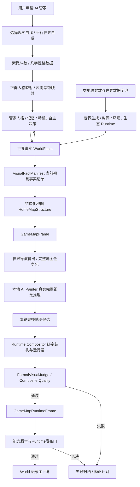
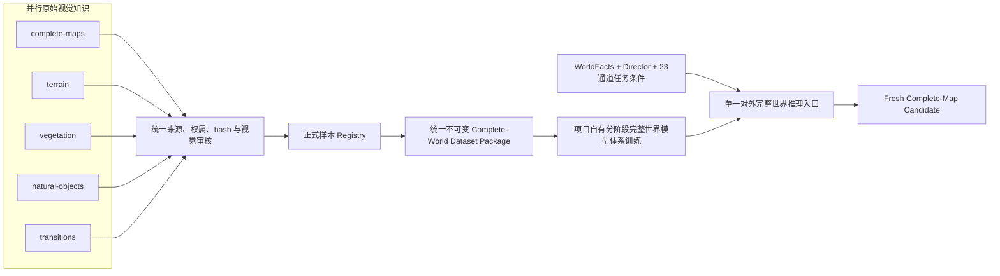
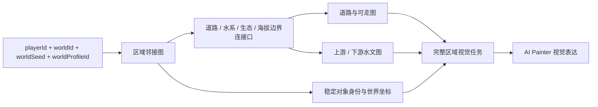
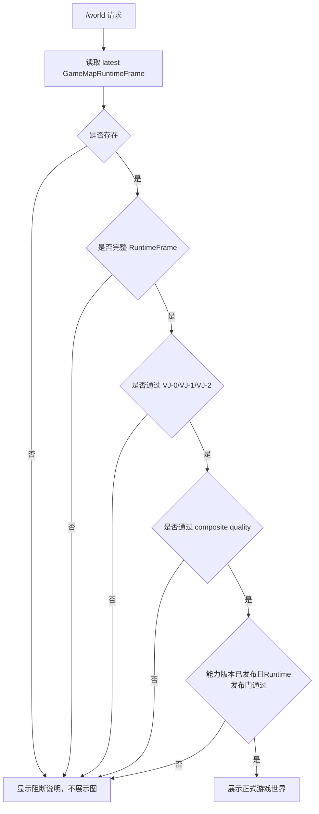

# AI-PET-WORLD 业务与技术架构

更新时间：2026-08-26 09:37:09 +08:00

状态：long-term-architecture-reference

文档版本：`AI-PET-WORLD-ARCHITECTURE-1.3`

生效日期：`2026-08-26`

替代版本：`AI-PET-WORLD-ARCHITECTURE-1.2`

文档状态：`active_normative_target`

程序符合状态：`program_adoption_pending`

Codex等外部执行智能体不得超出当前用户任务范围；本地程序在生效业务、安全和机器合同内自主运行，不从聊天或本句推导逐步Owner审批。

> 本文保留长期产品架构。模块安排只记录在 `docs/game-world-generation/CURRENT_EXECUTION_GUIDE_20260710.md`，不得从长期架构推导执行授权。紫微斗数是人格数据子系统，必须通过正式契约连接 AI 管家人格映射。

本地自研AI如何逐步获得项目知识、任务规划、软件工程、训练验证、审核和运营能力，以及Codex如何逐项退出执行链，由`docs/LOCAL_SELF_DEVELOPED_AI_CAPABILITY_AND_CODEX_MIGRATION_ARCHITECTURE.md`统一定义。该文件是本架构下的能力迁移主体架构，不是项目总体架构，也不产生执行授权。

本文定义 MVP 与长期主线的业务架构、技术架构、数据流、模块边界和禁止事项。模块状态与运行事实不在本文维护。

## 0. 本地智能核心与外部员工解耦架构

本地系统是正式判断、执行状态、审核状态、发布状态和长期记忆的唯一载体。世界事实、任务状态、机器结论、异常升级请求、业务决定、复审结果、容量登记和下一门禁必须全部以本地不可变文件为证据，并由本地SQLite提供查询索引。聊天和外部智能体记忆不属于系统状态。

正式运行链固定为：

```text
本地事实与能力版本读取
-> 本地任务规划与执行
-> 自动验证、机器审核与失败分类
-> 发布 / 回退 / 失败关闭
-> 本地不可变保存、事件与SQLite索引
-> 触及长期业务、许可或安全边界时生成policy-boundary-report并失败关闭
```

Codex只作为受控执行与检查员工。当前允许它在本地程序已经锁定任务、范围和门禁后执行受控冷启动RGB、代码修复或对应检查；它不得成为系统编排器、长期记忆、正式证据源或授权机关。目标架构中，本地小AI负责完整判断和流程编排，Codex仅在收到具体任务时运行相应检查并把证据交回本地系统；移除Codex或丢失聊天历史不得破坏本地流程连续性。

机器可读长期合同由AI Painter正式主体规格登记。训练、能力版本变更、生成、验证、审核、发布、回退或失败关闭均由本地程序在生效合同内自主执行；触及长期业务、外部许可、付费资源或不可恢复操作时禁止越界动作，保存`policy-boundary-report`并写入事件总账与SQLite。Owner职责只由`GOV-OWNER-001`定义，不进入执行链。`latest.json`只是查询指针。

## 0.1 V7 容量架构

V7训练容量采用两级目标，不改变AI Painter、WorldFacts、World Director、23通道、审核或Runtime边界：

| 级别 | 完整地图数量 | split | 作用 |
|---|---:|---|---|
| 首次MVP训练门槛 | 64 | `48/8/4/4` | 尽快启动第一轮正式MVP训练并验证本地模型闭环 |
| 后续正式增强目标 | 128 | `96/16/8/8` | 扩大构图、季节、生态和挑战集覆盖，提高泛化稳定性 |

64张门槛要求每条记录绑定独立完整地图世界事实、World Director、正式23通道、原生RGB、来源许可、机器审核、数据版本机器发布身份、hash和不可变存储；扩容目标不改变单条质量与完整地图门槛。实际容量、活动版本和split以不可变数据包及Dataset最终选择为准。

来源总索引与批准训练容量是两个不同身份。当前来源索引可以同时保存容量样本、历史来源和其他治理记录，因此顶层`sampleCount`不得被解释为批准训练数量；当前64份批准容量只能由容量子集身份及其独立计数字段确认，并继续按`48/8/4/4`使用。任何读取器都必须先验证顶层索引Schema，再从正式容量子集取样，禁止把顶层对象当作样本数组或把总索引数量硬编码为64。

## 0.2 自主能力变更与机器发布信任边界

模型、Loss、数据选择、审核实现、训练计划、能力版本和生产构建等变更必须在首次高风险写入前完成可验证的自主变更控制链：

```text
本地规划器依据生效项目合同形成能力变更候选
-> 不可变变更包绑定范围、代码、数据、模型、阈值和回归
-> 独立程序验证身份、版本、载荷、资源和输出命名空间
-> 建立不可覆盖的消费与执行记录
-> 执行变更、训练、验证和机器能力发布或回退
```

历史冷启动研发运行使用过的Ed25519签名与Owner消费记录只保留为历史证据，不得成为当前或未来本地AI能力变更的前置条件。当前变更包仍必须绑定实际动作、程序、数据、模型、目标和规范化载荷，但由本地系统根据常驻合同创建并用内部幂等票据执行；票据不表示人工许可。

本地编排器必须核对任务合同、scope、具体动作、资源预算和输出边界，并在训练或能力发布等高风险写入前原子登记。普通CPU检查、自动机器审核、只读分析、失败关闭、监控和治理记录属于系统自身职责，不得被错误归类为新的人工授权事项。

生产构建和新能力发布必须有独立变更身份，任一中间步骤失败都保持上一正式版本。正式能力发布后，Runtime任务按版本化合同自主执行；不能从一次业务运行反向获得修改模型、数据或阈值的权限。

能力发布身份不能由调用方布尔字段或外部口头声明成立。发布器必须从真实不可变证据重新计算数据版本、模型产物、审核合同、Runtime接口合同、23通道条件合同、测试报告和程序血缘的SHA-256，验证全部机器门后原子追加发布注册记录；只有注册记录完整有效时才能签发一次性内部任务票据。消费票据时必须再次计算票据SHA-256并核对当前发布记录。注册表中的实际发布状态属于机器事实，不在长期架构文档硬编码。

被后继合同替代的历史合同必须保留原始字节用于复核旧运行，但必须由替代索引登记为`historical_read_only_not_valid_for_new_work`。正式文档和当前程序不得使用历史合同启动新任务。

## 0.3 AI Painter连续执行与后台运行架构

AI Painter 长任务必须由独立于Codex窗口的本地持续执行器承担。研发期的一次训练计划可以打包Smoke、Stage 0、Stage 1和Stage 2；正式运行期的视觉任务可以打包生成、验证、审核、发布和回退。包内状态、次数、程序血缘和停止条件必须在启动前确定。

```text
本地系统物化精确执行计划与能力版本
-> 持续执行器验证任务包、程序血缘、输入证据和新输出目录
-> 建立本地状态、日志、事件和SQLite记录
-> 当前阶段预检
-> 执行训练或生成
-> 同包自动执行固定复现、验证、机器审核与证据保存
-> 写入Manifest、Finalization和唯一成功或失败终态
-> 成功才进入下一阶段；失败则关闭并保持上一正式版本
```

固定验证、机器审核和终态记录属于当前阶段的完成条件，不是训练或生成完成后临时发起的新业务任务。程序不得在这些内部步骤间等待聊天确认。只有新的模型/数据/阈值/训练计划、真实失败路线重启或业务范围变化才进入能力版本变更流程。

Stage 1和Stage 2在启动前尚不知道前一阶段实际Checkpoint哈希，因此执行计划不得绑定模糊的“任意父Checkpoint”。它必须绑定前序成功终态路径、要求状态和Checkpoint字段选择规则；执行器只允许从同一计划的不可变成功终态解析实际路径与SHA。旧失败Run、`latest.json`或聊天内容均不得替代该派生关系。

持续执行器不得依赖Shell命令字符串或Codex会话，只能调用机器合同允许的运行器及参数数组；不得无限自动重试或跨过机器审核。旧冷启动签署工具只用于历史运行复核，不得继续生成当前本地AI握手券。AI Painter具体边界见[正式主体规格](game-world-generation/AI_PAINTER_FORMAL_IMPLEMENTATION_SPEC.md)。

## 0.4 AI Painter内部任务票据与三层自主状态机

内部任务票据是本地系统的幂等和证据机制，不是Owner授权的替代品或派生权限。票据必须绑定`ticketId`、签发程序身份、机器签发密钥身份、执行包ID与SHA、能力版本、状态图、输入证据SHA集合、程序血缘、动作身份、尝试序号、随机nonce、有效期和唯一输出目录。规范化票据载荷必须由操作系统保护的本地机器密钥签名；消费方必须验证签名并重新计算载荷SHA。Owner职责只由`DOCUMENT_AUTHORITY_INDEX.md`中的`GOV-OWNER-001`定义。

票据消费必须跨进程和重启持久防重放：执行器在同一SQLite事务中对`ticketId + capabilityReleaseIdentity + action + attempt`建立唯一消费记录、追加事件并登记目标输出身份，唯一约束冲突即失败关闭。文件证据先写入同目录临时文件、刷新后原子改名；进程中断时只能按事务日志恢复到未消费或已消费的唯一状态，不得根据内存、PID消失或文件部分存在重新消费。

三个状态层级固定为：

### 0.4.1 能力生命周期

```text
change_candidate
-> isolated_implementation
-> cpu_contract_verified
-> readonly_gpu_qualified（需要GPU时）
-> controlled_smoke_completed
-> formal_stage_validation_completed
-> independent_regression_completed
-> machine_release_adjudicated
-> released / rejected / rolled_back
```

能力生命周期回答“某个能力版本能否成为正式能力”。`rejected`和`rolled_back`都是不可变终态；新尝试必须建立新的能力版本身份。

### 0.4.2 单次执行生命周期

```text
package_materialized
-> preflight
-> executing
-> validating
-> reviewing
-> adjudicating
-> finalizing
-> completed

任一状态 -> failed_closed
触及冻结政策边界 -> blocked_policy_boundary
```

执行生命周期回答“某个执行包当前进行到哪里”。`failed_closed`和`blocked_policy_boundary`都不是等待Owner批准；前者终止当前执行，后者禁止越界动作并保存政策边界报告。

### 0.4.3 机器审核生命周期

```text
review_pending
-> review_running
-> review_passed / review_failed / review_evidence_conflict
```

机器审核生命周期回答“当前候选证据是否满足冻结审核合同”。状态映射唯一为：

| 审核终态 | 单次执行映射 | 能力生命周期映射 |
|---|---|---|
| `review_passed` | `reviewing -> adjudicating` | 允许继续后续机器资格，不直接等于`released` |
| `review_failed` | `reviewing -> failed_closed` | 当前能力候选进入`rejected`或保持未发布 |
| `review_evidence_conflict` | `reviewing -> failed_closed` | 不得形成发布裁决；新证据必须使用新执行身份 |
| `blocked_policy_boundary` | 当前执行失败关闭并保存政策报告 | 能力保持上一正式版本，不产生Owner等待状态 |

内部票据覆盖：读取和核验证据、资源预检、进度与心跳、执行包声明的训练或生成、固定预览复现、机器审核、冻结规则因果裁决、Manifest/Finalization/终态、任务胶囊/事件账本/SQLite同步，以及能力版本合同允许的有限基础设施恢复。状态不得跳跃；票据不得补充执行包和能力版本没有的动作。

模型、Loss、数据、划分、阈值、Checkpoint来源或选择规则、程序或依赖血缘、新模型家族和新训练路线发生变化时，必须停止当前运行实例并形成新的隔离能力版本；本地系统可以自主进入该版本的设计、测试、训练和发布流程。裁决不唯一时失败关闭当前路线并保存证据，不得伪造唯一答案。触及长期业务、许可、付费或不可恢复操作边界时禁止越界动作、生成政策边界报告并选择合同内安全替代路线或停止，不得进入Owner等待状态。

自主裁决器初期以确定性规则引擎为正式门，本地模型可以提出候选解释，但必须由机器合同验证。每个裁决保存输入证据、规则版本、命中条件、被排除选项和唯一结果；不唯一时当前路线进入`failed_closed`并登记`failureCode=evidence_ambiguous`，本地系统只能选择合同已声明的替代路线或停止。

## 0.5 当前执行身份与状态投影架构

本地系统必须将运行事实与页面查询选择分离。下列四个身份属于不同状态空间，不得合并为一个“当前Run”：

```text
currentProjectTask       项目当前应继续推进的任务
activeExecution          当前真实活动的执行实例
latestTrainingTerminal   最近一次训练的不可变终态
selectedHistoricalRun    只读界面当前选中的历史记录
```

`currentProjectTask`由本地能力生命周期编排器在合法状态转换成功后更新。训练失败后形成的审核、裁决或下一候选规划可以成为新的项目当前任务，但不改写该训练的失败终态。`activeExecution`必须同时满足任务锁、进程和心跳身份一致且未过期；不满足时为空。`selectedHistoricalRun`只是查询参数，不参与任何状态转换。

当前执行登记采用单写者、追加事件和单调修订。每次更新必须绑定能力版本、执行包、任务、Run、状态、事件序号、终态或任务胶囊的路径与SHA-256。文件指针、追加事件和SQLite索引在同一个可恢复事务中提交；并发修订冲突必须失败关闭，不得覆盖。

控制台和GET聚合器只读取已验证的当前执行登记及其指向的不可变证据。它们不得扫描Smoke、Stage、审核或裁决目录并使用代码顺序、目录名或来源类型优先级推测“当前”。指针不完整或证据不一致时必须返回`unknown_or_stale`并保存冲突证据，不得回退到某个可读取的历史命名空间。

本节定义总体架构。字段、事务、排序、失效和控制台投影规则由`REVIEW_AUTOMATION_AND_STORAGE_SPEC.md`第11节定义。

## 1. 架构原则

系统边界固定为：AI-PET-WORLD 是像素风格自主世界游戏；本地小 AI 是跨世界理解、导演、推理、角色自主、失败学习和视觉表达的游戏智能核心。AI Painter 位于视觉表达边界，只是本地小 AI 的一个子系统。它不能代替 World Runtime、世界事实、角色决策或游戏规则，也不能反向根据图片发明世界事实。

| 原则 | 说明 |
|---|---|
| 世界事实优先 | 世界事实是源头，视觉不能决定世界事实。 |
| 结构先于画面 | 先有可玩的结构地图，再有视觉表达。 |
| AI Painter 负责完整视觉生产 | AI Painter 在世界事实、导演结果和地图结构约束下生成完整世界视觉及持续更新；局部材料只是内部能力。它不负责 Runtime、碰撞、交互和世界规则。 |
| 地图不是单图 | 正式游戏地图由地图块、视觉单元、对象层、可走层、碰撞层、交互层和状态层组成。 |
| 管家决定建设行为 | 初始世界不预设家园位置或未来道路；管家根据人格、记忆、目标和世界事实自主选址、建设与修路，合法结果再写入 WorldFact。 |
| `/world` 只展示 RuntimeFrame | 训练图、候选图、失败图、局部图只进训练页和归档页。 |
| 训练与正式隔离 | 训练产物不能绕过 RuntimeFrame 和 VisualJudge。 |
| 禁止程序直绘最终画面 | 程序可以生成结构、Mask、校验、合成，不能手写玩家最终画面。 |
| 机器审核是正式运行闸门 | 第一版和后续能力均由训练、验证、VisualJudge、历史回归、资源和RuntimeFrame机器门决定能否发布；Owner不承担逐版本验收。 |
| 参考图只定方向 | 当前最高局部图只作为质感基准，不能绕过 RuntimeFrame，也不能作为 `/world` 成果。 |
| 第一版像素视觉契约 | 正式模型原生生成 `1024×768` 高分辨率像素风完整地图；禁止从低分辨率图、tile、sprite 或局部材料放大/拼接得到正式候选。 |

项目架构必须始终保持两条一级主线：

| 一级主线 | 输入 | 核心处理 | 输出 |
|---|---|---|---|
| AI 管家人格与角色自主 | 紫微斗数、八字、用户选择的映射模式 | 性格数据标准化、现实自我正向映射、平行世界反向紫微映射、记忆与自主决策 | 可持续行动的 AI 管家 |
| 类地球世界自主运行与生长 | 类地球参数、世界数据字典、时间、环境和世界事实 | 世界生成、Runtime 推进、生态与资源变化、状态持久化 | 持续存在并自主演化的世界 |

两条主线通过“管家感知世界事实”和“管家行为写入合法世界变化”连接。视觉系统只负责表达该闭环产生的事实。管家的初始记忆可以为空；紫微斗数为主、八字为辅的人格映射提供初始判断倾向，但不会预写具体家园位置。家园选址、建筑和道路变化必须由运行时决策与世界规则共同产生。

世界生成身份层固定为：

```text
PlayerIdentity
-> WorldIdentity(worldId)
-> DeterministicWorldSeed
-> EarthLikeWorldProfile
-> Terrain / Climate / Hydrology / Ecology / Time
-> WorldFacts
```

长期生成器必须允许不同 `playerId` 绑定不同世界种子和世界档案。MVP 使用 `mainland-southeast-asia-tropical-monsoon-natural-home-v1` 作为兼容参考档案，并以 `sakaerat-wang-nam-khiao-mvp-reference-v1` 作为当前新增数据的具体事实锚点。新路线允许从有明确许可、版本和来源的真实高程、土地覆盖、气候与土壤测量中派生自然世界事实和自然拓扑，但必须先剔除建筑、城市、工程道路、耕地地块、人工水体与其他人类开发痕迹，再归一化到游戏坐标；不得把外部RGB或地图瓦片视觉作为训练图或生成器图片参考。`playerId`、`worldId`、`worldSeed` 和 `worldProfileId` 四个字段仍必须保留，避免第一版完成后重写世界身份架构。气候、水文、地形和物种事实必须绑定来源、版本、许可、采集时间、hash与派生步骤；外部测量来源不自动授予图片训练权。

上述泰国锚点只属于当前MVP区域。长期架构必须在WorldIdentity与WorldFacts之间增加版本化真实地球区域来源层：

```text
WorldIdentity
-> RealEarthRegionIdentity
-> RealEarthRegionSourcePackage
-> DerivedNaturalWorldFacts
-> RegionGraph / Terrain / Climate / Hydrology / Soil / Ecology
-> WorldFacts
```

`RealEarthRegionSourcePackage`按真实国家或地区独立建立，不能由一个全局泰国包服务所有世界。它必须包含区域范围和地理参考，以及高程、土地覆盖、气候、土壤、水文、生态、连接数据的来源对象、许可、版本、采集时间、hash和派生清单。新区域缺少自己的合格包时必须阻断，不能退回泰国数据或由生成器补造事实。

### 1.1 RealEarthRegionSourcePackage正式结构

```text
RealEarthRegionSourcePackage
├─ identity
│  ├─ realEarthRegionId
│  ├─ countryOrTerritory
│  ├─ namedArea
│  ├─ spatialBounds
│  ├─ coordinateReference
│  └─ observationPeriod
├─ sourceLayers
│  ├─ elevationAndTerrain
│  ├─ landCover
│  ├─ climateAndSeason
│  ├─ soilAndMoisture
│  ├─ hydrology
│  ├─ ecologyAndSpecies
│  └─ regionalConnectivity
├─ sourceProvenance
│  ├─ provider / product / version
│  ├─ license / attribution
│  ├─ acquisitionUrlOrObjectId
│  ├─ acquiredAtUtc / acquiredAtAsiaShanghai
│  └─ rawSha256
├─ derivation
│  ├─ humanDevelopmentClassification
│  ├─ removalOrNaturalization
│  ├─ measurementAggregation
│  ├─ anonymousGameCoordinateNormalization
│  └─ derivationManifestSha256
└─ output
   ├─ DerivedNaturalWorldFacts
   ├─ regionalConnectivityFacts
   ├─ sourcePackageSha256
   └─ auditStatus
```

### 1.2 区域包生命周期

```text
本地系统在长期区域策略、来源许可和资源预算内选择真实地区和范围
-> 注册适用来源、许可和版本
-> 获取并不可变保存原始对象与hash
-> 核对空间覆盖、时间覆盖和无数据范围
-> 识别人类开发与不适用事实
-> 按当前世界阶段执行移除或自然化
-> 派生地形/气候/土壤/水文/生态事实
-> 建立该地区自己的RegionGraph与连接实例
-> 归一化到游戏坐标并保存派生关系
-> 编译WorldFacts、World Director和23通道
-> 来源、完整地图、连接、唯一性和存储审核
-> 才能进入完整RGB生成门
```

MVP区域来源为泰国Sakaerat / Wang Nam Khiao包。未来区域可以由本地系统在长期业务目标、来源许可、网络与资源预算内自主建立独立来源包；若需要未登记付费来源、接受不明确许可或改变产品地区范围，必须禁止越界动作、失败关闭并生成政策边界报告，不等待审批。

### 1.3 真实空间与游戏坐标关系

真实空间身份和测量值必须保留在来源层；游戏坐标是经记录的视觉/运行坐标派生层。两者关系固定为：

```text
真实地区与测量数据
-> 可追溯自然事实和空间关系
-> 经审核的游戏坐标归一化
-> WorldFacts与结构条件
-> AI Painter视觉表达
```

不得把真实地图RGB当作游戏画面，也不得因“匿名游戏坐标”丢失真实地区、来源范围或事实谱系。匿名化只防止直接复制现实导航/工程几何，不允许把真实地球依据改成随机想象。

## 2. 业务架构图



## 3. 技术架构图

```mermaid
flowchart LR
  subgraph Personality["Butler Personality and Autonomy"]
    Astrology["Ziwei / Bazi Structured Data"]
    Mapping["Self Mapping / Reverse Ziwei Mapping"]
    ButlerCore["Personality / Memory / Motivation / Decision"]
  end

  subgraph Runtime["World Runtime"]
    Earth["Earth-like Parameters"]
    WF["WorldFacts"]
    Tick["World Tick"]
    Growth["Environment / Ecology / Growth"]
  end

  subgraph Map["Game Map System"]
    HMS["HomeMapStructure"]
    GMF["GameMapFrame"]
    Layers["terrain/object/walkable/collision/interaction/state"]
    Slots["VisualUnitSlots"]
  end

  subgraph Painter["Local AI Painter"]
    FactManifest["VisualFactManifest"]
    Director["World Director Output"]
    Task["Complete World Visual Task Package"]
    Model["Local Staged Complete-World Visual System"]
    Output["Fresh Complete-Map Candidate"]
    Archive["Generated Results Archive"]
  end

  subgraph Judge["Visual Judge"]
    VJ0["VJ-0 来源/绑定"]
    VJ1["VJ-1 视觉质量"]
    VJ2["VJ-2 语义/游戏地图"]
    CQ["Composite Quality"]
  end

  subgraph Display["Display"]
    RF["GameMapRuntimeFrame"]
    ReleaseGate["Machine Capability Release / Runtime Publish Gate"]
    WorldPage["/world"]
  end

  Astrology --> Mapping --> ButlerCore
  Earth --> Tick --> Growth --> WF
  ButlerCore --> WF
  WF --> ButlerCore
  WF --> FactManifest --> HMS --> GMF --> Slots --> Director --> Task --> Model --> Output --> Archive
  Output --> VJ0 --> VJ1 --> VJ2 --> CQ
  CQ --> RF --> ReleaseGate --> WorldPage
  GMF --> RF
```



### 3.1 视觉知识、训练数据与推理架构

原图库是训练来源层，不是运行时地图层。五类目录按主要知识职责并行保存原图和证据；审核通过后由统一登记器写入正式样本注册表，再由数据包构建器按 hash、结构和来源隔离为统一完整世界数据包。正式推理只有一个完整世界入口，内部能力可以由一个或多个自有模块实现，但不得让任何分类目录或局部模型取得主入口地位。



“单一对外入口”不等于内部只能存在一个不可分辨模型。AI Painter 当前正式内部责任链固定为：

```text
authoritative_world_structure_binding                  [非训练权威绑定]
-> terrain_route_hydrology_spatial_realization        [隔离训练组件]
-> per_class_object_semantic_realization              [隔离训练组件]
-> global_visual_harmonization_and_native_complete_rgb_decode [隔离训练组件]
-> Fresh Complete-Map Candidate
```

四个责任阶段必须绑定同一 `worldId`、`regionId`、`tick`、`factHash`、`VisualFactManifest` 和23通道条件包。后三个训练组件拥有相互隔离的参数、Checkpoint、输出和终态身份；后一组件只能消费同一执行包前一阶段的成功终态与输出身份。该内部责任链不得与 `Stage 0/1/2` 的训练分辨率阶段混淆，也不得退化为 tile、patch、sprite、局部拼接、低分辨率放大或规则程序直绘。

固定禁止关系：

```text
五类目录 != 五个训练阶段
五类目录 != 五个 Runtime 图层
五类目录 != 五个必须独立存在的神经网络
五类原图 != 程序机械拼接后的完整地图
```

语义分类图可以保留完整环境上下文；只有用于明确标注、条件构建或审核证据时才允许生成可追溯裁切。旧 256×192 材料槽、无父图引用的孤立裁片和重复噪声变体不能替代完整世界训练数据。

第一版正式路线使用原生 `1024×768` 高分辨率像素风画布：正式输出覆盖整个地图并绑定当前任务包、全部结构条件、模型谱系和审核记录。旧 `256×192` 材料槽和任何低分辨率局部输出只作历史证据，不得放大或拼接进入正式路线。23 通道结构条件必须通过可审计的条件编译生成与原生画布严格对齐的条件张量；训练可以使用渐进分辨率，但正式候选、审核和 Runtime 只认原生 `1024×768` 输出。

### 3.2 大世界空间连接架构

第一版自然家园是未来类地球大世界中的第一个连接区域。`1024×768` 是当前完整区域视觉画布，不是整个长期世界的固定边界。区域连接必须先由World Runtime依据结构化世界事实和正式连接合同产生，再由 AI Painter 表达；图片、提示词和模型输出没有拓扑决策权。

连接架构必须严格区分“模式契约”和“实例蓝图”：

```text
natural-home-large-world-connectivity-v1
  = 所有区域共同遵守的数据结构、配对和审核规则

mainland-southeast-asia-earth-reference-natural-home-region-0001-v1
  = region-0001自身的一个具体连接实例
```

模式契约不得携带固定北/南/东/西构图。具体实例可以锁定自身的方向和端口，但其作用域只能是对应`regionId`。V7训练槽位和其他自主生成区域必须建立独立`regionId`及其RegionGraph、EdgePort、PathGraph、HydrologyGraph和WalkableGraph；除非任务明确绑定同一运行区域，否则禁止引用`region-0001`的北入南出、东侧共享水道、南侧道路口作为训练边界。水体不存在、封闭水体、内部湿地和不同跨区域水文必须按当前世界事实表达。

“独立区域连接实例”仍须落在同一个连通世界图中。每个区域节点至少包含一组与相邻区域双向配对的边界通行口，并由PathGraph/WalkableGraph证明可达；水系存在时由HydrologyGraph证明上下游或跨界关系，生态与海拔过渡由相邻事实证明连续。任何无邻接、端口未配对或仅用图片接缝证明连接的区域都不能进入自主世界或独立训练容量。

完整地图唯一性必须使用两个相互独立的结构身份：

| 身份 | 至少包含 | 作用 |
|---|---|---|
| `themeArchitectureIdentity` | RegionGraph关系、EdgePort类型/方向、水文与道路拓扑、水路相对关系、生态/空间分区、自然边界和阅读层级 | 阻断同一世界主题骨架重复 |
| `instanceDetailIdentity` | 河岸/道路具体轨迹、分支和水域轮廓、分区轮廓、对象实例位置与簇、密度节奏、空隙及局部过渡 | 阻断换皮、轻微位移或细节复用 |

两者都必须对全部历史执行直接、镜像、旋转和变形比较。hash不同、测量窗口不同或主题名称不同不能替代结构唯一性证明。



| 结构 | 职责 | 固定边界 |
|---|---|---|
| RegionGraph | 保存区域身份、全局范围和双向邻接关系 | 不由 RGB 或导演自由生成 |
| EdgePort | 保存道路、水系、生态和海拔在区域边界的配对关系 | 未配对出口必须阻断，不能伪装成已连接 |
| PathGraph / WalkableGraph | 证明入口、中心和批准出口可走连通 | 任何碰撞变化都必须重新校验 |
| HydrologyGraph | 保存流向、上游、下游、海拔和跨区域水口 | 水岸视觉不能替代水文事实 |
| ObjectIdentitySet | 保存跨 tick 和跨区域对象身份 | 视觉变体不得改变对象事实 |

机器可读模式契约是 `natural-home-large-world-connectivity-v1`，固定位置为 `data/world-samples/world-connectivity/world-connectivity-contract-v1.json`。具体实例蓝图 `mainland-southeast-asia-earth-reference-natural-home-region-0001-v1` 只定义其对应区域的连接事实，不批准其他训练区域复制。具体迁移、tick、审核和hash由世界运行证据保存；连接事实审核通过也不等于图片具备连接训练资格。

### 3.3 训练数据存储与目录索引架构

AI Painter训练、推理、审核、失败回写和Runtime证据采用文件权威、数据库索引的冷热分层架构：

```text
F:\ai-pet-world                       项目代码、文档和轻量逻辑入口
D:\AI-PET-WORLD-DATA\hot\runtime     当前运行和仍需直接访问的热文件
D:\AI-PET-WORLD-DATA\cold\runs       已完成运行的不可变冷归档
D:\AI-PET-WORLD-DATA\catalog         SQLite目录索引与只读查询快照
D:\AI-PET-WORLD-DATA\migrations      迁移清单、数量/字节/hash校验和切换证据
```

数据库只保存run、artifact、event、审核状态、URI、大小、时间戳和SHA-256，不取代图片、checkpoint和原始JSON文件。项目逻辑路径`.runtime`在无损迁移完成后通过目录联接继续保持兼容，避免现有世界事实、训练和审核身份发生变化。完成运行进入冷层时必须保留不可变归档、原始相对路径和hash；控制台通过SQLite分页查询，不得为显示页面递归扫描整个物理目录。

存储迁移必须由不可变迁移清单保存源、目标、数量、字节、逐文件hash、切换和回退证据。实际迁移状态、备份位置和SQLite计数只从机器记录读取，不写入架构文档。

## 4. RuntimeFrame 数据结构边界

RuntimeFrame运行证据按`working -> candidates -> accepted frame / rejected frames`流转。工作区只保存生成和合成中的身份，候选区只保存等待审核的记录；二者都不能被`/world`读取。由有效能力版本生成且通过机器审核与发布门的记录进入正式RuntimeFrame存储，失败记录进入不可变拒绝存储；第一版和后续版本使用同一机器发布规则。

正式 GameMapRuntimeFrame 必须至少包含：

| 层 | 作用 | 是否世界事实 |
|---|---|---:|
| identity | worldId、ownerId、tick、sourceFactIds | 是 |
| mapStructure | 地图结构、入口/出口、区域、自然通行、水岸；建设后才可包含家园与新道路 | 是 |
| terrainLayer | 草地、水体、水岸、道路等地形定义 | 是 |
| objectLayer | 树、石头、草丛、花等对象记录 | 是 |
| visualLayer | AI Painter 生成的视觉材料引用 | 部分。它是表达，不是事实。 |
| walkableLayer | 可走区域 | 是 |
| collisionLayer | 不可穿越区域 | 是 |
| interactionLayer | 可查看、可点击、可建设、可采集区域 | 是 |
| stateLayer | 生命周期、建造状态、资源状态、天气影响 | 是 |
| audit | VisualJudge、hash、时间戳、模型版本、失败记录 | 否，但必须存在。 |
| capabilityRelease | 由数据、模型、审核、Runtime、条件和测试证据形成的机器能力发布身份 | 是；不需要逐版本或逐帧人工验收。 |

## 5. 关键对象

| 对象 | 作用 | 关键字段 |
|---|---|---|
| WorldFact | 世界事实源头 | `factId`、`worldId`、`tick`、`type`、`payload`、`source` |
| VisualFactManifest | 视觉所需事实清单 | `sourceFactIds`、主事实、支撑事实、环境事实 |
| CompleteWorldVisualTaskPackage | 当前完整地图推理任务 | `worldId`、`tick`、`dictionaryVersion`、`visualFactManifestId`、导演输出、结构输入、失败记忆、禁止内容 |
| CompleteWorldVisualCandidate | 本轮真实完整地图候选 | `taskPackageId`、`modelVersion`、`checkpoint`、`seed`、`imageHash`、`generatedAt`、`reusedExistingImage=false` |
| HighResolutionPixelStyleFrame | 第一版高分辨率像素风画面契约 | `nativeWidth=1024`、`nativeHeight=768`、`completeMap=true`、`generatedDirectly=true`、`lowResolutionUpscale=false`、`mechanicalComposition=false`、`addsVisualFacts=false` |
| HomeMapStructure | 自然家园结构 | 入口/出口、水岸、自然通行、自然边界；家园与建设道路仅在后续事实存在时出现 |
| GameMapFrame | 可合成地图帧 | layers、slots、layout、camera |
| VisualUnitSlot | 视觉单元槽位 | `slotId`、`kind`、`bounds`、`layer`、`sourceFactIds` |
| RegionTexture | AI 生成的区域视觉材料 | `textureId`、`slotId`、`imageHash`、`reviewStatus` |
| ObjectVisualUnit | AI 生成的对象视觉材料 | `unitId`、`objectKind`、`imageHash`、`alphaMaskHash` |
| Approved Material Pack | 已审核视觉材料包 | `packId`、`worldId`、`tick`、`qualityReport`、`materials` |
| GameMapRuntimeFrame | 正式世界画面记录 | `frameId`、`worldId`、`tick`、`runtimeLayers`、`visualLayers`、`audit` |

## 6. AI Painter 内部边界

| 模块 | 职责 |
|---|---|
| Dataset Builder | 准备训练图、Mask、来源记录、用途记录。 |
| Training Runner | 本地训练，记录 GPU、耗时、loss、输出。 |
| Authoritative World Structure Binding | 非训练地绑定 WorldFacts、VisualFactManifest、23通道条件和任务身份，不生成或修改世界事实。 |
| Terrain / Route / Hydrology Component | 只承担地形、道路和水文空间实现，保存隔离输出与终态。 |
| Per-Class Object Semantic Component | 只承担 footprints、tree、rock、vegetation 语义实现，不修改批准对象掩码。 |
| Global Visual Harmonization Component | 只承担全局视觉协调和原生完整RGB解码，是唯一允许通过冻结Autoencoder形成最终RGB的内部组件。 |
| Inference Runner | 对外只提供一个完整世界推理入口，按固定责任顺序编排同包组件并生成本轮完整地图新候选；局部材料推理只可作为内部从属能力。 |
| Refiner | 细化局部视觉材料。 |
| Candidate Store | 保存候选结果，不进入 `/world`。 |
| Result Archive | 保存成功、失败、耗时、时间戳、GPU 信息、质量分数。 |

`Dataset Builder` 必须统一消费五类合格记录和完整任务条件，输出同一个版本化完整世界数据包。`Refiner` 只负责模型内部或候选后的受控细化，不得把五类原图按坐标贴合、缩放或拼接后宣称为 AI Painter 完整地图生成。

AI Painter 禁止承担：

| 禁止职责 | 原因 |
|---|---|
| 决定地图里有什么 | 这是世界事实和 Runtime 的职责。 |
| 决定玩家能不能走 | 这是可走层和碰撞层的职责。 |
| 直接写 `/world` | 必须经过 RuntimeFrame 和 VisualJudge。 |
| 接入第三方在线绘图 API | 当前正式链路必须本地自研。 |

## 7. `/world` 展示闸门



`/world` 不能读取：

| 内容 | 原因 |
|---|---|
| 训练图片 | 中间产物。 |
| 失败图片 | 只能归档和复盘。 |
| 候选图片 | 未正式通过。 |
| 局部素材 | 不是完整游戏地图。 |
| 单张 ApprovedFrame | 只是视觉素材凭证，不是 RuntimeFrame。 |
| 程序占位图 | 不是正式 AI 视觉结果。 |
| 能力发布或Runtime发布门否决图 | 即使部分审核通过也不能展示，必须进入失败归档和修复链。 |

## 8. 架构结论

系统必须采用“视觉事实清单 + 世界导演 + 结构化游戏地图 + 本地模型完整视觉推理 + RuntimeFrame 绑定”。AI Painter 负责完整视觉表达，局部材料只是内部能力。游戏是否可玩、对象是否存在、道路是否连通、碰撞是否正确、世界是否自主，全部由结构化数据和 Runtime 决定。

正式展示链路必须收口为：

```txt
VisualFactManifest + 世界导演 + 结构化游戏地图
+ 本地 AI Painter 本轮完整地图新候选
+ RuntimeFrame 结构与运行层绑定
+ VisualJudge / composite quality
+ 能力版本机器发布门 / Runtime发布门
= /world 正式游戏世界
```

能力版本机器发布证据不完整，或Runtime发布门否决时，不能把任何 RuntimeFrame 当成正式游戏成功结果。

## 9. 视觉模型实现关系

V7是AI Painter视觉生产子系统中的一代完整地图条件去噪实现：输入是正式世界事实、世界导演和23通道完整地图条件，输出须经过机器审核、能力版本发布策略和RuntimeFrame绑定，不能生成或修改世界事实。V7及其后续候选属于可替换实现，不等同于AI Painter长期业务架构。

代码合同、CPU回归、数据容量、GPU训练、Checkpoint、训练后验证、正式推理和游戏世界完成是相互独立的状态。任何前置状态都不能被描述为后续能力通过；实际模型状态只从训练、验证和资格机器证据读取。
