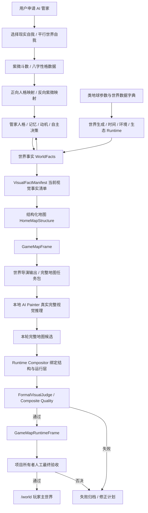
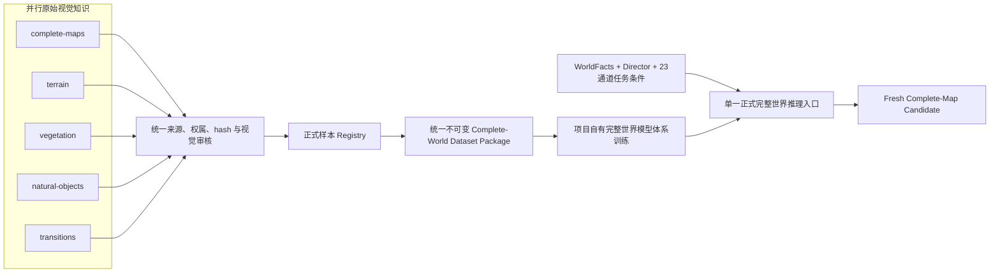
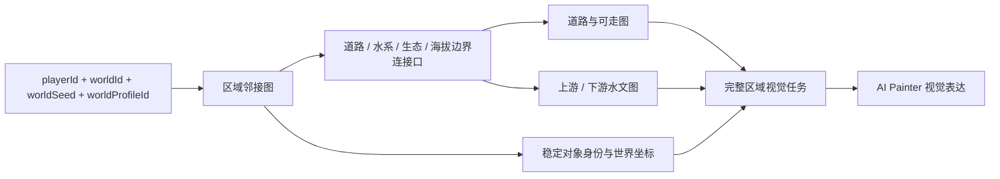

# AI-PET-WORLD 业务与技术架构

更新时间：2026-07-23 05:55:34 +08:00

状态：long-term-architecture-reference / 当前只实现完整自然家园地图相关层

不允许自由发挥；除非发现错误导致无法继续，必须先停下来询问项目所有者。

> 本文保留长期产品架构。当前执行范围、阻断和下一步只读取 `docs/game-world-generation/CURRENT_EXECUTION_GUIDE_20260710.md`，不得从长期架构提前启动管家角色或玩家交互。紫微斗数是人格数据子系统，当前地图阶段不实现其业务，但长期必须通过正式契约连接 AI 管家人格映射。

本文定义当前 MVP 和长期主线的业务架构、技术架构、数据流、模块边界和禁止事项。

## 1. 架构原则

系统边界固定为：AI-PET-WORLD 是像素风格自主世界游戏；本地小 AI 是跨世界理解、导演、推理、角色自主、失败学习和视觉表达的游戏智能核心。AI Painter 位于视觉表达边界，只是本地小 AI 的一个子系统。它不能代替 World Runtime、世界事实、角色决策或游戏规则，也不能反向根据图片发明世界事实。

| 原则 | 说明 |
|---|---|
| 世界事实优先 | 世界事实是源头，视觉不能决定世界事实。 |
| 结构先于画面 | 先有可玩的结构地图，再有视觉表达。 |
| AI Painter 负责完整视觉生产 | AI Painter 在世界事实、导演结果和地图结构约束下生成完整世界视觉及持续更新；局部材料只是内部能力。它不负责 Runtime、碰撞、交互和世界规则。 |
| 地图不是单图 | 正式游戏地图由地图块、视觉单元、对象层、可走层、碰撞层、交互层和状态层组成。 |
| `/world` 只展示 RuntimeFrame | 训练图、候选图、失败图、局部图只进训练页和归档页。 |
| 训练与正式隔离 | 训练产物不能绕过 RuntimeFrame 和 VisualJudge。 |
| 禁止程序直绘最终画面 | 程序可以生成结构、Mask、校验、合成，不能手写玩家最终画面。 |
| 机器审核不是最终通过 | VisualJudge 和 RuntimeFrame gate 只是前置闸门，最终必须由项目所有者人工确认达到正式游戏标准。 |
| 参考图只定方向 | 当前最高局部图只作为质感基准，不能绕过 RuntimeFrame，也不能作为 `/world` 成果。 |
| 第一版像素视觉契约 | 正式模型原生生成 `1024×768` 高分辨率像素风完整地图；禁止从低分辨率图、tile、sprite 或局部材料放大/拼接得到正式候选。 |

项目架构必须始终保持两条一级主线：

| 一级主线 | 输入 | 核心处理 | 输出 |
|---|---|---|---|
| AI 管家人格与角色自主 | 紫微斗数、八字、用户选择的映射模式 | 性格数据标准化、现实自我正向映射、平行世界反向紫微映射、记忆与自主决策 | 可持续行动的 AI 管家 |
| 类地球世界自主运行与生长 | 类地球参数、世界数据字典、时间、环境和世界事实 | 世界生成、Runtime 推进、生态与资源变化、状态持久化 | 持续存在并自主演化的世界 |

两条主线通过“管家感知世界事实”和“管家行为写入合法世界变化”连接。视觉系统只负责表达该闭环产生的事实。

世界生成身份层固定为：

```text
PlayerIdentity
-> WorldIdentity(worldId)
-> DeterministicWorldSeed
-> EarthLikeWorldProfile
-> Terrain / Climate / Hydrology / Ecology / Time
-> WorldFacts
```

长期生成器必须允许不同 `playerId` 绑定不同世界种子和世界档案。MVP 使用 `mainland-southeast-asia-tropical-monsoon-natural-home-v1` 作为固定参考档案，以东南亚大陆热带季风低地、河谷和丘陵生态为现实参照；`playerId`、`worldId`、`worldSeed` 和 `worldProfileId` 四个字段仍必须保留，避免第一版完成后重写世界身份架构。气候、水文、地形和物种事实必须绑定来源、版本、许可与采集时间；外部事实来源不自动授予图片训练权。

## 2. 业务架构图



## 3. 技术架构图

```mermaid
flowchart LR
  subgraph Personality["Butler Personality and Autonomy"]
    Astrology["Ziwei / Bazi Structured Data"]
    Mapping["Self Mapping / Reverse Ziwei Mapping"]
    ButlerCore["Personality / Memory / Motivation / Decision"]
  end

  subgraph Runtime["World Runtime"]
    Earth["Earth-like Parameters"]
    WF["WorldFacts"]
    Tick["World Tick"]
    Growth["Environment / Ecology / Growth"]
  end

  subgraph Map["Game Map System"]
    HMS["HomeMapStructure"]
    GMF["GameMapFrame"]
    Layers["terrain/object/walkable/collision/interaction/state"]
    Slots["VisualUnitSlots"]
  end

  subgraph Painter["Local AI Painter"]
    FactManifest["VisualFactManifest"]
    Director["World Director Output"]
    Task["Complete World Visual Task Package"]
    Model["Local Complete-World Model"]
    Output["Fresh Complete-Map Candidate"]
    Archive["Generated Results Archive"]
  end

  subgraph Judge["Visual Judge"]
    VJ0["VJ-0 来源/绑定"]
    VJ1["VJ-1 视觉质量"]
    VJ2["VJ-2 语义/游戏地图"]
    CQ["Composite Quality"]
  end

  subgraph Display["Display"]
    RF["GameMapRuntimeFrame"]
    OwnerGate["Owner Final Acceptance"]
    WorldPage["/world"]
  end

  Astrology --> Mapping --> ButlerCore
  Earth --> Tick --> Growth --> WF
  ButlerCore --> WF
  WF --> ButlerCore
  WF --> FactManifest --> HMS --> GMF --> Slots --> Director --> Task --> Model --> Output --> Archive
  Output --> VJ0 --> VJ1 --> VJ2 --> CQ
  CQ --> RF --> OwnerGate --> WorldPage
  GMF --> RF
```



### 3.1 视觉知识、训练数据与推理架构

原图库是训练来源层，不是运行时地图层。五类目录按主要知识职责并行保存原图和证据；审核通过后由统一登记器写入正式样本注册表，再由数据包构建器按 hash、结构和来源隔离为统一完整世界数据包。正式推理只有一个完整世界入口，内部能力可以由一个或多个自有模块实现，但不得让任何分类目录或局部模型取得主入口地位。



固定禁止关系：

```text
五类目录 != 五个训练阶段
五类目录 != 五个 Runtime 图层
五类目录 != 五个必须独立存在的神经网络
五类原图 != 程序机械拼接后的完整地图
```

语义分类图可以保留完整环境上下文；只有用于明确标注、条件构建或审核证据时才允许生成可追溯裁切。旧 256×192 材料槽、无父图引用的孤立裁片和重复噪声变体不能替代完整世界训练数据。

第一版正式路线使用原生 `1024×768` 高分辨率像素风画布：正式输出覆盖整个地图并绑定当前任务包、全部结构条件、模型谱系和审核记录。旧 `256×192` 材料槽和任何低分辨率局部输出只作历史证据，不得放大或拼接进入正式路线。23 通道结构条件必须通过可审计的条件编译生成与原生画布严格对齐的条件张量；训练可以使用渐进分辨率，但正式候选、审核和 Runtime 只认原生 `1024×768` 输出。

### 3.2 大世界空间连接架构

第一版自然家园是未来类地球大世界中的第一个连接区域。`1024×768` 是当前完整区域视觉画布，不是整个长期世界的固定边界。区域连接必须先由结构化世界事实和项目所有者批准的连接蓝图定义，再由 AI Painter 表达；图片、提示词和模型输出没有拓扑决策权。



| 结构 | 职责 | 固定边界 |
|---|---|---|
| RegionGraph | 保存区域身份、全局范围和双向邻接关系 | 不由 RGB 或导演自由生成 |
| EdgePort | 保存道路、水系、生态和海拔在区域边界的配对关系 | 未配对出口必须阻断，不能伪装成已连接 |
| PathGraph / WalkableGraph | 证明入口、中心和批准出口可走连通 | 任何碰撞变化都必须重新校验 |
| HydrologyGraph | 保存流向、上游、下游、海拔和跨区域水口 | 水岸视觉不能替代水文事实 |
| ObjectIdentitySet | 保存跨 tick 和跨区域对象身份 | 视觉变体不得改变对象事实 |

机器可读契约是 `natural-home-large-world-connectivity-v1`，固定位置为 `data/world-samples/world-connectivity/world-connectivity-contract-v1.json`。第一版连接蓝图 `mainland-southeast-asia-earth-reference-natural-home-region-0001-v1` 已按项目所有者“使用真实地球实际情况”的命令登记：水文按东南亚大陆河谷总体北入南出组织，道路从当前最近的南边界接入，西侧保持自然边界；外部资料只提供事实关系，不复制真实地图几何。项目所有者授权后，程序已把区域身份、三个邻居、四个当前区域连接口、PathGraph、HydrologyGraph 和 WalkableGraph 写入 tick 2，并自动保存迁移前后世界状态、hash 和报告；项目所有者审核通过后，程序在不改变连接几何的前提下写入 tick 3 和独立审核记录。连接事实审核通过不等于图片具备连接训练资格，也不等于连接覆盖数量门槛已批准。

### 3.3 训练数据存储与目录索引架构

AI Painter训练、推理、审核、失败回写和Runtime证据采用文件权威、数据库索引的冷热分层架构：

```text
F:\ai-pet-world                       项目代码、文档和轻量逻辑入口
D:\AI-PET-WORLD-DATA\hot\runtime     当前运行和仍需直接访问的热文件
D:\AI-PET-WORLD-DATA\cold\runs       已完成运行的不可变冷归档
D:\AI-PET-WORLD-DATA\catalog         SQLite目录索引与只读查询快照
D:\AI-PET-WORLD-DATA\migrations      迁移清单、数量/字节/hash校验和切换证据
```

数据库只保存run、artifact、event、审核状态、URI、大小、时间戳和SHA-256，不取代图片、checkpoint和原始JSON文件。项目逻辑路径`.runtime`在无损迁移完成后通过目录联接继续保持兼容，避免现有世界事实、训练和审核身份发生变化。完成运行进入冷层时必须保留不可变归档、原始相对路径和hash；控制台通过SQLite分页查询，不得为显示页面递归扫描整个物理目录。

迁移`runtime-to-d-20260720-0528`已完成并激活。源/目标均为700,058个文件和94,808,690,230字节，逐文件校验差异为0；`.runtime`已成为D盘热层目录联接，F盘旧数据保留为带迁移ID的备份。SQLite现登记700,058条artifact和637条程序事件；控制台主页面、实时摘要和完整地图页面均已通过索引读取回归。

## 4. RuntimeFrame 数据结构边界

正式 GameMapRuntimeFrame 必须至少包含：

| 层 | 作用 | 是否世界事实 |
|---|---|---:|
| identity | worldId、ownerId、tick、sourceFactIds | 是 |
| mapStructure | 地图结构、入口、中心、区域、道路、水岸 | 是 |
| terrainLayer | 草地、水体、水岸、道路等地形定义 | 是 |
| objectLayer | 树、石头、草丛、花等对象记录 | 是 |
| visualLayer | AI Painter 生成的视觉材料引用 | 部分。它是表达，不是事实。 |
| walkableLayer | 可走区域 | 是 |
| collisionLayer | 不可穿越区域 | 是 |
| interactionLayer | 可查看、可点击、可建设、可采集区域 | 是 |
| stateLayer | 生命周期、建造状态、资源状态、天气影响 | 是 |
| audit | VisualJudge、hash、时间戳、模型版本、失败记录 | 否，但必须存在。 |
| ownerAcceptance | 项目所有者人工最终验收记录 | 否，但正式展示前必须存在通过记录。 |

## 5. 关键对象

| 对象 | 作用 | 关键字段 |
|---|---|---|
| WorldFact | 世界事实源头 | `factId`、`worldId`、`tick`、`type`、`payload`、`source` |
| VisualFactManifest | 视觉所需事实清单 | `sourceFactIds`、主事实、支撑事实、环境事实 |
| CompleteWorldVisualTaskPackage | 当前完整地图推理任务 | `worldId`、`tick`、`dictionaryVersion`、`visualFactManifestId`、导演输出、结构输入、失败记忆、禁止内容 |
| CompleteWorldVisualCandidate | 本轮真实完整地图候选 | `taskPackageId`、`modelVersion`、`checkpoint`、`seed`、`imageHash`、`generatedAt`、`reusedExistingImage=false` |
| HighResolutionPixelStyleFrame | 第一版高分辨率像素风画面契约 | `nativeWidth=1024`、`nativeHeight=768`、`completeMap=true`、`generatedDirectly=true`、`lowResolutionUpscale=false`、`mechanicalComposition=false`、`addsVisualFacts=false` |
| HomeMapStructure | 自然家园结构 | 入口、中心、水岸、道路、自然边界 |
| GameMapFrame | 可合成地图帧 | layers、slots、layout、camera |
| VisualUnitSlot | 视觉单元槽位 | `slotId`、`kind`、`bounds`、`layer`、`sourceFactIds` |
| RegionTexture | AI 生成的区域视觉材料 | `textureId`、`slotId`、`imageHash`、`reviewStatus` |
| ObjectVisualUnit | AI 生成的对象视觉材料 | `unitId`、`objectKind`、`imageHash`、`alphaMaskHash` |
| Approved Material Pack | 已审核视觉材料包 | `packId`、`worldId`、`tick`、`qualityReport`、`materials` |
| GameMapRuntimeFrame | 正式世界画面记录 | `frameId`、`worldId`、`tick`、`runtimeLayers`、`visualLayers`、`audit` |

## 6. AI Painter 内部边界

| 模块 | 职责 |
|---|---|
| Dataset Builder | 准备训练图、Mask、来源记录、用途记录。 |
| Training Runner | 本地训练，记录 GPU、耗时、loss、输出。 |
| Inference Runner | 根据当前 VisualFactManifest、世界导演输出和完整任务包，使用本地模型生成本轮完整地图新候选；局部材料推理只可作为内部从属能力。 |
| Refiner | 细化局部视觉材料。 |
| Candidate Store | 保存候选结果，不进入 `/world`。 |
| Result Archive | 保存成功、失败、耗时、时间戳、GPU 信息、质量分数。 |

`Dataset Builder` 必须统一消费五类合格记录和完整任务条件，输出同一个版本化完整世界数据包。`Refiner` 只负责模型内部或候选后的受控细化，不得把五类原图按坐标贴合、缩放或拼接后宣称为 AI Painter 完整地图生成。

AI Painter 禁止承担：

| 禁止职责 | 原因 |
|---|---|
| 决定地图里有什么 | 这是世界事实和 Runtime 的职责。 |
| 决定玩家能不能走 | 这是可走层和碰撞层的职责。 |
| 直接写 `/world` | 必须经过 RuntimeFrame 和 VisualJudge。 |
| 接入第三方在线绘图 API | 当前正式链路必须本地自研。 |

## 7. `/world` 展示闸门


`/world` 不能读取：

| 内容 | 原因 |
|---|---|
| 训练图片 | 中间产物。 |
| 失败图片 | 只能归档和复盘。 |
| 候选图片 | 未正式通过。 |
| 局部素材 | 不是完整游戏地图。 |
| 单张 ApprovedFrame | 只是视觉素材凭证，不是 RuntimeFrame。 |
| 程序占位图 | 不是正式 AI 视觉结果。 |
| 人工否决图 | 机器审核曾通过也不能展示，必须进入失败归档和修复链。 |

## 8. 当前架构结论

当前必须从“AI 自由生成一张图”收口为“视觉事实清单 + 世界导演 + 结构化游戏地图 + 本地模型完整视觉推理 + RuntimeFrame 绑定”。AI Painter 负责完整视觉表达，局部材料只是内部能力。游戏是否可玩、对象是否存在、道路是否连通、碰撞是否正确、世界是否自主，全部由结构化数据和 Runtime 决定。

正式展示链路必须收口为：

```txt
VisualFactManifest + 世界导演 + 结构化游戏地图
+ 本地 AI Painter 本轮完整地图新候选
+ RuntimeFrame 结构与运行层绑定
+ VisualJudge / composite quality
+ 项目所有者人工最终验收
= /world 正式游戏世界
```

缺少项目所有者人工最终验收，或人工验收明确否决时，不能把任何 RuntimeFrame 当成正式游戏成功结果。

## 9. 当前视觉模型实现关系

V6失败诊断和V7代码修复不改变本文件定义的长期架构。V7仍然只是AI Painter视觉生产子系统中的完整地图条件去噪器：输入继续是正式世界事实、世界导演和23通道完整地图条件，输出仍须经过机器审核、项目所有者终审和RuntimeFrame绑定，不能生成或修改世界事实。

V7当前只完成代码合同、纯CPU回归、128张容量覆盖规划及3条V7条件-RGB容量贡献登记，没有GPU训练、没有正式checkpoint、没有V7推理验证图。程序审计旧21条基线与3条V7贡献合计24/24合格并确认仍缺104条，不可变数据包尚未达到128张，因此训练被`blocked_pending_approved_128_dataset_implementation`硬阻断。数据包完成后仍需项目所有者另行授权GPU训练。不得把容量登记、覆盖矩阵或CPU回归描述为V7已训练、视觉能力通过或游戏世界完成。
