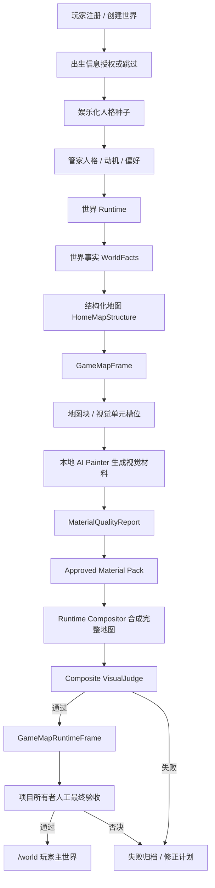
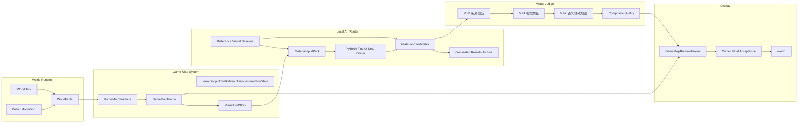

# AI-PET-WORLD 业务与技术架构

更新：2026-07-06

本文定义当前 MVP 和长期主线的业务架构、技术架构、数据流、模块边界和禁止事项。

## 1. 架构原则

| 原则 | 说明 |
|---|---|
| 世界事实优先 | 世界事实是源头，视觉不能决定世界事实。 |
| 结构先于画面 | 先有可玩的结构地图，再有视觉表达。 |
| AI 只负责视觉表达 | AI Painter 生成视觉材料，不负责 Runtime、碰撞、交互和世界规则。 |
| 地图不是单图 | 正式游戏地图由地图块、视觉单元、对象层、可走层、碰撞层、交互层和状态层组成。 |
| `/world` 只展示 RuntimeFrame | 训练图、候选图、失败图、局部图只进训练页和归档页。 |
| 训练与正式隔离 | 训练产物不能绕过 RuntimeFrame 和 VisualJudge。 |
| 禁止程序直绘最终画面 | 程序可以生成结构、Mask、校验、合成，不能手写玩家最终画面。 |
| 机器审核不是最终通过 | VisualJudge 和 RuntimeFrame gate 只是前置闸门，最终必须由项目所有者人工确认达到正式游戏标准。 |
| 参考图只定方向 | 当前最高局部图只作为质感基准，不能绕过 RuntimeFrame，也不能作为 `/world` 成果。 |

## 2. 业务架构图



## 3. 技术架构图



## 4. RuntimeFrame 数据结构边界

正式 GameMapRuntimeFrame 必须至少包含：

| 层 | 作用 | 是否世界事实 |
|---|---|---:|
| identity | worldId、ownerId、tick、sourceFactIds | 是 |
| mapStructure | 地图结构、入口、中心、区域、道路、水岸 | 是 |
| terrainLayer | 草地、水体、水岸、道路等地形定义 | 是 |
| objectLayer | 树、石头、草丛、花等对象记录 | 是 |
| visualLayer | AI Painter 生成的视觉材料引用 | 部分。它是表达，不是事实。 |
| walkableLayer | 可走区域 | 是 |
| collisionLayer | 不可穿越区域 | 是 |
| interactionLayer | 可查看、可点击、可建设、可采集区域 | 是 |
| stateLayer | 生命周期、建造状态、资源状态、天气影响 | 是 |
| audit | VisualJudge、hash、时间戳、模型版本、失败记录 | 否，但必须存在。 |
| ownerAcceptance | 项目所有者人工最终验收记录 | 否，但正式展示前必须存在通过记录。 |

## 5. 关键对象

| 对象 | 作用 | 关键字段 |
|---|---|---|
| WorldFact | 世界事实源头 | `factId`、`worldId`、`tick`、`type`、`payload`、`source` |
| VisualFactManifest | 视觉所需事实清单 | `sourceFactIds`、主事实、支撑事实、环境事实 |
| HomeMapStructure | 自然家园结构 | 入口、中心、水岸、道路、自然边界 |
| GameMapFrame | 可合成地图帧 | layers、slots、layout、camera |
| VisualUnitSlot | 视觉单元槽位 | `slotId`、`kind`、`bounds`、`layer`、`sourceFactIds` |
| RegionTexture | AI 生成的区域视觉材料 | `textureId`、`slotId`、`imageHash`、`reviewStatus` |
| ObjectVisualUnit | AI 生成的对象视觉材料 | `unitId`、`objectKind`、`imageHash`、`alphaMaskHash` |
| Approved Material Pack | 已审核视觉材料包 | `packId`、`worldId`、`tick`、`qualityReport`、`materials` |
| GameMapRuntimeFrame | 正式世界画面记录 | `frameId`、`worldId`、`tick`、`runtimeLayers`、`visualLayers`、`audit` |

## 6. AI Painter 内部边界

| 模块 | 职责 |
|---|---|
| Dataset Builder | 准备训练图、Mask、来源记录、用途记录。 |
| Training Runner | 本地训练，记录 GPU、耗时、loss、输出。 |
| Inference Runner | 根据结构条件生成候选视觉材料。 |
| Refiner | 细化局部视觉材料。 |
| Candidate Store | 保存候选结果，不进入 `/world`。 |
| Result Archive | 保存成功、失败、耗时、时间戳、GPU 信息、质量分数。 |

AI Painter 禁止承担：

| 禁止职责 | 原因 |
|---|---|
| 决定地图里有什么 | 这是世界事实和 Runtime 的职责。 |
| 决定玩家能不能走 | 这是可走层和碰撞层的职责。 |
| 直接写 `/world` | 必须经过 RuntimeFrame 和 VisualJudge。 |
| 接入第三方在线绘图 API | 当前正式链路必须本地自研。 |

## 7. `/world` 展示闸门


`/world` 不能读取：

| 内容 | 原因 |
|---|---|
| 训练图片 | 中间产物。 |
| 失败图片 | 只能归档和复盘。 |
| 候选图片 | 未正式通过。 |
| 局部素材 | 不是完整游戏地图。 |
| 单张 ApprovedFrame | 只是视觉素材凭证，不是 RuntimeFrame。 |
| 程序占位图 | 不是正式 AI 视觉结果。 |
| 人工否决图 | 机器审核曾通过也不能展示，必须进入失败归档和修复链。 |

## 8. 当前架构结论

当前必须从“AI 生成一张图”收口为“结构化游戏地图 + AI 视觉材料 + RuntimeFrame 合成”。AI Painter 仍然重要，但它只负责视觉表达。游戏是否可玩、对象是否存在、道路是否连通、碰撞是否正确、世界是否自主，全部由结构化数据和 Runtime 决定。

正式展示链路必须收口为：

```txt
结构化游戏地图
+ 本地 AI Painter 视觉材料
+ RuntimeFrame 合成
+ VisualJudge / composite quality
+ 项目所有者人工最终验收
= /world 正式游戏世界
```

缺少项目所有者人工最终验收，或人工验收明确否决时，不能把任何 RuntimeFrame 当成正式游戏成功结果。
