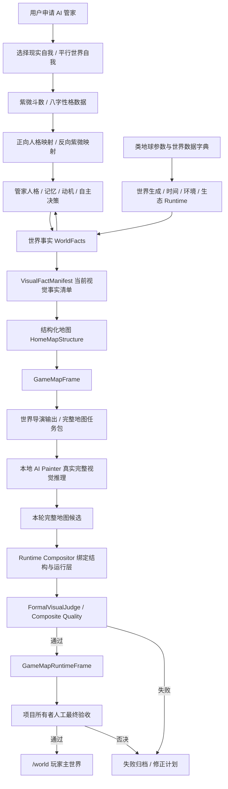
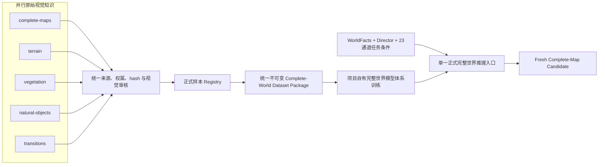
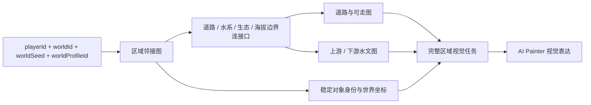

# AI-PET-WORLD 业务与技术架构

更新时间：2026-08-03 11:12:09 +08:00

状态：long-term-architecture-reference

不允许自由发挥；除非发现错误导致无法继续，必须先停下来询问项目所有者。

> 本文保留长期产品架构。模块安排只记录在 `docs/game-world-generation/CURRENT_EXECUTION_GUIDE_20260710.md`，不得从长期架构推导执行授权。紫微斗数是人格数据子系统，必须通过正式契约连接 AI 管家人格映射。

本地自研AI如何逐步获得项目知识、任务规划、软件工程、训练验证、审核和运营能力，以及Codex如何逐项退出执行链，由`docs/LOCAL_SELF_DEVELOPED_AI_CAPABILITY_AND_CODEX_MIGRATION_ARCHITECTURE.md`统一定义。该文件是本架构下的能力迁移主体架构，不是项目总体架构，也不产生执行授权。

本文定义 MVP 与长期主线的业务架构、技术架构、数据流、模块边界和禁止事项。模块状态与运行事实不在本文维护。

## 0. 本地智能核心与外部员工解耦架构

本地系统是正式判断、授权请求、审核状态和长期记忆的唯一载体。世界事实、任务状态、机器结论、owner动作请求、owner决定、复审结果、容量登记和下一门禁必须全部以本地不可变文件为证据，并由本地SQLite提供查询索引。聊天和外部智能体记忆不属于系统状态。

本地治理链固定为：

```text
本地证据读取
-> 本地门禁判断与冲突诊断
-> 本地生成owner-action-request
-> 本地不可变保存、事件与SQLite索引
-> 项目所有者明确决定
-> 本地程序只执行获批范围
-> 本地复审、登记和下一状态
```

Codex只作为受控执行与检查员工。当前允许它在本地程序已经锁定任务、范围和门禁后执行受控冷启动RGB、代码修复或对应检查；它不得成为系统编排器、长期记忆、正式证据源或授权机关。目标架构中，本地小AI负责完整判断和流程编排，Codex仅在收到具体任务时运行相应检查并把证据交回本地系统；移除Codex或丢失聊天历史不得破坏本地流程连续性。

机器可读长期合同固定为`data/ai-painter/system-governance/local-ai-responsibility-contract-v1.json`。运行时owner动作请求固定保存到`.runtime/ai-painter/owner-action-requests/<requestId>/request.json`，同时写入训练过程事件总账和D盘SQLite索引；`latest.json`只是查询指针。

## 0.1 V7 容量架构

V7训练容量采用两级目标，不改变AI Painter、WorldFacts、World Director、23通道、审核或Runtime边界：

| 级别 | 完整地图数量 | split | 作用 |
|---|---:|---|---|
| 首次MVP训练门槛 | 64 | `48/8/4/4` | 尽快启动第一轮正式MVP训练并验证本地模型闭环 |
| 后续正式增强目标 | 128 | `96/16/8/8` | 扩大构图、季节、生态和挑战集覆盖，提高泛化稳定性 |

64张门槛要求每条记录绑定独立完整地图世界事实、World Director、正式23通道、原生RGB、来源许可、机器审核、适用的项目所有者审核、hash和不可变存储；扩容目标不改变单条质量与完整地图门槛。实际容量、活动版本和split以不可变数据包及Dataset最终选择为准。

## 0.2 Owner写授权信任边界

通用HTTP写入口与生产构建必须在首次写入前完成下列签名授权链：

```text
Owner离线Ed25519私钥签发
-> 项目内授权文件只保存公钥签名、精确动作、方法、路由、目标哈希和载荷哈希
-> 受信公钥注册表由部署环境提供固定SHA-256锚点
-> 程序验证签名、有效期、commandRef、scope与全部绑定字段
-> 使用wx建立不可变消费记录
-> 才允许执行写操作
```

请求者提供的授权文件路径或文件SHA只能证明读取对象未变化，不能证明Owner身份；通用门禁中的Owner身份只能由受信公钥注册表及其部署外哈希锚点证明。授权不得只绑定`world.create`一类粗粒度动作，必须同时绑定实际HTTP方法或`EXEC`、实际路由/脚本、具体world或资产目标以及规范化请求载荷。授权只允许一个动作并且只能消费一次；崩溃、重试、锁恢复和重新启动不得恢复授权额度。

已有任务专用编排器在迁入通用签名门禁前，必须至少使用程序内固定授权文件SHA锚点，并核对commandRef、scope、具体动作和任务范围，同时在任何事件、配置、锁或训练写入前使用`wx`原子消费；不得接受调用方同时提供路径和哈希作为身份依据。该兼容边界不得扩展到新入口。

生产构建属于写操作。构建程序必须先消费绑定`platform.production_build`与确定命令的授权，再在同一个`try/finally`保护范围内临时持有`.runtime`入口；任一中间步骤失败都必须恢复原Runtime身份。训练、验证、正式推理、RuntimeFrame和世界运行继续分别授权，任何一项都不能从构建或普通写授权推导。

## 1. 架构原则

系统边界固定为：AI-PET-WORLD 是像素风格自主世界游戏；本地小 AI 是跨世界理解、导演、推理、角色自主、失败学习和视觉表达的游戏智能核心。AI Painter 位于视觉表达边界，只是本地小 AI 的一个子系统。它不能代替 World Runtime、世界事实、角色决策或游戏规则，也不能反向根据图片发明世界事实。

| 原则 | 说明 |
|---|---|
| 世界事实优先 | 世界事实是源头，视觉不能决定世界事实。 |
| 结构先于画面 | 先有可玩的结构地图，再有视觉表达。 |
| AI Painter 负责完整视觉生产 | AI Painter 在世界事实、导演结果和地图结构约束下生成完整世界视觉及持续更新；局部材料只是内部能力。它不负责 Runtime、碰撞、交互和世界规则。 |
| 地图不是单图 | 正式游戏地图由地图块、视觉单元、对象层、可走层、碰撞层、交互层和状态层组成。 |
| 管家决定建设行为 | 初始世界不预设家园位置或未来道路；管家根据人格、记忆、目标和世界事实自主选址、建设与修路，合法结果再写入 WorldFact。 |
| `/world` 只展示 RuntimeFrame | 训练图、候选图、失败图、局部图只进训练页和归档页。 |
| 训练与正式隔离 | 训练产物不能绕过 RuntimeFrame 和 VisualJudge。 |
| 禁止程序直绘最终画面 | 程序可以生成结构、Mask、校验、合成，不能手写玩家最终画面。 |
| 机器审核不是最终通过 | VisualJudge 和 RuntimeFrame gate 只是前置闸门，最终必须由项目所有者人工确认达到正式游戏标准。 |
| 参考图只定方向 | 当前最高局部图只作为质感基准，不能绕过 RuntimeFrame，也不能作为 `/world` 成果。 |
| 第一版像素视觉契约 | 正式模型原生生成 `1024×768` 高分辨率像素风完整地图；禁止从低分辨率图、tile、sprite 或局部材料放大/拼接得到正式候选。 |

项目架构必须始终保持两条一级主线：

| 一级主线 | 输入 | 核心处理 | 输出 |
|---|---|---|---|
| AI 管家人格与角色自主 | 紫微斗数、八字、用户选择的映射模式 | 性格数据标准化、现实自我正向映射、平行世界反向紫微映射、记忆与自主决策 | 可持续行动的 AI 管家 |
| 类地球世界自主运行与生长 | 类地球参数、世界数据字典、时间、环境和世界事实 | 世界生成、Runtime 推进、生态与资源变化、状态持久化 | 持续存在并自主演化的世界 |

两条主线通过“管家感知世界事实”和“管家行为写入合法世界变化”连接。视觉系统只负责表达该闭环产生的事实。管家的初始记忆可以为空；紫微斗数为主、八字为辅的人格映射提供初始判断倾向，但不会预写具体家园位置。家园选址、建筑和道路变化必须由运行时决策与世界规则共同产生。

世界生成身份层固定为：

```text
PlayerIdentity
-> WorldIdentity(worldId)
-> DeterministicWorldSeed
-> EarthLikeWorldProfile
-> Terrain / Climate / Hydrology / Ecology / Time
-> WorldFacts
```

长期生成器必须允许不同 `playerId` 绑定不同世界种子和世界档案。MVP 使用 `mainland-southeast-asia-tropical-monsoon-natural-home-v1` 作为兼容参考档案，并以 `sakaerat-wang-nam-khiao-mvp-reference-v1` 作为当前新增数据的具体事实锚点。新路线允许从有明确许可、版本和来源的真实高程、土地覆盖、气候与土壤测量中派生自然世界事实和自然拓扑，但必须先剔除建筑、城市、工程道路、耕地地块、人工水体与其他人类开发痕迹，再归一化到游戏坐标；不得把外部RGB或地图瓦片视觉作为训练图或生成器图片参考。`playerId`、`worldId`、`worldSeed` 和 `worldProfileId` 四个字段仍必须保留，避免第一版完成后重写世界身份架构。气候、水文、地形和物种事实必须绑定来源、版本、许可、采集时间、hash与派生步骤；外部测量来源不自动授予图片训练权。

上述泰国锚点只属于当前MVP区域。长期架构必须在WorldIdentity与WorldFacts之间增加版本化真实地球区域来源层：

```text
WorldIdentity
-> RealEarthRegionIdentity
-> RealEarthRegionSourcePackage
-> DerivedNaturalWorldFacts
-> RegionGraph / Terrain / Climate / Hydrology / Soil / Ecology
-> WorldFacts
```

`RealEarthRegionSourcePackage`按真实国家或地区独立建立，不能由一个全局泰国包服务所有世界。它必须包含区域范围和地理参考，以及高程、土地覆盖、气候、土壤、水文、生态、连接数据的来源对象、许可、版本、采集时间、hash和派生清单。新区域缺少自己的合格包时必须阻断，不能退回泰国数据或由生成器补造事实。

### 1.1 RealEarthRegionSourcePackage正式结构

```text
RealEarthRegionSourcePackage
├─ identity
│  ├─ realEarthRegionId
│  ├─ countryOrTerritory
│  ├─ namedArea
│  ├─ spatialBounds
│  ├─ coordinateReference
│  └─ observationPeriod
├─ sourceLayers
│  ├─ elevationAndTerrain
│  ├─ landCover
│  ├─ climateAndSeason
│  ├─ soilAndMoisture
│  ├─ hydrology
│  ├─ ecologyAndSpecies
│  └─ regionalConnectivity
├─ sourceProvenance
│  ├─ provider / product / version
│  ├─ license / attribution
│  ├─ acquisitionUrlOrObjectId
│  ├─ acquiredAtUtc / acquiredAtAsiaShanghai
│  └─ rawSha256
├─ derivation
│  ├─ humanDevelopmentClassification
│  ├─ removalOrNaturalization
│  ├─ measurementAggregation
│  ├─ anonymousGameCoordinateNormalization
│  └─ derivationManifestSha256
└─ output
   ├─ DerivedNaturalWorldFacts
   ├─ regionalConnectivityFacts
   ├─ sourcePackageSha256
   └─ auditStatus
```

### 1.2 区域包生命周期

```text
项目所有者确定真实地区和范围
-> 注册适用来源、许可和版本
-> 获取并不可变保存原始对象与hash
-> 核对空间覆盖、时间覆盖和无数据范围
-> 识别人类开发与不适用事实
-> 按当前世界阶段执行移除或自然化
-> 派生地形/气候/土壤/水文/生态事实
-> 建立该地区自己的RegionGraph与连接实例
-> 归一化到游戏坐标并保存派生关系
-> 编译WorldFacts、World Director和23通道
-> 来源、完整地图、连接、唯一性和存储审核
-> 才能进入单张RGB授权门
```

MVP区域来源为泰国Sakaerat / Wang Nam Khiao包。架构支持未来区域不等于程序已获权自动采集或建设其他国家；新增区域必须由项目所有者明确业务范围，并建立独立来源包。

### 1.3 真实空间与游戏坐标关系

真实空间身份和测量值必须保留在来源层；游戏坐标是经记录的视觉/运行坐标派生层。两者关系固定为：

```text
真实地区与测量数据
-> 可追溯自然事实和空间关系
-> 经审核的游戏坐标归一化
-> WorldFacts与结构条件
-> AI Painter视觉表达
```

不得把真实地图RGB当作游戏画面，也不得因“匿名游戏坐标”丢失真实地区、来源范围或事实谱系。匿名化只防止直接复制现实导航/工程几何，不允许把真实地球依据改成随机想象。

## 2. 业务架构图



## 3. 技术架构图

```mermaid
flowchart LR
  subgraph Personality["Butler Personality and Autonomy"]
    Astrology["Ziwei / Bazi Structured Data"]
    Mapping["Self Mapping / Reverse Ziwei Mapping"]
    ButlerCore["Personality / Memory / Motivation / Decision"]
  end

  subgraph Runtime["World Runtime"]
    Earth["Earth-like Parameters"]
    WF["WorldFacts"]
    Tick["World Tick"]
    Growth["Environment / Ecology / Growth"]
  end

  subgraph Map["Game Map System"]
    HMS["HomeMapStructure"]
    GMF["GameMapFrame"]
    Layers["terrain/object/walkable/collision/interaction/state"]
    Slots["VisualUnitSlots"]
  end

  subgraph Painter["Local AI Painter"]
    FactManifest["VisualFactManifest"]
    Director["World Director Output"]
    Task["Complete World Visual Task Package"]
    Model["Local Complete-World Model"]
    Output["Fresh Complete-Map Candidate"]
    Archive["Generated Results Archive"]
  end

  subgraph Judge["Visual Judge"]
    VJ0["VJ-0 来源/绑定"]
    VJ1["VJ-1 视觉质量"]
    VJ2["VJ-2 语义/游戏地图"]
    CQ["Composite Quality"]
  end

  subgraph Display["Display"]
    RF["GameMapRuntimeFrame"]
    OwnerGate["Owner Final Acceptance"]
    WorldPage["/world"]
  end

  Astrology --> Mapping --> ButlerCore
  Earth --> Tick --> Growth --> WF
  ButlerCore --> WF
  WF --> ButlerCore
  WF --> FactManifest --> HMS --> GMF --> Slots --> Director --> Task --> Model --> Output --> Archive
  Output --> VJ0 --> VJ1 --> VJ2 --> CQ
  CQ --> RF --> OwnerGate --> WorldPage
  GMF --> RF
```



### 3.1 视觉知识、训练数据与推理架构

原图库是训练来源层，不是运行时地图层。五类目录按主要知识职责并行保存原图和证据；审核通过后由统一登记器写入正式样本注册表，再由数据包构建器按 hash、结构和来源隔离为统一完整世界数据包。正式推理只有一个完整世界入口，内部能力可以由一个或多个自有模块实现，但不得让任何分类目录或局部模型取得主入口地位。



固定禁止关系：

```text
五类目录 != 五个训练阶段
五类目录 != 五个 Runtime 图层
五类目录 != 五个必须独立存在的神经网络
五类原图 != 程序机械拼接后的完整地图
```

语义分类图可以保留完整环境上下文；只有用于明确标注、条件构建或审核证据时才允许生成可追溯裁切。旧 256×192 材料槽、无父图引用的孤立裁片和重复噪声变体不能替代完整世界训练数据。

第一版正式路线使用原生 `1024×768` 高分辨率像素风画布：正式输出覆盖整个地图并绑定当前任务包、全部结构条件、模型谱系和审核记录。旧 `256×192` 材料槽和任何低分辨率局部输出只作历史证据，不得放大或拼接进入正式路线。23 通道结构条件必须通过可审计的条件编译生成与原生画布严格对齐的条件张量；训练可以使用渐进分辨率，但正式候选、审核和 Runtime 只认原生 `1024×768` 输出。

### 3.2 大世界空间连接架构

第一版自然家园是未来类地球大世界中的第一个连接区域。`1024×768` 是当前完整区域视觉画布，不是整个长期世界的固定边界。区域连接必须先由结构化世界事实和项目所有者批准的连接蓝图定义，再由 AI Painter 表达；图片、提示词和模型输出没有拓扑决策权。

连接架构必须严格区分“模式契约”和“实例蓝图”：

```text
natural-home-large-world-connectivity-v1
  = 所有区域共同遵守的数据结构、配对和审核规则

mainland-southeast-asia-earth-reference-natural-home-region-0001-v1
  = region-0001自身的一个具体连接实例
```

模式契约不得携带固定北/南/东/西构图。具体实例可以锁定自身的方向和端口，但其作用域只能是对应`regionId`。V7训练槽位和其他自主生成区域必须建立独立`regionId`及其RegionGraph、EdgePort、PathGraph、HydrologyGraph和WalkableGraph；除非任务明确绑定同一运行区域，否则禁止引用`region-0001`的北入南出、东侧共享水道、南侧道路口作为训练边界。水体不存在、封闭水体、内部湿地和不同跨区域水文必须按当前世界事实表达。

“独立区域连接实例”仍须落在同一个连通世界图中。每个区域节点至少包含一组与相邻区域双向配对的边界通行口，并由PathGraph/WalkableGraph证明可达；水系存在时由HydrologyGraph证明上下游或跨界关系，生态与海拔过渡由相邻事实证明连续。任何无邻接、端口未配对或仅用图片接缝证明连接的区域都不能进入自主世界或独立训练容量。

完整地图唯一性必须使用两个相互独立的结构身份：

| 身份 | 至少包含 | 作用 |
|---|---|---|
| `themeArchitectureIdentity` | RegionGraph关系、EdgePort类型/方向、水文与道路拓扑、水路相对关系、生态/空间分区、自然边界和阅读层级 | 阻断同一世界主题骨架重复 |
| `instanceDetailIdentity` | 河岸/道路具体轨迹、分支和水域轮廓、分区轮廓、对象实例位置与簇、密度节奏、空隙及局部过渡 | 阻断换皮、轻微位移或细节复用 |

两者都必须对全部历史执行直接、镜像、旋转和变形比较。hash不同、测量窗口不同或主题名称不同不能替代结构唯一性证明。



| 结构 | 职责 | 固定边界 |
|---|---|---|
| RegionGraph | 保存区域身份、全局范围和双向邻接关系 | 不由 RGB 或导演自由生成 |
| EdgePort | 保存道路、水系、生态和海拔在区域边界的配对关系 | 未配对出口必须阻断，不能伪装成已连接 |
| PathGraph / WalkableGraph | 证明入口、中心和批准出口可走连通 | 任何碰撞变化都必须重新校验 |
| HydrologyGraph | 保存流向、上游、下游、海拔和跨区域水口 | 水岸视觉不能替代水文事实 |
| ObjectIdentitySet | 保存跨 tick 和跨区域对象身份 | 视觉变体不得改变对象事实 |

机器可读模式契约是 `natural-home-large-world-connectivity-v1`，固定位置为 `data/world-samples/world-connectivity/world-connectivity-contract-v1.json`。具体实例蓝图 `mainland-southeast-asia-earth-reference-natural-home-region-0001-v1` 只定义其对应区域的连接事实，不批准其他训练区域复制。具体迁移、tick、审核和hash由世界运行证据保存；连接事实审核通过也不等于图片具备连接训练资格。

### 3.3 训练数据存储与目录索引架构

AI Painter训练、推理、审核、失败回写和Runtime证据采用文件权威、数据库索引的冷热分层架构：

```text
F:\ai-pet-world                       项目代码、文档和轻量逻辑入口
D:\AI-PET-WORLD-DATA\hot\runtime     当前运行和仍需直接访问的热文件
D:\AI-PET-WORLD-DATA\cold\runs       已完成运行的不可变冷归档
D:\AI-PET-WORLD-DATA\catalog         SQLite目录索引与只读查询快照
D:\AI-PET-WORLD-DATA\migrations      迁移清单、数量/字节/hash校验和切换证据
```

数据库只保存run、artifact、event、审核状态、URI、大小、时间戳和SHA-256，不取代图片、checkpoint和原始JSON文件。项目逻辑路径`.runtime`在无损迁移完成后通过目录联接继续保持兼容，避免现有世界事实、训练和审核身份发生变化。完成运行进入冷层时必须保留不可变归档、原始相对路径和hash；控制台通过SQLite分页查询，不得为显示页面递归扫描整个物理目录。

存储迁移必须由不可变迁移清单保存源、目标、数量、字节、逐文件hash、切换和回退证据。实际迁移状态、备份位置和SQLite计数只从机器记录读取，不写入架构文档。

## 4. RuntimeFrame 数据结构边界

正式 GameMapRuntimeFrame 必须至少包含：

| 层 | 作用 | 是否世界事实 |
|---|---|---:|
| identity | worldId、ownerId、tick、sourceFactIds | 是 |
| mapStructure | 地图结构、入口/出口、区域、自然通行、水岸；建设后才可包含家园与新道路 | 是 |
| terrainLayer | 草地、水体、水岸、道路等地形定义 | 是 |
| objectLayer | 树、石头、草丛、花等对象记录 | 是 |
| visualLayer | AI Painter 生成的视觉材料引用 | 部分。它是表达，不是事实。 |
| walkableLayer | 可走区域 | 是 |
| collisionLayer | 不可穿越区域 | 是 |
| interactionLayer | 可查看、可点击、可建设、可采集区域 | 是 |
| stateLayer | 生命周期、建造状态、资源状态、天气影响 | 是 |
| audit | VisualJudge、hash、时间戳、模型版本、失败记录 | 否，但必须存在。 |
| ownerAcceptance | 项目所有者人工最终验收记录 | 否，但正式展示前必须存在通过记录。 |

## 5. 关键对象

| 对象 | 作用 | 关键字段 |
|---|---|---|
| WorldFact | 世界事实源头 | `factId`、`worldId`、`tick`、`type`、`payload`、`source` |
| VisualFactManifest | 视觉所需事实清单 | `sourceFactIds`、主事实、支撑事实、环境事实 |
| CompleteWorldVisualTaskPackage | 当前完整地图推理任务 | `worldId`、`tick`、`dictionaryVersion`、`visualFactManifestId`、导演输出、结构输入、失败记忆、禁止内容 |
| CompleteWorldVisualCandidate | 本轮真实完整地图候选 | `taskPackageId`、`modelVersion`、`checkpoint`、`seed`、`imageHash`、`generatedAt`、`reusedExistingImage=false` |
| HighResolutionPixelStyleFrame | 第一版高分辨率像素风画面契约 | `nativeWidth=1024`、`nativeHeight=768`、`completeMap=true`、`generatedDirectly=true`、`lowResolutionUpscale=false`、`mechanicalComposition=false`、`addsVisualFacts=false` |
| HomeMapStructure | 自然家园结构 | 入口/出口、水岸、自然通行、自然边界；家园与建设道路仅在后续事实存在时出现 |
| GameMapFrame | 可合成地图帧 | layers、slots、layout、camera |
| VisualUnitSlot | 视觉单元槽位 | `slotId`、`kind`、`bounds`、`layer`、`sourceFactIds` |
| RegionTexture | AI 生成的区域视觉材料 | `textureId`、`slotId`、`imageHash`、`reviewStatus` |
| ObjectVisualUnit | AI 生成的对象视觉材料 | `unitId`、`objectKind`、`imageHash`、`alphaMaskHash` |
| Approved Material Pack | 已审核视觉材料包 | `packId`、`worldId`、`tick`、`qualityReport`、`materials` |
| GameMapRuntimeFrame | 正式世界画面记录 | `frameId`、`worldId`、`tick`、`runtimeLayers`、`visualLayers`、`audit` |

## 6. AI Painter 内部边界

| 模块 | 职责 |
|---|---|
| Dataset Builder | 准备训练图、Mask、来源记录、用途记录。 |
| Training Runner | 本地训练，记录 GPU、耗时、loss、输出。 |
| Inference Runner | 根据当前 VisualFactManifest、世界导演输出和完整任务包，使用本地模型生成本轮完整地图新候选；局部材料推理只可作为内部从属能力。 |
| Refiner | 细化局部视觉材料。 |
| Candidate Store | 保存候选结果，不进入 `/world`。 |
| Result Archive | 保存成功、失败、耗时、时间戳、GPU 信息、质量分数。 |

`Dataset Builder` 必须统一消费五类合格记录和完整任务条件，输出同一个版本化完整世界数据包。`Refiner` 只负责模型内部或候选后的受控细化，不得把五类原图按坐标贴合、缩放或拼接后宣称为 AI Painter 完整地图生成。

AI Painter 禁止承担：

| 禁止职责 | 原因 |
|---|---|
| 决定地图里有什么 | 这是世界事实和 Runtime 的职责。 |
| 决定玩家能不能走 | 这是可走层和碰撞层的职责。 |
| 直接写 `/world` | 必须经过 RuntimeFrame 和 VisualJudge。 |
| 接入第三方在线绘图 API | 当前正式链路必须本地自研。 |

## 7. `/world` 展示闸门


`/world` 不能读取：

| 内容 | 原因 |
|---|---|
| 训练图片 | 中间产物。 |
| 失败图片 | 只能归档和复盘。 |
| 候选图片 | 未正式通过。 |
| 局部素材 | 不是完整游戏地图。 |
| 单张 ApprovedFrame | 只是视觉素材凭证，不是 RuntimeFrame。 |
| 程序占位图 | 不是正式 AI 视觉结果。 |
| 人工否决图 | 机器审核曾通过也不能展示，必须进入失败归档和修复链。 |

## 8. 架构结论

系统必须采用“视觉事实清单 + 世界导演 + 结构化游戏地图 + 本地模型完整视觉推理 + RuntimeFrame 绑定”。AI Painter 负责完整视觉表达，局部材料只是内部能力。游戏是否可玩、对象是否存在、道路是否连通、碰撞是否正确、世界是否自主，全部由结构化数据和 Runtime 决定。

正式展示链路必须收口为：

```txt
VisualFactManifest + 世界导演 + 结构化游戏地图
+ 本地 AI Painter 本轮完整地图新候选
+ RuntimeFrame 结构与运行层绑定
+ VisualJudge / composite quality
+ 项目所有者人工最终验收
= /world 正式游戏世界
```

缺少项目所有者人工最终验收，或人工验收明确否决时，不能把任何 RuntimeFrame 当成正式游戏成功结果。

## 9. 视觉模型实现关系

V7是AI Painter视觉生产子系统中的完整地图条件去噪器：输入是正式世界事实、世界导演和23通道完整地图条件，输出仍须经过机器审核、项目所有者终审和RuntimeFrame绑定，不能生成或修改世界事实。

代码合同、CPU回归、数据容量、GPU训练、Checkpoint、训练后验证、正式推理和游戏世界完成是相互独立的状态。任何前置状态都不能被描述为后续能力通过；实际模型状态只从训练、验证和资格机器证据读取。
