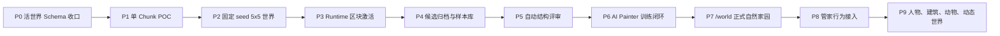

# AI-PET-WORLD 项目总计划

更新：2026-07-06  
状态：项目级主控计划

本文是 AI-PET-WORLD 的项目级主计划。它用于统一 README、活世界方案、AI Painter、Runtime、管家、紫微模块和后续执行顺序，避免不同文档各走一条线。

## 1. 项目目标

AI-PET-WORLD 的长期目标是构建一个可持续运行的自主游戏世界。

```txt
用户创建世界
-> 世界根据规则生成事实
-> 管家拥有性格、动机、偏好、记忆和判断
-> 管家和玩家行为改变世界
-> 世界事实驱动地图结构
-> AI Painter 生成视觉表现
-> Runtime 展示正式游戏世界
```

项目不是：

```txt
AI 图片展示站
地图编辑器
单张 PNG 游戏
纯训练实验项目
命理判断产品
```

## 2. 项目模块

| 模块 | 职责 | 当前状态 |
|---|---|---|
| 活世界系统 | WorldState、ChunkState、Tile、Entity、Lifecycle、Collision、Runtime | 当前主线，P0 Schema 收口 |
| AI Painter | 本地小模型训练、推理、视觉候选、正负样本 | 已有能力，等待结构化输入重接 |
| Runtime 世界页 | `/world` 正式游戏入口 | 已有旧链路，等待新活世界协议接入 |
| 管家系统 | 自主行为、动机、记忆、建设行为 | 后置，等待第一版活世界地图 |
| 紫微模块 | 娱乐化人格种子和数据字典 | 已独立成模块，不阻塞活世界主线 |
| 文档与验收 | 计划、进度、目录、工程安全和验收标准 | 当前正在重构完成 |

## 3. 当前主线调整

旧主线曾聚焦：

```txt
P7-8 第一版完整自然家园游戏地图 RuntimeFrame
```

该方向暴露出关键问题：

```txt
世界数据协议未锁死
视觉材料和世界事实边界不够硬
候选图、材料图、RuntimeFrame 的层级容易混淆
训练链路可以生成局部好图，但不能稳定生成可运行世界
```

因此当前主线调整为：

```txt
P0 活世界 Schema 收口
```

这是项目回到正确地基，不是倒退。

## 4. 总阶段路线



## 5. 阶段定义

| 阶段 | 名称 | 状态 | 目标 |
|---|---|---:|---|
| P0 | 活世界 Schema 收口 | 当前主线 | 定义世界事实、实体、生命周期、碰撞、视觉输入、候选、评审、样本协议。 |
| P1 | 单 Chunk POC | 待做 | 手写一个 32x32 Chunk，验证结构化输入能否约束 AI Painter。 |
| P2 | 固定 seed 5x5 世界 | 后置 | 生成 25 个 Chunk 的小型自然家园世界。 |
| P3 | Runtime 区块激活 | 后置 | 玩家附近 3x3 Chunk 激活，远离 Chunk 休眠。 |
| P4 | 候选归档与样本库 | 后置 | VisualCandidate -> Review -> Sample 的闭环落地。 |
| P5 | 自动结构评审 | 后置 | 检查资源数量、mask、路径、水岸、边缘和幻觉资源。 |
| P6 | AI Painter 训练闭环 | 后置 | 用正负样本持续优化结构到视觉的生成。 |
| P7 | `/world` 正式自然家园 | 后置 | 展示通过机器和人工验收的正式 Runtime。 |
| P8 | 管家行为接入 | 后置 | 管家行为改变世界事实并触发地图变化。 |
| P9 | 人物、建筑、动物、动态世界 | 后置 | 扩展长期游戏体验。 |

## 6. P0 当前执行范围

P0 只做数据协议和最小验证准备。

允许：

```txt
world-types.ts
terrain-types.ts
lifecycle-types.ts
entity-types.ts
collision-types.ts
visual-types.ts
candidate-types.ts
review-types.ts
sample-types.ts
placement-rules.ts
mask-spec
poc-0-input-spec
archive-spec
engineering-safety
```

禁止：

```txt
正式接入 AI Painter
继续整图训练
生成 5x5 世界
完整 Runtime 展示
自动评审
训练闭环
高清输出
管家行为
建筑和人物
```

## 7. 文档职责

| 文档 | 职责 |
|---|---|
| `README.md` | 项目入口，不承载详细阶段计划。 |
| `docs/PROJECT_MASTER_PLAN.md` | 项目级总计划，定义阶段和主线。 |
| `docs/EXECUTION_PLAN.md` | 当前可执行任务表。 |
| `docs/PROGRESS.md` | 当前进度和下一步。 |
| `docs/live-world/AI_LIVE_WORLD_MVP_TECHNICAL_SPEC.md` | 活世界定版方案。 |
| `docs/live-world/DIRECTORY_STRUCTURE.md` | 活世界目录和数据边界。 |

## 8. 模块优先级

| 优先级 | 模块 | 原因 |
|---:|---|---|
| 1 | 活世界 Schema | 没有数据协议，AI Painter 和 Runtime 都会继续试错。 |
| 2 | 单 Chunk POC | 验证结构化输入能否约束视觉输出。 |
| 3 | 候选归档 | 防止候选图污染训练样本。 |
| 4 | AI Painter 结构化输入 | 让小模型从“画图”转为“世界视觉渲染器”。 |
| 5 | Runtime 激活 | 世界可运行后再显示。 |
| 6 | 管家行为 | 有可运行世界后再接自主行为。 |
| 7 | 人物、建筑、动物 | 后期扩展，不抢地基。 |

## 9. 成功标准

项目阶段成功不以“图片好看”为唯一标准。

P0 成功：

```txt
所有核心类型可编译
世界事实、视觉输入、候选、评审、样本边界清晰
目录结构明确
POC-0 输入规范明确
```

P1 成功：

```txt
单 Chunk 输入能生成候选图
候选图能绑定 inputPayloadHash
人工能按硬标准通过或拒绝
候选能进入 candidate 目录
```

P7 成功：

```txt
/world 展示的是正式 Runtime
世界事实、可走层、碰撞层、交互层和视觉层一致
AI 图没有篡改世界事实
机器审核和项目所有者人工验收都通过
```

## 10. 当前结论

当前不再沿旧 P7-8 材料槽继续推进。

当前唯一正确下一步：

```txt
按 docs/live-world/AI_LIVE_WORLD_MVP_TECHNICAL_SPEC.md
和 docs/live-world/DIRECTORY_STRUCTURE.md
落地 P0 Schema 文件。
```

