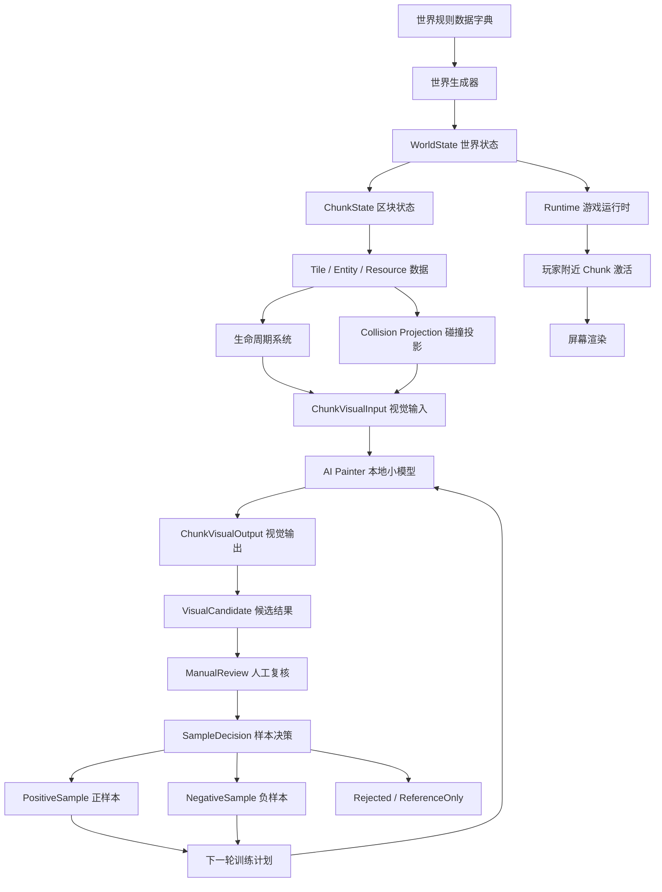
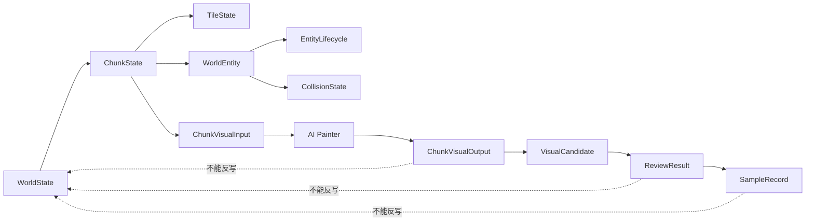
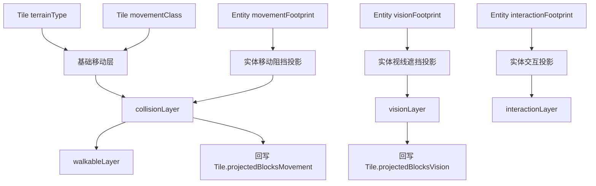
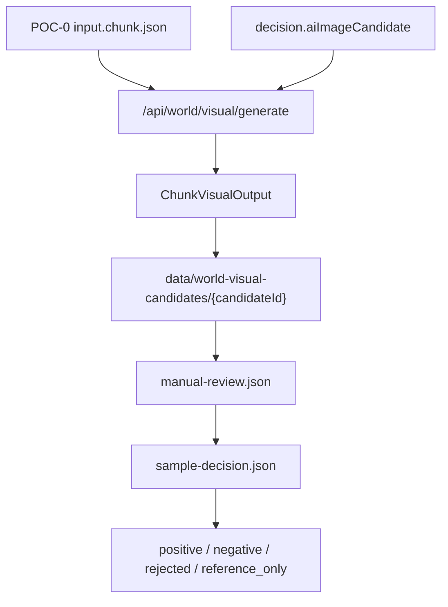
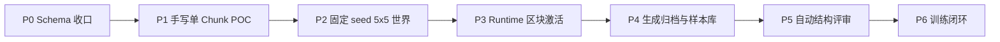

# AI 活世界生成系统 MVP 技术架构与 P0 Schema 方案

版本：V1.2  
状态：定版主方案，可作为项目后续执行依据  
适用范围：AI Pet World 活世界生成、AI Painter 区块视觉生成、候选归档、人工复核、正负样本闭环

## 1. 项目目标

本项目目标不是生成一张静态地图图片，而是构建一个由程序维护世界事实、由本地小模型生成视觉表现、可被玩家交互、可持续演化的活世界系统。

核心定义：

```txt
程序负责世界事实。
小模型负责视觉表现。
玩家交互改变世界状态。
世界状态再驱动下一轮视觉生成。
评审结果进入样本库，反哺后续训练。
```

系统最终要实现：

| 目标 | 说明 |
|---|---|
| 数据驱动世界 | 世界由 WorldState / ChunkState / Tile / Entity 组成。 |
| 本地 AI 绘制 | AI Painter 根据结构化 ChunkVisualInput 绘制区块图。 |
| 资源生命周期 | 树、石头、草丛、花、浆果、芦苇具备状态变化。 |
| 区块激活 | 玩家附近区块运行，远离区块休眠。 |
| 视觉约束 | AI 不得新增世界不存在的主要资源。 |
| 样本闭环 | 每次生成保存输入、输出、评审和样本决策。 |
| 可持续训练 | 正负样本用于后续模型训练优化。 |

## 2. 总体架构



## 3. 核心原则

### 3.1 世界数据是唯一事实源

图片不是世界事实。图片只是 WorldState 的一次视觉表达。

示例：

```txt
WorldState 中有 3 棵树。
AI Painter 画出 5 棵树。
结果不是世界变成 5 棵树，而是该视觉输出不合格。
```

### 3.2 AI Painter 不是世界生成器

AI Painter 不负责决定：

```txt
地图上有什么资源
资源在哪里
资源是否可交互
哪里能走
哪里不能走
资源是否成长或枯竭
```

AI Painter 只负责：

```txt
把结构化世界数据画成统一风格的游戏视觉图。
```

### 3.3 候选图不等于训练样本

生成结果必须先进入候选库，经过人工复核后才允许进入正负样本库。

```txt
ChunkVisualOutput
-> VisualCandidate
-> ManualReview
-> SampleDecision
-> PositiveSample / NegativeSample / Rejected / ReferenceOnly
```

未经人工确认的候选图不得进入训练集。

## 4. 系统分层

| 层级 | 模块 | 职责 |
|---|---|---|
| L1 | 世界规则层 | 定义地形、生态区、资源、生成规则。 |
| L2 | 世界状态层 | 保存世界事实，是唯一权威数据。 |
| L3 | 区块数据层 | 管理 Chunk、Tile、Entity、Resource。 |
| L4 | 生命周期层 | 控制资源成长、采集、恢复、枯竭。 |
| L5 | 碰撞投影层 | 生成可走、阻挡、交互区域。 |
| L6 | 视觉输入层 | 将世界数据转换成 AI Painter 输入。 |
| L7 | AI 绘制层 | 根据输入生成像素风区块图。 |
| L8 | 评审归档层 | 判断输出是否符合世界数据。 |
| L9 | 样本闭环层 | 形成正负样本，支持后续训练。 |
| L10 | Runtime 层 | 玩家附近区块激活、渲染、交互。 |

## 5. 数据权威边界



| 类型 | 属于世界事实 | 可由世界系统更新 | 可由视觉链路反写 |
|---|---:|---:|---:|
| WorldState | 是 | 是 | 否 |
| ChunkState | 是 | 是 | 否 |
| TileState | 是 | 是 | 否 |
| WorldEntity | 是 | 是 | 否 |
| EntityLifecycle | 是 | 是 | 否 |
| CollisionState | 是 | 是 | 否 |
| ChunkVisualInput | 否 | 否 | 否 |
| ChunkVisualOutput | 否 | 否 | 否 |
| VisualCandidate | 否 | 否 | 否 |
| ReviewResult | 否 | 否 | 否 |
| SampleRecord | 否 | 否 | 否 |

## 6. MVP 固定参数

P0 / P1 阶段必须锁死默认参数，避免输入协议和视觉评审复杂化。

| 参数 | 固定值 |
|---|---:|
| chunkSize | 32 |
| tileSize | 16 |
| pixelWidth | 512 |
| pixelHeight | 512 |
| chunkRadius | 2 |
| 世界 Chunk 范围 | -2 到 2 |
| 总 Chunk 数 | 25 |
| activeChunkRadius | 1 |
| 激活 Chunk 数 | 3 x 3 |
| maskOrigin | top_left |
| maskIndexing | mask[y][x] |

高清模式：

```txt
tileSize = 32
pixelWidth = 1024
pixelHeight = 1024
```

高清模式不进入 P0 / P1，只作为后续扩展。

## 7. 世界结构

世界按网格管理。

```txt
World
  -> Chunk
      -> Tile
          -> Entity
              -> EntityLifecycle
```

Chunk 是逻辑区块，不是单纯图片切片。每个 Chunk 必须包含：

```txt
地形
生态区
资源
实体
生命周期
碰撞
可走层
交互层
视觉缓存
运行状态
```

## 8. 基础类型

### 8.1 TerrainType

地形表示格子表面。

```ts
export type TerrainType =
  | "grass"
  | "tall_grass"
  | "water"
  | "shoreline"
  | "dirt_path"
  | "wetland"
  | "forest_edge"
  | "stone_ground"
  | "home_ground"
```

### 8.2 BiomeType

生态区表示区域语义。Biome 不能只挂在 Chunk 上，必须能落到 Tile 或 biomeMask。

```ts
export type BiomeType =
  | "open_grassland"
  | "water_edge"
  | "small_woods"
  | "stone_patch"
  | "wetland_edge"
  | "home_entrance"
```

### 8.3 ResourceType

```ts
export type ResourceType =
  | "tree"
  | "rock"
  | "grass_clump"
  | "flower"
  | "berry_bush"
  | "reed"
```

注意：

```txt
grass 是地形。
grass_clump 才是资源。
```

树桩规则：

```txt
树桩不作为独立 ResourceType。
树桩属于 tree 的生命周期阶段：stage = "stump"。
```

### 8.4 MovementClass

```ts
export type MovementClass =
  | "walkable"
  | "blocked"
  | "slow"
  | "shallow_water"
  | "edge_only"
```

## 9. 世界时间系统

时间系统用于生命周期补算、昼夜、季节扩展。

```ts
export type TimeOfDay =
  | "morning"
  | "day"
  | "evening"
  | "night"

export type Season =
  | "spring"
  | "summer"
  | "autumn"
  | "winter"

export interface TimeState {
  currentTick: number
  dayIndex: number
  timeOfDay: TimeOfDay
  season: Season
}
```

P0 只定义字段。复杂季节、天气、昼夜视觉变化不进入 P0。

## 10. WorldState Schema

```ts
export interface WorldState {
  worldId: string
  worldVersion: string
  worldRuleVersion: string
  generatorVersion: string

  seed: string

  chunkSize: 32
  tileSize: 16
  chunkRadius: 2
  activeChunkRadius: 1

  timeState: TimeState

  chunks: ChunkState[]
  playerState?: PlayerWorldState

  createdAt: string
  updatedAt: string
}
```

## 11. ChunkState Schema

```ts
export type ChunkLoadedState =
  | "not_generated"
  | "generated"
  | "active"
  | "sleeping"

export interface ChunkRuntimeState {
  loadedState: ChunkLoadedState
  isActive: boolean
  lastActiveTick: number
  lastUpdatedTick: number
}
```

```ts
export interface ChunkState {
  chunkId: string
  worldId: string

  chunkX: number
  chunkY: number

  width: 32
  height: 32

  primaryBiomeType: BiomeType

  tiles: TileState[][]
  entities: WorldEntity[]

  collisionLayer: CollisionCell[][]
  walkableLayer: WalkableCell[][]
  interactionLayer: InteractionCell[][]

  visualCache: VisualCacheState
  runtimeState: ChunkRuntimeState
}
```

## 12. TileState Schema

```ts
export interface TileState {
  x: number
  y: number

  terrainType: TerrainType
  biomeType: BiomeType

  movementClass: MovementClass
  traversalCost: number

  elevation: number
  moisture: number
  fertility: number

  baseBlocksMovement: boolean
  baseBlocksVision: boolean

  projectedBlocksMovement: boolean
  projectedBlocksVision: boolean

  overlays: TileOverlay[]
}
```

说明：

```txt
terrainType 决定表面。
biomeType 决定区域语义。
movementClass 决定基础移动规则。
projectedBlocksMovement 由 Collision Projection 回写。
```

## 13. 生命周期 Schema

统一使用：

```txt
EntityLifecycle
```

不再混用 ResourceLifecycle。

```ts
export type TreeStage =
  | "seed"
  | "sprout"
  | "young"
  | "mature"
  | "stump"
  | "dead"

export type RockStage =
  | "small"
  | "medium"
  | "large"
  | "mined"
  | "depleted"

export type GrassClumpStage =
  | "young"
  | "mature"
  | "harvested"
  | "recovering"

export type FlowerStage =
  | "bud"
  | "blooming"
  | "picked"
  | "recovering"

export type BerryBushStage =
  | "young"
  | "mature_no_fruit"
  | "fruiting"
  | "harvested"
  | "recovering"

export type ReedStage =
  | "young"
  | "mature"
  | "cut"
  | "recovering"

export type LifecycleStage =
  | TreeStage
  | RockStage
  | GrassClumpStage
  | FlowerStage
  | BerryBushStage
  | ReedStage
```

```ts
export interface TreeLifecycle {
  type: "tree"
  stage: TreeStage
  ageTicks: number
  nextStageTick?: number
}

export interface RockLifecycle {
  type: "rock"
  stage: RockStage
  durability: number
}

export interface GrassClumpLifecycle {
  type: "grass_clump"
  stage: GrassClumpStage
  ageTicks: number
  nextRegenTick?: number
}

export interface FlowerLifecycle {
  type: "flower"
  stage: FlowerStage
  ageTicks: number
  nextRegenTick?: number
}

export interface BerryBushLifecycle {
  type: "berry_bush"
  stage: BerryBushStage
  ageTicks: number
  nextFruitTick?: number
}

export interface ReedLifecycle {
  type: "reed"
  stage: ReedStage
  ageTicks: number
  nextRegenTick?: number
}

export type EntityLifecycle =
  | TreeLifecycle
  | RockLifecycle
  | GrassClumpLifecycle
  | FlowerLifecycle
  | BerryBushLifecycle
  | ReedLifecycle
```

## 14. WorldEntity Schema

Entity 必须使用 discriminated union，禁止资源类型和生命周期错配。

错误示例：

```ts
{
  entityType: "tree",
  lifecycle: {
    type: "rock",
    stage: "depleted"
  }
}
```

正确结构：

```ts
export interface BaseWorldEntity {
  entityId: string
  chunkId: string

  tileX: number
  tileY: number

  widthTiles: number
  heightTiles: number

  collision: CollisionState
  interaction: InteractionState

  visualProfileId: string
  sourceRuleId: string

  createdTick: number
  updatedTick: number
}
```

```ts
export interface TreeEntity extends BaseWorldEntity {
  entityType: "tree"
  lifecycle: TreeLifecycle
}

export interface RockEntity extends BaseWorldEntity {
  entityType: "rock"
  lifecycle: RockLifecycle
}

export interface GrassClumpEntity extends BaseWorldEntity {
  entityType: "grass_clump"
  lifecycle: GrassClumpLifecycle
}

export interface FlowerEntity extends BaseWorldEntity {
  entityType: "flower"
  lifecycle: FlowerLifecycle
}

export interface BerryBushEntity extends BaseWorldEntity {
  entityType: "berry_bush"
  lifecycle: BerryBushLifecycle
}

export interface ReedEntity extends BaseWorldEntity {
  entityType: "reed"
  lifecycle: ReedLifecycle
}

export type WorldEntity =
  | TreeEntity
  | RockEntity
  | GrassClumpEntity
  | FlowerEntity
  | BerryBushEntity
  | ReedEntity
```

## 15. 碰撞设计

碰撞不能等于视觉尺寸。

一棵大树可能：

```txt
视觉占 3 x 3
移动阻挡只有树干 1 x 1
交互范围是树干周围一圈
树冠遮挡视线但不挡移动
```

```ts
export interface SizeInTiles {
  width: number
  height: number
}

export interface FootprintCell {
  dx: number
  dy: number
}

export interface CollisionState {
  blocksMovement: boolean
  blocksVision: boolean

  visualSize: SizeInTiles

  movementFootprint: FootprintCell[]
  visionFootprint: FootprintCell[]
  interactionFootprint: FootprintCell[]

  collisionProfileId: string
}
```

## 16. Collision Projection



投影顺序：

| 顺序 | 动作 |
|---:|---|
| 1 | 根据 TileState 生成基础移动层。 |
| 2 | 根据 movementFootprint 叠加实体阻挡。 |
| 3 | 根据 visionFootprint 生成视线遮挡。 |
| 4 | 根据 interactionFootprint 生成交互层。 |
| 5 | 生成 collisionLayer。 |
| 6 | 生成 walkableLayer。 |
| 7 | 回写 TileState.projectedBlocksMovement。 |
| 8 | 回写 TileState.projectedBlocksVision。 |

## 17. Mask 规范

所有 mask 固定：

```txt
32 x 32
mask[y][x]
origin = top_left
y = 0 为区块顶部
x = 0 为区块左侧
```

推荐 P0 格式：

```ts
export type TerrainMask = TerrainType[][]
export type BiomeMask = BiomeType[][]
export type BinaryMask = number[][]
```

对应关系：

```txt
terrainMask[y][x] 对应 tileX = x, tileY = y
biomeMask[y][x] 对应 tileX = x, tileY = y
walkableMask[y][x] = 1 表示可走
collisionMask[y][x] = 1 表示阻挡
```

P0 不使用压缩编码，优先可读、可调试、可复核。

## 18. 资源生成规则

```ts
export interface ResourcePlacementRule {
  resourceType: ResourceType

  allowedTerrain: TerrainType[]
  preferredBiome: BiomeType[]
  forbiddenTerrain: TerrainType[]

  minDistanceTiles: number
  maxPerChunk: number
  placementWeight: number

  avoidMainPath: boolean
  avoidWaterDistanceTiles?: number
  preferWaterDistanceTiles?: number

  defaultLifecycleStage: LifecycleStage
  defaultCollisionProfileId: string
  defaultVisualProfileId: string
}
```

基础矩阵：

| 资源 | 允许地形 | 偏好生态区 | 禁止地形 | 最大数量 |
|---|---|---|---|---:|
| tree | grass、tall_grass、forest_edge | small_woods、water_edge | water、dirt_path | 16 |
| rock | grass、stone_ground、forest_edge | stone_patch | water、dirt_path | 8 |
| grass_clump | grass、tall_grass | open_grassland | water、dirt_path | 24 |
| flower | grass、tall_grass、shoreline | open_grassland、water_edge | water、stone_ground | 16 |
| berry_bush | grass、tall_grass、forest_edge | small_woods | water、dirt_path | 8 |
| reed | shoreline、wetland | water_edge、wetland_edge | dirt_path、stone_ground | 12 |

## 19. VisualCacheStatus 与 VisualReviewStatus

缓存状态和评审状态必须拆开。

```ts
export type VisualCacheStatus =
  | "missing"
  | "generation_requested"
  | "generated"
  | "failed"
```

```ts
export type VisualReviewStatus =
  | "generated"
  | "auto_rejected"
  | "pending_owner_review"
  | "owner_approved"
  | "owner_rejected"
```

规则：

```txt
missing 只能属于 visualCache。
ChunkVisualOutput.status 不允许出现 missing。
```

## 20. ChunkVisualInput Schema

ChunkVisualInput 是 AI Painter 的结构化输入。

```ts
export interface ChunkVisualInput {
  inputVersion: string
  worldRuleVersion: string
  generatorVersion: string
  inputPayloadHash: string

  chunkId: string
  chunkX: number
  chunkY: number

  tileWidth: 32
  tileHeight: 32
  tileSize: 16

  pixelWidth: 512
  pixelHeight: 512

  terrainMask: TerrainMask
  biomeMask: BiomeMask
  walkableMask: BinaryMask
  collisionMask: BinaryMask

  entityMap: ChunkVisualEntity[]

  neighborContext: NeighborContext
  styleProfile: StyleProfile
  visualConstraints: VisualConstraints
}
```

## 21. VisualConstraints

视觉约束是防止资源幻觉的核心协议。

```ts
export type DecorationType =
  | "grass_detail"
  | "tiny_flower_detail"
  | "fallen_leaf"
  | "small_pebble"
  | "shore_foam"
  | "mud_patch"

export type ForbiddenObjectType =
  | "building"
  | "npc"
  | "bridge"
  | "fence"
  | "chest"
  | "extra_large_tree"
  | "extra_large_rock"

export type EntityCountPolicy =
  | "exact"
  | "approximate"
```

```ts
export interface VisualConstraints {
  forbidUnlistedInteractiveResources: true

  allowedDecorations: DecorationType[]
  forbiddenObjects: ForbiddenObjectType[]

  entityCountPolicy: Record<ResourceType, EntityCountPolicy>

  maxEntityCenterOffsetTiles: number

  preserveTerrainMask: {
    water: true
    dirt_path: true
    shoreline: true
  }

  preserveChunkEdges: true
}
```

计数策略：

| 资源 | 策略 |
|---|---|
| tree | exact |
| rock | exact |
| berry_bush | exact |
| reed | approximate |
| flower | approximate |
| grass_clump | approximate |

说明：

```txt
exact 表示主要对象数量必须严格匹配。
approximate 表示可视觉合并或作为装饰化表达。
```

## 22. NeighborContext

相邻区块上下文必须结构化，不能只用自由字符串。

```ts
export interface ChunkEdgeContext {
  chunkId: string

  terrainEdge: TerrainType[]
  biomeEdge: BiomeType[]
  movementEdge: MovementClass[]

  entityEdgeHints: EdgeEntityHint[]
}

export interface EdgeEntityHint {
  entityId: string
  entityType: ResourceType
  stage: LifecycleStage
  tileX: number
  tileY: number
  distanceToEdge: number
}

export interface NeighborContext {
  north?: ChunkEdgeContext
  south?: ChunkEdgeContext
  east?: ChunkEdgeContext
  west?: ChunkEdgeContext
}
```

每条边数组长度固定 32。

## 23. ChunkVisualOutput

ChunkVisualOutput 只记录模型输出，不包含人工复核和样本决策。

```ts
export interface ChunkVisualOutput {
  outputId: string
  outputVersion: string

  inputPayloadHash: string
  chunkId: string

  imagePath: string

  modelVersion: string
  promptVersion: string
  generatedAt: string

  status: VisualReviewStatus
}
```

不得包含：

```txt
manualReview
sampleDecision
```

这两者必须独立存储。

## 24. VisualCandidate

```ts
export interface VisualCandidate {
  candidateId: string
  outputId: string
  inputPayloadHash: string

  chunkId: string
  imagePath: string
  metaPath: string

  status:
    | "pending_review"
    | "reviewed"
    | "promoted_to_sample"
    | "rejected"

  createdAt: string
}
```

规则：

```txt
生成图先进入 candidate。
candidate 经人工复核后才允许进入 sample。
```

## 25. ReviewResult

```ts
export type ReviewType =
  | "auto"
  | "manual"

export type Reviewer =
  | "system"
  | "owner"

export type ReviewStatus =
  | "pass"
  | "fail"
  | "needs_owner_review"
```

```ts
export type StructureIssue =
  | "tree_count_mismatch"
  | "rock_count_mismatch"
  | "path_mask_broken"
  | "water_mask_broken"
  | "entity_position_drift"
  | "extra_interactive_resource"
  | "chunk_edge_mismatch"

export type VisualIssue =
  | "style_mismatch"
  | "low_readability"
  | "muddy_texture"
  | "broken_pixel_art"
  | "bad_depth_order"
  | "too_noisy"
```

```ts
export interface ReviewResult {
  reviewId: string
  outputId: string
  inputPayloadHash: string

  reviewType: ReviewType
  reviewer: Reviewer
  status: ReviewStatus

  structureIssues: StructureIssue[]
  visualIssues: VisualIssue[]

  notes?: string
  reviewedAt: string
}
```

## 26. SampleRecord

```ts
export type SampleDecision =
  | "positive"
  | "negative"
  | "rejected"
  | "reference_only"

export type SampleSourceType =
  | "generated"
  | "manual_reference"
  | "external_reference"

export type LicenseStatus =
  | "owned"
  | "generated_by_us"
  | "unknown"
  | "do_not_train"
```

```ts
export interface SampleRecord {
  sampleId: string

  outputId: string
  inputPayloadHash: string
  linkedRunId: string

  decision: SampleDecision
  sourceType: SampleSourceType
  sourcePath: string
  licenseStatus: LicenseStatus

  createdAt: string
}
```

授权规则：

| sourceType | licenseStatus | 是否可训练 |
|---|---|---:|
| generated | generated_by_us | 是 |
| manual_reference | owned | 是 |
| external_reference | unknown | 否 |
| external_reference | do_not_train | 否 |

## 27. inputPayloadHash

输入哈希用于绑定输入、输出、候选、评审、样本。

计算规则：

```txt
inputPayloadHash = sha256(canonicalJson(ChunkVisualInput without inputPayloadHash))
```

必须排除：

```txt
inputPayloadHash 自身
generatedAt
reviewedAt
人工备注
运行时临时字段
```

canonicalJson 要求：

```txt
对象 key 稳定排序
数组顺序固定
数值格式稳定
不包含运行时临时字段
```

目的：

```txt
同一输入永远得到同一 hash。
不同输入必须得到不同 hash。
```

## 28. POC-0 单区块验证

POC-0 是正式接入 AI Painter 前的最小验证。

固定配置：

| 项目 | 值 |
|---|---:|
| chunkSize | 32 |
| tileSize | 16 |
| output | 512 x 512 |
| chunkX | 0 |
| chunkY | 0 |

地形要求：

```txt
草地为主
包含 dirt_path
包含 water
包含 shoreline
包含少量 wetland
```

资源配置：

| 资源 | 数量 | 说明 |
|---|---:|---|
| tree | 3 | 严格匹配 |
| rock | 2 | 严格匹配 |
| grass_clump | 6 | 可视觉合并 |
| flower | 5 | 可装饰化 |
| reed | 4 | 必须靠近水岸 |
| berry_bush | 0 | 后置到 POC-1 或 P2 |

berry_bush 后置原因：

```txt
POC-0 只验证核心可交互资源、水岸资源和路径约束。
berry_bush 进入 POC-1 或 5x5 世界阶段。
```

## 29. POC-0 验收标准

| 编号 | 验收项 | 通过标准 |
|---|---|---|
| 1 | Schema 校验 | input.chunk.json 通过 Schema。 |
| 2 | 碰撞投影 | collisionLayer 可由 Tile + Entity 生成。 |
| 3 | 可走层 | walkableLayer 可由 collisionLayer 生成。 |
| 4 | 图片尺寸 | output.image.png 固定 512 x 512。 |
| 5 | 输入绑定 | output.meta.json 包含 inputPayloadHash。 |
| 6 | 树数量 | 输入 3 个 tree，输出不得出现第 4 个主要树对象。 |
| 7 | 石头数量 | 输入 2 个 rock，输出不得出现第 3 个主要石头对象。 |
| 8 | 路径 | dirt_path 主路径偏移不超过 1 tile。 |
| 9 | 水岸 | water / shoreline 连续，不允许孤立水岸。 |
| 10 | 禁止对象 | 不出现 building、npc、bridge、fence、chest。 |
| 11 | 人工复核 | manual-review.json 必须包含 approve/reject 和原因。 |
| 12 | 样本决策 | sample-decision.json 必须为 positive / negative / rejected / reference_only。 |

POC-0 失败时：

```txt
不得进入 5x5 世界生成。
不得继续整图训练。
必须回到 ChunkVisualInput、visualConstraints 或模型输入方式排查。
```

## 30. 归档规范

每次生成必须完整归档。

```txt
data/world-runs/{runId}/
  input.chunk.json
  output.image.png
  output.meta.json
  auto-judge.json
  manual-review.json
  sample-decision.json
```

候选结果：

```txt
data/world-visual-candidates/{candidateId}/
  input.chunk.json
  output.image.png
  candidate.meta.json
```

正样本：

```txt
data/world-samples/positive/{sampleId}/
  input.chunk.json
  output.image.png
  review.json
  sample.json
```

负样本：

```txt
data/world-samples/negative/{sampleId}/
  input.chunk.json
  output.image.png
  review.json
  sample.json
```

P1 阶段 `auto-judge.json` 可以是占位文件：

```json
{
  "enabled": false,
  "stage": "P1",
  "reason": "auto judge is not implemented in P1",
  "createdAt": "ISO_TIME"
}
```

## 31. 现有工程衔接

当前项目涉及：

```txt
/api/world/visual/generate
decision.aiImageCandidate
data/world-visual-candidates
route.ts
```

工程衔接流程：



P0 对接范围：

```txt
定义 CandidateRecord
定义 input.chunk.json
定义 output.image.png
定义 output.meta.json
定义 candidate.meta.json
定义 manual-review.json
定义 sample-decision.json
```

P0 不做：

```txt
自动训练调度
自动图像评分
直接把 candidate 加入训练集
Runtime 实时请求 AI Painter
```

## 32. 工程安全规则

高风险文件：

```txt
route.ts
schema 文件
生成器文件
数据字典文件
AI Painter 调用文件
归档写入文件
```

写入前：

```txt
1. 必须新建分支。
2. 禁止直接改 main。
3. 必须读取原文件完整内容。
4. 必须记录原始行数。
5. 必须确认中文编码。
```

写入后：

```txt
1. 写入后立即读回。
2. 对比行数。
3. 检查关键 export。
4. 检查文件尾部是否完整。
5. 检查是否出现乱码。
6. 发现截断立即停止。
```

route.ts 特别规则：

```txt
在确认写入通道稳定前，禁止通过不可靠方式直接修改 route.ts。
如必须修改：
1. 新分支
2. 本地完整文件写入
3. 写后读回
4. 对比行数和 hash
5. 检查关键导出
6. 失败立即恢复，不重复硬写
```

## 33. P0 交付物

| 编号 | 文件 | 内容 |
|---|---|---|
| P0-1 | world-types.ts | WorldState、TimeState、ChunkState、ChunkRuntimeState。 |
| P0-2 | terrain-types.ts | TerrainType、BiomeType、MovementClass、TileOverlay。 |
| P0-3 | entity-types.ts | WorldEntity discriminated union。 |
| P0-4 | lifecycle-types.ts | EntityLifecycle、各资源 Stage。 |
| P0-5 | collision-types.ts | CollisionState、Footprint、Projection 输出。 |
| P0-6 | visual-types.ts | ChunkVisualInput、ChunkVisualOutput、VisualConstraints。 |
| P0-7 | candidate-types.ts | VisualCandidate。 |
| P0-8 | review-types.ts | ReviewResult、StructureIssue、VisualIssue。 |
| P0-9 | sample-types.ts | SampleRecord、SampleDecision、LicenseStatus。 |
| P0-10 | placement-rules.ts | ResourcePlacementRule。 |
| P0-11 | mask-spec.md | 32x32、mask[y][x]、top_left。 |
| P0-12 | poc-0-input-spec.md | POC-0 输入和硬验收。 |
| P0-13 | archive-spec.md | runs、candidates、samples 目录规范。 |
| P0-14 | engineering-safety.md | route.ts、防截断、防乱码规则。 |

## 34. 阶段路线



| 阶段 | 目标 | 是否允许开始 |
|---|---|---:|
| P0 | Schema、类型、归档协议 | 是 |
| P1 | 单 Chunk POC | P0 完成后 |
| P2 | 5x5 世界生成 | P1 通过后 |
| P3 | Runtime 激活/休眠 | P2 稳定后 |
| P4 | 样本库 | P1/P2 有输出后 |
| P5 | 自动评审 | 样本标准稳定后 |
| P6 | 训练闭环 | 正负样本积累后 |

## 35. P0 完成判定

P0 必须满足：

```txt
1. 所有基础类型不再使用松散 string / object。
2. EntityLifecycle 统一命名。
3. WorldEntity 使用 discriminated union。
4. WorldState 包含 timeState。
5. ChunkState 包含 runtimeState。
6. 数据权威边界清晰。
7. ChunkVisualOutput、VisualCandidate、ReviewResult、SampleRecord 已拆分。
8. visualConstraints 已明确。
9. neighborContext 已结构化。
10. mask 规范已锁死。
11. POC-0 输入和验收标准已锁死。
12. 归档路径已明确。
13. 现有工程接口衔接已明确。
14. 工程安全规则已明确。
```

## 36. 最终结论

本项目的正确路线是：

```txt
先定义世界事实。
再定义 Chunk 数据。
再定义 Tile / Entity / Lifecycle。
再定义碰撞投影。
再定义 AI Painter 输入。
再生成候选图。
再人工复核。
再进入样本库。
最后形成训练闭环。
```

当前不应该继续做：

```txt
整图训练
完整地图一次性生成
Runtime 全量开发
自动评审
训练闭环
高清输出
```

当前应该做：

```txt
P0 Schema 文件落地
POC-0 输入样例
碰撞投影验证
ChunkVisualInput 构建验证
候选归档协议验证
```

最终一句话：

```txt
活世界不是一张图。
活世界是可运行的世界数据。
AI Painter 只是这个世界的视觉渲染器。
P0 的任务，就是把这个世界数据协议钉死。
```

