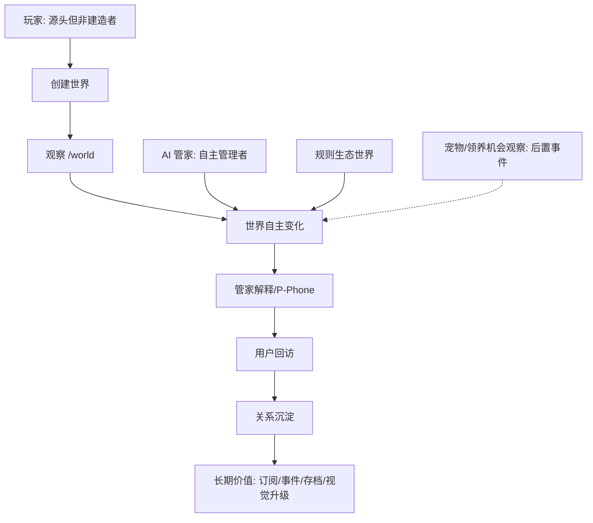
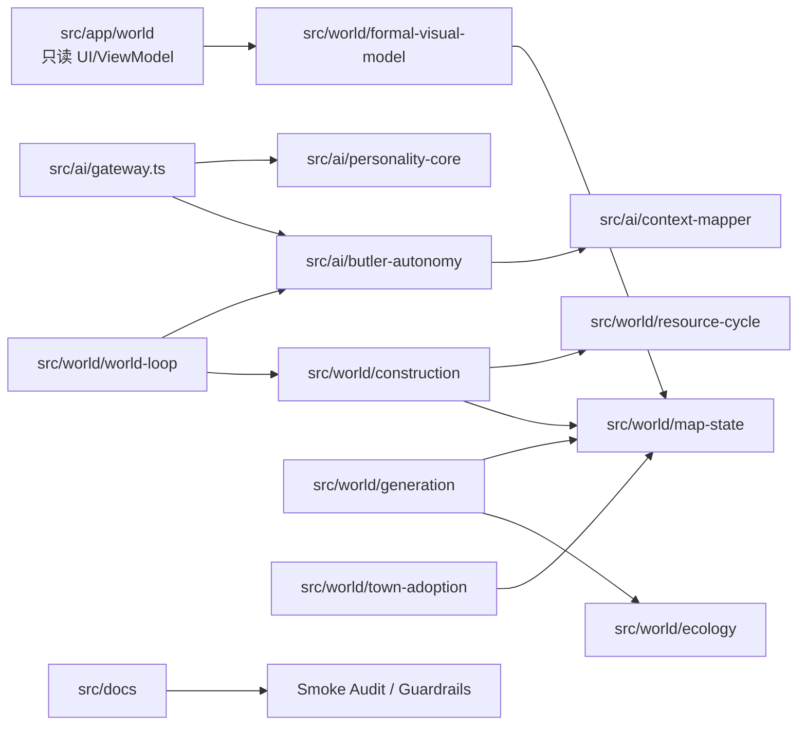

> 历史归档：本文件不得作为 V2.6 当前产品、架构或开发依据。

# AI-PET-WORLD V2.3 完整架构图：业务架构 + 逻辑架构 + 代码架构

日期：2026-05-24  
版本：V2.3  
用途：补齐 V2.2 全景图中“业务架构、逻辑架构、代码架构未同图表达完整”的问题。

---

## 1. 本版定位

本版不是替代 V2.0 主文档、AI Core 架构文档和 V2.2 Agent Guardrails 文档，而是把三类架构合并到同一套图中：

1. 业务架构：玩家、管家、世界、领养机会观察、业务闭环、产品价值和红线。
2. 逻辑架构：紫微灵魂、记忆学习、世界感知、动机、目标、意图、规划、执行、审计、反馈。
3. 代码架构：`src/ai`、`src/world`、`src/app/world`、`src/docs` 的模块关系和依赖方向。

核心结论：

```txt
AI-PET-WORLD 不是单纯业务图、不是单纯逻辑图、也不是单纯代码目录图。
它必须同时画清楚：用户价值如何产生，AI 管家如何自主决策，世界事实如何可信写入，代码模块如何承接。
```

---

## 2. 总览架构说明

V2.3 完整图分为五张：

| 图 | 说明 |
| --- | --- |
| 完整全景架构图 | 把业务、AI、世界事实、审计、表现和代码落点放在同一张图里 |
| 业务架构图 | 说明用户、管家、世界、宠物/领养机会观察、商业闭环和产品红线 |
| 逻辑架构图 | 说明从紫微灵魂、感知、动机、目标到 SafeApply 和学习反馈的完整闭环 |
| 代码架构图 | 说明代码目录、Gateway、模块依赖和禁止反向依赖 |
| 数据流与红线图 | 说明事实容器、候选计划、审计事务、只读视觉之间的边界 |

---

## 3. Mermaid 源文件

### 3.1 完整全景架构

```mermaid
flowchart LR
  Player[玩家: 世界源头/观察者] --> Input[CreateWorldInput]
  Input --> Personality[Personality Core / 紫微人格映射]
  Personality --> Soul[Butler Soul Profile]
  Input --> Seed[Stable World Seed]
  Seed --> Home[HomeMapState]
  Home --> Ecology[WorldEcologyState]
  Home --> Resource[ResourceCycle]
  Player --> Observer[Observer Ingress / Player Signal]
  Observer --> Perception[Butler World Perception]
  Soul --> Motivation[Motivation Engine]
  Ecology --> Perception
  Resource --> Perception
  Memory[Memory Lifecycle Manager] --> Conscious[Conscious State]
  Perception --> Conscious --> Motivation --> Goal[Goal Generator] --> Intent[Intent Ranking]
  Context[AI Context & Meta-Mapper] --> Intent
  Intent --> Constraint[Constraint Kernel]
  Constraint --> Planner[Planner Layer]
  Planner --> Executor[Action Execution]
  Executor --> Conflict[Conflict Resolver]
  Conflict --> SafeApply[SafeApply & Audit]
  SafeApply --> Home
  SafeApply --> Failure[Failure Recovery]
  Failure --> Memory
  SafeApply --> Memory
  Home --> Visual[Visual Projection]
  Visual --> FVM[FormalVisualModel]
  FVM --> UI[/world Formal UI]
  SafeApply --> Explain[P-Phone / Logs / Audit Panel]
```

### 3.2 业务架构



### 3.3 逻辑架构

```mermaid
flowchart LR
  Input[Player/World/Memory 输入] --> Signal[Observer Signal Audit]
  Signal --> Context[Context Compiler / Meta-Mapper]
  Context --> Perception[World Perception]
  Perception --> Conscious[Conscious State]
  Conscious --> Motivation[Motivation Engine]
  Motivation --> Goal[Goal Generator]
  Goal --> Intent[Intent Ranking]
  Intent --> Audit[Intent Audit]
  Audit --> Planner[Planner]
  Planner --> Resource[ResourceCycle]
  Resource --> Conflict[Conflict Resolver]
  Conflict --> Diff[MapDiff]
  Diff --> SafeApply[SafeApply]
  SafeApply -->|Accepted| State[nextHomeMapState]
  SafeApply -->|Rejected| Recovery[Failure Recovery]
  State --> Memory[Memory Lifecycle / Learning Update]
  Recovery --> Memory
  Memory --> Intent
```



### 3.4 代码架构



---

## 4. 后续执行口径

后续代码开发应按这套图执行：

1. 先补 AI 大脑层：`src/ai/butler-autonomy`。
2. 再补生产级护栏：Memory Lifecycle、Constraint Kernel、Failure Recovery、Observer Ingress、Meta-Mapper。
3. 再让 Construction Planner 接收 `ButlerAutonomousIntent`。
4. 最后把 /world UI 变成只读观察窗口，展示“为什么这样做”，而不是只展示“建了什么”。

红线不变：

```txt
玩家不直接建造。
UI 不生成世界事实。
LLM 不直接写世界。
资源不能凭空增长。
宠物/孵化器/胚胎后置。
世界事实必须进入 HomeMapState/MapDiff/SafeApply/FormalVisualModel 链路。
```
